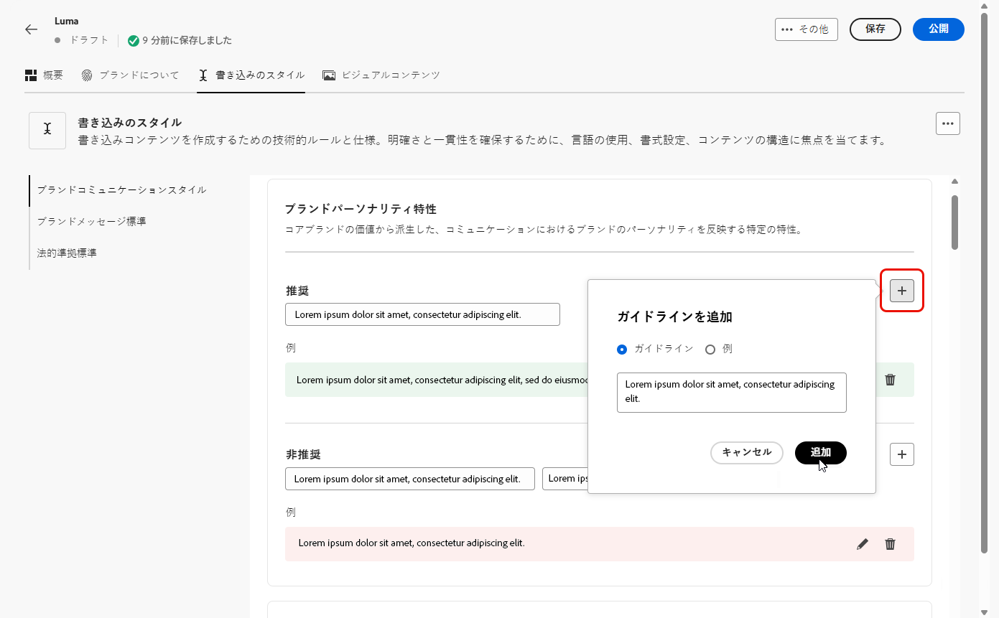

# ブランドのパーソナライズ {#brands-personalize}

すべてのコンテンツとチャネルにわたって一貫性を確保する包括的なブランドキットを作成するには、ブランドアイデンティティの異なる側面に焦点を当てた、次の 4 つのタブを設定します。

* **[!UICONTROL ブランドについて]** は、ブランドのコアアイデンティティと価値を確立します。
* **[!UICONTROL ライティングスタイル]** 言語とコンテンツの標準を定義します。
* **[!UICONTROL ビジュアルコンテンツ]** は、画像とデザインのガイドラインを設定します。
* **[!UICONTROL カラー]** は、ブランドのカラーシステムと使用状況を管理します。

設定が完了したら、ブランドガイドラインを使用して、コンテンツ品質とブランドとの整合性を検証できます。 [ コンテンツ品質検証の詳細情報 ](brands-score.md#validate-quality)

## ブランドについて {#about-brand}

「**[!UICONTROL ブランドについて]**」タブを使用して、ブランドの目的、パーソナリティ、タグライン、その他の定義属性を説明し、ブランドのコア ID を確立します。

1. まず、**[!UICONTROL 主な詳細]**&#x200B;カテゴリにブランドの基本情報を入力します。

   * **[!UICONTROL ブランドキット名]**：ブランドキットの名前を入力します。

   * **[!UICONTROL 使用するタイミング]**：このブランドキットを適用するシナリオまたはコンテキストを指定します。

   * **[!UICONTROL ブランド名]**：ブランドの正式名称を入力します。

   * **[!UICONTROL ブランドの説明]**：このブランドが表す内容の概要を入力します。

   * **[!UICONTROL デフォルトのタグライン]**：ブランドに関連付けられたプライマリのタグラインを追加します。

     

1. **[!UICONTROL 基本原則]**&#x200B;カテゴリでは、ブランドのコアとなる方向性と哲学を明確にします。

   * **[!UICONTROL ミッション]**：ブランドの目的を詳しく説明します。

   * **[!UICONTROL ビジョン]**：長期目標または目的の今後の状態を説明します。

   * **[!UICONTROL マーケットでの位置付け]**：ブランドがマーケットでどのように位置付けられているかを説明します。

   

1. **[!UICONTROL コアブランド値]**&#x200B;カテゴリで、 をクリックして、ブランドのコア値を追加し、詳細を入力します。

   * **[!UICONTROL 値]**：コアブランド値に名前を付けます。

   * **[!UICONTROL 説明]**：この値がブランドにもたらす意味を説明します。

   * **[!UICONTROL 行動]**：この値を実際に反映する行動や態度を説明します。

   * **[!UICONTROL 表現]**：この値が実際のブランディングでどのように表現されるかの例を示します。

     

1. 必要に応じて、 アイコンをクリックして、コアブランド値の 1 つを更新または削除します。

   

ブランドをさらにパーソナライズしたり、[ブランドを公開](#create-brand-kit)したりできるようになりました。

## 文体 {#writing-style}

**[!UICONTROL 文体]**&#x200B;の節では、コンテンツを書くための標準を説明し、すべての資料にまたがる明確さ、一貫性、整合性を維持するために、言語、書式設定、構造を使用する方法について詳しく説明します。

+++ 使用可能なカテゴリと例

<table>
  <thead>
    <tr>
      <th>カテゴリ</th>
      <th>サブカテゴリ</th>
      <th>ガイドラインの例</th>
      <th>除外の例</th>
    </tr>
  </thead>
  <tbody>
    <tr>
      <td rowspan="4">コンテンツ作成標準</td>
      <td>ブランドメッセージ標準</td>
      <td>イノベーションと顧客第一のメッセージをハイライト表示します。</td>
      <td>製品の機能を過度に期待しないでください。</td>
    </tr>
    <tr>
      <td>タグラインの使用状況</td>
      <td>すべてのデジタルマーケティングアセットのロゴの下にタグラインを配置します。</td>
      <td>タグラインを変更または翻訳しないでください。</td>
    </tr>
    <tr>
      <td>コアメッセージ</td>
      <td>生産性の向上など、主なメリットの文章をハイライト表示します。</td>
      <td>無関係な値の提案は使用しないでください。</td>
    </tr>
    <tr>
      <td>命名標準</td>
      <td>「ProScheduler」など、シンプルでわかりやすい名前を使用します。</td>
      <td>複雑な用語や特殊文字を使用しないでください。</td>
    </tr>
    <tr>
      <td rowspan="5">ブランドコミュニケーションスタイル</td>
      <td>ブランドパーソナリティ特性</td>
      <td>わかりやすく、親しみやすくします。</td>
      <td>悲観的にならないようにしてください。</td>
    </tr>
    <tr>
      <td>書き込みのメカニクス</td>
      <td>文を短く、影響力のある状態に保ちます。</td>
      <td>専門用語を過度に使用しないでください。</td>
    </tr>
    <tr>
      <td>状況に応じたトーン</td>
      <td>危機対応コミュニケーションでは、プロフェッショナルなトーンを維持します。</td>
      <td>サポートに関するコミュニケーションでは、否定的な態度を取らないでください。</td>
    </tr>
    <tr>
      <td>単語選択ガイドライン</td>
      <td>「革新的」や「スマート」などの単語を使用します。</td>
      <td>「安い」や「ハック」などの単語は避けます。</td>
    </tr>
    <tr>
      <td>言語標準</td>
      <td>米国英語の規則に従います。</td>
      <td>英国英語と米国英語のスペルを混在させないでください。</td>
    </tr>
    <tr>
      <td rowspan="3">法的遵守標準</td>
      <td>商標標準</td>
      <td>常に ™ 記号または ® 記号を使用します。</td>
      <td>必要な場面で法的記号を省略しないでください。</td>
    </tr>
    <tr>
      <td>著作権標準</td>
      <td>マーケティング資料に著作権表示を含めます。</td>
      <td>許可なくサードパーティコンテンツを使用しないでください。</td>
    </tr>
    <tr>
      <td>免責事項標準</td>
      <td>デジタルアセットに免責事項を読みやすく表示します。</td>
      <td>非表示の領域で免責事項を非表示にしないでください。</td>
    </tr>
</table>

+++

 

**[!UICONTROL 文体]**&#x200B;をパーソナライズするには：

1. 「**[!UICONTROL 文体]**」タブで  をクリックし、ガイドライン、例外または除外を追加します。

1. ガイドライン、例外または除外を入力します。また、**[!UICONTROL 例]**&#x200B;を含めることで、適用方法をより明確に示すことができます。

   

1. ガイドライン、例外または除外の&#x200B;**[!UICONTROL 使用コンテキスト]**&#x200B;を指定します。

   * **[!UICONTROL チャネルタイプ]**：このガイドライン、例外または除外を適用する場所を選択します。例えば、特定の書き込みスタイルをメール、モバイル、プリントまたは他の通信チャネルにのみ表示する場合があります。

   * **[!UICONTROL 要素タイプ]**：ルールが適用されるコンテンツ要素を指定します。これには、見出し、ボタン、リンクまたはコンテンツ内の他のコンポーネントなどの要素が含まれる場合があります。

   

1. ガイドライン、例外または除外を設定したら、「**[!UICONTROL 追加]**」をクリックします。
1. 必要に応じて、更新または削除するガイドラインや除外の 1 つを選択します。

1.  をクリックして例を編集するか、 アイコンをクリックして削除します。

   

ブランドをさらにパーソナライズしたり、[ブランドを公開](#create-brand-kit)したりできるようになりました。

## 視覚的コンテンツ {#visual-content}

**[!UICONTROL ビジュアルコンテンツ]**&#x200B;の節では、画像とデザインの標準を定義し、統一された一貫性のあるブランドの外観を維持するために必要な仕様について詳しく説明します。

+++ 使用可能なカテゴリと例

<table>
  <thead>
    <tr>
      <th>カテゴリ</th>
      <th>ガイドラインの例</th>
      <th>除外の例</th>
    </tr>
  </thead>
  <tbody>
    <tr>
      <td>フォト標準</td>
      <td>屋外での撮影には自然光を使用します。</td>
      <td>過度に編集された画像やピクセル化された画像は回避します。</td>
    </tr>
    <tr>
      <td>イラスト標準</td>
      <td>クリーンでミニマルなスタイルを使用します。</td>
      <td>過度に複雑なスタイルは回避します。</td>
    </tr>
    <tr>
      <td>アイコン標準</td>
      <td>一貫性のある 24px グリッドシステムを使用します。</td>
      <td>アイコンのサイズを混在させたり、一貫性のないストロークの太さを使用したり、グリッドルールから逸脱したりしないでください。</td>
    </tr>
    <tr>
      <td>使用ガイドライン</td>
      <td>プロフェッショナルな環境で製品を使用している実際の顧客を反映したライフスタイル画像を選択します。</td>
      <td>ブランドのトーンと矛盾する画像や、コンテキストから外れた画像は使用しないでください。</td>
    </tr>
</table>

+++

 

**[!UICONTROL ビジュアルコンテンツ]**&#x200B;をパーソナライズするには：

1. 「**[!UICONTROL ビジュアルコンテンツ]**」タブで、 をクリックし、ガイドライン、除外または例を追加します。

1. ガイドライン、除外または例を入力します。

   

1. ガイドラインまたは除外の&#x200B;**[!UICONTROL 使用コンテキスト]**&#x200B;を指定します。

   * **[!UICONTROL チャネルタイプ]**：このガイドライン、例外または除外を適用する場所を選択します。例えば、特定の書き込みスタイルをメール、モバイル、プリントまたは他の通信チャネルにのみ表示する場合があります。

   * **[!UICONTROL 要素タイプ]**：ルールが適用されるコンテンツ要素を指定します。これには、見出し、ボタン、リンクまたはコンテンツ内の他のコンポーネントなどの要素が含まれる場合があります。

     

1. ガイドライン、例外または除外を設定したら、「**[!UICONTROL 追加]**」をクリックします。

1. 正しい使用方法を示す画像を追加するには、「**[!UICONTROL 例]**」を選択し、「**[!UICONTROL 画像を選択]**」をクリックします。また、除外の例として、正しくない使用方法を示す画像を追加することもできます。

   

1. 更新または削除するガイドラインや除外の 1 つを選択します。

1. 更新するガイドラインや除外の 1 つを選択します。 アイコンをクリックして削除します。

   

ブランドをさらにパーソナライズしたり、[ブランドを公開](#create-brand-kit)したりできるようになりました。

## カラー {#colors}

**[!UICONTROL カラー]** セクションには、ブランドのカラーシステムの標準が表示され、エクスペリエンス間でカラーを選択、整理、適用する方法の概要が示されます。 これにより、プライマリー、セカンダリー、アクセント、ニュートラルカラーを一貫して使用し、一貫性があり、アクセスしやすく、識別可能なブランドアイデンティティを維持できます。

+++ 使用可能なカテゴリと例

<table>
  <thead>
    <tr>
      <th>カテゴリ</th>
      <th>ガイドラインの例</th>
      <th>除外の例</th>
    </tr>
  </thead>
  <tbody>
    <tr>
      <td>プライマリの色</td>
      <td>ロゴ、ヘッダー、メインのcall-to-action要素にはプライマリブランドカラーを使用します。</td>
      <td>プライマリブランドカラーを置き換えたり、変更したりしないでください。</td>
    </tr>
    <tr>
      <td>セカンダリ色</td>
      <td>セカンダリカラーを使用して、レイアウト、イラスト、UI コンポーネントをサポートします。</td>
      <td>セカンダリカラーがプライマリブランドカラーを圧倒しないようにします。</td>
    </tr>
    <tr>
      <td>アクセントの色</td>
      <td>ボタン、リンク、アラートに対しては、アクセントの色は控えめに使用してください。</td>
      <td>大きな背景領域にはアクセントカラーを使用しないでください。</td>
    </tr>
    <tr>
      <td>中間色</td>
      <td>テキスト、境界線、境界線、細かい UI 要素には中間色を使用します。</td>
      <td>コントラストが低い中和材や色のキャストが多い中和材は使用しないでください。</td>
    </tr>
    <tr>
      <td>背景色</td>
      <td>明るい背景やニュートラルな背景を使用して、読みやすさと視覚的な明確さを確保します。</td>
      <td>低コントラストの背景にテキストやロゴを配置しないでください。</td>
    </tr>
    <tr>
      <td>追加の色</td>
      <td>追加の色は、データビジュアライゼーションまたは承認済みキャンペーンにのみ使用します。</td>
      <td>未承認のカラーやブランド外のカラーを導入しないでください。</td>
    </tr>
    <tr>
      <td>カラースケール</td>
      <td>UI の状態（ホバー、アクティブ、無効など）に対して承認済みの色合いとシェードを使用します。</td>
      <td>非公式の色合いやグラデーションを作成しないでください。</td>
    </tr>
    <tr>
      <td>使用ガイドライン</td>
      <td>すべてのアセットで一貫したカラー使用状況とアクセス可能なコントラストを維持します。</td>
      <td>競合するパレットを混在させたり、カラーを一貫して適用したりしないでください。</td>
    </tr>
</table>

+++

 

**[!UICONTROL カラー]** をパーソナライズするには：

1. **[!UICONTROL カラー]** タブで、カラー、ガイドラインまたは除外を追加する  をクリックします。

1. 正確に定義するには、次のようにカラー情報を入力します。

   * **カラー名**：ブランドシステム内のカラーを識別するわかりやすい名前を指定します。

   * **カラー値**：色相ピッカーを使用して色を選択するか、RGB、16 進数、Pantoneの名前/コードを使用して正確な値を入力し、デジタルアセットとプリントアセットの間で一貫性を確保します。

   

1. 選択内容を確認して精度と視覚的な一貫性を確認し、「**[!UICONTROL 追加]**」をクリックしてカラーを保存します。

1. 次に、ガイドラインまたは除外を入力します。

1. ガイドラインまたは除外の使用コンテキストを指定します。

   * **[!UICONTROL チャネルタイプ]**：このガイドライン、例外または除外を適用する場所を選択します。例えば、特定の書き込みスタイルをメール、モバイル、プリントまたは他の通信チャネルにのみ表示する場合があります。

   * **[!UICONTROL 要素タイプ]**：ルールが適用されるコンテンツ要素を指定します。これには、見出し、ボタン、リンクまたはコンテンツ内の他のコンポーネントなどの要素が含まれる場合があります。

     

1. ガイドライン、例外または除外を設定したら、「**[!UICONTROL 追加]**」をクリックします。

1. 必要に応じて、更新または削除するガイドラインや除外の 1 つを選択します。

1. 更新するガイドラインや除外の 1 つを選択します。 アイコンをクリックして削除します。

   

1. ブランドの追加のカラーを定義したり、カラースケールグループを追加したりするには、「**[!UICONTROL グループを追加]**」をクリックします。

ブランドをさらにパーソナライズしたり、[ブランドを公開](brands.md#create-brand-kit)したりできるようになりました。

