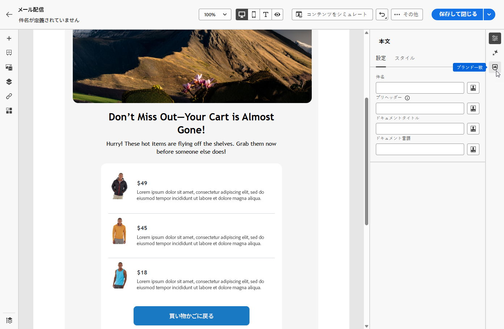
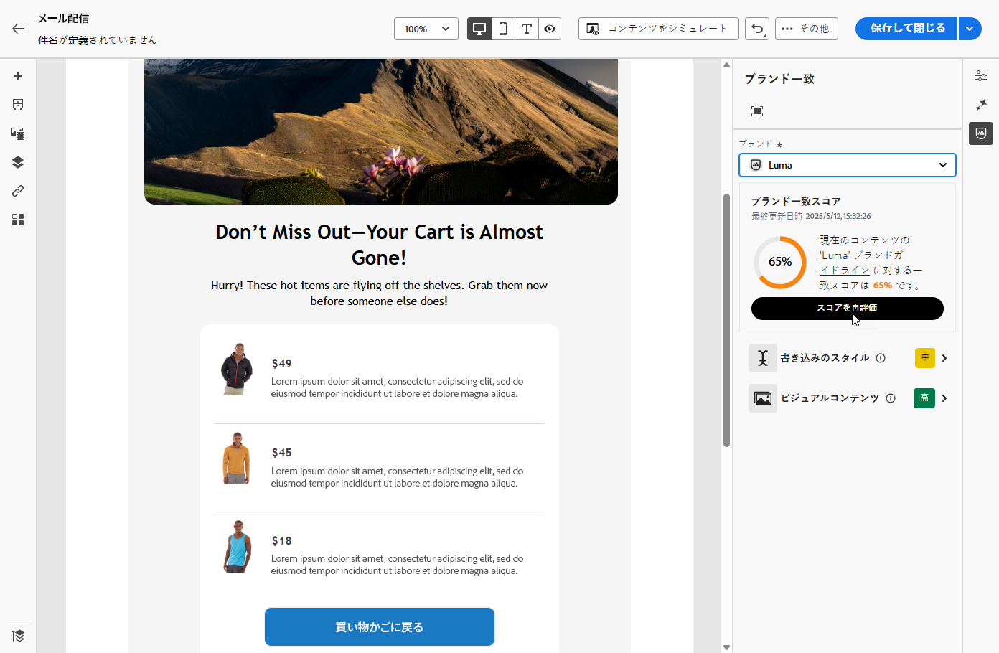
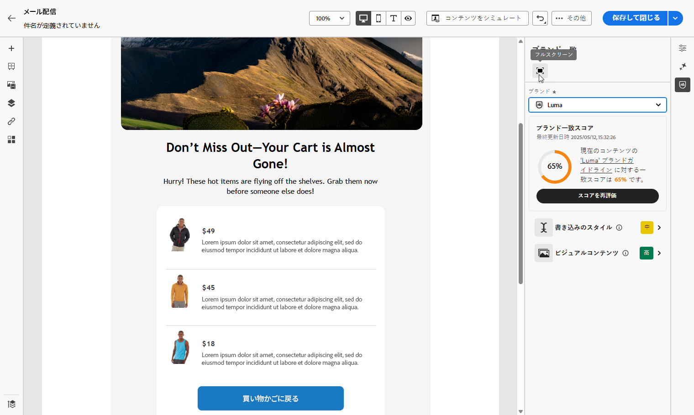
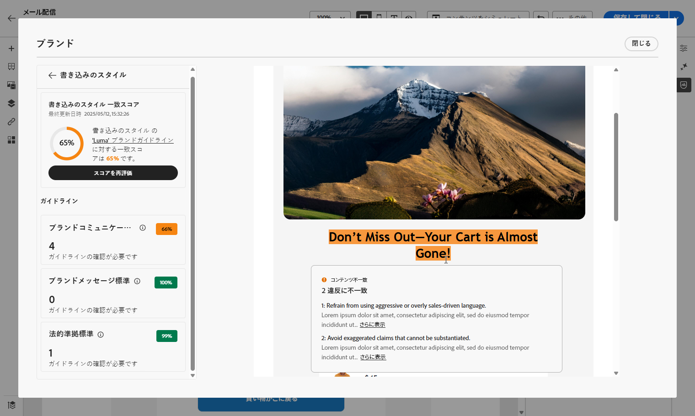

# ブランド一致 {#brands-score}

>[!AVAILABILITY]
>
>AI アシスタントを使用する前に、[ユーザー契約](https://www.adobe.com/jp/legal/licenses-terms/adobe-dx-gen-ai-user-guidelines.html){target="_blank"}に同意する必要があります。詳しくは、アドビ担当者にお問い合わせください。

ブランド一致機能は、ブランドガイドラインに準拠したコンテンツを作成、確認、管理できるように作成されています。これにより、メールキャンペーン全体でトーン、メッセージ、視覚的なアイデンティティの一貫性が確保されると共に、コンテンツが公開される前の品質チェックとしても機能します。

## ブランド一致を使用したコンテンツの検証 {#validate-content}

[ブランドを設定して公開](brands.md)したら、メールキャンペーン内で直接ブランド一致スコアを評価し、コンテンツがブランドガイドラインに準拠していることを確認します。

1. [メールキャンペーン](../email/create-email.md)を作成します。

1. E メールデザイナーで&#x200B;**[!UICONTROL ブランド一致]**&#x200B;メニューを開きます。

   コンテンツは、デフォルトのブランドに対して自動的に評価されます。[デフォルトのブランドの詳細情報を参照してください](brands.md)。

   

1. 別のブランドを使用して評価するには、**[!UICONTROL ブランド]**&#x200B;ドロップダウンメニューから選択し、「**[!UICONTROL スコアを再評価]**」をクリックします。

   

1. **ブランド一致スコア**（高、中、低）を参照し、詳細なフィードバックを確認します。

1.  アイコンをクリックして、スコアの詳細なインサイトを表示します。

   

1. フラグの付いたガイドラインを選択して、特定のフィードバックと提案を表示します。

   

1. レコメンデーションに基づいてコンテンツを編集し、ブランド一致を向上させます。

1. 変更後にコンテンツを手動で再評価し、一致スコアを更新します。
