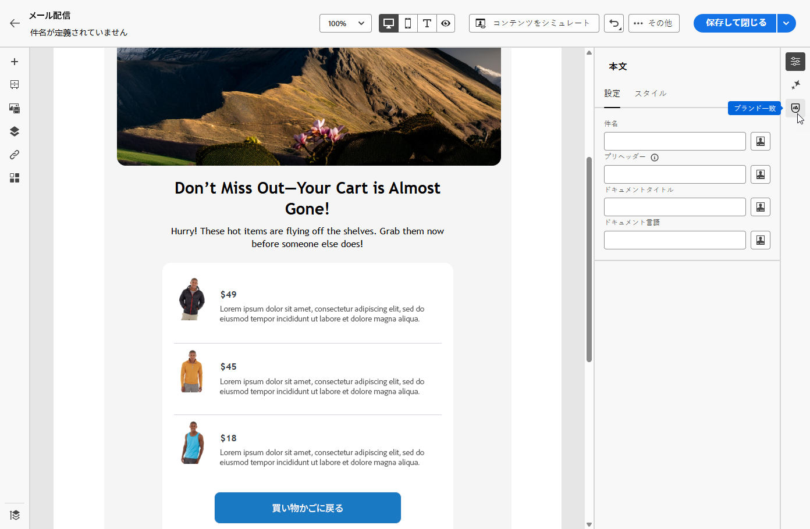
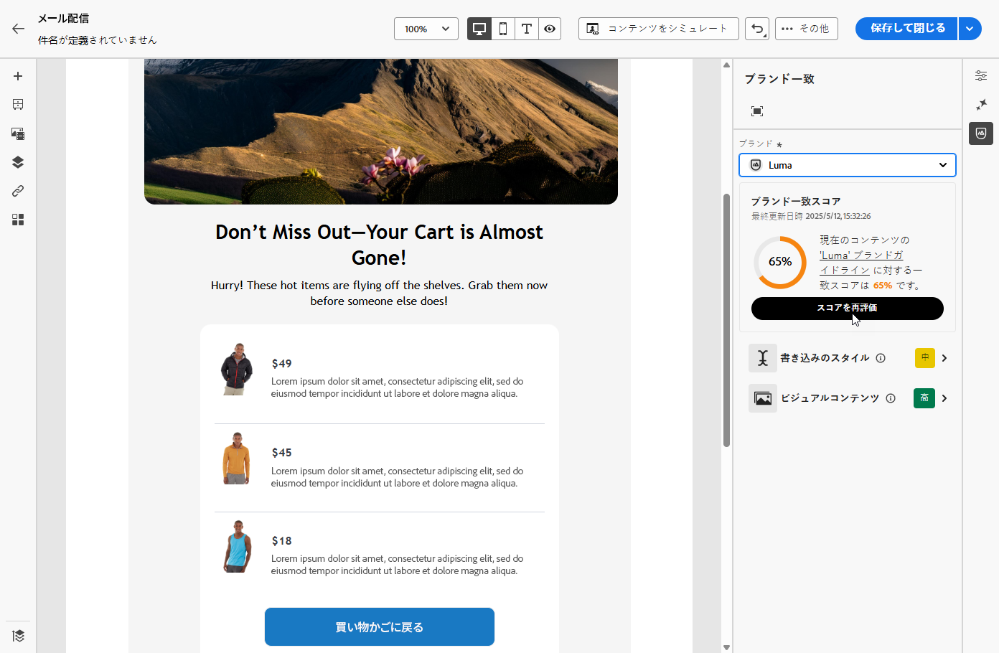
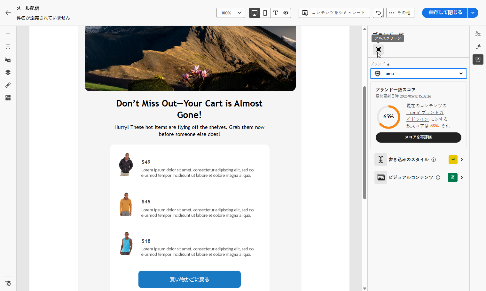
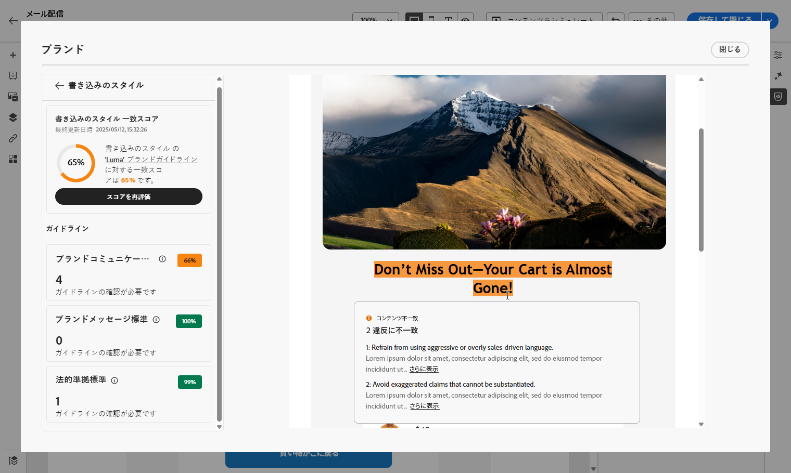
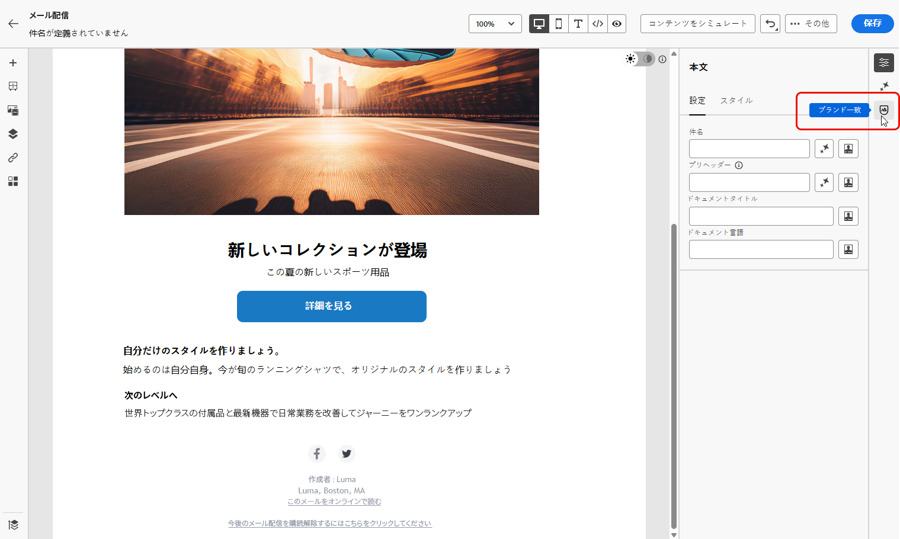
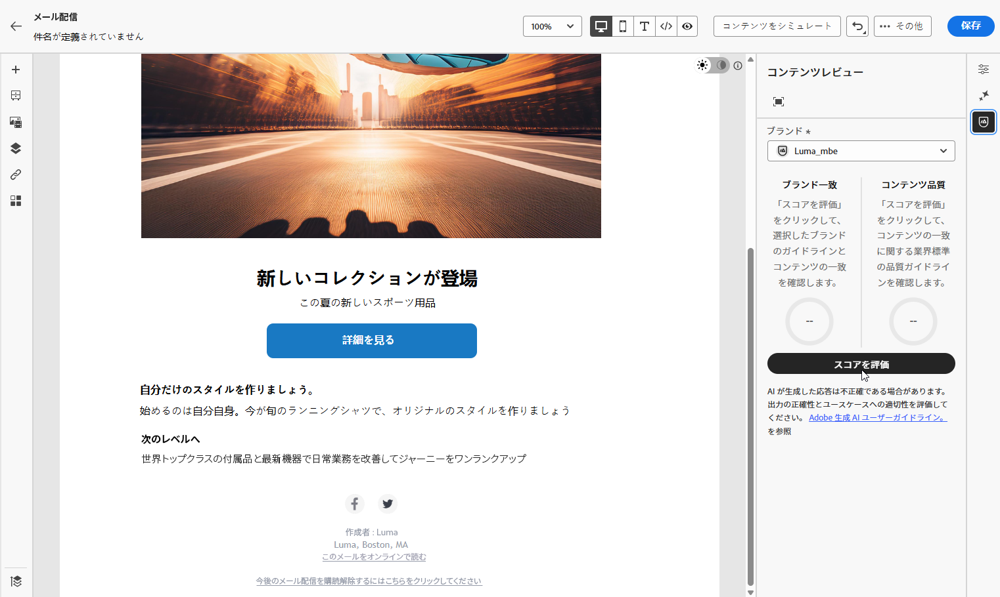
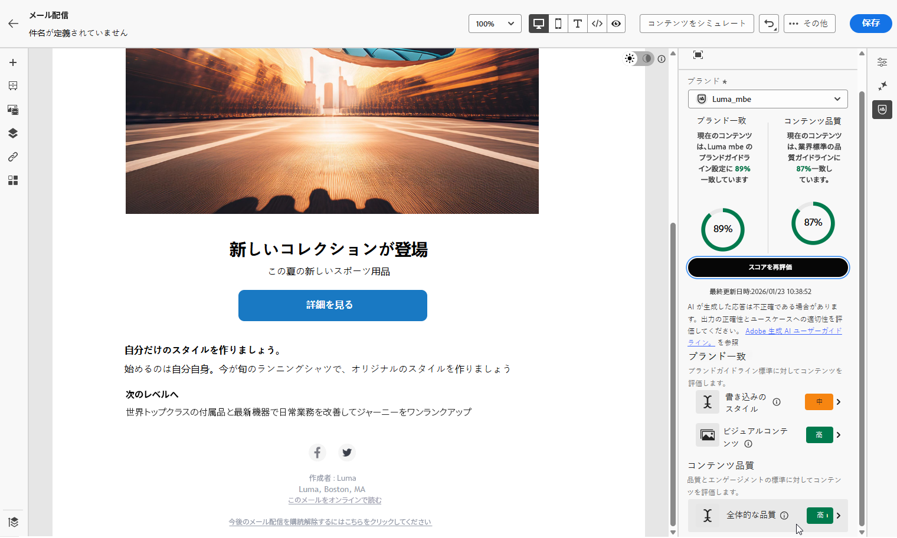
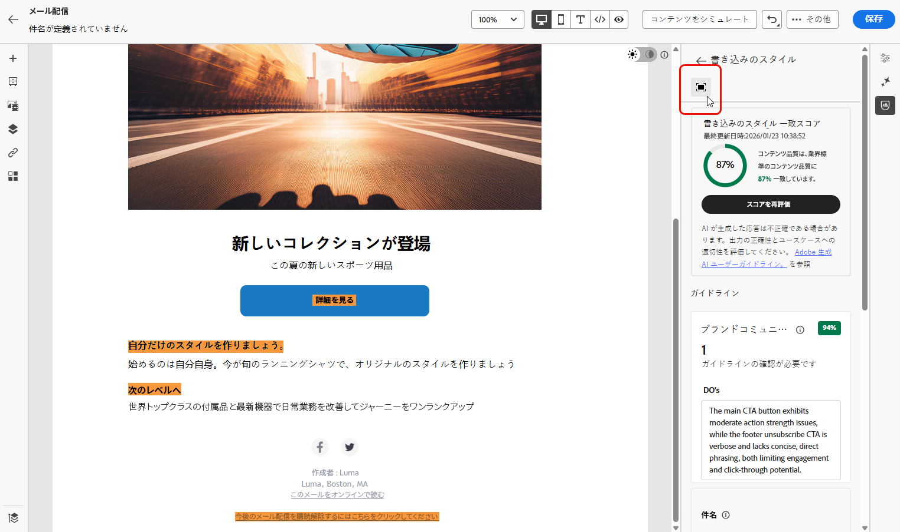
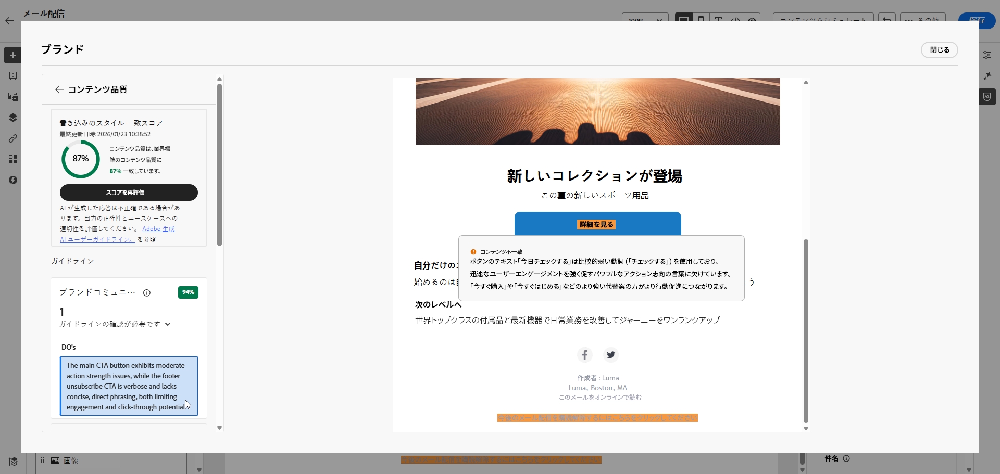

# コンテンツの評価 {#brands-score}

>[!AVAILABILITY]
>
>AI アシスタントを使用する前に、[ユーザー契約](https://www.adobe.com/jp/legal/licenses-terms/adobe-dx-gen-ai-user-guidelines.html){target="_blank"}に同意する必要があります。 詳しくは、アドビ担当者にお問い合わせください。

コンテンツレビュー機能には、包括的な評価ツールが用意されています。これにより、キャンペーンがブランドガイドラインにどの程度合致しており、あらゆるコミュニケーションをまたいでコンテンツの品質基準を維持しているかを測定できます。

* **ブランド一致**：ブランドガイドラインに準拠したコンテンツをレビューおよび管理できます。これにより、メールキャンペーン全体でトーン、メッセージ、ビジュアルアイデンティティの一貫性が確保されます。
* **品質チェック**：本番稼働前にコンテンツを検証して、高い基準とブランドの整合性を維持します。

## ブランド一致を使用したコンテンツの検証 {#validate-content}

[ブランドを設定して公開](brands.md)したら、メールキャンペーン内で直接ブランド一致スコアを評価し、コンテンツがブランドガイドラインに準拠していることを確認します。

1. [メールキャンペーン](../email/create-email.md)を作成します。

1. E メールデザイナーで&#x200B;**[!UICONTROL ブランド一致]**&#x200B;メニューを開きます。

   コンテンツは、デフォルトのブランドに対して自動的に評価されます。 [デフォルトのブランドの詳細情報を参照してください](brands.md)。

   

1. 別のブランドを使用して評価するには、**[!UICONTROL ブランド]**&#x200B;ドロップダウンメニューから選択し、「**[!UICONTROL スコアを再評価]**」をクリックします。

   

1. **ブランド一致スコア**（高、中、低）を参照し、詳細なフィードバックを確認します。

1.  アイコンをクリックして、スコアの詳細なインサイトを表示します。

   

1. フラグの付いたガイドラインを選択して、特定のフィードバックと提案を表示します。

   

1. レコメンデーションに基づいてコンテンツを編集し、ブランド一致を向上させます。

1. 変更後にコンテンツを手動で再評価し、一致スコアを更新します。

## コンテンツ品質を検証 {#validate-quality}

>[!NOTE]
>
>コンテンツの品質評価は、ブランドガイドラインとは独立しています。ドロップダウンメニューでブランドを選択しても、そのブランドのガイドラインは品質チェックに適用されません。ブランド選択は、ブランド一致スコアリングにのみ関連します。

ブランド一致に加えて、一般的なコンテンツの品質を評価し、ブランドガイドラインに依存せずに、読みやすさ、コンテンツのまとまり、有効性に関する潜在的な問題を特定できます。

コンテンツの品質を評価するには、次の手順に従います。

1. [メール配信](../email/create-email.md)を作成します。

1. E メールデザイナーで&#x200B;**[!UICONTROL ブランド一致]**&#x200B;メニューを開きます。

   

1. 「**[!UICONTROL スコアを評価]**」をクリックして、ブランド一致とコンテンツ品質の両方のスコアを生成します。

   

1. 「**[!UICONTROL 全体的な品質]**」タブに移動して、コンテンツ品質に関するインサイトとレコメンデーションを確認します。

   

1.  アイコンをクリックすると、品質スコアの詳細ビューが表示されます。

   

1. フラグが付けられた項目を選択して、特定のフィードバックと改善に向けた実用的な提案を表示します。スコアは、次のカテゴリに基づいています。

   * **[!UICONTROL CTA 効果]**：コールトゥアクションが、読者に望ましい行動をどの程度促せているかを評価します。
   * **[!UICONTROL 件名]**：メールの開封を促すために、明確さ、関連性、注意を引く品質を評価します。
   * **[!UICONTROL 読みやすさ]**：読者が理解できるよう、読者にとってコンテンツがどの程度容易で魅力的であるかを測定します。
   * **[!UICONTROL スパムチェック]**：配信品質に影響を与える可能性のある一般的なスパムトリガーを特定します。
   * **[!UICONTROL コンテンツのまとまり]**：コンテンツがスムーズに流れ、トピックに沿ったものであることを確認します。
   * **[!UICONTROL プルーフリーディング]**：スペル、文法、明確さの問題をチェックします。

   

1. レコメンデーションにもとづいてコンテンツを編集することで、読みやすさ、コンテンツのまとまり、全体的な品質を向上させます。

1. 変更後に「**[!UICONTROL スコアを再評価]**」をクリックし、品質スコアを更新します。
