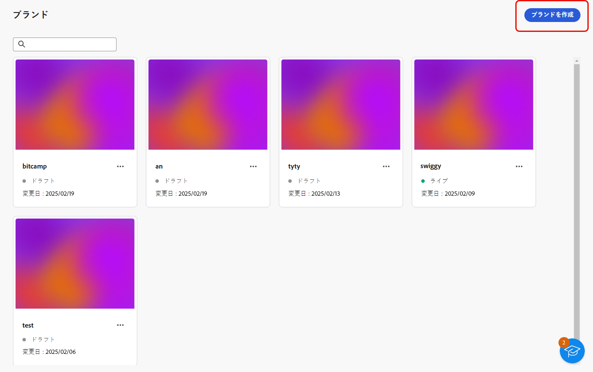
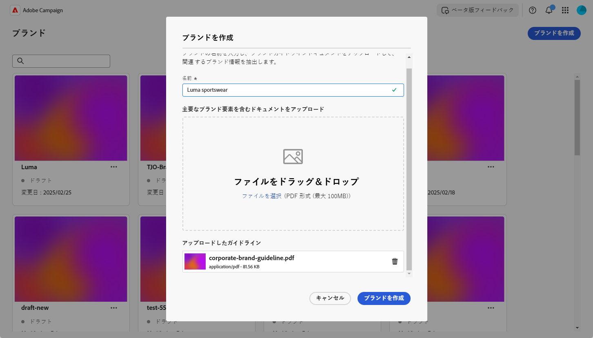
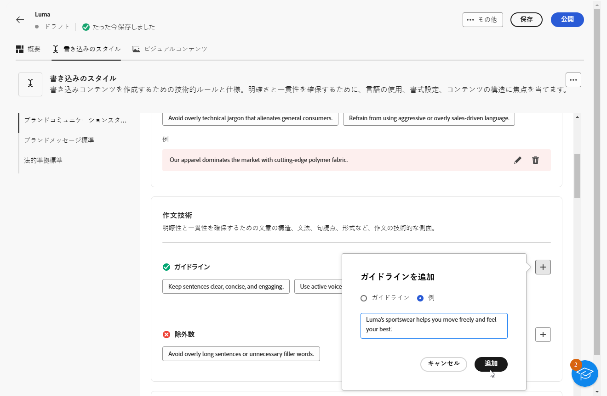
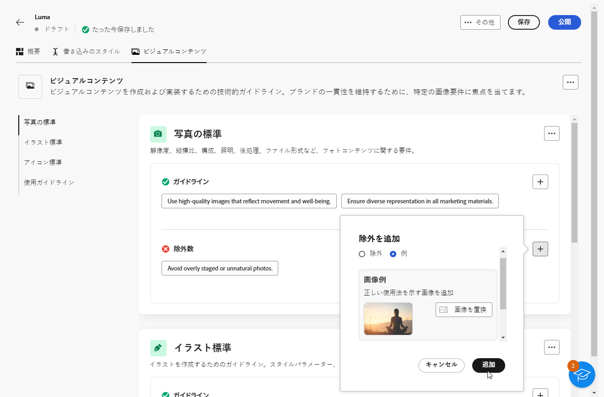
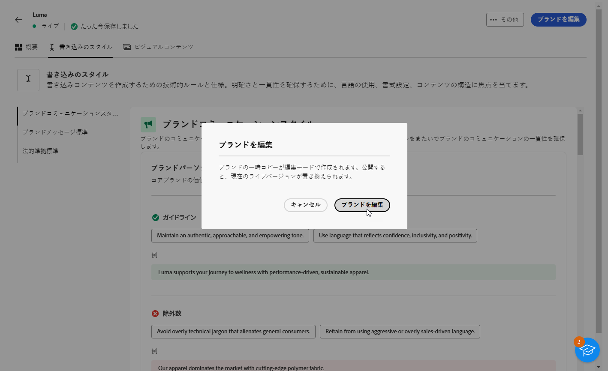
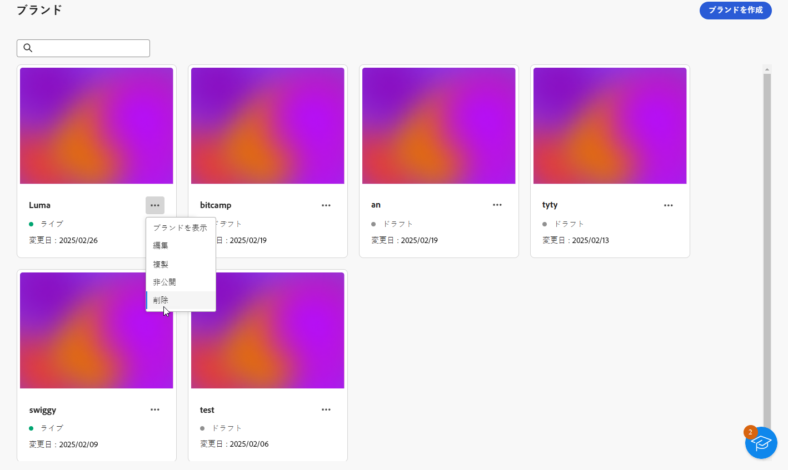
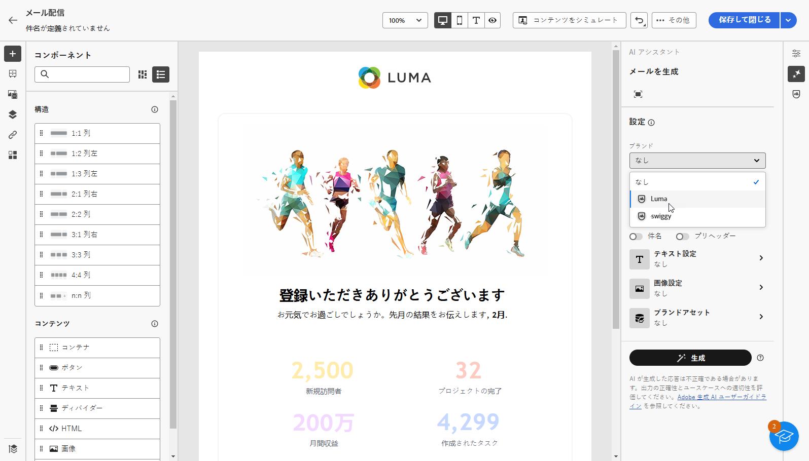

# ブランドの作成と管理 {#brands}

>[!AVAILABILITY]
>
>この機能は非公開のベータ版としてリリースされています。今後のリリースで、すべてのお客様が段階的に利用できるようになります。

ブランドガイドラインは、ブランドの視覚的および言語的なアイデンティティを定義する包括的な一連のルールおよび標準です。すべてのマーケティングおよびコミュニケーションチャネルにわたって一貫したブランド表現を確保するための参照として機能します。

ま [!DNL Adobe Campaign Web]、ユーザーはブランド情報を手動で入力および整理したり、ブランドガイドラインドキュメントをアップロードして自動データ抽出用に抽出したりできます。

## ブランドへのアクセス {#generative-access}

[!DNL Adobe Campaign Web] で **[!UICONTROL ブランド]** メニューにアクセスするには、ユーザーに **[!UICONTROL 管理者（管理者）]** および **[!UICONTROL ブランドキット]** 製品プロファイルを割り当て、ブランドを作成および管理する必要があります。 読み取り専用アクセスの場合、ユーザーには [!UICONTROL AI アシスタント ] 製品プロファイルが必要です。

[詳細情報](https://experienceleague.adobe.com/ja/docs/campaign/campaign-v8/admin/permissions/manage-permissions)

+++ ブランド関連の権限を割り当てる方法を学ぶ

1. [Admin Console](https://adminconsole.adobe.com/enterprise) のホームページで、Campaign 製品にアクセスします。

   

1. ユーザーに付与する権限のレベルに基づいて **[!DNL Product profile]** を選択します。

   

1. 「**[!DNL Add users]**」をクリックして、選択した製品プロファイルを割り当てます。

   

1. ユーザーの名前、ユーザーグループまたはメールアドレスを入力します。

1. 「**保存**」をクリックして変更を適用します。

この役割に既に割り当てられているユーザーの権限は自動的に更新されます。

+++

## ブランドの作成 {#create-brand-kit}

ブランドガイドラインを作成および設定するには、次の手順に従います。

ユーザーは、詳細を手動で入力するか、ブランドガイドラインドキュメントをアップロードして情報を自動的に抽出できます。

1. **[!UICONTROL コンテンツ管理]**&#x200B;メニューから、「**[!UICONTROL ブランド]**」を選択します。

1. **[!UICONTROL ブランド]**&#x200B;メニューで、「**[!UICONTROL ブランドを作成]**」をクリックします。

   

1. ブランドの&#x200B;**[!UICONTROL 名前]**&#x200B;を入力します。

1. ファイルをドラッグ&amp;ドロップまたは選択して、ブランドガイドラインをアップロードし、関連するブランド情報を自動的に抽出します。 「**[!UICONTROL ブランドを作成]**」をクリックします。

   情報の抽出プロセスが開始されます。 完了するまでに数分かかる場合があります。

   

1. コンテンツとビジュアル作成標準が自動的に入力されます。 様々なタブを参照して、必要に応じて情報を調整します。

1. 「**[!UICONTROL ライティングスタイル]**」タブで「」をクリックして、例を含むガイドラインや除外を追加します。

   

1. 「**[!UICONTROL ビジュアルコンテンツ]**」タブで、「 をクリックして、別のガイドラインまたは除外を追加します。

1. 正しい使用方法を示す画像を追加するには、「**[!UICONTROL 例]**」を選択し、「**[!UICONTROL 画像を選択]**」をクリックします。また、除外の例として、正しくない使用方法を示す画像を追加することもできます。

   

1. 設定が完了したら、「**[!UICONTROL 保存]**」、「**[!UICONTROL 公開]**」の順にクリックし、ブランドガイドラインを AI アシスタントで使用できるようにします。

1. 公開したブランドを変更するには、「**[!UICONTROL ブランドを編集]**」をクリックします。

   >[!NOTE]
   >
   >これにより、編集モードで一時コピーが作成され、公開後にライブバージョンが置き換えられます。

   

1. **[!UICONTROL ブランド]** ダッシュボードで、「その他のオプション」アイコン  す。

   * ブランドを表示
   * 編集
   * 複製
   * 公開
   * 非公開
   * 削除

   

ブランドガイドラインに、AI アシスタントメニューの **[!UICONTROL ブランド]** ドロップダウンからアクセスできるようになりました。 これにより、AI アシスタントが仕様に合ったコンテンツおよびアセットを生成できるようになります。 [詳しくは、AI アシスタントを参照してください](../email/generative-gs.md)

