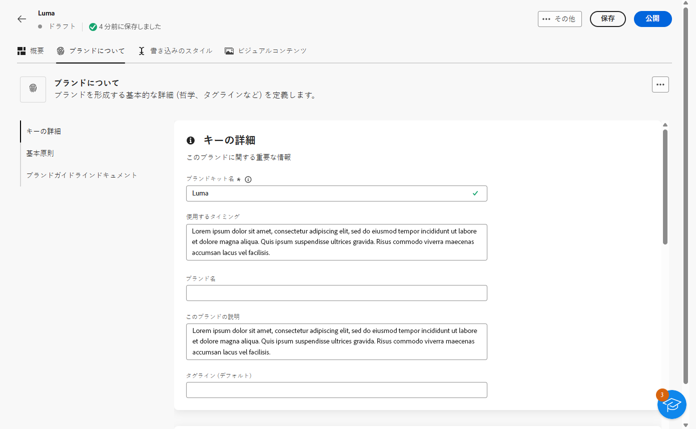
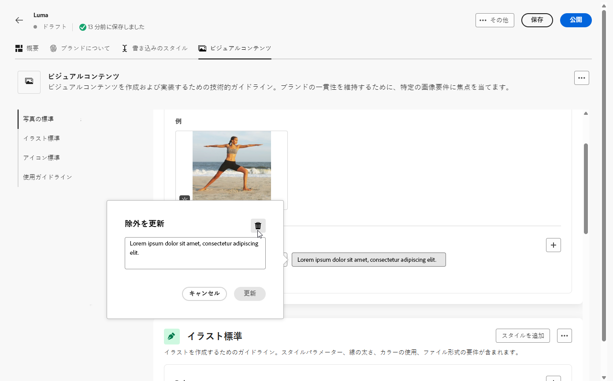

# ブランドの作成と管理 {#brands}

ブランドガイドラインは、ブランドの視覚的および言語的なアイデンティティを定義する包括的な一連のルールおよび標準です。すべてのマーケティングおよびコミュニケーションチャネルにわたって一貫したブランド表現を確保するための参照として機能します。

[!DNL Adobe Campaign Web] では、ブランド情報を手動で入力および整理したり、自動データ抽出用のブランドガイドラインドキュメントをアップロードしたりできます。

## ブランドへのアクセス {#generative-access}

[!DNL Adobe Campaign Web] の&#x200B;**[!UICONTROL ブランド]**&#x200B;メニューにアクセスするには、ブランドを作成および管理するための&#x200B;**[!UICONTROL 管理者 (管理者)]** と&#x200B;**[!UICONTROL ブランドキット]**&#x200B;製品プロファイルをユーザーに割り当てる必要があります。読み取り専用アクセスの場合、ユーザーには [!UICONTROL AI アシスタント]製品プロファイルが必要です。[詳細情報](https://experienceleague.adobe.com/ja/docs/campaign/campaign-v8/admin/permissions/manage-permissions)

+++ ブランド関連の権限を割り当てる方法について説明します

1. [Admin Console](https://adminconsole.adobe.com/enterprise) のホームページで、Campaign 製品にアクセスします。

   

1. ユーザーに付与する権限のレベルに基づいて、**[!DNL Product profile]** を選択します。

   

1. 「**[!DNL Add users]**」をクリックして、選択した製品プロファイルを割り当てます。

   

1. ユーザーの名前、ユーザーグループまたはメールアドレスを入力します。

1. 「**保存**」をクリックして変更を適用します。

この役割に既に割り当てられているユーザーは、権限が自動的に更新されます。

+++

## ブランドの作成 {#create-brand-kit}

ブランドガイドラインを作成および設定するには、次の手順に従います。

詳細を手動で入力するか、ブランドガイドラインドキュメントをアップロードして、情報を自動的に抽出できます。

1. **[!UICONTROL ブランド]**&#x200B;メニューで、「**[!UICONTROL ブランドを作成]**」をクリックします。

   

1. ブランドの&#x200B;**[!UICONTROL 名前]**&#x200B;を入力します。

1. ファイルをドラッグ＆ドロップするか選択して、ブランドガイドラインをアップロードし、関連するブランド情報を自動的に抽出します。「**[!UICONTROL ブランドを作成]**」をクリックします。

   これで、情報の抽出プロセスが開始されます。完了するまでに数分かかる場合があります。

   

1. コンテンツとビジュアル作成標準が自動的に入力されるようになりました。様々なタブを参照して、必要に応じて情報を調整します。[詳細情報](#personalize)

1. 各セクションやカテゴリの詳細メニューから参照を追加して、関連するブランド情報を自動的に抽出できます。

   既存のコンテンツを削除するには、「**[!UICONTROL セクションをクリア]**」オプションまたは「**[!UICONTROL カテゴリをクリア]**」オプションを使用します。

   

1. 設定が完了したら、「**[!UICONTROL 保存]**」、「**[!UICONTROL 公開]**」の順にクリックし、ブランドガイドラインを AI アシスタントで使用できるようにします。

1. 公開済みのブランドの変更を行うには、「**[!UICONTROL ブランドを編集]**」をクリックします。

   >[!NOTE]
   >
   >これにより、編集モードで一時コピーが作成され、公開後はライブバージョンが置き換えられます。

   

1. **[!UICONTROL ブランド]**&#x200B;ダッシュボードから、 アイコンをクリックして詳細設定メニューを開き、次の操作を実行します。

   * ブランドを表示
   * 編集
   * デフォルトのブランドとしてマーク
   * 複製
   * 公開
   * 非公開
   * 削除

   

AI アシスタントメニューのブランドドロップダウンから&#x200B;**[!UICONTROL ブランド]**&#x200B;ガイドラインにアクセスできるようになりました。これにより、AI アシスタントで仕様に合わせたコンテンツとアセットを生成できます。[詳しくは、AI アシスタントを参照してください](../content/generative-gs.md)

### デフォルトのブランドの設定 {#default-brand}

キャンペーン作成時にコンテンツを生成し、一致スコアを計算する際に自動的に適用されるデフォルトのブランドを指定できます。

デフォルトのブランドを設定するには、**[!UICONTROL ブランド]**&#x200B;ダッシュボードに移動します。 アイコンをクリックして詳細メニューを開き、「**[!UICONTROL デフォルトのブランドとしてマーク]**」を選択します。

## ブランドのパーソナライズ {#personalize}

### ブランドについて {#about-brand}

「**[!UICONTROL ブランドについて]**」タブを使用して、ブランドの目的、パーソナリティ、タグライン、その他の定義属性を説明し、ブランドのコア ID を確立します。

1. まず、**[!UICONTROL 主な詳細]**&#x200B;カテゴリにブランドの基本情報を入力します。

   * **[!UICONTROL ブランドキット名]**：ブランドキットの名前を入力します。

   * **[!UICONTROL 使用するタイミング]**：このブランドキットを適用するシナリオまたはコンテキストを指定します。

   * **[!UICONTROL ブランド名]**：ブランドの正式名称を入力します。

   * **[!UICONTROL ブランドの説明]**：このブランドが表す内容の概要を入力します。

   * **[!UICONTROL デフォルトのタグライン]**：ブランドに関連付けられたプライマリのタグラインを追加します。

     

1. **[!UICONTROL 基本原則]**&#x200B;カテゴリでは、ブランドのコアとなる方向性と哲学を明確にします。

   * **[!UICONTROL ミッション]**：ブランドの目的を詳しく説明します。

   * **[!UICONTROL ビジョン]**：長期目標または目的の今後の状態を説明します。

   * **[!UICONTROL マーケットでの位置付け]**：ブランドがマーケットでどのように位置付けられているかを説明します。

   

1. **[!UICONTROL コアブランド値]**&#x200B;カテゴリで、 をクリックして、ブランドのコア値を追加し、詳細を入力します。

   * **[!UICONTROL 値]**：コアブランド値に名前を付けます。

   * **[!UICONTROL 説明]**：この値がブランドにもたらす意味を説明します。

   * **[!UICONTROL 行動]**：この値を実際に反映する行動や態度を説明します。

   * **[!UICONTROL 表現]**：この値が実際のブランディングでどのように表現されるかの例を示します。

     

1. 必要に応じて、 アイコンをクリックして、コアブランド値の 1 つを更新または削除します。

   

ブランドをさらにパーソナライズしたり、[ブランドを公開](#create-brand-kit)したりできるようになりました。

### 文体 {#writing-style}

**[!UICONTROL 文体]**&#x200B;の節では、コンテンツを書くための標準を説明し、すべての資料にまたがる明確さ、一貫性、整合性を維持するために、言語、書式設定、構造を使用する方法について詳しく説明します。

+++ 使用可能なカテゴリと例

<table>
  <thead>
    <tr>
      <th>カテゴリ</th>
      <th>サブカテゴリ</th>
      <th>ガイドラインの例</th>
      <th>除外の例</th>
    </tr>
  </thead>
  <tbody>
    <tr>
      <td rowspan="4">コンテンツ作成標準</td>
      <td>ブランドメッセージ標準</td>
      <td>イノベーションと顧客第一のメッセージをハイライト表示します。</td>
      <td>製品の機能を過度に期待しないでください。</td>
    </tr>
    <tr>
      <td>タグラインの使用状況</td>
      <td>すべてのデジタルマーケティングアセットのロゴの下にタグラインを配置します。</td>
      <td>タグラインを変更または翻訳しないでください。</td>
    </tr>
    <tr>
      <td>コアメッセージ</td>
      <td>生産性の向上など、主なメリットの文章をハイライト表示します。</td>
      <td>無関係な値の提案は使用しないでください。</td>
    </tr>
    <tr>
      <td>命名標準</td>
      <td>「ProScheduler」など、シンプルでわかりやすい名前を使用します。</td>
      <td>複雑な用語や特殊文字を使用しないでください。</td>
    </tr>
    <tr>
      <td rowspan="5">ブランドコミュニケーションスタイル</td>
      <td>ブランドパーソナリティ特性</td>
      <td>わかりやすく、親しみやすくします。</td>
      <td>悲観的にならないようにしてください。</td>
    </tr>
    <tr>
      <td>書き込みのメカニクス</td>
      <td>文を短く、影響力のある状態に保ちます。</td>
      <td>専門用語を過度に使用しないでください。</td>
    </tr>
    <tr>
      <td>状況に応じたトーン</td>
      <td>危機対応コミュニケーションでは、プロフェッショナルなトーンを維持します。</td>
      <td>サポートに関するコミュニケーションでは、否定的な態度を取らないでください。</td>
    </tr>
    <tr>
      <td>単語選択ガイドライン</td>
      <td>「革新的」や「スマート」などの単語を使用します。</td>
      <td>「安い」や「ハック」などの単語は避けます。</td>
    </tr>
    <tr>
      <td>言語標準</td>
      <td>米国英語の規則に従います。</td>
      <td>英国英語と米国英語のスペルを混在させないでください。</td>
    </tr>
    <tr>
      <td rowspan="3">法的遵守標準</td>
      <td>商標標準</td>
      <td>常に ™ 記号または ® 記号を使用します。</td>
      <td>必要な場面で法的記号を省略しないでください。</td>
    </tr>
    <tr>
      <td>著作権標準</td>
      <td>マーケティング資料に著作権表示を含めます。</td>
      <td>許可なくサードパーティコンテンツを使用しないでください。</td>
    </tr>
    <tr>
      <td>免責事項標準</td>
      <td>デジタルアセットに免責事項を読みやすく表示します。</td>
      <td>非表示の領域で免責事項を非表示にしないでください。</td>
    </tr>
</table>

+++

 

**[!UICONTROL 文体]**&#x200B;をパーソナライズするには：

1. 「**[!UICONTROL 文体]**」タブで  をクリックし、ガイドライン、例外または除外を追加します。

1. ガイドライン、例外または除外を入力します。また、**[!UICONTROL 例]**&#x200B;を含めることで、適用方法をより明確に示すことができます。

   

1. ガイドライン、例外または除外の&#x200B;**[!UICONTROL 使用コンテキスト]**&#x200B;を指定します。

   * **[!UICONTROL チャネルタイプ]**：このガイドライン、例外または除外を適用する場所を選択します。例えば、特定の書き込みスタイルをメール、モバイル、プリントまたは他の通信チャネルにのみ表示する場合があります。

   * **[!UICONTROL 要素タイプ]**：ルールが適用されるコンテンツ要素を指定します。これには、見出し、ボタン、リンクまたはコンテンツ内の他のコンポーネントなどの要素が含まれる場合があります。

   

1. ガイドライン、例外または除外を設定したら、「**[!UICONTROL 追加]**」をクリックします。
1. 必要に応じて、更新または削除するガイドラインや除外の 1 つを選択します。

1.  をクリックして例を編集するか、 アイコンをクリックして削除します。

   

ブランドをさらにパーソナライズしたり、[ブランドを公開](#create-brand-kit)したりできるようになりました。

### 視覚的コンテンツ {#visual-content}

**[!UICONTROL ビジュアルコンテンツ]**&#x200B;の節では、画像とデザインの標準を定義し、統一された一貫性のあるブランドの外観を維持するために必要な仕様について詳しく説明します。

+++ 使用可能なカテゴリと例

<table>
  <thead>
    <tr>
      <th>カテゴリ</th>
      <th>ガイドラインの例</th>
      <th>除外の例</th>
    </tr>
  </thead>
  <tbody>
    <tr>
      <td>フォト標準</td>
      <td>屋外での撮影には自然光を使用します。</td>
      <td>過度に編集された画像やピクセル化された画像は回避します。</td>
    </tr>
    <tr>
      <td>イラスト標準</td>
      <td>クリーンでミニマルなスタイルを使用します。</td>
      <td>過度に複雑なスタイルは回避します。</td>
    </tr>
    <tr>
      <td>アイコン標準</td>
      <td>一貫性のある 24px グリッドシステムを使用します。</td>
      <td>アイコンのサイズを混在させたり、一貫性のないストロークの太さを使用したり、グリッドルールから逸脱したりしないでください。</td>
    </tr>
    <tr>
      <td>使用ガイドライン</td>
      <td>プロフェッショナルな環境で製品を使用している実際の顧客を反映したライフスタイル画像を選択します。</td>
      <td>ブランドのトーンと矛盾する画像や、コンテキストから外れた画像は使用しないでください。</td>
    </tr>
</table>

+++

 

**[!UICONTROL ビジュアルコンテンツ]**&#x200B;をパーソナライズするには：

1. 「**[!UICONTROL ビジュアルコンテンツ]**」タブで、 をクリックし、ガイドライン、除外または例を追加します。

1. ガイドライン、除外または例を入力します。

   

1. ガイドラインまたは除外の&#x200B;**[!UICONTROL 使用コンテキスト]**&#x200B;を指定します。

   * **[!UICONTROL チャネルタイプ]**：このガイドライン、例外または除外を適用する場所を選択します。例えば、特定の書き込みスタイルをメール、モバイル、プリントまたは他の通信チャネルにのみ表示する場合があります。

   * **[!UICONTROL 要素タイプ]**：ルールが適用されるコンテンツ要素を指定します。これには、見出し、ボタン、リンクまたはコンテンツ内の他のコンポーネントなどの要素が含まれる場合があります。

     

1. ガイドライン、例外または除外を設定したら、「**[!UICONTROL 追加]**」をクリックします。

1. 正しい使用方法を示す画像を追加するには、「**[!UICONTROL 例]**」を選択し、「**[!UICONTROL 画像を選択]**」をクリックします。また、除外の例として、正しくない使用方法を示す画像を追加することもできます。

   

1. 更新または削除するガイドラインや除外の 1 つを選択します。

1. 更新するガイドラインや除外の 1 つを選択します。 アイコンをクリックして削除します。

   

ブランドをさらにパーソナライズしたり、[ブランドを公開](#create-brand-kit)したりできるようになりました。
