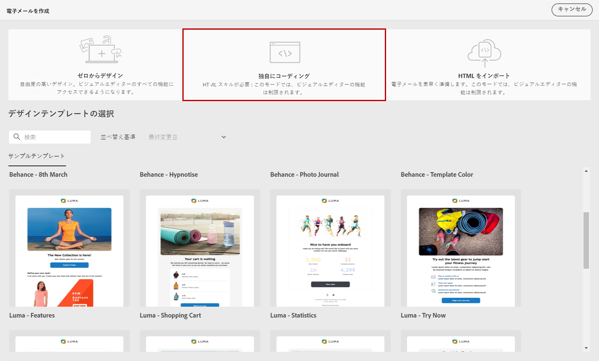
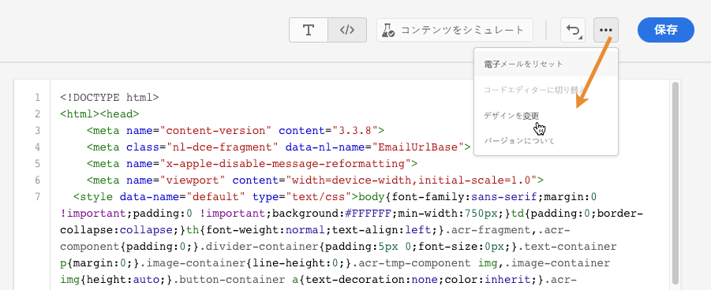
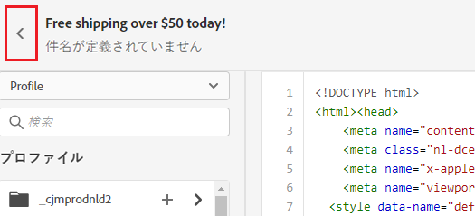

# 独自のコンテンツをコーディング {#code-content}

>[!NOTE]
>
>このドキュメントは作成中で、頻繁に更新されています。 このコンテンツの最終バージョンは、2023 年 1 月に準備が整います。

以下を使用： **[!UICONTROL 独自のコーディング]** モード：生のHTMLを読み込んだり、e メールコンテンツをコード化したりします。 この方法には、HTMLスキルが必要です。

➡️ [ビデオでこの機能を確認する](#video)

>[!CAUTION]
>
> このメソッドを使用する場合、Adobe Experience Manager Assets Essentialsの画像は参照できません。 HTMLコードで参照される画像は、公開場所に保存する必要があります。

1. E メールデザイナーのホームページで、 **[!UICONTROL 独自のコーディング]**.

   

1. 生のHTMLコードを入力または貼り付けます。

1. 左側のウィンドウを使用して [!DNL Journey Optimizer] パーソナライゼーション機能。

   

1. 電子メールデザイナーを開いて新しいデザインから電子メールを開始する場合は、「 **[!UICONTROL デザインを変更]** を選択します。

   

1. 次をクリック： **[!UICONTROL プレビュー]** ボタンを使用して、テストプロファイルを使用してメッセージデザインとパーソナライゼーションを確認します。

   

1. コードの準備が整ったら、「 **[!UICONTROL 保存]** 次に、メッセージ作成画面に戻り、メッセージを最終決定します。

   
