# E メールデザイナーのコンテンツの使用 {#content-components}

>[!CONTEXTUALHELP]
>id="ac_content_components_email"
>title="コンテンツについて"
>abstract="コンテンツコンポーネントは、空のコンテンツプレースホルダーで、電子メールのレイアウトの作成に使用できます。"

>[!CONTEXTUALHELP]
>id="ac_content_components_landing_page"
>title="コンテンツについて"
>abstract="コンテンツコンポーネントは、ランディングページのレイアウトの作成に使用できる空のコンテンツプレースホルダーです。"

>[!CONTEXTUALHELP]
>id="ac_content_components_fragment"
>title="コンテンツについて"
>abstract="コンテンツコンポーネントは、フラグメントのレイアウトの作成に使用できる空のコンテンツプレースホルダーです。"

>[!CONTEXTUALHELP]
>id="ac_content_components_template"
>title="コンテンツについて"
>abstract="コンテンツコンポーネントは、テンプレートのレイアウトの作成に使用できる空のコンテンツプレースホルダーです。"

E メールコンテンツを作成する場合、 **[!UICONTROL コンテンツ]** コンポーネントを使用すると、生の空コンポーネントで e メールをさらにパーソナライズできます。このコンポーネントは、e メールに配置した後に使用できます。

追加できる数は、 **[!UICONTROL 内容]** 必要に応じて **[!UICONTROL 構造]**:E メールのレイアウトを定義します。

## コンテンツコンポーネントを追加 {#add-content-components}

メールにコンテンツコンポーネントを追加し、必要に応じて調整するには、次の手順に従います。

1. E メールデザイナーで、 [既存コンテンツ](existing-content.md) または、 **[!UICONTROL 構造]** を空のコンテンツに追加して、e メールのレイアウトを定義します。 方法については、[こちら](create-email-content.md)を参照してください。

1. 次をドラッグ&amp;ドロップ： **[!UICONTROL コンテンツ]** を選択します。

   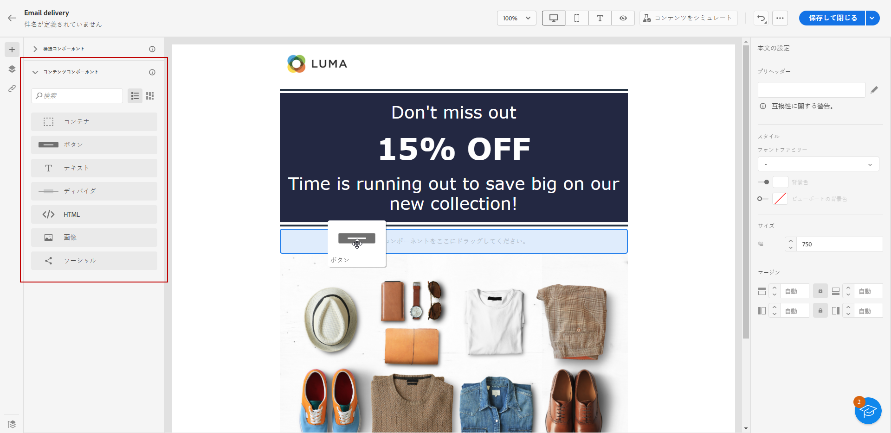

   >[!NOTE]
   >
   >複数のコンポーネントを 1 つの構造に追加し、構造の各列に追加できます。

1. コンテキストを使用して各コンポーネントのオプションを調整する **[!UICONTROL 設定]** タブをクリックします。 例えば、デスクトップとモバイルデバイスのみ、またはその両方に表示するよう選択できます。 また、このタブからリンクオプションを管理することもできます。 [リンク管理の詳細を説明します](message-tracking.md)

1. を使用して、各コンポーネントのスタイル属性を調整します。 **[!UICONTROL スタイル]** タブをクリックします。 例えば、各コンポーネントのテキストスタイル、パディングまたは余白を変更できます。 [詳しくは、整列とパディングを参照してください](alignment-and-padding.md)

   

1. の詳細設定メニューから **[!UICONTROL コンテンツ]** 右側のウィンドウでは、必要に応じて任意のコンテンツコンポーネントを簡単に削除または複製できます。

## コンテナ {#container}

シンプルなコンテナを追加して、その中に別のコンテンツコンポーネントを追加することができます。これにより、内部で使用されるコンポーネントとは異なる特定のスタイルをコンテナに適用できます。

例えば、**[!UICONTROL コンテナ]**&#x200B;コンポーネントを追加したあと、そのコンテナの内部に[ボタン](#button)コンポーネントを追加します。 コンテナには特定の背景を使用し、ボタンには別の背景を指定することができます。

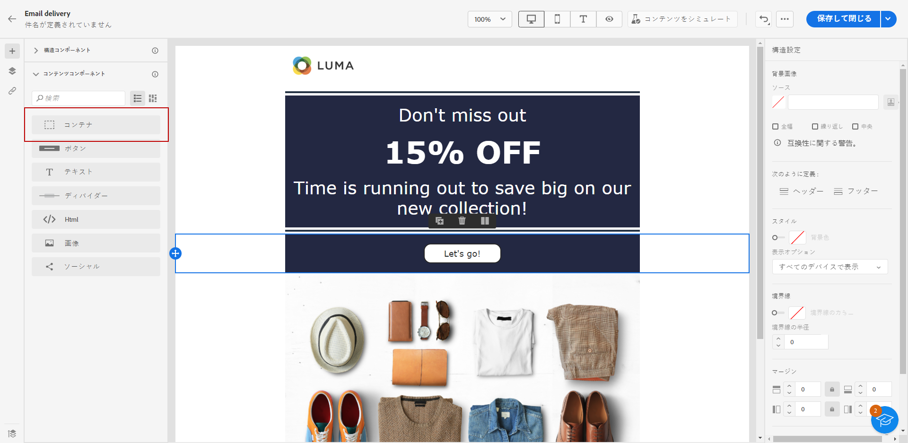

## ボタン {#buttons}

**[!UICONTROL ボタン]**&#x200B;コンポーネントを使用すると、メールに 1 つまたは複数のボタンを挿入し、メールのオーディエンスを別のページにリダイレクトすることができます。

1. **[!UICONTROL コンテンツ]**&#x200B;リストから、**[!UICONTROL ボタン]**&#x200B;コンポーネントを&#x200B;**[!UICONTROL 構造]**&#x200B;コンポーネントにドラッグ＆ドロップします。

   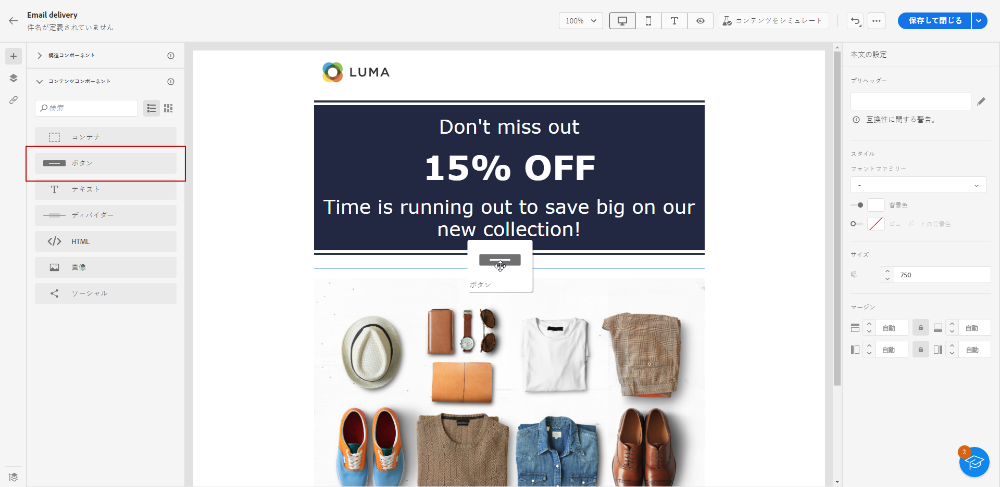

1. 新しく追加したボタンをクリックして、テキストをパーソナライズし、「**[!UICONTROL 設定]**」タブと「**[!UICONTROL スタイル]**」タブにアクセスします。

   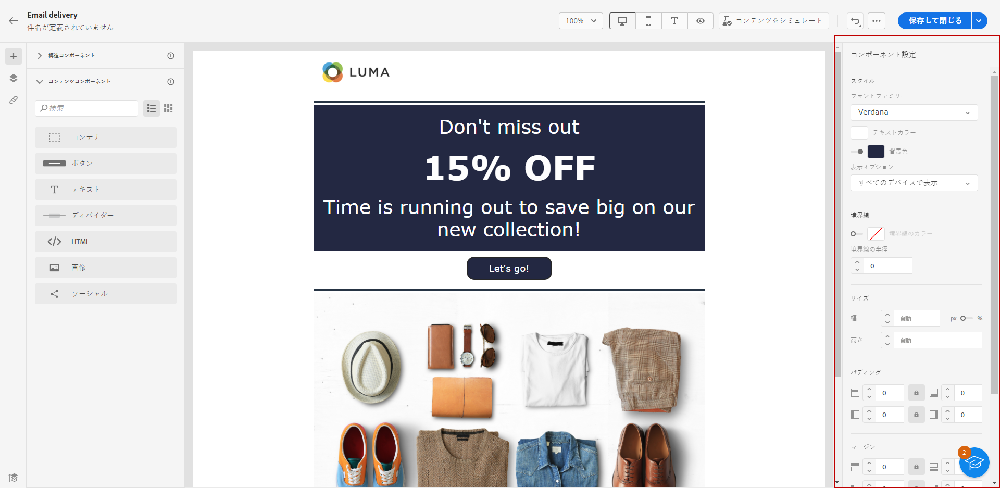

1. 「**[!UICONTROL 設定]**」タブの「**[!UICONTROL URL]**」フィールドに、ボタンをクリックしたときにリダイレクトする URL を追加します。

1. 「**[!UICONTROL ターゲット]**」ドロップダウンリストで、コンテンツの表示方法を選択します。

   * **[!UICONTROL なし]**：クリックされたのと同じフレームでリンクを開きます（デフォルト）。
   * **[!UICONTROL 空白]**：リンクを新しいウィンドウまたはタブで開きます。
   * **[!UICONTROL セルフ]**：クリックされたのと同じフレームでリンクを開きます。
   * **[!UICONTROL 親]**：親フレームでリンクを開きます。
   * **[!UICONTROL 上位]**：ウィンドウの全体でリンクを開きます。

   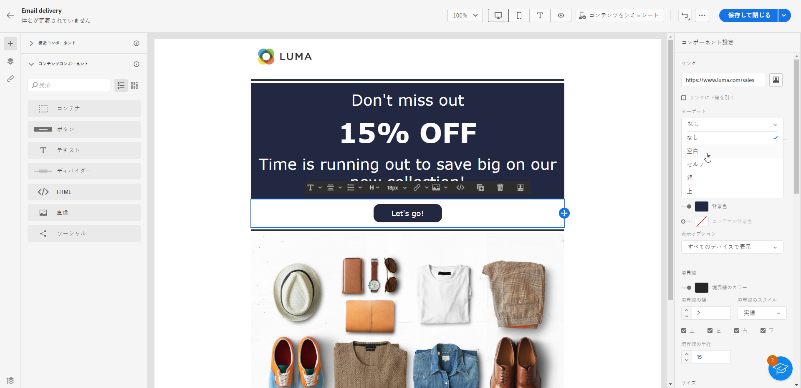

1. ボタンをさらにパーソナライズするには、「**[!UICONTROL 境界線]**」、「**[!UICONTROL サイズ]**」、「**[!UICONTROL 余白]**」などのスタイル属性をから **[!UICONTROL スタイル]** タブをクリックします。

## テキスト {#text}

**[!UICONTROL テキスト]**&#x200B;コンポーネントを使用すると、メールにテキストを挿入し、スタイル（境界線、サイズ、パディングなど）を「**[!UICONTROL 設定]**」タブと「**[!UICONTROL スタイル]**」タブの使用。

1. 次の **[!UICONTROL 内容]** メニュー、ドラッグ&amp;ドロップ **[!UICONTROL テキスト]** に **[!UICONTROL 構造]** コンポーネント。

   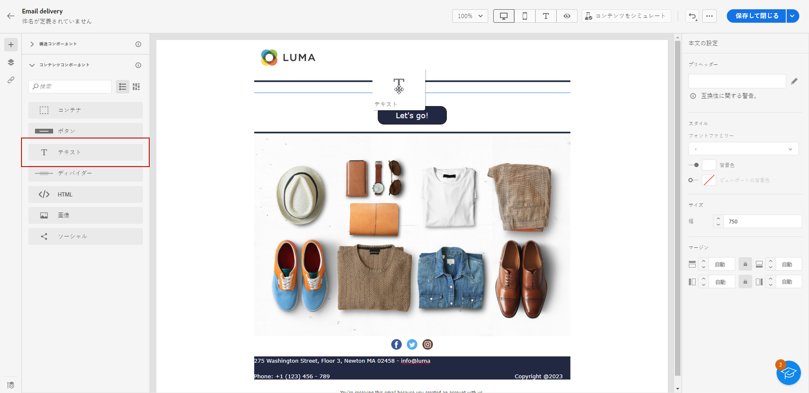

1. 新しく追加したコンポーネントをクリックして、テキストをパーソナライズしたり、「**[!UICONTROL 設定]**」タブと「**[!UICONTROL スタイル]**」タブにアクセスしたりします。

1. コンテキストツールバーから使用できる次のオプションを使用して、テキストを変更します。

   

   * **[!UICONTROL テキストスタイルを変更]**：テキストに太字、斜体、下線または取り消し線を適用します。
   * **整列を変更**：テキストの配置を左揃え、右揃え、中央揃えまたは両端揃えにします。
   * **[!UICONTROL リストを作成]**：テキストに箇条書きリストまたは番号リストを追加します。
   * **[!UICONTROL 見出しを設定]**：テキストに最大 6 つの見出しレベルを追加します。
   * **フォントサイズ**：テキストのフォントサイズをピクセル単位で選択します。
   * **[!UICONTROL 画像を編集]**：テキストコンポーネントに画像またはアセットを追加します。
   * **[!UICONTROL ソースコードを表示]**：テキストのソースコードを表示します。これは変更できません。
   * **[!UICONTROL 複製]**：テキストコンポーネントのコピーを追加します。
   * **[!UICONTROL 削除]**：選択したテキストコンポーネントをメールから削除します。
   * **[!UICONTROL パーソナライゼーションを追加]**：パーソナライゼーションフィールドを追加して、プロファイルデータからコンテンツをカスタマイズします。
   * **[!UICONTROL 条件付きコンテンツを有効にする]**：条件付きコンテンツを追加して、コンポーネントのコンテンツをターゲットプロファイルに適応させます。

1. その他のスタイル属性（テキストの色、フォントファミリー、境界線、パディング、余白など）をから **[!UICONTROL スタイル]** タブをクリックします。

   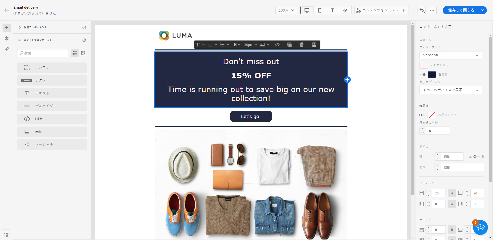

## ディバイダー {#divider}

**[!UICONTROL ディバイダー]**&#x200B;コンポーネントを使用すると、分割線を挿入してメールのレイアウトとコンテンツを整理できます。

線の色、スタイル、高さなどのスタイル属性は、 **[!UICONTROL スタイル]** タブをクリックします。

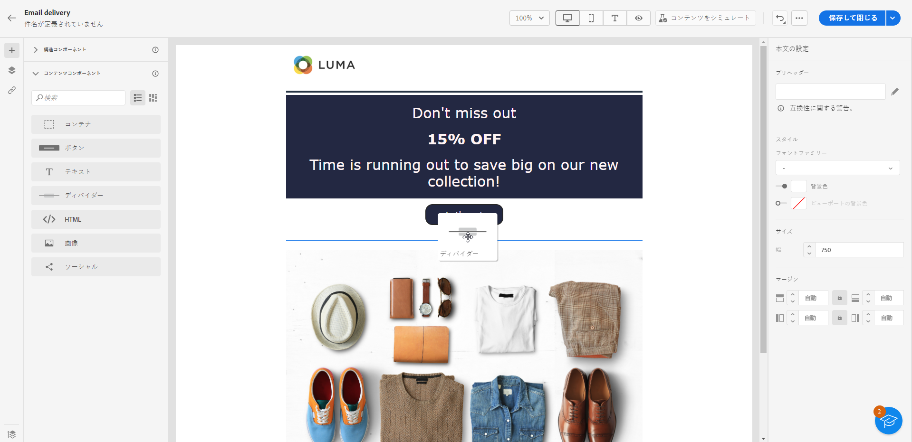

## HTML {#HTML}

**[!UICONTROL HTML]** コンポーネントを使用して、既存の HTML の別の部分をコピーして貼り付けることができます。これにより、無料のモジュラー HTML コンポーネントを作成して、一部の外部コンテンツを再利用できます。

1. **[!UICONTROL コンポーネント]**&#x200B;から、**[!UICONTROL HTML]** コンポーネントを&#x200B;**[!UICONTROL 構造]**&#x200B;コンポーネントにドラッグ＆ドロップします。

   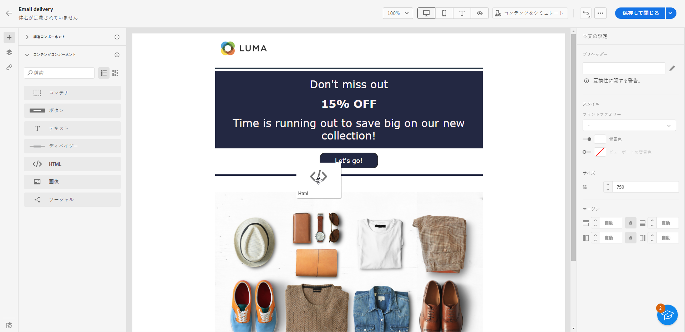

1. 新しく追加したコンポーネントをクリックし、コンテキストツールバーから「**[!UICONTROL ソースコードを表示]**」選択して HTML を追加します。

   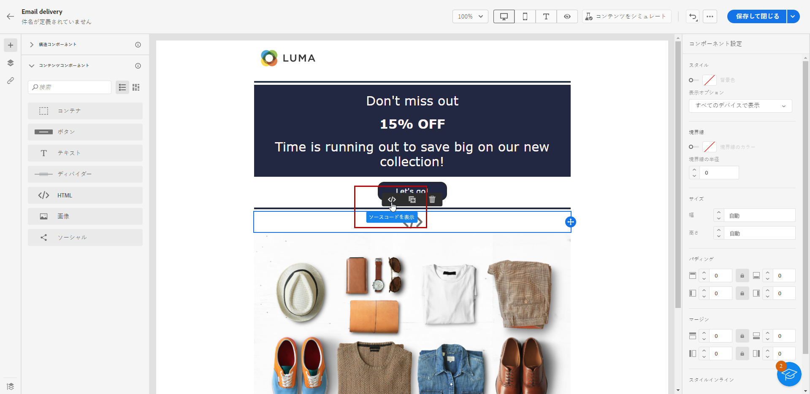

>[!NOTE]
>
>外部コンテンツを E メールデザイナーに簡単に準拠させるには、Adobeにお勧めします [ゼロからのメッセージの作成](create-email-content.md) 既存の e メールの内容をコンポーネントにコピーします。

## 画像 {#image}

**[!UICONTROL 画像]**&#x200B;コンポーネントを使用して、コンピューターからメールに画像ファイルを挿入します。

1. **[!UICONTROL コンテンツ]**&#x200B;メニューで、**[!UICONTROL 画像]**&#x200B;コンポーネントを&#x200B;**[!UICONTROL 構造]**&#x200B;コンポーネントにドラッグ＆ドロップします。

   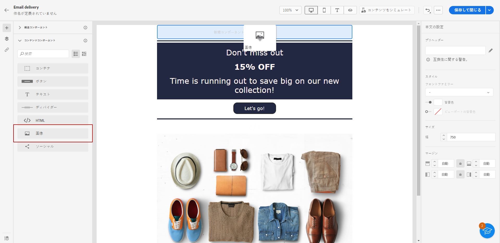

1. 「**[!UICONTROL 参照]**」をクリックして、アセットから画像ファイルを選択します。

1. 新しく追加したコンポーネントをクリックし、 **[!UICONTROL 設定]** タブ：

   * **[!UICONTROL 画像タイトル]**&#x200B;を使用すると、画像のタイトルを指定できます。
   * **[!UICONTROL 代替テキスト]**&#x200B;を使用すると、画像にリンクされたキャプションを定義できます。これは、HTML の alt 属性に対応します。

   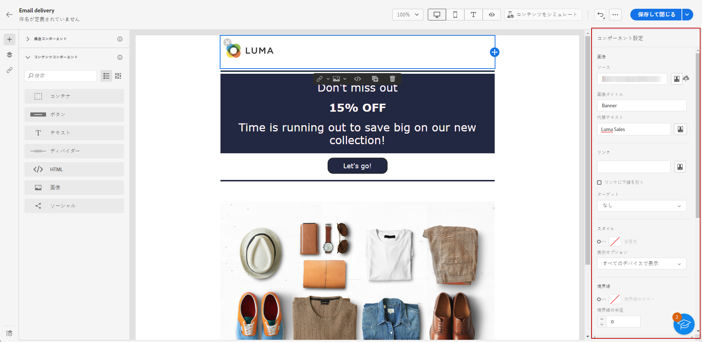

1. オーディエンスを別のコンテンツにリダイレクトするためのリンクを追加できます。 [詳細情報](message-tracking.md)

1. 余白、境界線など、他のスタイル属性を調整、の使用 **[!UICONTROL スタイル]** タブをクリックします。

## ソーシャル {#social}

**[!UICONTROL ソーシャル]**&#x200B;コンポーネントを使用すると、メールコンテンツにソーシャルメディアページへのリンクを挿入できます。

1. **[!UICONTROL コンテンツ]**&#x200B;コンテンツメニューから、**[!UICONTROL ソーシャル]**&#x200B;コンポーネントを&#x200B;**[!UICONTROL 構造]**&#x200B;コンポーネントにドラッグ＆ドロップします。

1. 新しく追加したコンポーネントをクリックします。

1. 「**[!UICONTROL 設定]**」タブの「**[!UICONTROL ソーシャル]**」フィールドで、追加または削除するソーシャルメディアを選択します。

   

1. 「**[!UICONTROL 画像のサイズ]**」フィールドでアイコンのサイズを選択します。

1. 各ソーシャルメディアアイコンをクリックして、オーディエンスのリダイレクト先の **[!UICONTROL URL]** を設定します。

   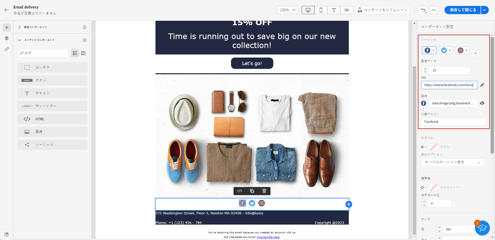

1. また、必要に応じて、各ソーシャルメディアのアイコンを変更できます。 **[!UICONTROL ソース]** フィールドに入力します。

1. スタイル、余白、境界線など、他のスタイル属性をから **[!UICONTROL スタイル]** タブをクリックします。
