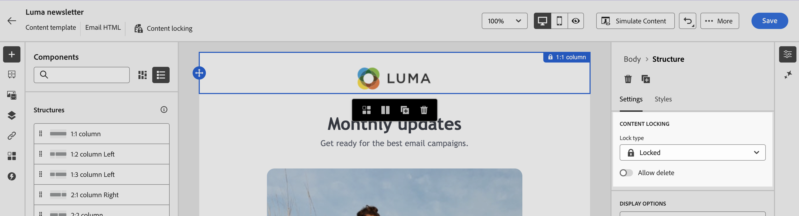

# メールテンプレート内のコンテンツをロック {#lock-content-email-templates}

>[!CONTEXTUALHELP]
>id="ajo_locking_governance"
>title="ガバナンス"
>abstract="ガバナンスをオンに切り替えて、テンプレート全体をロックするか、特定の構造とコンポーネントをロックして、テンプレート内のコンテンツをロックします。これにより、意図しない編集や削除を防ぎ、テンプレートのカスタマイズをより細かく制御して、メールキャンペーンの効率と信頼性を向上させることができます。"

>[!CONTEXTUALHELP]
>id="ajo_locking_mode"
>title="モード"
>abstract="テンプレートに必要なロックモードを選択します。**コンテンツのロック**&#x200B;を使用すると、テンプレート内のコンテンツの特定のセクションをロックできます。**読み取り専用**&#x200B;を使用すると、テンプレートのコンテンツ全体をロックして、変更を防ぐことができます。"

>[!CONTEXTUALHELP]
>id="ajo_locking_content_addition"
>title="コンテンツ追加を有効にする"
>abstract="このオプションをオンに切り替えて、ユーザーによるテンプレートの操作方法をさらに定義します。「**構造とコンテンツの追加を許可**」を選択すると、ユーザーは既存の構造間に構造を追加することや、編集可能な構造内にコンテンツコンポーネントまたはフラグメントを追加することができます。「**コンテンツの追加のみを許可**」では、ユーザーは構造を追加または複製することなく、編集可能な構造内にコンテンツコンポーネントまたはフラグメントを追加できます。"

>[!CONTEXTUALHELP]
>id="ajo_email_locking_activated"
>title="ガバナンスが有効になりました"
>abstract="コンテンツのロックがアクティブ化され、変更が防止されます。"

>[!CONTEXTUALHELP]
>id="ajo_email_locking_read_only"
>title="読み取り専用"
>abstract="このコンテンツは読み取り専用であるため、変更できません。"

Adobe Campaign では、テンプレート全体または特定の構造とコンポーネントをロックして、メールテンプレート内のコンテンツをロックできます。これにより、意図しない編集や削除を防ぎ、テンプレートのカスタマイズをより細かく制御して、メールキャンペーンの効率と信頼性を向上させることができます。
<!--
>[!IMPORTANT]
>
>Content locking is an editor-level feature for authors and does not guarantee the content will remain unedited when imported or created through API.-->

コンテンツのロックは、**構造**&#x200B;レベルまたは&#x200B;**コンポーネント**&#x200B;レベルのいずれかで適用できます。テンプレート内のコンテンツをロックする際に構造とコンポーネントレベルで適用される主な原則を以下に示します。

* 構造をロックする場合：

   * その構造内のすべてのコンテンツもデフォルトでロックされます。
   * コンテンツは、構造に追加できません。
   * デフォルトでは、構造を削除できません。「削除を許可」オプションを有効にすると、この制限を上書きできます。
   * ロックした構造内の個々のコンテンツコンポーネントを編集可能として設定できます。

* 構造が編集可能な場合（構造がロックされていない場合）：

   * 個々のコンテンツコンポーネントをその構造内でロックできます。
   * デフォルトでは、コンポーネントをロックした場合や、「編集可能なコンテンツのロックのみ」を選択した場合は、コンポーネントを削除できません。「削除を許可」オプションを有効にすると、この制限を上書きできます。

>[!AVAILABILITY]
>
>コンテンツテンプレートを作成する権限を持つユーザーは、コンテンツのロックを有効にできます。

<!--
➡️ [Discover this feature in video](#video)-->

## メールテンプレートのロック {#define}

### コンテンツのロックを有効にする {#enable}

新規テンプレートを作成する場合でも、既存のテンプレートを編集する場合でも、E メールデザイナーでメールテンプレートのコンテンツのロックを直接有効にできます。次の手順に従います。

1. メールテンプレートを開くか作成し、[E メールデザイナー](../email/get-started-email-designer.md)のコンテンツ編集画面にアクセスします。

1. 右側の&#x200B;**[!UICONTROL 本文]**&#x200B;パネルで、「**[!UICONTROL ガバナンス]**」オプションをオンに切り替えます。

1. **[!UICONTROL モード]**&#x200B;ドロップダウンリストから、テンプレートの目的のロックモードを選択します。

   * **[!UICONTROL コンテンツのロック]**：テンプレート内のコンテンツの特定のセクションをロックします。デフォルトでは、すべての構造とコンポーネントが編集できるようになります。その後、個々の要素を選択的にロックできます。
   * **[!UICONTROL 読み取り専用]**：テンプレートのコンテンツ全体をロックして、変更を防ぎます。

   

1. **[!UICONTROL コンテンツのロック]**&#x200B;モードを選択した場合は、ユーザーによるテンプレートの操作方法をさらに定義できます。「**[!UICONTROL コンテンツの追加を有効にする]**」オプションをオンに切り替えて、次のいずれかを選択します。

   * **[!UICONTROL 構造とコンテンツの追加を許可]**：ユーザーは既存の構造間に構造を追加することや、編集可能な構造内にコンテンツコンポーネントまたはフラグメントを追加できます。

   * **[!UICONTROL コンテンツの追加のみを許可]**：ユーザーは編集可能な構造内にコンテンツコンポーネントまたはフラグメントを追加できますが、構造を追加または複製できません。

1. ロックモードを選択した後、**[!UICONTROL コンテンツのロック]**&#x200B;モードを選択した場合は、ロックする構造やコンポーネントを定義できます。

   * [構造をロックする方法の詳細情報](#lock-structures)
   * [コンポーネントをロックする方法の詳細情報](#lock-components)

   **[!UICONTROL 読み取り専用]**&#x200B;モードを選択した場合は、通常どおりテンプレートの最終処理と保存に進みます。

テンプレートを設計する際に、テンプレート本文を選択して、いつでも&#x200B;**[!UICONTROL ガバナンス]**&#x200B;設定を調整できます。これを行うには、右側のサイドパネルの上部にあるナビゲーションパネルの&#x200B;**[!UICONTROL 本文]**&#x200B;リンクをクリックします。

### 構造をロック {#lock-structures}

>[!CONTEXTUALHELP]
>id="ajo_locking_structure"
>title="構造でのコンテンツのロック"
>abstract="テンプレート内の構造をロックするには、**ロックタイプ**&#x200B;ドロップダウンから「**ロック済み**」を選択します。デフォルトでは、ユーザーはロックされた構造を削除できません。「**[!UICONTROL 削除を許可]**」オプションを有効にすると、この制限を上書きできます。"

テンプレート内の構造をロックするには：

1. ロックする構造を選択します。

1. **[!UICONTROL ロックタイプ]**&#x200B;ドロップダウンリストで、「**[!UICONTROL ロック済み]**」を選択します。

   

   >[!NOTE]
   >
   >デフォルトでは、ユーザーはロックされた構造を削除できません。「**[!UICONTROL 削除を許可]**」オプションを有効にすると、この制限を上書きできます。

構造をロックした後は、その構造内でこれ以上のコンテンツコンポーネントやフラグメントを複製または追加できません。ロックした構造内のすべてのコンポーネントもデフォルトでロックされます。ロックした構造内でコンポーネントを編集できるようにするには：

1. ロック解除するコンポーネントを選択します。

1. 「**[!UICONTROL 特定のロックを使用]**」オプションをオンに切り替えます。

1. **[!UICONTROL ロックタイプ]**&#x200B;ドロップダウンリストで、「**[!UICONTROL 編集可能]**」を選択します。スタイルのロック中にコンテンツの編集を許可するには、「**[!UICONTROL 編集可能なコンテンツのみ]**」を選択します。[コンポーネントをロックする方法の詳細情報](#lock-components)

   

### コンポーネントをロック {#lock-components}

>[!CONTEXTUALHELP]
>id="ajo_locking_component"
>title="コンポーネントで特定のロックを使用"
>abstract="テンプレート内のコンポーネントをロックするには、「**特定のロックを使用**」オプションをオンに切り替えます。**[!UICONTROL ロックタイプ]**&#x200B;ドロップダウンリストから、優先するロックオプションを選択します。「**編集可能なコンテンツのロックのみ**」では、ユーザーはコンポーネントのスタイルをロックできますが、コンテンツの編集は許可されます。一方、「**ロック済み**」では、コンポーネントのコンテンツとスタイルの両方が完全にロックされます。"

構造内の特定のコンポーネントをロックするには：

1. コンポーネントを選択し、右側のパネルにある「**[!UICONTROL 特定のロックを使用]**」オプションを有効にします。

1. **[!UICONTROL ロックタイプ]**&#x200B;ドロップダウンリストから、目的のロックオプションを選択します。

   

   * **[!UICONTROL 編集可能なコンテンツのみ]**：コンポーネントのスタイルをロックしますが、コンテンツの編集は許可します。
   * **[!UICONTROL ロック済み]**：コンポーネントのコンテンツとスタイルの両方を完全にロックします。

   >[!NOTE]
   >
   >**[!UICONTROL 編集可能]**&#x200B;ロックタイプを使用すると、ユーザーはロックした構造内でもコンポーネントを編集できます。[構造をロックする方法の詳細情報](#lock-structures)

1. デフォルトでは、ユーザーはロックされたコンポーネントを削除できません。「**[!UICONTROL 削除を許可]**」オプションをアクティブ化すると、削除を有効にできます。

### ロックしたコンテンツの特定 {#identify}

テンプレート内のロックした構造とコンポーネントを簡単に特定するには、左側のサイドメニューにある&#x200B;**[!UICONTROL ナビゲーションツリー]**&#x200B;を使用します。このメニューでは、すべてのテンプレート要素の概要が視覚的に表示され、ロックした項目はロックアイコンで、編集可能な項目は鉛筆アイコンでハイライト表示されます。

次の例では、テンプレート本文に対してガバナンスが有効になっています。*構造 2* は&#x200B;*コンポーネント 1* が編集可能な状態でロックされていますが、*構造 3* は完全にロックされています。

## ロックされたコンテンツを含むテンプレートを使用 {#use}

>[!CONTEXTUALHELP]
>id="ajo_email_editable_areas"
>title="編集可能な領域をハイライト表示"
>abstract="テンプレートに適用されたロックのタイプに応じて、テンプレートの構造とコンポーネントに対して様々なアクションを実行できます。テンプレート内のすべての編集可能な領域をすばやく識別するには、「**[!UICONTROL 編集可能な領域をハイライト表示]**」オプションをオンに切り替えます。"

コンテンツがロックされたテンプレートを使用すると、右側のパネルにメッセージが表示されます。

テンプレートに適用されたロックのタイプに応じて、テンプレートの構造とコンポーネントに対して様々なアクションを実行できます。テンプレート内のすべての編集可能な領域をすばやく識別するには、「**[!UICONTROL 編集可能な領域をハイライト表示]**」オプションをオンに切り替えます。

例えば、次のテンプレートでは、一番上の画像を除くすべての領域が編集可能です。つまり、一番上の画像はロックされ、編集または削除できません。

適用可能な様々なタイプのロックについて詳しくは、次の節を参照してください。

* [構造をロック](#lock-structures)
* [コンポーネントをロック](#lock-components)

設定されているメールのエディションと関連するコンテンツのロック設定の例を以下に示します。

| コンテンツのロックタイプ | テンプレート設定 | メールのエディション |
| ------- | ------- | ------- |
| 読み取り専用コンテンツテンプレート | {zoomable="yes"} | {zoomable="yes"} |
| 完全なコンテンツは編集可能ですが、ユーザーは構造やコンポーネントを追加できません | {zoomable="yes"} | {zoomable="yes"} |
| 削除できないロックした構造 | {zoomable="yes"} | {zoomable="yes"} |
| スタイルがロックされたコンポーネント。ユーザーは、コンテンツのみを変更できます。 | {zoomable="yes"} | {zoomable="yes"} |
| ロックした構造内の編集可能コンポーネント。 | {zoomable="yes"} | {zoomable="yes"} |

<!--
TO REPLACE WITH VIDEO FOR CAMPAIGN IF/WHEN CREATED

## How-to video {#video}

Learn how to lock content in email templates.

>[!VIDEO](https://video.tv.adobe.com/v/3451608?quality=12&captions=jpn)-->
