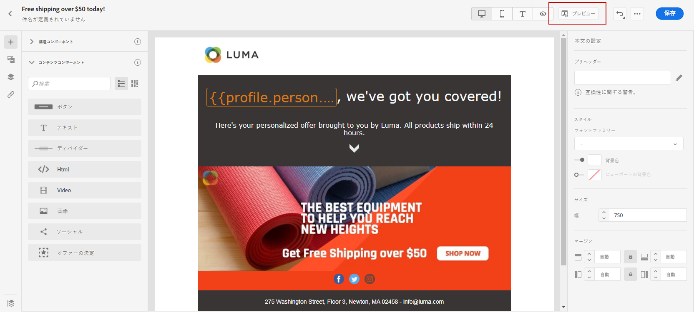

# 最初から開始 {#create-email-content}

>[!NOTE]
>
>このドキュメントは作成中で、頻繁に更新されています。 このコンテンツの最終バージョンは、2023 年 1 月に準備が整います。

>[!CONTEXTUALHELP]
>id="ac_structure_components_email"
>title="構造コンポーネントについて"
>abstract="構造コンポーネントは、E メールのレイアウトを定義します。"

>[!CONTEXTUALHELP]
>id="ac_structure_components_landing_page"
>title="構造コンポーネントについて"
>abstract="構造コンポーネントは、ランディングページのレイアウトを定義します。"

>[!CONTEXTUALHELP]
>id="ac_structure_components_fragment"
>title="構造コンポーネントについて"
>abstract="構造コンポーネントは、フラグメントのレイアウトを定義します。"

>[!CONTEXTUALHELP]
>id="ac_structure_components_template"
>title="構造コンポーネントについて"
>abstract="構造コンポーネントは、テンプレートのレイアウトを定義します。"

>[!CONTEXTUALHELP]
>id="ac_edition_columns_email"
>title="E メール列の定義"
>abstract="E メールデザイナーを使用すると、列構造を定義することで、E メールのレイアウトを簡単に定義できます。"

>[!CONTEXTUALHELP]
>id="ac_edition_columns_landing_page"
>title="ランディングページ列の定義"
>abstract="E メールデザイナーを使用すると、列構造を定義することで、ランディングページのレイアウトを簡単に定義できます。"

>[!CONTEXTUALHELP]
>id="ac_edition_columns_fragment"
>title="フラグメント列の定義"
>abstract="E メールデザイナーを使用すると、列構造を定義することで、フラグメントのレイアウトを簡単に定義できます。"

>[!CONTEXTUALHELP]
>id="ac_edition_columns_template"
>title="テンプレート列の定義"
>abstract="E メールデザイナーを使用すると、列構造を定義することで、テンプレートのレイアウトを簡単に定義できます。"

E メールデザイナーを使用すると、E メールの構造を簡単に定義できます。 簡単なドラッグ&amp;ドロップ操作で構造要素を追加して移動することで、E メールの形状を数秒でデザインできます。

E メールデザイナーで E メールコンテンツの作成を開始するには、次の手順に従います。

1. E メールデザイナーのホームページで、 **[!UICONTROL ゼロからデザイン]** オプション。

   

1. ドラッグ&amp;ドロップで E メールコンテンツのデザインを開始 **[!UICONTROL 構造コンポーネント]** ：電子メールのレイアウトを定義します。

   >[!NOTE]
   >
   >列のスタックは、すべての電子メールプログラムと互換性があるわけではないことに注意してください。サポートされていない場合、列はスタックされません。
   >
   >E メールに配置した後は、既にコンテンツコンポーネントまたはフラグメントが配置されていない限り、コンポーネントを移動または削除することはできません。

   

1. 追加する数 **[!UICONTROL 構造コンポーネント]** 必要に応じて。

   を選択します。 **[!UICONTROL n:n 列]** コンポーネントを使用して、選択する列の数を定義します (3 ～ 10)。 また、各列の下部にある矢印を移動して、各列の幅を定義することもできます。

   >[!NOTE]
   >
   >各列のサイズは、構造コンポーネントの全幅の 10%以下にすることはできません。 空でない列は削除できません。

1. 次の **[!UICONTROL コンテンツコンポーネント]** ドロップダウンから、 **[!UICONTROL コンテンツコンポーネント]** 必要に応じて、構造コンポーネントで必要に応じて追加します。 [コンテンツコンポーネントの詳細を説明します](content-components.md).

   

1. 各コンポーネントは、 **[!UICONTROL コンポーネント設定]** 」セクションに入力します。 例えば、テキストスタイル、コンポーネントのパディングまたはマージンを変更できます。 [整列とパディングの詳細を表示](adjusting-vertical-alignment-and-padding.md).

   

1. 次の **[!UICONTROL アセットピッカー]**&#x200B;を使用すると、 **[!UICONTROL アセットライブラリ]** を電子メールに送信します。

   アセットが含まれているフォルダーをダブルクリックし、電子メールに追加するアセットをドラッグ&amp;ドロップします。

   

1. パーソナライゼーションフィールドを追加して、プロファイルデータからコンテンツをカスタマイズします。

   

1. 動的コンテンツを追加して、条件ルールに基づいてコンテンツをターゲットプロファイルに適応させます。

   

1. 内 **[!UICONTROL リンク]** タブの左側のペインで、追跡するコンテンツのすべての URL のリストを確認します。 これらの **[!UICONTROL トラッキングタイプ]**, **[!UICONTROL ラベル]** および **[!UICONTROL タグ]** 必要に応じて。

   

   >[!NOTE]
   >
   >リンクとメッセージトラッキングについて詳しくは、 [このページ](message-tracking.md).

1. 必要に応じて、コードエディターに切り替え、「 」をクリックして E メールをさらにパーソナライズできます。 **[!UICONTROL コードエディターに切り替え]** を選択します。 コードエディターについて詳しくは、 [このページ](code-content.md#).

   >[!NOTE]
   >
   >コードエディターに切り替えた後は、この電子メールのビジュアルデザイナーを使用できなくなります。

   

1. クリック **[!UICONTROL プレビューを表示]** 電子メールのレンダリングを確認する場合。 デスクトップ表示またはモバイル表示を選択できます。

   

1. E メールの準備が整ったら、 **[!UICONTROL 保存して閉じる]**.

