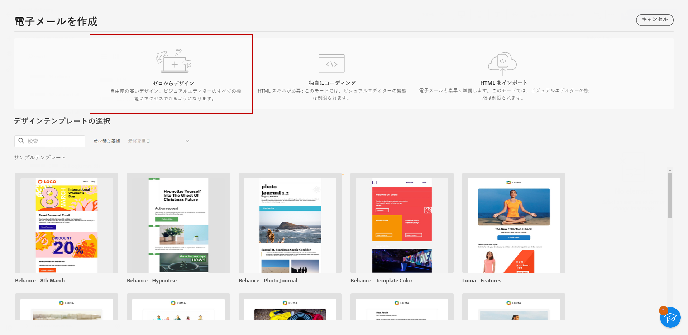
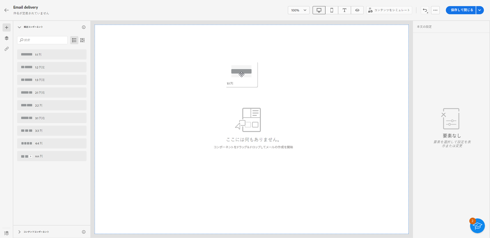
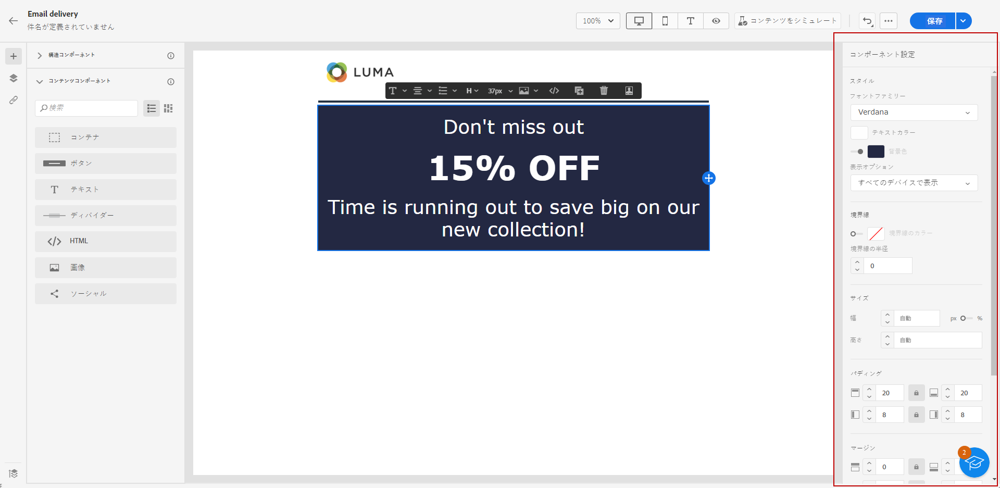
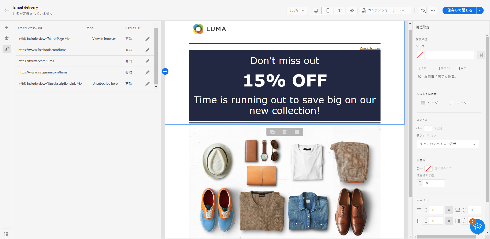
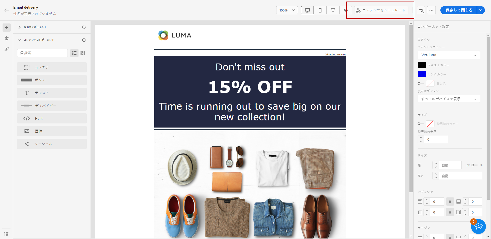

# ゼロから開始 {#create-email-content}

>[!NOTE]
>
>このドキュメントは作成中で、頻繁に更新されています。 このコンテンツの最終バージョンは、2023年1月に用意できます。

>[!CONTEXTUALHELP]
>id="ac_structure_components_email"
>title="構造コンポーネントについて"
>abstract="構造コンポーネントは、メールのレイアウトを定義します。"

>[!CONTEXTUALHELP]
>id="ac_structure_components_landing_page"
>title="構造コンポーネントについて"
>abstract="構造コンポーネントは、ランディングページのレイアウトを定義します。"

>[!CONTEXTUALHELP]
>id="ac_structure_components_fragment"
>title="構造コンポーネントについて"
>abstract="構造コンポーネントは、フラグメントのレイアウトを定義します。"

>[!CONTEXTUALHELP]
>id="ac_structure_components_template"
>title="構造コンポーネントについて"
>abstract="構造コンポーネントは、テンプレートのレイアウトを定義します。"

>[!CONTEXTUALHELP]
>id="ac_edition_columns_email"
>title="メール列の定義"
>abstract="メールデザイナーを使用すると、列構造を定義することで、メールのレイアウトを簡単に定義できます。"

>[!CONTEXTUALHELP]
>id="ac_edition_columns_landing_page"
>title="ランディングページ列の定義"
>abstract="メールデザイナーを使用すると、列構造を定義することで、ランディングページのレイアウトを簡単に定義できます。"

>[!CONTEXTUALHELP]
>id="ac_edition_columns_fragment"
>title="フラグメント列の定義"
>abstract="メールデザイナーを使用すると、列構造を定義することで、フラグメントのレイアウトを簡単に定義できます。"

>[!CONTEXTUALHELP]
>id="ac_edition_columns_template"
>title="テンプレート列の定義"
>abstract="メールデザイナーを使用すると、列構造を定義することで、テンプレートのレイアウトを簡単に定義できます。"

メールデザイナーを使用すると、メールの構造を簡単に定義できます。簡単なドラッグ&amp;ドロップ操作で構造要素を追加して移動することで、E メールの本文を数秒でデザインできます。

メールコンテンツの作成を開始するには、次の手順に従います。

1. メールデザイナーのホームページで、「**[!UICONTROL ゼロからデザイン]**」オプションを選択します。

   

1. **[!UICONTROL 構造コンポーネント]**&#x200B;をキャンバスにドラッグ＆ドロップしてメールコンテンツのデザインを開始し、メールのレイアウトを定義します。

   >[!NOTE]
   >
   >列の積み重ねは、すべてのメールプログラムと互換性があるわけではありません。 サポートされていない場合、列は積み重ねられません。

   <!--Once placed in the email, you cannot move nor remove your components unless there is already a content component or a fragment placed inside. This is not true in AJO - TBC?-->

   

1. 必要に応じて&#x200B;**[!UICONTROL 構造コンポーネント]**&#x200B;を追加し、右側の専用パネルで設定を編集します。

   **[!UICONTROL n:n 列]**&#x200B;コンポーネントを選択して、選択する列の数（3 ～ 10）を定義します。また、各列の下部にある矢印を移動して、各列の幅を定義することもできます。

   >[!NOTE]
   >
   >各列のサイズは、構造コンポーネントの全幅の 10％未満にすることはできません。空でない列は削除できません。

1. **[!UICONTROL コンテンツコンポーネント]**&#x200B;セクションを展開し、必要な数の要素を 1 つ以上の構造コンポーネントに追加します。[詳しくは、コンテンツコンポーネントを参照してください](content-components.md)

1. 各コンポーネントは、右側の&#x200B;**[!UICONTROL コンポーネント設定]**&#x200B;パネルを使用して、さらにカスタマイズできます。例えば、各コンポーネントのテキストスタイル、パディングまたは余白を変更できます。 [詳しくは、整列とパディングを参照してください](alignment-and-padding.md)

   

1. パーソナライゼーションフィールドを挿入して、プロファイルデータからのメールコンテンツをカスタマイズします。[詳しくは、コンテンツのパーソナライゼーションを参照してください](../personalization/personalize.md)

1. 左側のパネルから「**[!UICONTROL リンク]**」タブをクリックし、トラッキングするコンテンツのすべての URL を表示します。これらの **[!UICONTROL トラッキングタイプ]** または **[!UICONTROL ラベル]** とを追加します。 **[!UICONTROL カテゴリ]** 必要に応じて。 [詳しくは、リンクとメッセージトラッキングを参照してください](message-tracking.md)

   

1. 必要に応じて、詳細メニューの「**[!UICONTROL コードエディターに切り替え]**」をクリックして、メールをさらにパーソナライズできます。[詳しくは、コードエディターを参照してください](code-content.md)

   >[!CAUTION]
   >
   >コードエディターに切り替えた後で、このメールのビジュアルデザイナーに戻すことはできません。

1. コンテンツの準備が整ったら、「**[!UICONTROL コンテンツをシミュレート]**」をクリックして、メールのレンダリングを確認します。デスクトップ表示またはモバイル表示を選択できます。[詳しくは、メールのプレビューを参照してください](../preview-test/preview-test.md)

   

1. メールの準備が整ったら、「**[!UICONTROL 保存]**」をクリックします。

