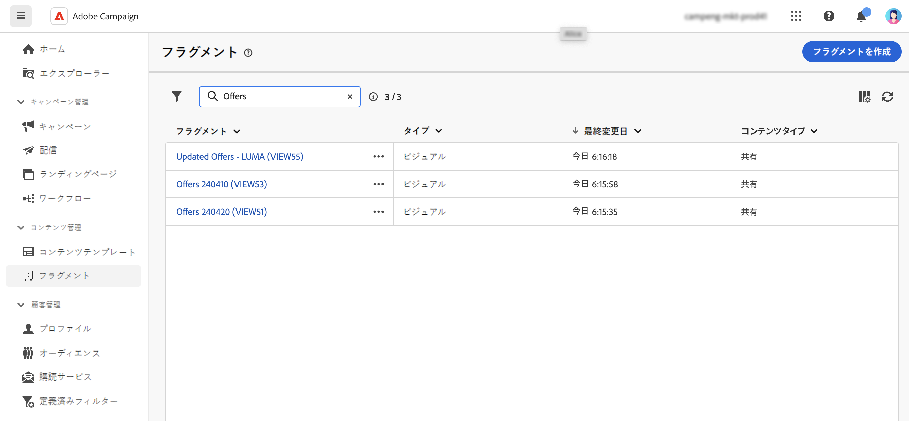
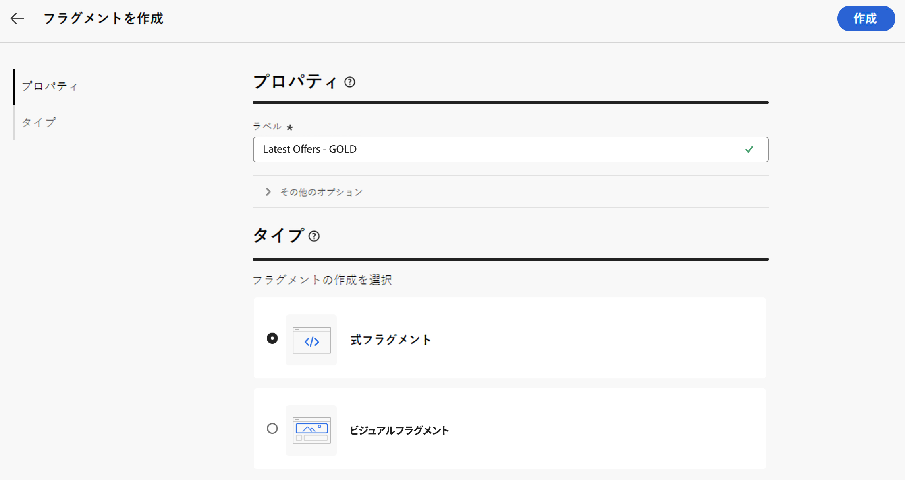
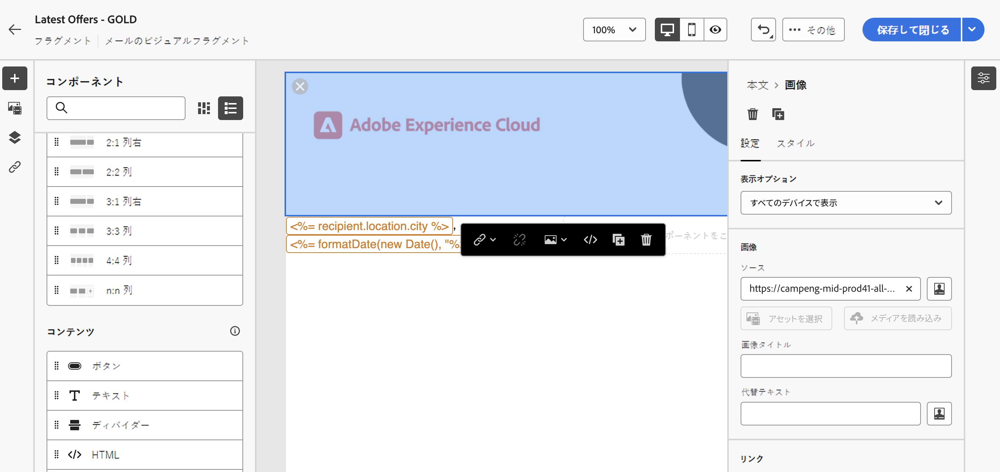
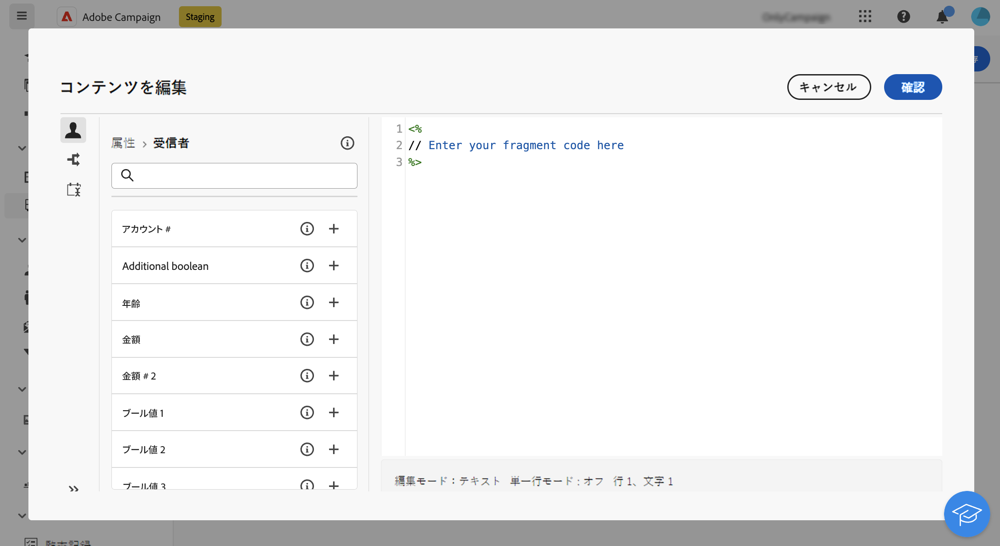
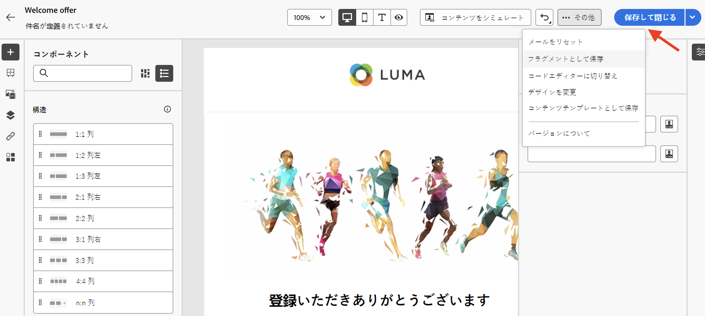
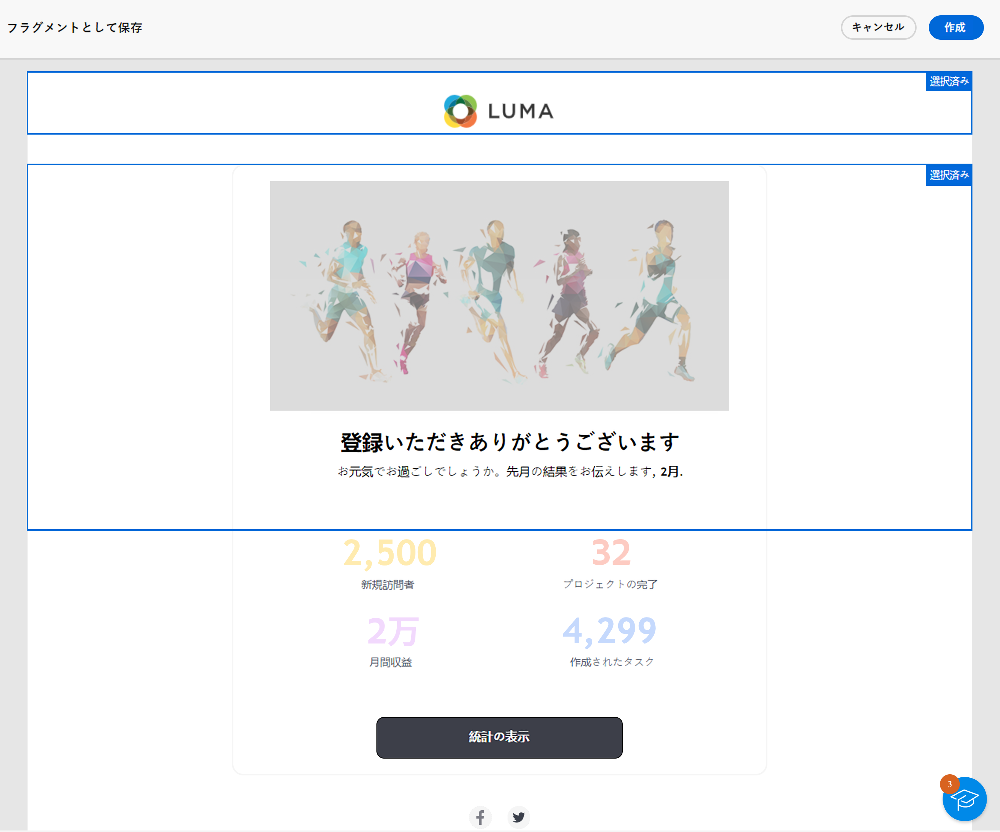
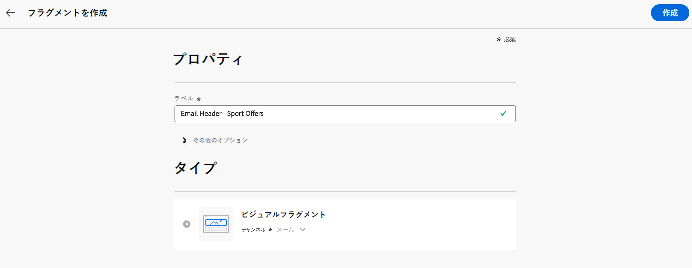
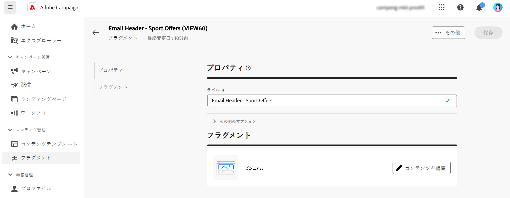
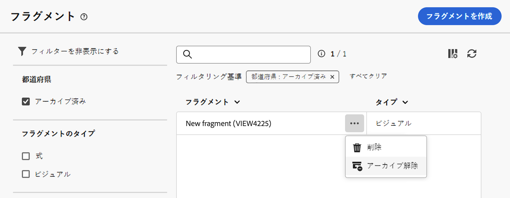

# コンテンツフラグメントの作成 {#fragments}

>[!CONTEXTUALHELP]
>id="acw_fragments_create"
>title="独自のコンテンツフラグメントの定義"
>abstract="フラグメントのプロパティと、作成するフラグメントのタイプを定義します。その後、E メールデザイナーまたは式エディターを使用して、フラグメントのコンテンツを設定できます。"

<!-- pas vu dans l'UI-->

>[!CONTEXTUALHELP]
>id="acw_fragments_properties"
>title="フラグメントのプロパティ"
>abstract="フラグメントのラベルを入力します。必要に応じて、フラグメントの内部名、フォルダー、説明など、追加のオプションを定義できます。"

>[!CONTEXTUALHELP]
>id="acw_fragments_type"
>title="コンテンツフラグメントのタイプ"
>abstract="作成するフラグメントのタイプを選択します。**ビジュアルフラグメント**&#x200B;は、複数のメール配信やコンテンツテンプレートで再利用できる、定義済みのビジュアルブロックです。**式フラグメント**&#x200B;は、式エディターの専用エントリから使用できる定義済みの式です。"

コンテンツフラグメントを作成する方法は 2 つあります。

* **[!UICONTROL フラグメント]**&#x200B;専用メニューを使用して、フラグメントをゼロから作成します。[詳細情報](#create-from-scratch)
* コンテンツをデザインする際は、コンテンツの一部をフラグメントとして保存します。 [詳細情報](#save-as-fragment)

  >[!NOTE]
  >
  >この機能は、ビジュアルフラグメントでのみ使用できます。式フラグメントは、**フラグメント**&#x200B;メニューからのみ作成されます。

保存すると、コンテンツフラグメントを任意の配信またはコンテンツテンプレートで使用できるようになります。

## ゼロからのコンテンツフラグメントの作成 {#create-from-scratch}

ゼロからコンテンツフラグメントを作成するには、次の手順に従います。

1. 左側のメニューの&#x200B;**[!UICONTROL コンテンツ管理]**／**[!UICONTROL フラグメント]**&#x200B;から[フラグメントリストにアクセス](#access-manage-fragments)し、「**[!UICONTROL フラグメントを作成]**」を選択します。

   

1. フラグメントのラベルを入力します。必要に応じて、フラグメントの内部名、フォルダー、説明など、追加のオプションを定義します。

1. 作成するフラグメントのタイプ（**ビジュアルフラグメント** または **式フラグメント** を選択します。 [詳しくは、ビジュアルフラグメントと式フラグメントの違いを参照してください](fragments.md)

   

   >[!AVAILABILITY]
   >
   >ビジュアルフラグメントを使用するには、Campaign v8.6.4 への更新が必要です。詳しくは、[Campaign v8 クライアントコンソールリリースノート](https://experienceleague.adobe.com/ja/docs/campaign/campaign-v8/releases/release-notes)を参照してください。

1. 「**作成**」ボタンをクリックします。

   * **ビジュアルフラグメント**&#x200B;の場合、[E メールデザイナー](../email/get-started-email-designer.md)が表示されます。キャンペーン内のメールと同じ方法でコンテンツを必要に応じて編集し、「**保存して閉じる**」ボタンをクリックします。 画像、リンク、パーソナライゼーションフィールドおよび動的コンテンツを追加します。

     

   * **式フラグメント**&#x200B;の場合、式エディターが開きます。パーソナライゼーション機能とオーサリング機能を使用してコンテンツを作成し、「**確認**」をクリックします。 [式エディターの操作方法の詳細を学ぶ](../personalization/personalize.md)

     

1. コンテンツの準備が整ったら、「**保存**」をクリックします。

コンテンツフラグメントが、Campaign 内で配信または[コンテンツテンプレート](../email/use-email-templates.md)を作成するときに使用できるようになりました。ビジュアルフラグメントと式フラグメントの使用方法については、次の節を参照してください。
* [メールへのビジュアルフラグメントの追加](use-visual-fragments.md)
* [式エディターへの式フラグメントの追加](use-expression-fragments.md)

## コンテンツをビジュアルフラグメントとして保存 {#save-as-fragment}

>[!CONTEXTUALHELP]
>id="acw_fragments_save"
>title="フラグメントとして保存"
>abstract="コンテンツをビジュアルフラグメントとして保存するには、パーソナライゼーションフィールドや動的コンテンツなど、フラグメントに含める要素を選択します。 隣接するセクションのみを選択できます。 空の構造や他のコンテンツフラグメントは選択できません。 その後、コンテンツはスタンドアロンのフラグメントになり、フラグメントリストに追加され、専用メニューからアクセスできるようになります。 このフラグメントは、Campaign 内でメールまたはコンテンツテンプレートを作成する際に使用できます。"

<!--pas vu dans l'UI-->

すべてのメールコンテンツは、後で再利用できるようにビジュアルフラグメントとして保存できます。 [ コンテンツテンプレート ](../email/use-email-templates.md) または [ メール ](../email/get-started-email-designer.md) 配信をデザインする際は、コンテンツの一部をビジュアルフラグメントとして保存します。 これを行うには、次の手順に従います。

1. [ メールDesigner](../email/get-started-email-designer.md) で、画面の右上にある **詳細** ボタンをクリックします。

1. ドロップダウンメニューから「**[!UICONTROL フラグメントとして保存]**」を選択します。

   

1. **[!UICONTROL フラグメントとして保存]**&#x200B;画面が表示されます。パーソナライゼーションフィールドや動的コンテンツなど、フラグメントに含める要素を選択します。

   >[!CAUTION]
   >
   >隣接するセクションのみを選択できます。 空の構造や他のコンテンツフラグメントは選択できません。

   

1. 「**[!UICONTROL 作成]**」をクリックします。フラグメント名を入力して保存します。

   

   このコンテンツはスタンドアロンのフラグメントになり、[ フラグメントリスト ](#manage-fragments) に追加され、専用メニューからアクセスできるようになりました。 このフラグメントは、Campaign 内で [ メール ](../email/get-started-email-designer.md) または [ コンテンツテンプレート ](../email/use-email-templates.md) を作成する際に使用します。 [詳細情報](../content/use-visual-fragments.md)

>[!NOTE]
>
>新しいフラグメントに対する変更は、送信元のメールまたはテンプレートには生成されません。 同様に、メールまたはテンプレート内で元のコンテンツを編集しても、新しいフラグメントは変更されません。

## コンテンツフラグメントの管理 {#manage-fragments}

フラグメントリストからコンテンツフラグメントの編集、更新、複製、削除を行うことができます。

### コンテンツフラグメントの編集と更新 {#edit-fragments}

コンテンツフラグメントを編集するには、次の手順に従います。

1. 編集するフラグメントの名前を&#x200B;**[!UICONTROL フラグメント]**&#x200B;リストからクリックします。
1. **コンテンツを編集** ボタンをクリックして、フラグメントのコンテンツを開きます。

   

1. 必要な変更を加え、変更内容を保存します。

>[!CAUTION]
>
>フラグメントに対する変更は、そのフラグメントを使用する配信またはテンプレートに反映されます。

### コンテンツフラグメントの削除 {#delete-fragments}

コンテンツフラグメントを削除するには、次の手順に従います。

1. フラグメントリストを参照し、削除するフラグメントの横にある「**[!UICONTROL その他のアクション]**」ボタンをクリックします。
1. 「**削除**」をクリックして確定します。

   

>[!CAUTION]
>
>フラグメントを削除すると、それを使用する配信とテンプレートが更新されます。 フラグメントはコンテンツから削除されますが、参照されたままになります。 これらの配信およびテンプレートにフラグメントコンテンツを保持するには、フラグメントを削除する前に継承を解除します [ 詳しくは、この節を参照 ](use-visual-fragments.md#break-inheritance)。

### コンテンツフラグメントのアーカイブ {#archive}

ブランドと関係がなくなったフラグメントをアーカイブすることで、フラグメントリストをクリーンアップできます。 これを行うには、目的のフラグメントの横にある「**[!UICONTROL その他のアクション]**」ボタンをクリックし、「**[!UICONTROL アーカイブ]**」を選択します。フラグメントはフラグメントリストから削除され、今後のメールやテンプレートでユーザーが使用できなくなります。

アーカイブしたフラグメントにアクセスするには、フィルタリングパネルを使用してフラグメントを表示します。フラグメントをアーカイブ解除するには、「**[!UICONTROL その他のアクション]**」ボタンをクリックし、「**[!UICONTROL アーカイブ解除]**」を選択します。

>[!NOTE]
>
>コンテンツで使用されているフラグメントをアーカイブしても、そのコンテンツは影響を受けません。

### コンテンツフラグメントの複製 {#duplicate-fragments}

コンテンツフラグメントを複製して、簡単に新しいフラグメントを作成できます。既存のフラグメントを複製するには、次の手順に従います。

1. フラグメントリストを参照し、複製するフラグメントの横にある「**[!UICONTROL その他のアクション]**」ボタンをクリックします。
1. 「**複製**」をクリックして確定します。
1. 新しいフラグメントのラベルを入力し、変更内容を保存します。

   このフラグメントがコンテンツフラグメントのリストに追加されます。必要に応じて編集および設定します。