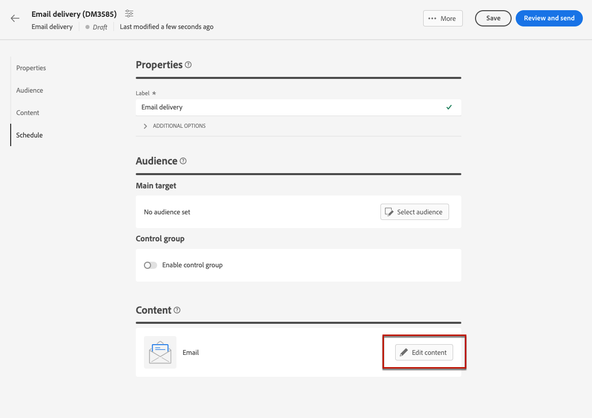

# E メールコンテンツの設定 {#edit-content}

>[!CONTEXTUALHELP]
>id="acw_deliveries_email_content"
>title="メールコンテンツの作成"
>abstract="この節では、メールのコンテンツを作成し、電子メールデザイナーを使用して洗練された外観にすることができます。"

>[!CONTEXTUALHELP]
>id="acw_deliveries_email_header"
>title="メールパラメーター"
>abstract="送信者名と送信者の電子メールの値は、電子メールテンプレートで定義されます。 件名行は、式エディターを使用してパーソナライズできます。"

>[!CONTEXTUALHELP]
>id="acw_deliveries_email_attachment"
>title="メール添付ファイル"
>abstract="メッセージに挿入する 1 つ以上のファイルを選択します。"

>[!CONTEXTUALHELP]
>id="acw_deliveries_email_options"
>title="トラッキングオプション"
>abstract="デフォルトでは、配信のトラッキングが有効になっています。ここからこのオプションを無効にできます。"

電子メール **[!UICONTROL コンテンツを編集]** 次の操作を実行できます。
* 送信者のアドレスや件名など、メッセージの基本要素を定義する
* 添付ファイルの追加やオファーの設定など、追加のアクションを実行する
* 次にアクセス： [メールデザイナー](get-started-email-designer.md#start-authoring) 電子メールの適切なコンテンツの作成を開始するには

E メールのコンテンツを設定または編集するには、次の手順に従います。

1. 次をクリック： **[!UICONTROL コンテンツを編集]** ボタン [E メール配信ダッシュボード](../email/create-email.md) 画面

   

1. E メールコンテンツ編集画面が開きます。

   

   >[!NOTE]
   >
   >が新しい電子メールを設定している場合、 **[!UICONTROL 送信者名]** および **[!UICONTROL 送信元メール]** フィールドは既に設定されています。

1. この **[!UICONTROL 送信者名]** フィールドは、電子メールテンプレートで定義されます。 変更する場合は、ブランド名など、受信者が容易に識別できる名前を使用して、配信の開封率を高めます。

   >[!NOTE]
   >
   >受信者のエクスペリエンスをさらに向上させるには、「Eve from Luma」など、人の名前を追加します。

1. この **[!UICONTROL 送信元メール]** また、「アドレス」フィールドは、e メールテンプレートでも定義されます。 アドレスドメインが、ドメインにデリゲートしたサブドメインと同じであることをAdobeします。

   >[!NOTE]
   >
   >「@」より前の部分は変更できますが、ドメインアドレスは変更できません。

   <!--In the Reply address text fields, the sender's address is used by default for replies. However, Adobe recommends using an existing real address such as your brand's customer care. In this case, if a recipient sends a reply, the customer care will be able to handle it.-->

1. メールの「**[!UICONTROL 件名]**」を定義します。専用のフィールドに件名を直接入力するか、式エディターを開いて、様々な属性、コンテンツブロックまたはオファーを使用したパーソナライゼーションを追加します。 [コンテンツをパーソナライズする方法を学ぶ](../personalization/personalize.md)

1. メールにファイルを添付する場合は、「**[!UICONTROL 添付ファイルを追加]**」ボタンをクリックして、1 つまたは複数のファイルを選択します。

   >[!NOTE]
   >
   >    パフォーマンスの問題を回避するために、1 つのメールに複数の添付ファイルを含めないことをお勧めします。

   <!--limitation on size + number of files?-->

1. メールでオファーを送信する場合は、「**[!UICONTROL オファーを設定]**」ボタンを使用して選択します。

   その後、パーソナライゼーションフィールドを使用してメールに挿入できます。[オファーの送信方法を学ぶ](offers.md)

1. 次をクリック： **[!UICONTROL メール本文を編集]** ボタンを使用して、E メールのコンテンツを構築しデザインします。 [メールデザイナー](#start-authoring). メールコンテンツのデザイン方法に関する追加情報については、次の節を参照してください。

   * [ゼロからのメールの作成](create-email-content.md)
   * [コンテンツのスタイル設定](get-started-email-style.md)

   >[!NOTE]
   >
   >また、E メールのプレビューにマウスポインターを置いて、「 **[!UICONTROL 電子メールデザイナーを開く]**.

1. デフォルトでは、配信のトラッキングが有効になっています。このオプションは、「**[!UICONTROL オプション機能]**」セクションから無効にすることができます。[リンクを追加してトラッキングを管理する方法を学ぶ](message-tracking.md)

1. メールのコンテンツを定義したら、「**[!UICONTROL コンテンツをシミュレート]**」ボタンを使用して、どのように表示されるかを送信前に確認します。[メールのプレビューとテストの方法を学ぶ](../preview-test/preview-test.md)

