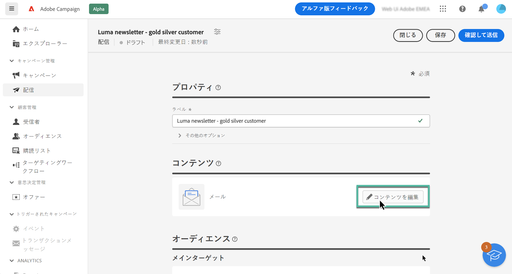
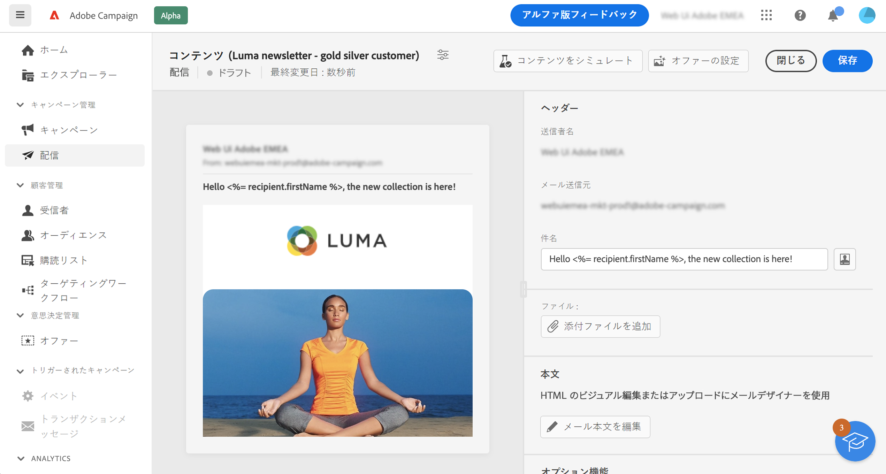

# メールコンテンツの編集 {#configure-content}

>[!CONTEXTUALHELP]
>id="acw_deliveries_email_content"
>title="メールコンテンツの作成"
>abstract="この節では、メールのコンテンツを作成し、電子メールデザイナーを使用して洗練された外観にすることができます。"

>[!CONTEXTUALHELP]
>id="acw_deliveries_email_header"
>title="メールヘッダー"
>abstract="TBC"

>[!CONTEXTUALHELP]
>id="acw_deliveries_email_attachment"
>title="メール添付ファイル"
>abstract="TBC"

>[!CONTEXTUALHELP]
>id="acw_deliveries_email_options"
>title="トラッキングオプション"
>abstract="TBC"

メールのコンテンツの作成を開始するには、メール作成画面から「**[!UICONTROL コンテンツを編集]**」ボタンをクリックします。

この画面では、メールのコンテンツを定義し、電子メールデザイナーにアクセスしてデザインできます。

メールのコンテンツを定義する手順は次のとおりです。

1. 「**[!UICONTROL 送信者名]**」と「**[!UICONTROL 送信元電子メール]**」の情報を確認します。これらのフィールドは読み取り専用で、メールの作成時に選択したメールテンプレートで設定されます。

1. メールの「**[!UICONTROL 件名]**」を定義します。これを行うには、件名を専用フィールドに直接入力するか、式エディターを開いて、様々な属性とコンテンツブロックまたはオファーを使用してパーソナライゼーションを追加するように定義します。[コンテンツをパーソナライズする方法を学ぶ](../personalization/personalize.md)

1. メールでオファーを送信する場合は、「**[!UICONTROL オファーを設定]**」ボタンを使用して選択します。その後、パーソナライゼーションフィールドを使用してメールに挿入できます。[オファーの送信方法を学ぶ](offers.md)

1. 「**[!UICONTROL メール本文を編集]**」ボタンをクリックして、メールのコンテンツを構成およびデザインします。メールコンテンツのデザイン方法に関する追加情報については、次の節を参照してください。

   * [メールのデザイン方法を説明します](create-email-content.md)
   * [コンテンツのスタイル設定](get-started-email-style.md)

1. メールにファイルを添付する場合は、「**[!UICONTROL 添付ファイルを追加]**」ボタンをクリックして、1 つまたは複数のファイルを選択します。

   パフォーマンスの問題を回避するために、1 つのメールに複数の添付ファイルを含めないことをお勧めします。

   <!--limitation on size + number of files?-->

1. デフォルトでは、配信のトラッキングが有効になっています。このオプションは、「**[!UICONTROL オプション機能]**」セクションから無効にすることができます。[リンクを追加してトラッキングを管理する方法を学ぶ](message-tracking.md)

メールのコンテンツを定義したら、「**[!UICONTROL コンテンツをシミュレート]**」ボタンを使用して、どのように表示されるかを送信前に確認します。[メールのプレビューとテストの方法を学ぶ](../preview-test/preview-test.md)
