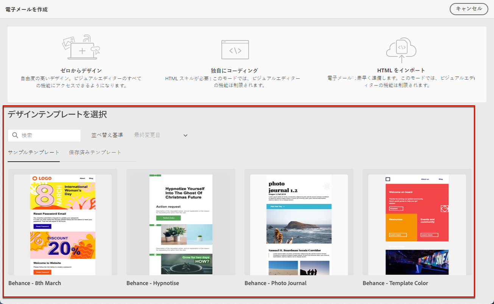
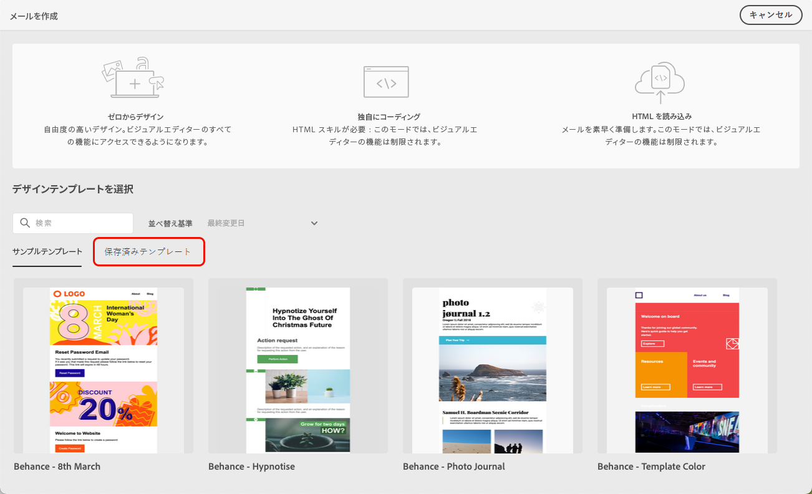
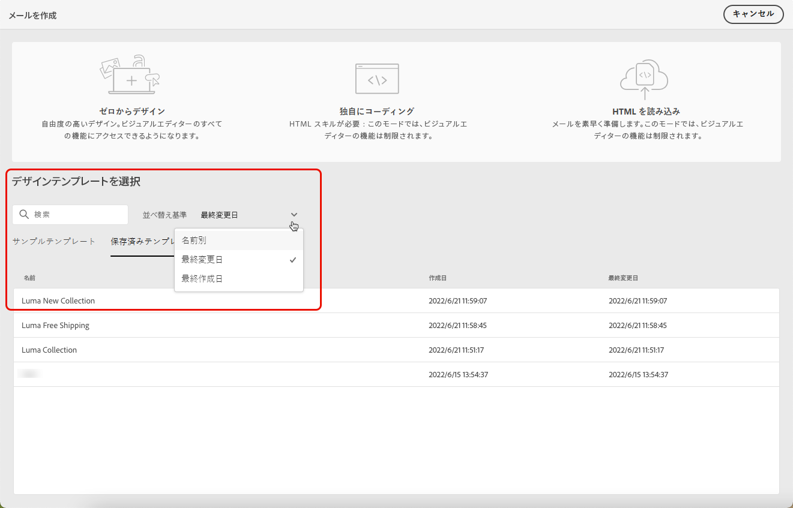
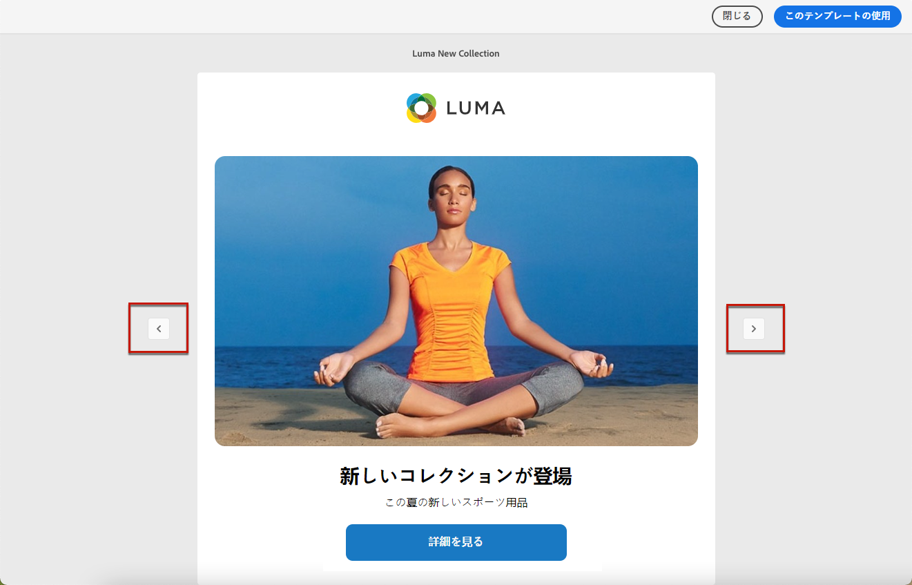
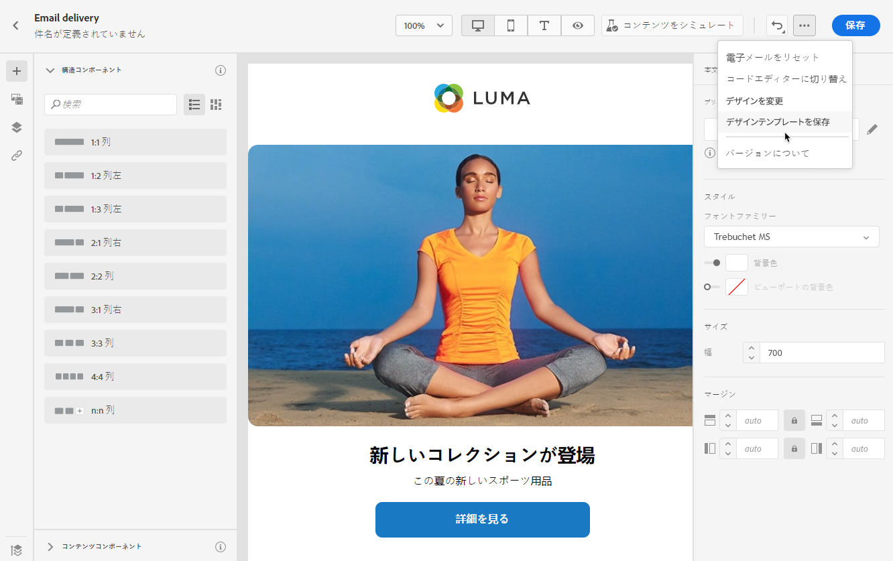
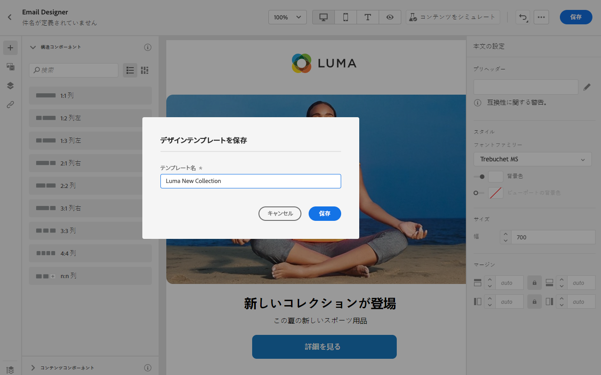
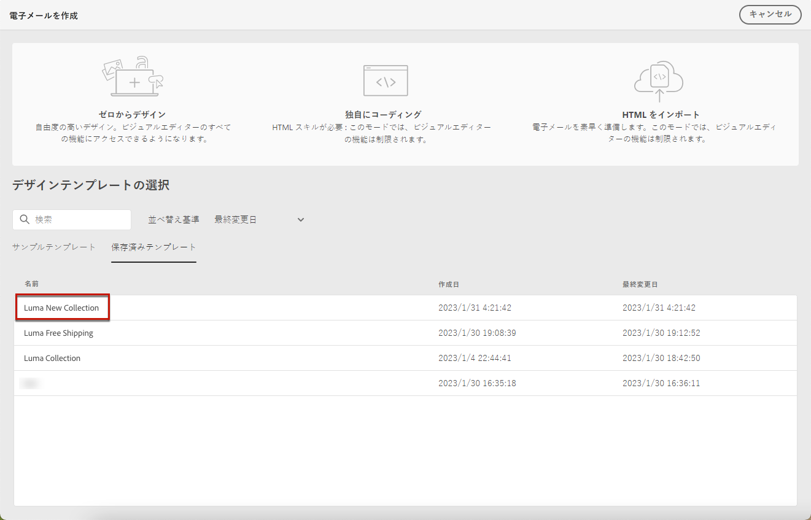

# メールテンプレートの操作 {#email-content-templates}

条件 [e メールの作成](#create-email)、 **[!UICONTROL デザインテンプレートを選択]** セクション **[!UICONTROL メールを作成]** インターフェイスを使用して、テンプレートからコンテンツの作成を開始できます。

次の中から選択できます。

* **サンプルテンプレート**. Campaign には、選択可能な一連の組み込みテンプレートが付属しています。

* **保存済みテンプレート**. また、既存のコンテンツからテンプレートとして保存したカスタムテンプレートを使用することもできます。

テンプレートの使用方法と、E メールコンテンツをテンプレートとして保存する方法については、以下の節を参照してください。

## テンプレートを使用 {#use-templates}

サンプルまたは保存済みのテンプレートの 1 つを使用してコンテンツの作成を開始するには、次の手順に従います。

1. を開きます。 [メールデザイナー](create-email-content.md).

1. 「**[!UICONTROL メールを作成]**」画面では、「**[!UICONTROL サンプルテンプレート]**」タブがデフォルトで選択されています。

1. 既存のカスタムテンプレートを使用するには、 **[!UICONTROL 保存済みのテンプレート]** タブをクリックします。

   

1. すべての[保存済みのテンプレート](#save-as-template)のリストが表示されます。「**[!UICONTROL 名前別]**」、「**[!UICONTROL 最終変更日]**」および「**[!UICONTROL 最終作成日]**」で並べ替えることができます。

   

1. リストからテンプレートを選択して、その内容を表示します。

1. 左右の矢印を使用して、テンプレート間を移動します（選択内容に応じてサンプルまたは保存します）。

   

1. クリック **[!UICONTROL このテンプレートを使用]** をクリックします。

1. メールデザイナーを使用して、必要に応じてコンテンツを編集します。[詳細情報](create-email-content.md)

## E メールコンテンツをテンプレートとして保存 {#save-as-template}

一度 [電子メールを設計した](create-email-content.md)を使用すると、後で再利用できるように、このコンテンツをテンプレートとして保存できます。 保存済みのテンプレートは、Adobe Campaign 環境のすべてのユーザーが使用できます。

メールコンテンツをテンプレートとして保存するには、次の手順に従います。

1. E メールデザイナーで、画面の右上にある省略記号をクリックします。

1. 選択 **[!UICONTROL コンテンツテンプレートとして保存]** を選択します。

   

1. このテンプレートの名前を入力して保存します.

   

次の操作を実行できます。 [このテンプレートを使用](#use-templates) 新しいコンテンツを作成するには：これは、 **[!UICONTROL 保存済みのテンプレート]** E メールデザイナーのタブ

