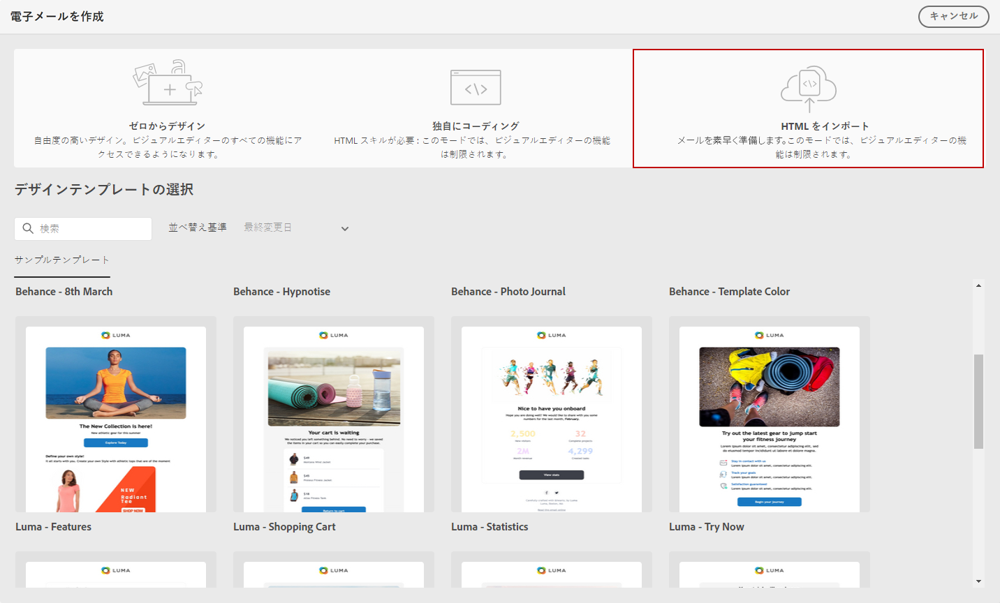
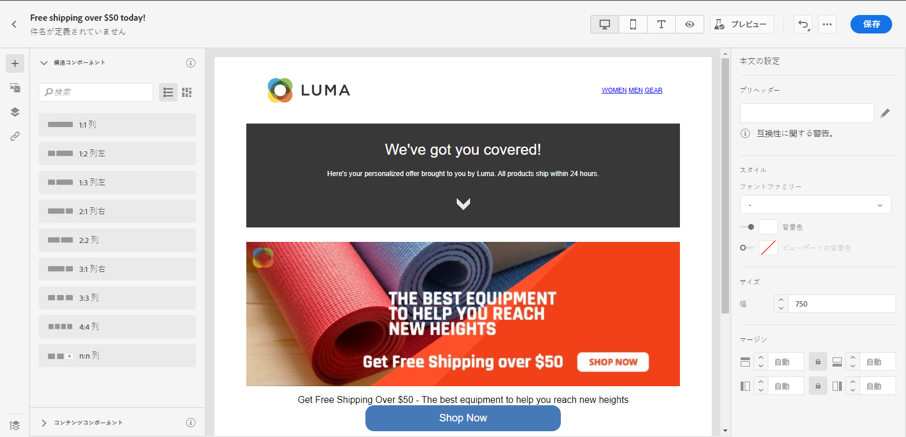

# メールコンテンツの読み込み {#existing-content}

電子メールデザイナーを使用すると、既存の HTML コンテンツを読み込むことができます。 このコンテンツには次のようなものがあります。

* スタイルシートが組み込まれた **HTML ファイル**
* HTML ファイル、スタイルシート（.css）および画像を含んだ **.zip フォルダー**

   >[!NOTE]
   >
   >.zip ファイル構造に制約はありません。 ただし、.zip フォルダーのツリー構造に合わせて、相対参照を指定する必要があります。

HTML コンテンツを含んだファイルを読み込むには、次の手順に従います。

1. 電子メールデザイナーのホームページで、「**[!UICONTROL HTML を読み込む]**」を選択します。

   

1. HTML コンテンツを含む HTML または .zip ファイルをドラッグ＆ドロップし、「**[!UICONTROL 読み込み]**」をクリックします。

1. HTML の内容をアップロードしたら、電子メールデザイナーの機能を利用して、メールを編集およびプレビューできます。 [詳しくは、この節を参照してください](create-email-content.md)。

   