# AI アシスタントを使用した完全なコンテンツの生成 {#generative-full-content}

>[!IMPORTANT]
>
>この機能の使用を開始する前に、関連する[ガードレールと制限](generative-gs.md#generative-guardrails)を参照してください。
> 
>
>Adobe Campaign web の AI アシスタントを使用する前に、[ユーザー契約](https://www.adobe.com/jp/legal/licenses-terms/adobe-dx-gen-ai-user-guidelines.html){target="_blank"}に同意する必要があります。詳しくは、アドビ担当者にお問い合わせください。

Adobe Campaign web の AI アシスタントを使用して、メール、ランディングページ、プッシュ通知チャネルをまたいで完全なコンテンツエクスペリエンスを生成します。 AI アシスタントは、オーディエンスの共感を呼ぶ包括的なコンテンツを作成することで、配信の影響を最適化するのに役立ちます。

## メールとランディングページの場合 {#email-web-channels}

AI アシスタントは、テキストと画像の両方を生成して、メール配信とランディングページの完全なコンテンツエクスペリエンスを生成できます。この堅牢な機能により、すべてのデジタルタッチポイントをまたいでオーディエンスとつながる、魅力的でブランドに即したコンテンツを作成できます。

### アクセスと設定 {#access-configure}

AI アシスタントを使用してコンテンツの作成を開始する前に、配信を設定し、コンテンツエディターを開く必要があります。ワークスペースを準備し、AI アシスタントパネルにアクセスするには、次の手順に従います。

1. 配信を作成および設定します。

   * **メール**：メール配信を作成および設定したら、「**[!UICONTROL コンテンツを編集]**」をクリックします。[詳細情報](../email/create-email-content.md)
   * **ランディングページ**：ランディングページを作成および設定したら、「**[!UICONTROL コンテンツを編集]**」をクリックします。[詳細情報](../landing-pages/create-lp.md)

1. 必要に応じてレイアウトをパーソナライズし、**[!UICONTROL AI アシスタント]**&#x200B;メニューにアクセスします。

   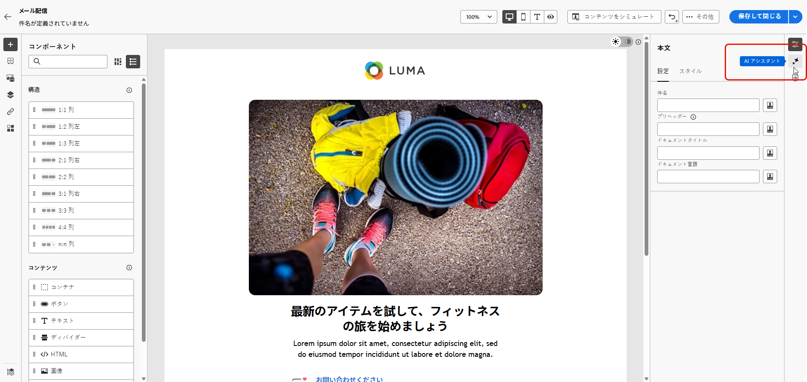{zoomable="yes"}

### コンテンツを生成 {#generate-content}

AI アシスタントを開いたら、生成設定を指定して、ブランドやキャンペーンの目標に一致するコンテンツを作成できるようになりました。テキストと画像のパラメーターをカスタマイズし、ブランドアセットを追加し、オーディエンスに関連するバリエーションの生成で AI をガイドするプロンプトを指定します。

1. **[!UICONTROL ブランド]**&#x200B;を選択して、AI で生成されたコンテンツがブランドの仕様に一致していることを確認します。ブランドについて詳しくは、[こちら](brands.md)を参照してください。

1. 「**[!UICONTROL プロンプト]**」フィールドに生成する内容を記述して、コンテンツを微調整します。

   プロンプトの作成に関するサポートが必要な場合は、配信を改善するための様々なプロンプトのアイデアを提供する&#x200B;**[!UICONTROL プロンプトライブラリ]**&#x200B;にアクセスします。[プロンプトのベストプラクティスの詳細情報](ai-assistant-prompting-guide.md)

   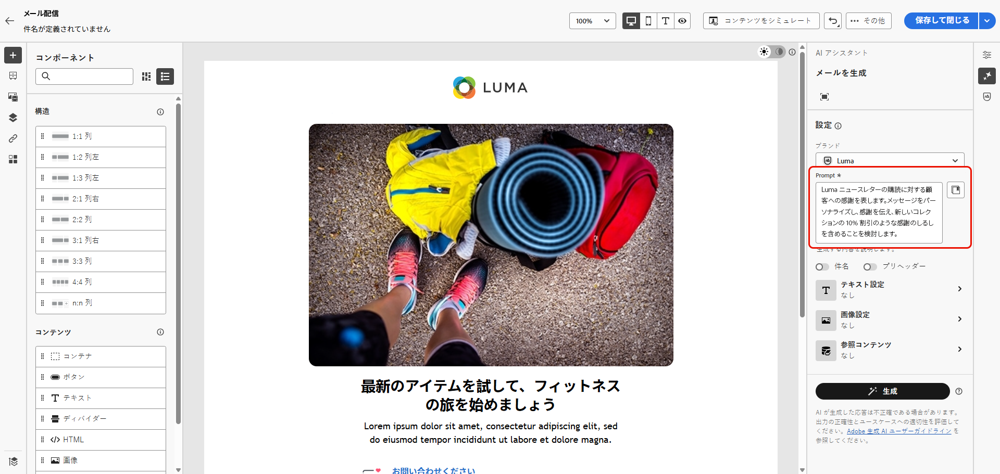{zoomable="yes"}

1. **メールの場合**、「**[!UICONTROL 件名]**」オプションと「**[!UICONTROL プリヘッダー]**」オプションを切り替えて、バリアントの生成に含めることができます。

1. 「**[!UICONTROL テキスト設定]**」オプションを使用してプロンプトを調整します。

   * **[!UICONTROL コミュニケーション戦略]**：生成テキストに最適なコミュニケーションスタイルを選択します。
   * **[!UICONTROL 言語]**：生成されたコンテンツの言語を選択します。
   * **[!UICONTROL トーン]**：メールのトーンは、オーディエンスの共感を呼びます。情報の提供や遊び心、説得力のいずれを目指している場合であっても、AI アシスタントはメッセージを適切に調整します。

     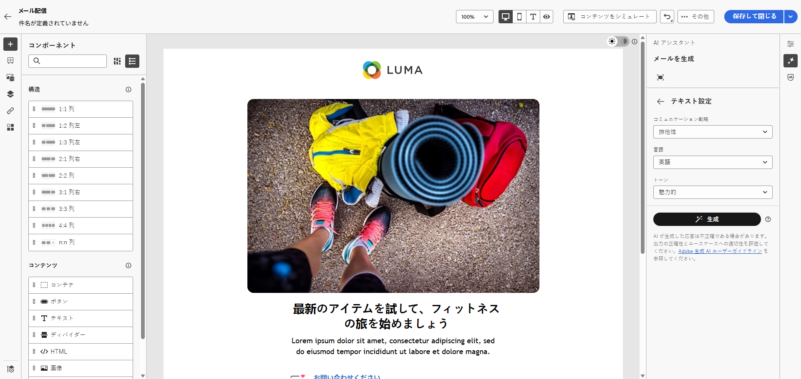{zoomable="yes"}

1. **[!UICONTROL 画像設定]**&#x200B;を選択します。

   * **[!UICONTROL コンテンツタイプ]**：視覚要素の性質が分類され、写真、グラフィック、アートなど、様々な視覚的表現が区別されます。
   * **[!UICONTROL 視覚的な強度]**：画像の強度を調整することで、画像の影響を制御します。低い値（2）を設定すると、より柔らかい外観が作成され、高い値（10）を設定すると、画像はより鮮やかになります。
   * **[!UICONTROL カラーとトーン]**：カラーの全体的な外観と、伝えられるムードまたは雰囲気を調整します。
   * **[!UICONTROL 照明]**：画像の照明を変更して雰囲気を形成し、特定の要素をハイライト表示します。
   * **[!UICONTROL 構成]**：画像のフレーム内に要素を配置します。

1. **[!UICONTROL 参照コンテンツ]**&#x200B;メニューから、「**[!UICONTROL ファイルをアップロード]**」をクリックして、AI アシスタントに追加のコンテキストを提供できるコンテンツを含むブランドアセットを追加するか、以前にアップロードしたものを選択します。

   以前にアップロードしたファイルは、**[!UICONTROL アップロードされた参照コンテンツ]**&#x200B;ドロップダウンで使用できます。生成に含めるアセットを切り替えるのみです。

   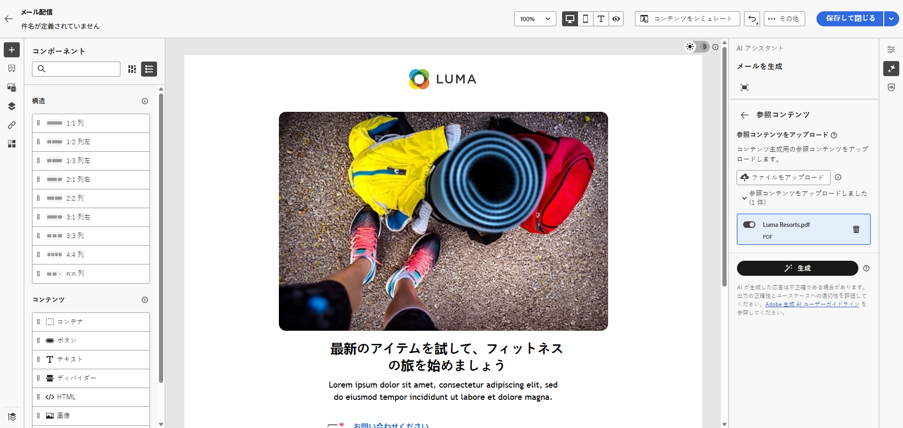{zoomable="yes"}

1. プロンプトの準備が整ったら、「**[!UICONTROL 生成]**」をクリックします。

### 絞り込みと最終処理 {#refine-finalize}

コンテンツのバリエーションを生成したら、結果を微調整して、正確な要件を満たすことができます。ブランド一致を確認し、トーンと言語を調整し、配信でアクティブ化するコンテンツを準備します。

1. 生成後、**[!UICONTROL バリエーション]**&#x200B;を参照します。

1. パーセンテージアイコンをクリックし、**[!UICONTROL ブランド整合性スコア]**&#x200B;を表示して、ブランドとの不整合を特定します。

   詳しくは、[ブランド整合性スコア](brands-score.md)を参照してください。

   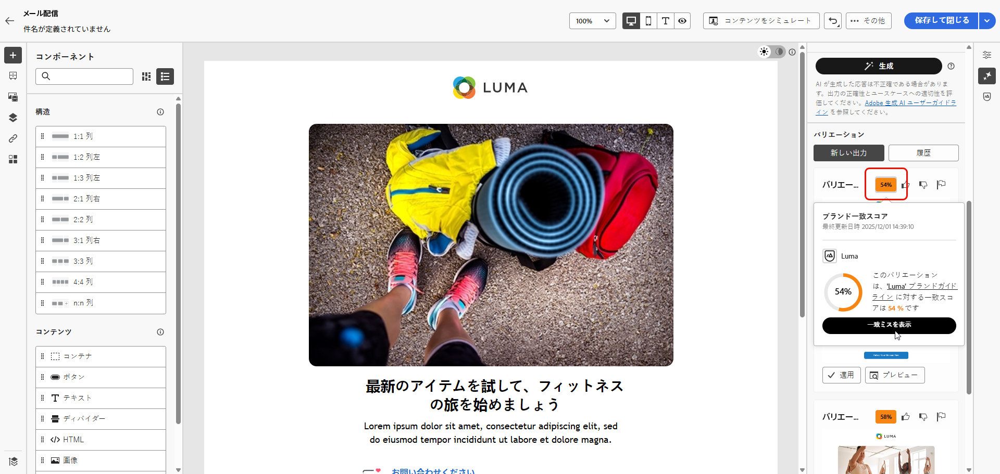{zoomable="yes"}

1. 選択したバリエーションの全画面バージョンを表示するには「**[!UICONTROL プレビュー]**」をクリックし、現在のコンテンツを置き換えるには「**[!UICONTROL 適用]**」をクリックします。

1. **[!UICONTROL プレビュー]**&#x200B;ウィンドウ内の「**[!UICONTROL 絞り込み]**」オプションに移動して、追加のカスタマイズ機能にアクセスします。

   * **[!UICONTROL 言い換え]**： 意味を保持しながらメッセージを書き換えます。このオプションを使用すると、コアメッセージを変更せずに、代替表現を生成したり、フローを改善したり、フレーズを調整したりできます。

   * **[!UICONTROL よりシンプルな言葉を使用]**：AI アシスタントを活用して言語をわかりやすく簡素化し、幅広いオーディエンスがアクセスできるようにします。

   * **[!UICONTROL 翻訳]**：言語をわかりやすく簡素化し、幅広いオーディエンスがアクセスできるようにします。

   * **[!UICONTROL トーンを変更]**：メッセージのトーンを、より使いやすい、プロフェッショナル、緊急、インスピレーションなど、コミュニケーションスタイルに一致させて調整します。

   * **[!UICONTROL コミュニケーション戦略を変更]**：緊急性の創出や魅力的なアピールの強調など、目的に応じてメッセージングアプローチを変更します。

     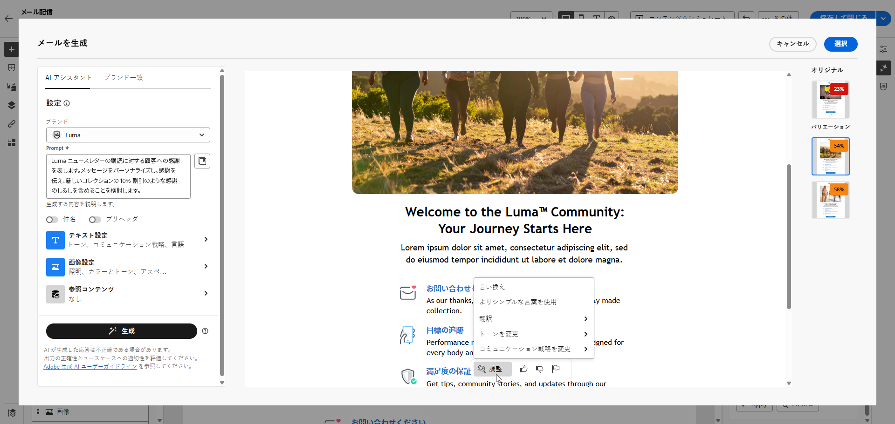{zoomable="yes"}

1. 「**[!UICONTROL ブランド整合性]**」タブを開き、コンテンツが[ブランドガイドライン](brands.md)と整合している程度を確認します。

1. 適切なコンテンツが見つかったら、「**[!UICONTROL 選択]**」をクリックします。

1. パーソナライゼーションフィールドを挿入し、プロファイルデータに基づいてコンテンツをカスタマイズします。次に「**[!UICONTROL コンテンツをシミュレート]**」ボタンをクリックしてレンダリングを制御し、テストプロファイルでパーソナライゼーション設定を確認します。[詳細情報](../preview-test/preview-content.md)

1. コンテンツを確認およびアクティブ化します。
   * **メール**：コンテンツ、オーディエンスおよびスケジュールを定義したら、メール配信の準備が整います。[詳細情報](../monitor/prepare-send.md)
   * **ランディングページ**：ランディングページの準備が整ったら、公開して、メッセージで使用できるようになります。[詳細情報](../landing-pages/create-lp.md)

## モバイルチャネルの場合 {#mobile-channels}

AI アシスタントはモバイルプッシュ通知のコンテンツ生成もサポートしており、モバイルアプリの魅力的なタイトル、メッセージ、画像を作成できます。これにより、モバイルを含むすべての顧客タッチポイントで一貫性のある高品質のコミュニケーションを維持できます。

### アクセスと設定 {#mobile-access-configure}

プッシュ通知に AI アシスタントを使用するには、まずプッシュ配信を設定し、コンテンツエディターを開きます。 配信の準備と AI アシスタントツールへのアクセスを実行するには、次の手順に従います。

1. プッシュ通知配信を作成および設定した後、「**[!UICONTROL コンテンツを編集]**」をクリックします。

   プッシュ配信の設定方法について詳しくは、[このページ](../push/create-push.md)を参照してください。

1. 必要に応じて、プッシュ通知をパーソナライズします。[詳細情報](../push/content-push.md)

1. **[!UICONTROL AI アシスタントを表示]**&#x200B;メニューにアクセスします。

   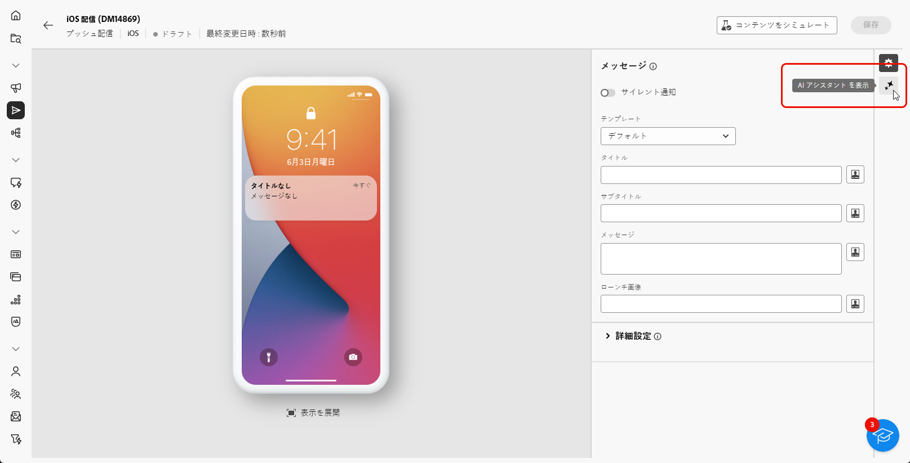{zoomable="yes"}

### コンテンツを生成 {#mobile-generate-content}

プッシュ通知用の AI アシスタントにアクセスしたら、生成設定を指定して、魅力的なモバイルコンテンツを作成できます。テキストと画像の環境設定を定義し、ブランドアセットを選択し、プロンプトを使用してモバイルユーザーに関与するプッシュ通知のバリエーションを生成します。

1. **[!UICONTROL ブランド]**&#x200B;を選択して、AI で生成されたコンテンツがブランドの仕様に一致していることを確認します。ブランドについて詳しくは、[こちら](brands.md)を参照してください。

1. 「**[!UICONTROL プロンプト]**」フィールドに生成する内容を記述して、コンテンツを微調整します。

   プロンプトの作成に関するサポートが必要な場合は、配信を改善するための様々なプロンプトのアイデアを提供する&#x200B;**[!UICONTROL プロンプトライブラリ]**&#x200B;にアクセスします。[プロンプトのベストプラクティスの詳細情報](ai-assistant-prompting-guide.md)

   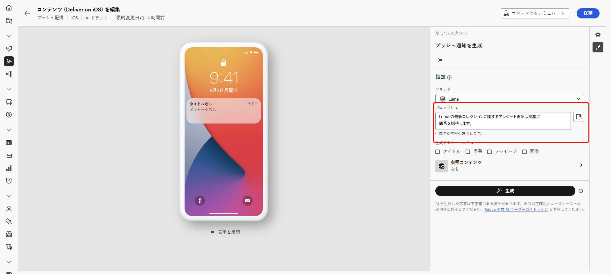{zoomable="yes"}

1. 生成するフィールド（「**[!UICONTROL タイトル]**」、「**[!UICONTROL サブタイトル]**」、「**[!UICONTROL メッセージ]**」、「**[!UICONTROL 画像]**」）を選択します。

1. 「**[!UICONTROL テキスト設定]**」オプションを使用してプロンプトを調整します。

   * **[!UICONTROL コミュニケーション戦略]**：生成テキストに最適なコミュニケーションスタイルを選択します。
   * **[!UICONTROL 言語]**：生成されたコンテンツの言語を選択します。
   * **[!UICONTROL トーン]**：プッシュ通知のトーンは、オーディエンスの共感を呼ぶものでなければなりません。情報を提供する、遊び心がある、説得力がある、のいずれを目指している場合であっても、AI アシスタントはメッセージを適切に調整できます。

     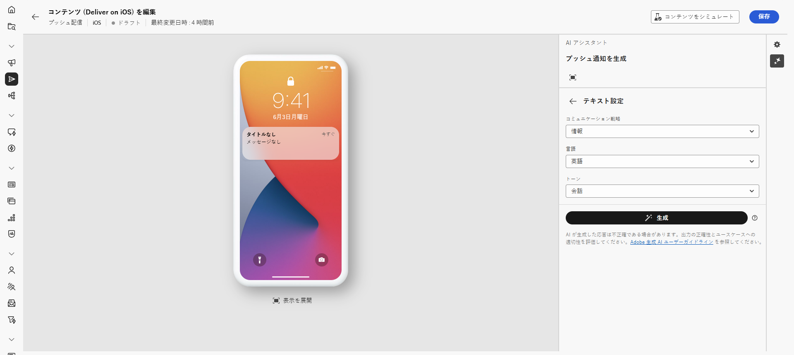{zoomable="yes"}

1. **[!UICONTROL 画像設定]**&#x200B;を選択します。

   * **[!UICONTROL コンテンツタイプ]**：視覚要素の性質が分類され、写真、グラフィック、アートなど、様々な視覚的表現が区別されます。
   * **[!UICONTROL 視覚的な強度]**：画像の強度を調整することで、画像の影響を制御します。低い値（2）を設定すると、より柔らかく、抑制された外観が作成され、高い値（10）を設定すると、画像はより鮮やかで視覚的に強力になります。
   * **[!UICONTROL 照明]**：画像の照明を調整して雰囲気を形成し、特定の要素をハイライト表示します。
   * **[!UICONTROL 構成]**：画像のフレーム内に要素を配置します。

     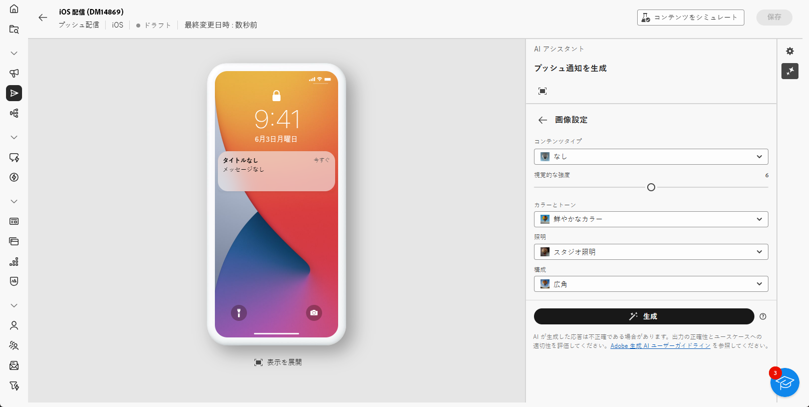{zoomable="yes"}

1. **[!UICONTROL 参照コンテンツ]**&#x200B;メニューから、「**[!UICONTROL ファイルをアップロード]**」をクリックして、AI アシスタントに追加のコンテキストを提供できるコンテンツを含むブランドアセットを追加するか、以前にアップロードしたものを選択します。

   以前にアップロードしたファイルは、**[!UICONTROL アップロードされた参照コンテンツ]**&#x200B;ドロップダウンで使用できます。生成に含めるアセットを切り替えるのみです。

1. プロンプトの準備が整ったら、「**[!UICONTROL 生成]**」をクリックします。

### 絞り込みと最終処理 {#mobile-refine-finalize}

生成されたプッシュ通知のバリエーションを確認したら、コンテンツを完全にすることができます。プッシュキャンペーンをアクティブ化する前に、絞り込みツールを使用して言語とトーンを調整し、ブランド一致を確認して、コンテンツをパーソナライズします。

1. 生成された&#x200B;**[!UICONTROL バリエーション]**&#x200B;を参照します。

1. パーセンテージアイコンをクリックし、**[!UICONTROL ブランド整合性スコア]**&#x200B;を表示して、ブランドとの不整合を特定します。

   詳しくは、[ブランド整合性スコア](brands-score.md)を参照してください。

   {zoomable="yes"}

1. 選択したバリエーションの全画面バージョンを表示するには「**[!UICONTROL プレビュー]**」をクリックし、現在のコンテンツを置き換えるには「**[!UICONTROL 適用]**」をクリックします。

1. **[!UICONTROL プレビュー]**&#x200B;ウィンドウ内の「**[!UICONTROL 絞り込み]**」オプションに移動して、追加のカスタマイズ機能にアクセスします。

   * **[!UICONTROL 参照コンテンツとして使用]**：選択したバリアントを、他の結果を生成する参照コンテンツとして使用します。
   * **[!UICONTROL 言い換え]**：メッセージを様々な方法で言い換え、ユーザーが作成した文章を新鮮で、多様なオーディエンスを惹きつけるメッセージにします。
   * **[!UICONTROL シンプルな言葉を使用]**：言語をわかりやすく簡素化し、幅広いオーディエンスがアクセスできるようにします。
   * **[!UICONTROL 翻訳]**：言語をわかりやすく簡素化し、幅広いオーディエンスがアクセスできるようにします。

   また、テキストの&#x200B;**[!UICONTROL トーン]**&#x200B;と&#x200B;**[!UICONTROL コミュニケーション戦略]**&#x200B;を変更することもできます。

   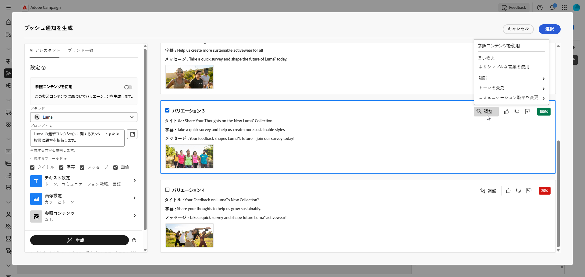{zoomable="yes"}

1. 「**[!UICONTROL ブランド整合性]**」タブを開き、コンテンツが[ブランドガイドライン](brands.md)と整合している程度を確認します。

1. 適切なコンテンツが見つかったら、「**[!UICONTROL 選択]**」をクリックします。

1. パーソナライゼーションフィールドを挿入して、プロファイルデータに基づいてメールコンテンツをカスタマイズします。次に「**[!UICONTROL コンテンツをシミュレート]**」ボタンをクリックしてレンダリングを制御し、テストプロファイルでパーソナライゼーション設定を確認します。[詳細情報](../preview-test/preview-content.md)

コンテンツ、オーディエンスおよびスケジュールを定義する際、プッシュ配信の準備を行います。[詳細情報](../monitor/prepare-send.md)

## チュートリアルビデオ {#video}

AI アシスタントを使用して、完全なメールコンテンツ、テキスト、画像を生成する方法を説明します。

>[!VIDEO](https://video.tv.adobe.com/v/3428984)