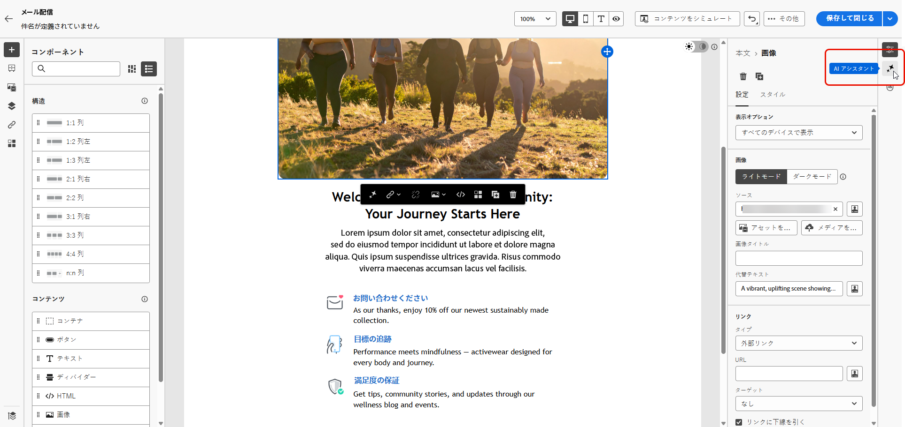
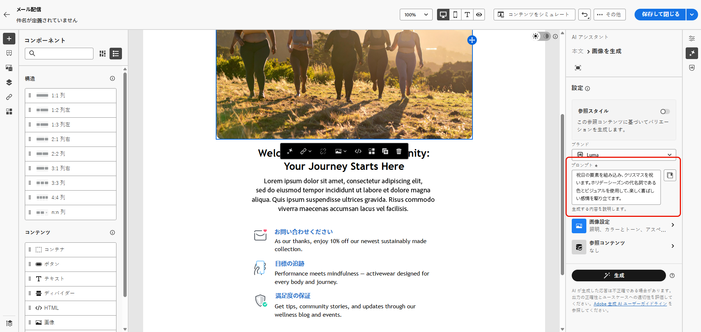
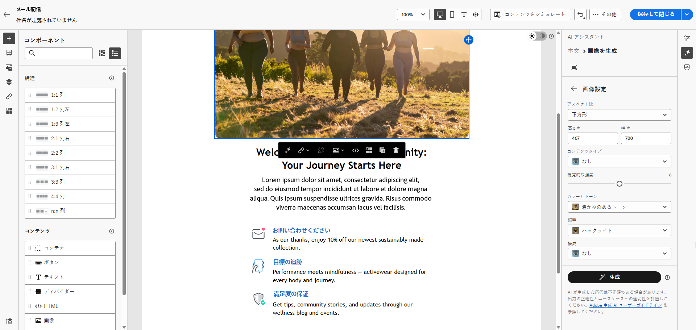
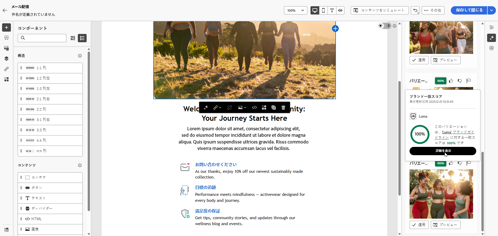
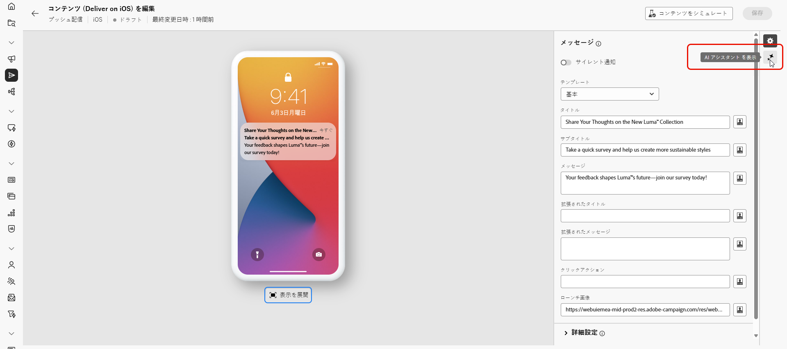
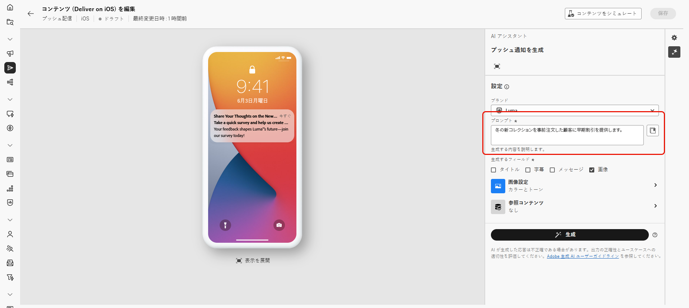
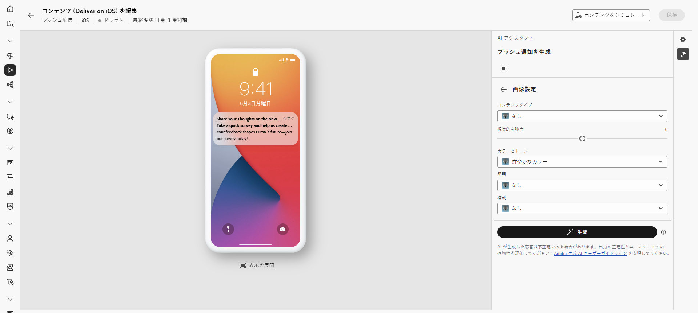
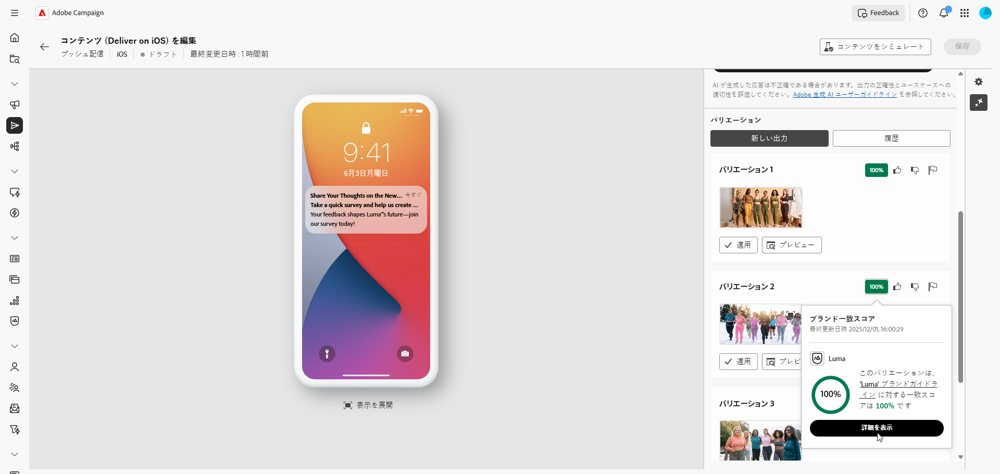

# AI アシスタントによる画像の生成 {#generative-image}

>[!IMPORTANT]
>
>この機能の使用を開始する前に、関連する[ガードレールと制限](generative-gs.md#generative-guardrails)を参照してください。
> 
>
>Adobe Campaign web の AI アシスタントを使用する前に、[ユーザー契約](https://www.adobe.com/jp/legal/licenses-terms/adobe-dx-gen-ai-user-guidelines.html){target="_blank"}に同意する必要があります。詳しくは、アドビ担当者にお問い合わせください。

Adobe Campaign Web で AI アシスタントを使用すると、説得力のあるビジュアルコンテンツを作成して、メール、ランディングページおよびプッシュ通知をまたいでメッセージを強化できます。 AI アシスタントは、画像を生成および最適化するのに役立ち、コンテンツが視覚的に魅力的で、ブランドに合っていることを確認します。

## メールおよびランディングページの場合 {#email-web-channels}

AI アシスタントは、E メール配信およびランディングページ用に完全な視覚的エクスペリエンスを生成できます。 この機能を使用すると、デジタルタッチポイントをまたいで、オーディエンスの共感を得られる、ブランドに合った注目を集める画像を作成できます。

### アクセスと設定 {#access-configure}

AI アシスタントで画像の生成を開始するには、まず配信を設定して、コンテンツエディターを開きます。 以下の手順に従ってワークスペースを準備し、AI アシスタント パネルにアクセスします。

1. 配信を作成して設定します。

   * **メール**：メール配信を作成して設定したら、「**[!UICONTROL コンテンツを編集]**」をクリックします。 [詳細情報](../email/create-email-content.md)
   * **ランディングページ**：ランディングページを作成して設定したら、**[!UICONTROL コンテンツを編集]** をクリックします。 [詳細情報](../landing-pages/create-lp.md)

1. AI アシスタントで変更するアセットを選択し、**[!UICONTROL AI アシスタント]** メニューにアクセスします。

   {zoomable="yes"}

### コンテンツを生成 {#generate-content}

効果的なプロンプトを作成し、画像設定を設定して、AI アシスタントで視覚的に魅力的な画像を生成する方法を説明します。 アスペクト比、視覚強度、照明などのパラメーターをカスタマイズして、ブランドやキャンペーンの目標に合った画像を作成します。

1. AI アシスタントの「**[!UICONTROL 参照スタイル]**」オプションを有効にして、選択したコンテンツに基づいて新しいコンテンツをパーソナライズします。

1. **[!UICONTROL ブランド]** を選択して、AI で生成されたコンテンツがブランドの仕様に従っていることを確認します。 ブランドの [ 詳細情報 ](brands.md)。

1. 「**[!UICONTROL プロンプト]**」フィールドに生成する内容を記述して、コンテンツを微調整します。

   プロンプトを作成する際に支援が必要な場合は、**[!UICONTROL プロンプトライブラリ]** にアクセスします。このライブラリは、配信を改善するための様々な迅速なアイデアを提供します。 [ プロンプトのベストプラクティスの詳細情報 ](ai-assistant-prompting-guide.md)

   {zoomable="yes"}

1. 「**[!UICONTROL 画像設定]**」オプションを使用してプロンプトを調整します。

   * **[!UICONTROL 縦横比]**：アセットの幅と高さが決まります。16:9、4:3、3:2、1:1 など、一般的な比率から選択するか、カスタムサイズを入力します。
   * **[!UICONTROL コンテンツタイプ]**：視覚要素の性質が分類され、写真、グラフィック、アートなど、様々な視覚的表現が区別されます。
   * **[!UICONTROL 視覚的な強度]**：画像の強度を調整することで、画像の影響を制御します。低い値（2）を設定すると、より柔らかい外観が作成され、高い値（10）を設定すると、画像はより鮮やかになります。
   * **[!UICONTROL カラーとトーン]**：カラーの全体的な外観と、伝えられるムードまたは雰囲気を調整します。
   * **[!UICONTROL 照明]**：画像の照明を変更して雰囲気を形成し、特定の要素をハイライト表示します。
   * **[!UICONTROL 構成]**：画像のフレーム内に要素を配置します。

     {zoomable="yes"}

1. **[!UICONTROL 参照コンテンツ]** メニューで「**[!UICONTROL ファイルをアップロード]**」をクリックし、追加のコンテキスト AI アシスタントを提供できるコンテンツを含むブランドアセットを追加するか、以前にアップロードしたものを選択します。

   以前にアップロードしたファイルは、「**[!UICONTROL アップロードされた参照コンテンツ]** ドロップダウンで使用できます。 生成に含めるアセットを切り替えるのみです。

1. プロンプトの設定が完了したら、「**[!UICONTROL 生成]**」をクリックします。

### 絞り込みと最終処理 {#refine-finalize}

画像バリエーションを生成したら、結果を確認し、ブランドの整合性を確認し、コンテンツに最適なオプションを選択できます。

1. 生成された **[!UICONTROL バリエーション]** を参照します。

1. パーセンテージアイコンをクリックし、**[!UICONTROL ブランド整合性スコア]**&#x200B;を表示して、ブランドとの不整合を特定します。

   詳しくは、[ブランド整合性スコア](../content/brands-score.md)を参照してください。

   {zoomable="yes"}

1. **[!UICONTROL プレビュー]** をクリックして選択したバリエーションの全画面表示バージョンを表示するか、**[!UICONTROL 適用]** をクリックして現在のコンテンツを置き換えます。

1. このバリアントに関連する画像を表示する場合は、「**[!UICONTROL 類似を生成]**」を選択します。

1. 「**[!UICONTROL ブランド整合性]**」タブを開き、コンテンツが[ブランドガイドライン](../content/brands.md)と整合している程度を確認します。

1. 適切なコンテンツが見つかったら、「**[!UICONTROL 選択]**」をクリックします。

1. メッセージコンテンツを定義したら、「**[!UICONTROL コンテンツをシミュレート]**」ボタンをクリックしてレンダリングを制御し、テストプロファイルでパーソナライゼーション設定を確認します。[詳細情報](../preview-test/preview-content.md)

1. コンテンツをレビューしてアクティブ化します。
   * **メール**：コンテンツ、オーディエンス、スケジュールを定義したら、メール配信の準備を始めます。 [詳細情報](../monitor/prepare-send.md)
   * **ランディングページ**：ランディングページの準備が整ったら、ページを公開して、メッセージで使用できるようにします。 [詳細情報](../landing-pages/create-lp.md)

## モバイルチャネル用 {#mobile-channels}

AI アシスタントを使用すると、プッシュ通知用の魅力的な画像を生成でき、注目を集め、オーディエンスの共感を得る、視覚的に魅力的なモバイル通信を作成できます。

### アクセスと設定 {#mobile-access-configure}

AI アシスタントでプッシュ通知用の画像の生成を開始するには、まず配信を設定して、AI アシスタントを開きます。

1. プッシュ通知配信を作成して設定したら、「**[!UICONTROL コンテンツを編集]**」をクリックします。 [詳細情報](../push/create-push.md)

1. **[!UICONTROL AI アシスタントを表示]**&#x200B;メニューにアクセスします。

   {zoomable="yes"}

### コンテンツを生成 {#mobile-generate-content}

AI アシスタントにアクセスしたら、生成設定を調整して、ブランドに合った画像を作成し、プッシュ通知の目標をサポートすることができます。 プロンプトパラメーターと画像パラメーターを設定して、モバイルディスプレイ用に最適化されたビジュアルを生成します。

1. **[!UICONTROL ブランド]** を選択して、AI で生成されたコンテンツがブランドの仕様に従っていることを確認します。 ブランドの [ 詳細情報 ](brands.md)。

1. 「**[!UICONTROL プロンプト]**」フィールドに生成する内容を記述して、コンテンツを微調整します。

   プロンプトを作成する際に支援を求めている場合は、**[!UICONTROL プロンプトライブラリ]** にアクセスしてください。このライブラリは、キャンペーンを改善するための様々な迅速なアイデアを提供します。 [ プロンプトのベストプラクティスの詳細情報 ](ai-assistant-prompting-guide.md)

   {zoomable="yes"}

1. アセットのみを生成するには、「**[!UICONTROL 画像]**」を選択します。

1. **[!UICONTROL 画像設定]**&#x200B;を選択します。

   * **[!UICONTROL コンテンツタイプ]**：視覚要素の性質が分類され、写真、グラフィック、アートなど、様々な視覚的表現が区別されます。
   * **[!UICONTROL 視覚的な強度]**：画像の強度を調整することで、画像の影響を制御します。低い値（2）を設定すると、より柔らかく、抑制された外観が作成され、高い値（10）を設定すると、画像はより鮮やかで視覚的に強力になります。
   * **[!UICONTROL 照明]**：画像の照明を調整して雰囲気を形成し、特定の要素をハイライト表示します。
   * **[!UICONTROL 構成]**：画像のフレーム内に要素を配置します。

     {zoomable="yes"}

1. **[!UICONTROL 参照コンテンツ]** メニューで「**[!UICONTROL ファイルをアップロード]**」をクリックし、追加のコンテキスト AI アシスタントを提供できるコンテンツを含むブランドアセットを追加するか、以前にアップロードしたものを選択します。

   以前にアップロードしたファイルは、「**[!UICONTROL アップロードされた参照コンテンツ]** ドロップダウンで使用できます。 生成に含めるアセットを切り替えるのみです。

1. プロンプトの準備が整ったら、「**[!UICONTROL 生成]**」をクリックします。

### 絞り込みと最終処理 {#mobile-refine-finalize}

モバイルメッセージ用の画像バリエーションを生成したら、結果を微調整して、正確な要件を満たしていることを確認できます。

1. 生成後、**[!UICONTROL バリエーション]** を参照できます。

1. パーセンテージアイコンをクリックし、**[!UICONTROL ブランド整合性スコア]**&#x200B;を表示して、ブランドとの不整合を特定します。

   詳しくは、[ブランド整合性スコア](../content/brands-score.md)を参照してください。

   {zoomable="yes"}

1. **[!UICONTROL プレビュー]** をクリックして **[!UICONTROL バリエーション]** を参照します。

1. 「**[!UICONTROL ブランド整合性]**」タブを開き、コンテンツが[ブランドガイドライン](brands.md)と整合している程度を確認します。

1. 適切なコンテンツが見つかったら、「**[!UICONTROL 選択]**」をクリックします。

コンテンツ、オーディエンスおよびスケジュールを定義したら、プッシュ配信の準備をします。 [詳細情報](../monitor/prepare-send.md)
