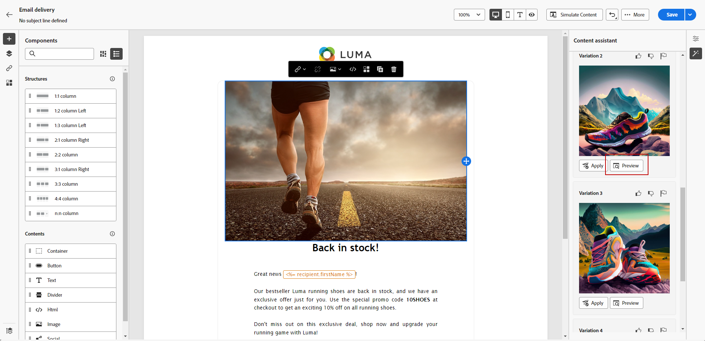

# コンテンツアシスタントを使用した画像の生成 {#generative-image}

E メールを作成し、パーソナライズした後は、生成 AI を活用した Content Assistant を使用してコンテンツを強化できます。 この機能により、パーソナライゼーションとコンテンツの改善のプロセスが簡素化されます。

次の例では、コンテンツアシスタントを活用してコンテンツを最適化および改善し、より使いやすいエクスペリエンスを実現する方法を説明します。 次の手順に従います。

1. E メール配信を作成および設定した後、 **[!UICONTROL コンテンツを編集]**.

   E メール配信の設定方法について詳しくは、 [このページ](../content/create-email-content.md).

1. 次の項目に入力： **[!UICONTROL 基本的な詳細]** 配信に使用します。 完了したら、「 **[!UICONTROL E メールコンテンツを編集]**.

1. コンテンツアシスタントを使用して、変更するアセットを選択します。

1. 右側のメニューから、「 」を選択します。 **[!UICONTROL エクスペリエンスの生成]**.

   

1. 結果をより微調整するためのプロンプトを追加します。

   

1. 選択 **[!UICONTROL ファイルをアップロード]** コンテンツアシスタントに追加のコンテキストを提供できるコンテンツを含むブランドアセットを追加する場合。

   また、 **[!UICONTROL アップロードされたコンテンツ]** をクリックして、以前に更新したファイルを検索します。 アップロードしたコンテンツは、現在のユーザーのみが再利用できることに注意してください。

1. を選択します。 **[!UICONTROL 縦横比]** を設定します。 これにより、アセットの幅と高さが決まります。

   16:9、4:3、3:2、1:1 など、一般的な比率から選択することも、カスタムサイズを入力することもできます。

1. のカスタマイズ **[!UICONTROL 色と色調]**, **[!UICONTROL コンテンツタイプ]**, **[!UICONTROL 照明]** および **[!UICONTROL 構成]** 目的のアセット特性に合わせた設定を使用できます。

   

1. プロンプトの設定が完了したら、 **[!UICONTROL 生成]**.

1. 次を参照： **[!UICONTROL バリエーションの候補]** をクリックして、目的のアセットを検索します。 クリック **[!UICONTROL プレビュー]** 選択したバリエーションのフルスクリーンバージョンを表示します。

   

1. クリック **[!UICONTROL 選択]** 適切なコンテンツが見つかったら、

   

1. メッセージコンテンツを定義したら、 **[!UICONTROL コンテンツをシミュレート]** ボタンを使用してレンダリングを制御し、テストプロファイルでパーソナライゼーション設定を確認します。  [詳細情報](../preview-test/preview-content.md)

   

1. コンテンツ、オーディエンス、スケジュールを定義したら、E メール配信を準備する準備が整います。 [詳細情報](../monitor/prepare-send.md)