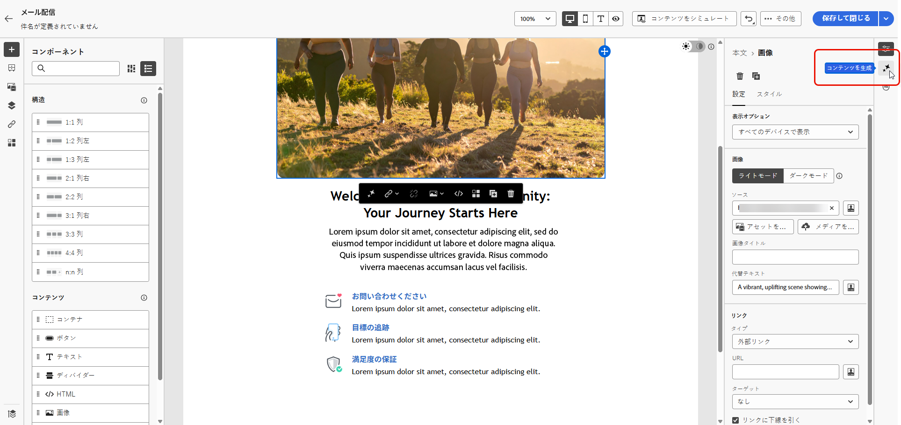
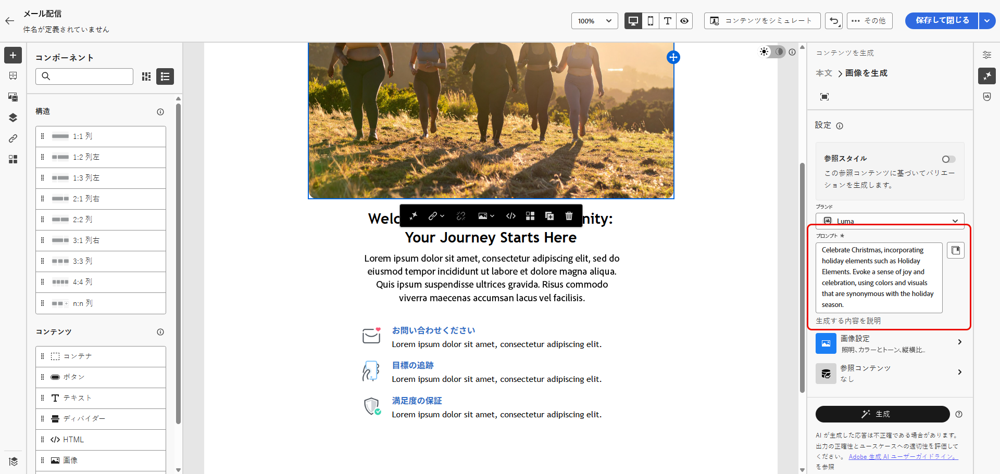
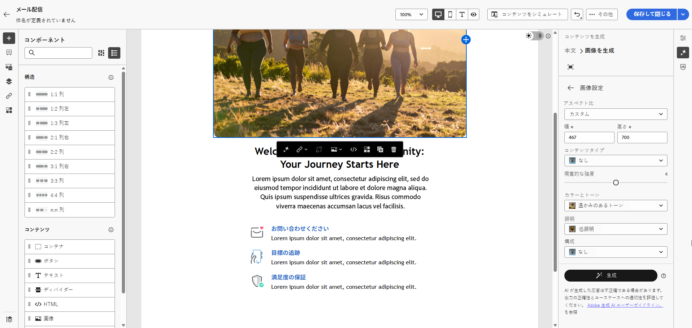
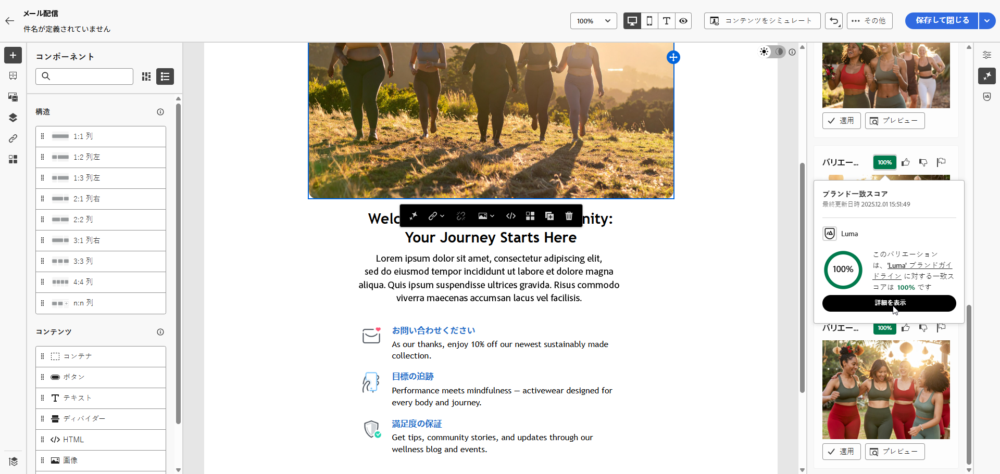
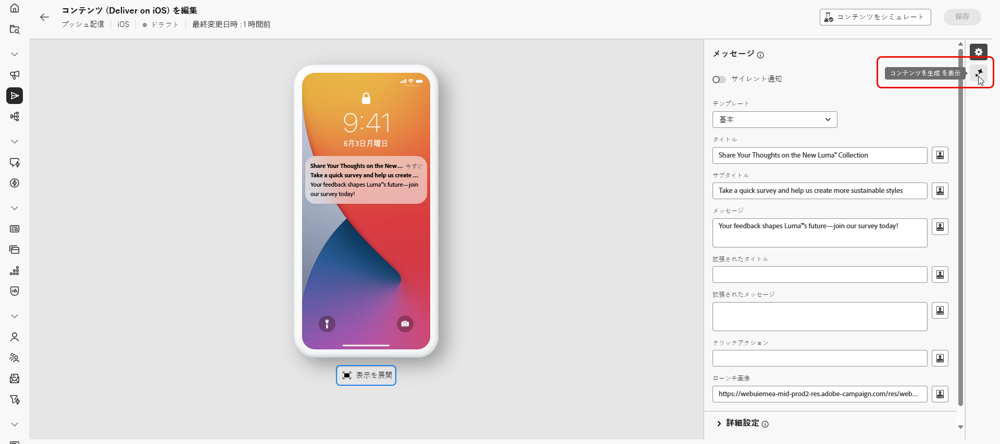
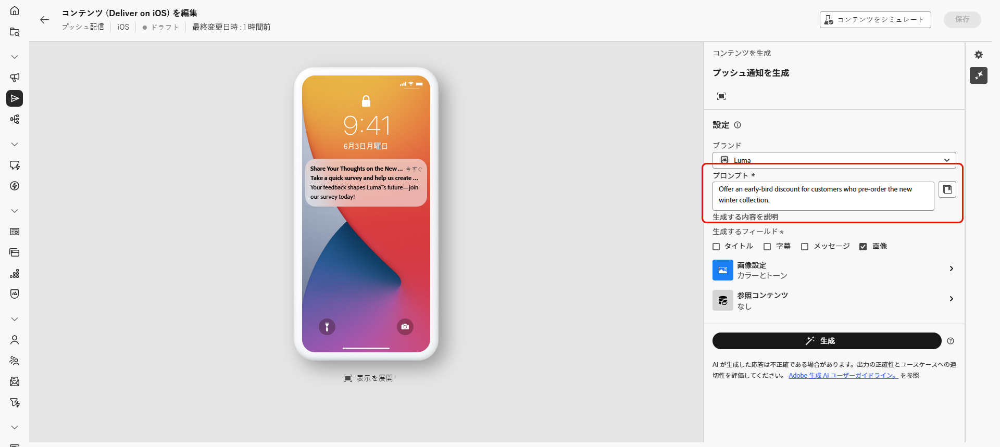
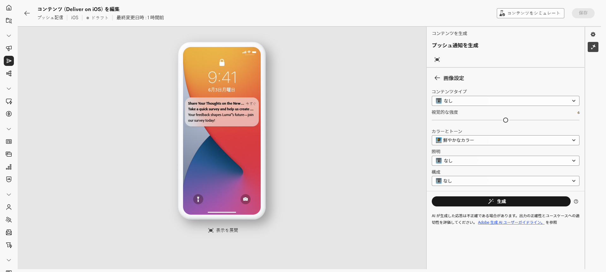
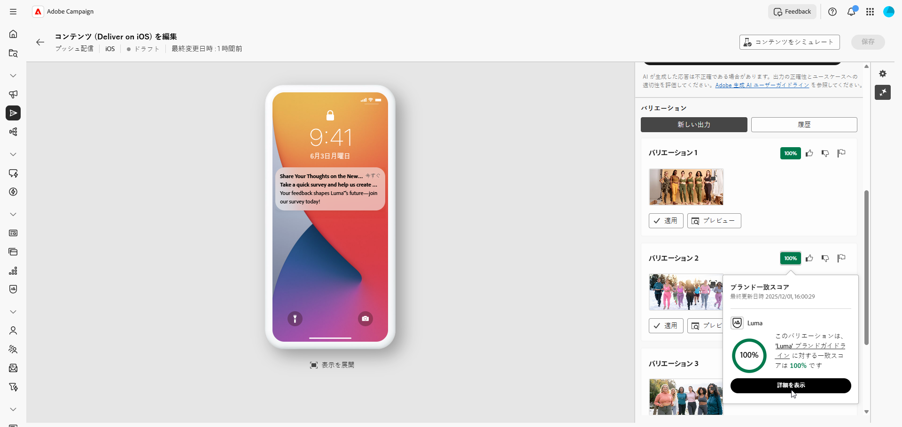

# 画像を生成 {#generative-image}

>[!IMPORTANT]
>
>この機能の使用を開始する前に、関連する[ガードレールと制限](generative-gs.md#generative-guardrails)を参照してください。
> 
>
>AIを使用してAdobe Campaign Webでコンテンツを生成する前に、[ ユーザー契約書](https://www.adobe.com/jp/legal/licenses-terms/adobe-dx-gen-ai-user-guidelines.html){target="_blank"}に同意する必要があります。 詳しくは、アドビ担当者にお問い合わせください。

Adobe Campaign WebのAIを利用して、魅力的なビジュアルコンテンツを制作し、電子メール、ランディングページ、プッシュ通知をまたいでメッセージを強化できます。 AIを活用して画像を生成および最適化し、コンテンツが視覚的に魅力的で、ブランドに即していることを確認します。

## メールとランディングページの場合 {#email-web-channels}

AIを活用して、メール配信とランディングページの包括的なビジュアルエクスペリエンスを生成します。 この機能により、デジタルタッチポイントをまたいでオーディエンスの共感を得られる、ブランドに即した注目を集める画像を作成できます。

### アクセスと設定 {#access-configure}

AIを利用して画像の生成を開始するには、まず配信を設定し、コンテンツエディターを開きます。 ワークスペースを準備し、コンテンツを生成パネルにアクセスするには、次の手順に従います。

1. 配信を作成および設定します。

   * **メール**：メール配信を作成および設定したら、「**[!UICONTROL コンテンツを編集]**」をクリックします。 [詳細情報](../email/create-email-content.md)
   * **ランディングページ**：ランディングページを作成および設定したら、「**[!UICONTROL コンテンツを編集]**」をクリックします。 [詳細情報](../landing-pages/create-lp.md)

1. 変更するアセットを選択し、**[!UICONTROL コンテンツを生成]** メニューにアクセスします。

   {zoomable="yes"}

### 画像を生成 {#generate-content}

AIを活用して、効果的なプロンプトを作成し、画像の設定を調整して視覚的に魅力的な画像を生成する方法を解説します。 縦横比、視覚強度、照明などのパラメーターをカスタマイズして、ブランドやキャンペーンの目標に一致する画像を作成します。

1. AIを使用して、選択したコンテンツに基づいて新しいコンテンツをパーソナライズするには、**[!UICONTROL 参照スタイル]** オプションを有効にします。

1. **[!UICONTROL ブランド]**&#x200B;を選択して、AI で生成されたコンテンツがブランドの仕様に一致していることを確認します。 ブランドについて詳しくは、[こちら](brands.md)を参照してください。

1. 「**[!UICONTROL プロンプト]**」フィールドに生成する内容を記述して、コンテンツを微調整します。

   プロンプトの作成に関するサポートが必要な場合は、配信を改善するための様々なプロンプトのアイデアを提供する&#x200B;**[!UICONTROL プロンプトライブラリ]**&#x200B;にアクセスします。 [プロンプトのベストプラクティスの詳細情報](ai-assistant-prompting-guide.md)

   {zoomable="yes"}

1. 「**[!UICONTROL 画像設定]**」オプションを使用してプロンプトを調整します。

   * **[!UICONTROL 生成モデル]**：すぐに使用できる **[!UICONTROL Adobe モデル]**、特殊機能を提供する&#x200B;**[!UICONTROL パートナーモデル]**、ブランドアセットでトレーニングされた&#x200B;**[!UICONTROL カスタムモデル]**&#x200B;の中から選択します。 [詳細情報](generative-models.md)
   * **[!UICONTROL 縦横比]**：アセットの幅と高さが決まります。 16:9、4:3、3:2、1:1などの一般的な比率から選択するか、カスタムサイズを入力します。
   * **[!UICONTROL コンテンツタイプ]**：視覚要素の性質が分類され、写真、グラフィック、アートなど、様々な視覚的表現が区別されます。
   * **[!UICONTROL 視覚的な強度]**：画像の強度を調整することで、画像の影響を制御します。 低い値（2）を設定すると、より柔らかい外観が作成され、高い値（10）を設定すると、画像はより鮮やかになります。
   * **[!UICONTROL カラーとトーン]**：カラーの全体的な外観と、伝えられるムードまたは雰囲気を調整します。
   * **[!UICONTROL 照明]**：画像の照明を変更して雰囲気を形成し、特定の要素をハイライト表示します。
   * **[!UICONTROL 構成]**：画像のフレーム内に要素を配置します。

     {zoomable="yes"}

1. **[!UICONTROL コンテンツを参照]** メニューから、**[!UICONTROL ファイルをアップロード]**&#x200B;をクリックして、追加のコンテキスト AIを提供したり、以前にアップロードしたコンテンツを選択したりできるコンテンツを含むブランドアセットを追加します。

   以前にアップロードしたファイルは、**[!UICONTROL アップロードされた参照コンテンツ]**&#x200B;ドロップダウンで使用できます。 生成に含めるアセットを切り替えるのみです。

1. プロンプトの設定が完了したら、「**[!UICONTROL 生成]**」をクリックします。

### 絞り込みと最終処理 {#refine-finalize}

画像のバリエーションを生成したら、結果を確認し、ブランド一致をチェックして、コンテンツに最適なオプションを選択できます。

1. 生成された&#x200B;**[!UICONTROL バリエーション]**&#x200B;を参照します。

1. パーセンテージアイコンをクリックし、**[!UICONTROL ブランド整合性スコア]**&#x200B;を表示して、ブランドとの不整合を特定します。

   詳しくは、[ブランド整合性スコア](../content/brands-score.md)を参照してください。

   {zoomable="yes"}

1. 選択したバリエーションの全画面バージョンを表示するには「**[!UICONTROL プレビュー]**」をクリックし、現在のコンテンツを置き換えるには「**[!UICONTROL 適用]**」をクリックします。

1. このバリアントに関連する画像を表示する場合は、「**[!UICONTROL 類似を生成]**」を選択します。

1. 「**[!UICONTROL ブランド整合性]**」タブを開き、コンテンツが[ブランドガイドライン](../content/brands.md)と整合している程度を確認します。

1. 適切なコンテンツが見つかったら、「**[!UICONTROL 選択]**」をクリックします。

1. メッセージコンテンツを定義したら、「**[!UICONTROL コンテンツをシミュレート]**」ボタンをクリックしてレンダリングを制御し、テストプロファイルでパーソナライゼーション設定を確認します。 [詳細情報](../preview-test/preview-content.md)

1. コンテンツを確認およびアクティブ化します。
   * **メール**：コンテンツ、オーディエンスおよびスケジュールを定義したら、メール配信の準備が整います。 [詳細情報](../monitor/prepare-send.md)
   * **ランディングページ**：ランディングページの準備が整ったら、公開して、メッセージで使用できるようになります。 [詳細情報](../landing-pages/create-lp.md)

## モバイルチャネルの場合 {#mobile-channels}

AIを活用して、プッシュ通知用の魅力的な画像を生成します。これにより、オーディエンスの関心を引き、共感を呼ぶ魅力的なモバイルコミュニケーションを視覚的に構築できます。

### アクセスと設定 {#mobile-access-configure}

AIを使用してプッシュ通知用の画像を生成するには、まず配信を設定し、「コンテンツを生成」を開きます。

1. プッシュ通知配信を作成および設定したら、「**[!UICONTROL コンテンツを編集]**」をクリックします。 [詳細情報](../push/create-push.md)

1. **[!UICONTROL コンテンツ生成を表示]** メニューにアクセスします。

   {zoomable="yes"}

### 画像を生成 {#mobile-generate-content}

「コンテンツを生成」にアクセスしたら、生成設定を調整して、ブランドに合った画像を作成し、プッシュ通知の目的に対応させることができます。 プロンプトと画像のパラメーターを設定して、モバイルディスプレイに最適化されたビジュアルを生成します。

1. **[!UICONTROL ブランド]**&#x200B;を選択して、AI で生成されたコンテンツがブランドの仕様に一致していることを確認します。 ブランドについて詳しくは、[こちら](brands.md)を参照してください。

1. 「**[!UICONTROL プロンプト]**」フィールドに生成する内容を記述して、コンテンツを微調整します。

   プロンプトの作成に関するサポートが必要な場合は、キャンペーンを改善するための様々なプロンプトのアイデアを提供する&#x200B;**[!UICONTROL プロンプトライブラリ]**&#x200B;にアクセスします。 [プロンプトのベストプラクティスの詳細情報](ai-assistant-prompting-guide.md)

   {zoomable="yes"}

1. アセットのみを生成するには、「**[!UICONTROL 画像]**」を選択します。

1. **[!UICONTROL 画像設定]**&#x200B;を選択します。

   * **[!UICONTROL 生成モデル]**：すぐに使用できる&#x200B;**[!UICONTROL Adobe モデル]**、特殊機能を提供する&#x200B;**[!UICONTROL パートナーモデル]**、ブランドアセットでトレーニングされた&#x200B;**[!UICONTROL カスタムモデル]**&#x200B;の中から選択します。 [詳細情報](generative-models.md)
   * **[!UICONTROL コンテンツタイプ]**：視覚要素の性質が分類され、写真、グラフィック、アートなど、様々な視覚的表現が区別されます。
   * **[!UICONTROL 視覚的な強度]**：画像の強度を調整することで、画像の影響を制御します。 低い値（2）を設定すると、より柔らかく、抑制された外観が作成され、高い値（10）を設定すると、画像はより鮮やかで視覚的に強力になります。
   * **[!UICONTROL 照明]**：画像の照明を調整して雰囲気を形成し、特定の要素をハイライト表示します。
   * **[!UICONTROL 構成]**：画像のフレーム内に要素を配置します。

     {zoomable="yes"}

1. **[!UICONTROL コンテンツを参照]** メニューから、**[!UICONTROL ファイルをアップロード]**&#x200B;をクリックして、追加のコンテキスト AIを提供したり、以前にアップロードしたコンテンツを選択したりできるコンテンツを含むブランドアセットを追加します。

   以前にアップロードしたファイルは、**[!UICONTROL アップロードされた参照コンテンツ]**&#x200B;ドロップダウンで使用できます。 生成に含めるアセットを切り替えるのみです。

1. プロンプトの準備が整ったら、「**[!UICONTROL 生成]**」をクリックします。

### 絞り込みと最終処理 {#mobile-refine-finalize}

モバイルメッセージの画像バリエーションを生成したら、結果を微調整して、正確な要件を満たすことができます。

1. 生成後、**[!UICONTROL バリエーション]**&#x200B;を参照します。

1. パーセンテージアイコンをクリックし、**[!UICONTROL ブランド整合性スコア]**&#x200B;を表示して、ブランドとの不整合を特定します。

   詳しくは、[ブランド整合性スコア](../content/brands-score.md)を参照してください。

   {zoomable="yes"}

1. 「**[!UICONTROL プレビュー]**」をクリックして&#x200B;**[!UICONTROL バリエーション]**&#x200B;を参照します。

1. 「**[!UICONTROL ブランド整合性]**」タブを開き、コンテンツが[ブランドガイドライン](brands.md)と整合している程度を確認します。

1. 適切なコンテンツが見つかったら、「**[!UICONTROL 選択]**」をクリックします。

コンテンツ、オーディエンスおよびスケジュールを定義したら、プッシュ配信の準備を行います。 [詳細情報](../monitor/prepare-send.md)
