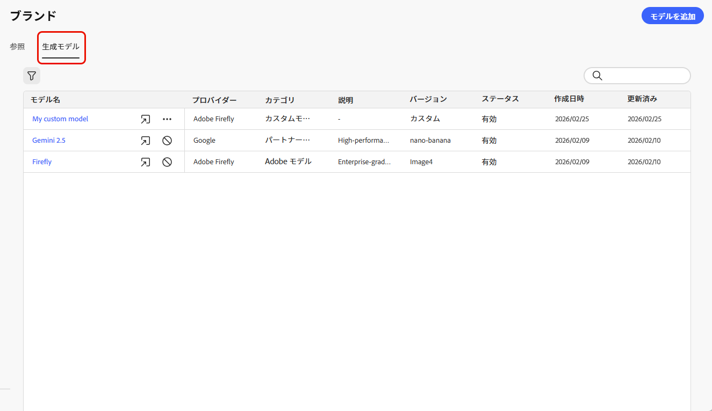
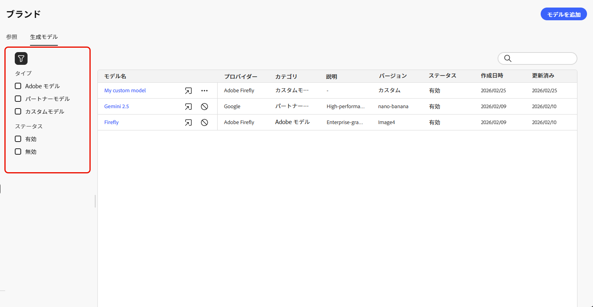
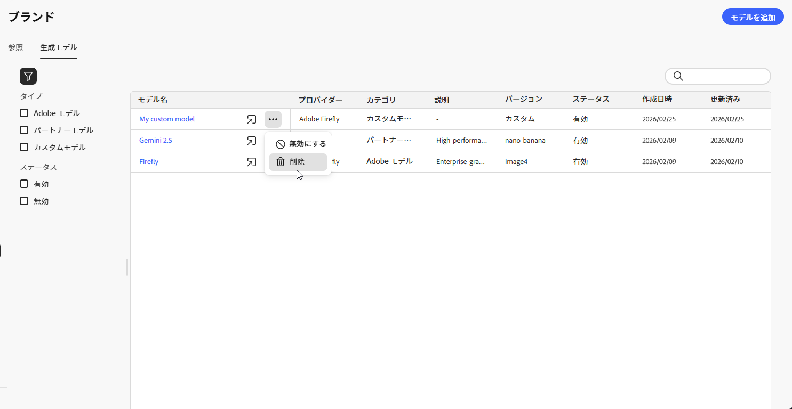
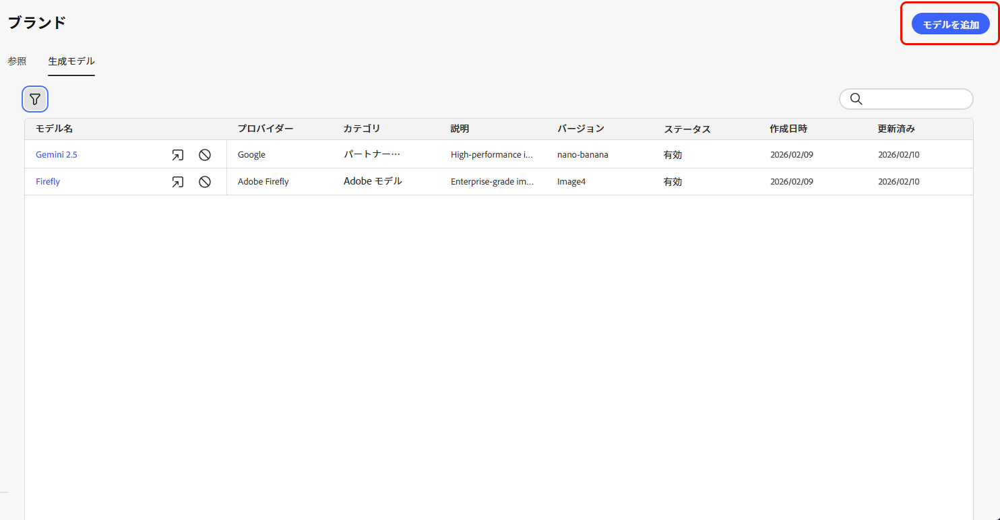
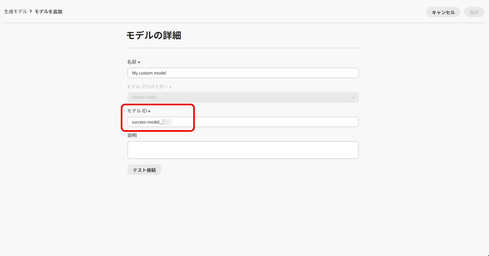
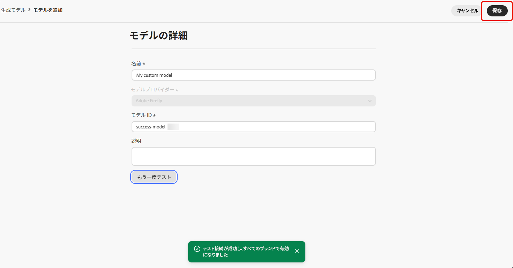
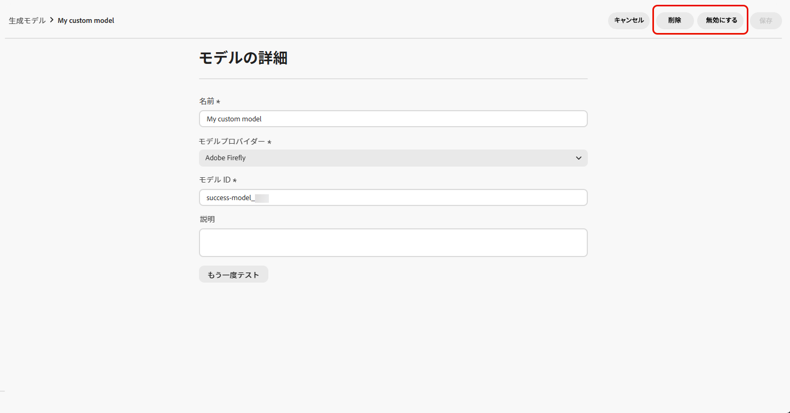
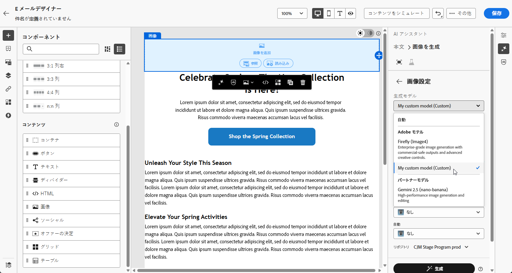

# 生成モデルの作成と管理 {#generative-models}

>[!CONTEXTUALHELP]
>id="acw_homepage_welcome_rn3"
>title="画像生成モデルの統合"
>abstract="標準およびカスタムの Firefly モデルと承認済みのサードパーティ画像モデルとのシームレスな統合によって、画像を生成する際の柔軟性、コントロール、ブランドの整合性を高めます。"
>additional-url="https://experienceleague.adobe.com/docs/campaign-web/v8/release-notes/release-notes.html?lang=ja" text="リリースノートを参照してください"

ビルトインモデル、カスタム Firefly モデル、サードパーティの画像生成プロバイダーなどを用いて AI 画像作成機能を拡張して、特定のニーズに対応し、ブランドの整合性を向上させることができます。

ニーズに適したモデルの選択：

- **[!UICONTROL Adobe モデル]**：Firefly Image Model 4を搭載。標準装備で、追加設定なしで即座に画像を生成できます。
- **[!UICONTROL パートナーモデル]**：Gemini 2.5 Flash を搭載。特定のユースケース向けに特別な機能を提供します。
- **[!UICONTROL カスタムモデル]**：自社のアセットでトレーニングされ、組織によって追加されたブランド固有のモデルです。

  **[!UICONTROL カスタムモデル]**&#x200B;の詳細については、[Adobe Firefly ドキュメント](https://helpx.adobe.com/jp/firefly/web/work-with-enterprise-features/train-custom-models/custom-models-overview.html)を参照してください

一度設定すれば、コンテンツに画像を作成する際に、任意の生成モデルを選択できます。[画像の生成に関する詳細情報](generative-image.md)。

## 生成モデルを管理

一か所で生成モデルを管理します。利用可能なモデルをすべて表示し、フィルタリングと検索で特定のモデルを見つけ、ブランドに合わせて設定できます。

1. **[!UICONTROL ブランド]**&#x200B;メニューから、「**[!UICONTROL 生成モデル]**」タブを選択します。

   {zoomable="yes"}

1.  アイコンをクリックして、フィルターメニューにアクセスします。**[!UICONTROL タイプ]**&#x200B;または&#x200B;**[!UICONTROL ステータス]**&#x200B;でモデルをフィルタリングします。

   {zoomable="yes"}

1. 検索バーを使用して、特定の生成モデルを名前で検索します。

1.  アイコンをクリックして詳細メニューにアクセスします。ここでは、モデルを有効または無効にしたり、削除したりできます。

   削除できるのは&#x200B;**[!UICONTROL カスタムモデル]**&#x200B;のみです。

   {zoomable="yes"}

1. クリックして、新しい生成モデルをゼロから作成するには、「**[!UICONTROL モデルを追加]**」をクリックします。

コンテンツで画像を作成する際に、任意の生成モデルを選択できるようになりました。[画像の生成に関する詳細情報](generative-image.md)。

## 生成モデルを追加

>[!IMPORTANT]
>
>カスタム Firefly モデルを作成するには、Firefly ETLA 契約が必要です。

カスタム Firefly モデルは、独自のアセットでトレーニングされたブランド固有のモデルで、ブランドアイデンティティ、スタイル、ビジュアルガイドラインに正確に一致する、ブランドに即したコンテンツの生成を可能にします。

カスタム Firefly モデルプロバイダーを作成することで、AI 機能をデフォルトモデル以上に高め、ブランド独自のデザインと要件を一貫して反映したコンテンツを生成できます。

➡️ [カスタムモデルのトレーニング方法を学ぶ](https://helpx.adobe.com/jp/firefly/web/work-with-enterprise-features/train-custom-models/train-firefly-custom-models.html)

1. **[!UICONTROL ブランド]**&#x200B;メニューから、「**[!UICONTROL 生成モデル]**」タブにアクセスし、「**[!UICONTROL モデルを追加]**」をクリックします。

   {zoomable="yes"}

1. モデルに「**[!UICONTROL 名前]**」を入力します。

1. 「**[!UICONTROL モデル ID]**」を入力します。

   Firefly モデル IDを見つけるには、Firefly web サイトにアクセスし、トレーニング済みモデルに移動します。一意の ID は、公開後にモデルの管理セクションで使用できます。詳しくは、[Firefly カスタムモデルドキュメント](https://helpx.adobe.com/jp/firefly/web/work-with-enterprise-features/train-custom-models/manage-custom-models.html)を参照してください。

   {zoomable="yes"}

1. オプションで、モデルの特定に役立つよう「**[!UICONTROL 説明]**」を入力します。

1. 「**[!UICONTROL 接続をテスト]**」をクリックして、モデル設定を確認します。

1. 接続テストが成功したら、「**[!UICONTROL 保存]**」をクリックして、モデル設定を保存します。

   {zoomable="yes"}

1. 保存後、カスタムモデルがモデルリストに追加されます。いつでも無効化または削除できます。

   {zoomable="yes"}

<!--
1. Once the connection test is successful, choose whether to enable the model for selected brands.

1. Enable or disable the option to connect the model to all brands.

    If disabled, select which brands this model should be applied to.
-->

一度設定すれば、コンテンツで画像を作成する際に、任意のカスタム生成モデルを選択できます。[画像の生成に関する詳細情報](generative-image.md)。

{zoomable="yes"}
