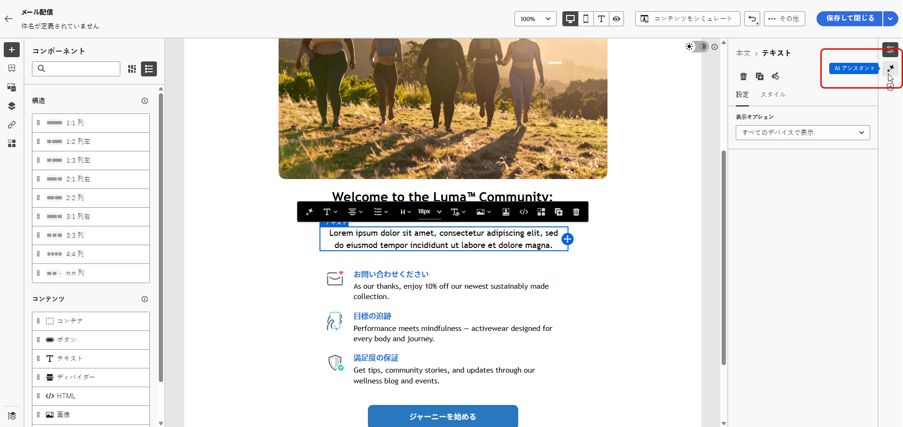
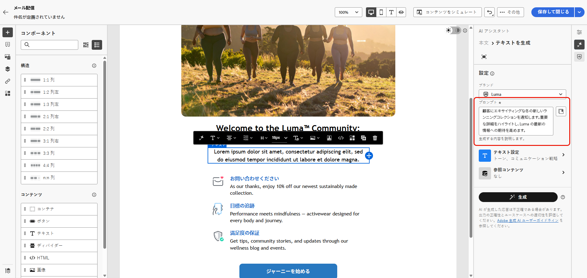
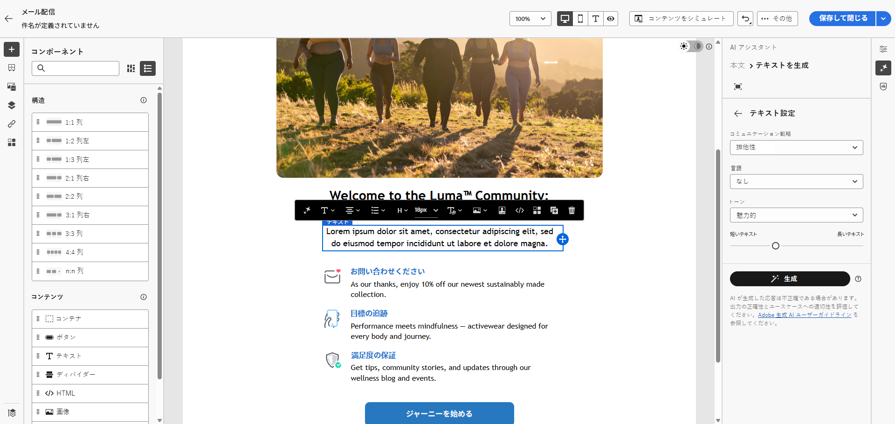
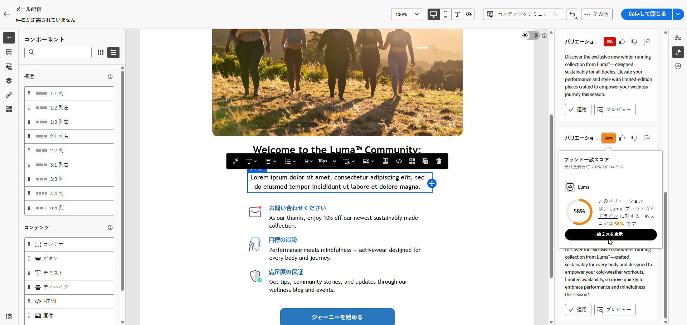
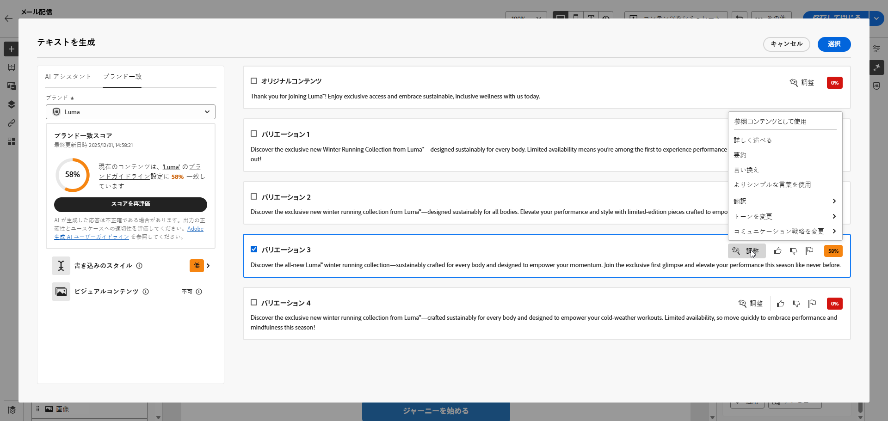
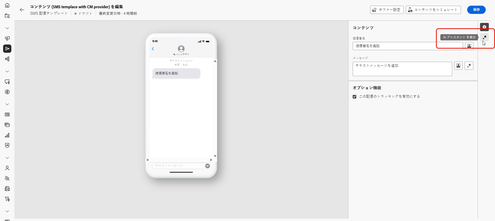
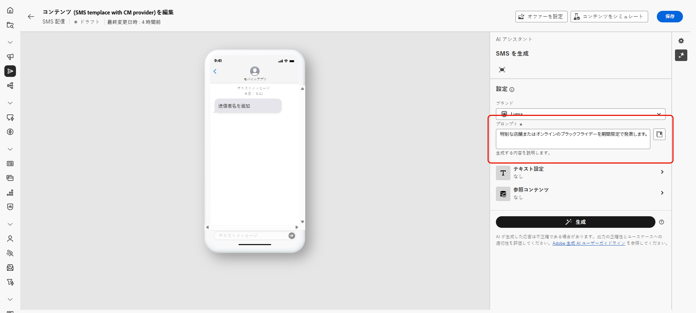
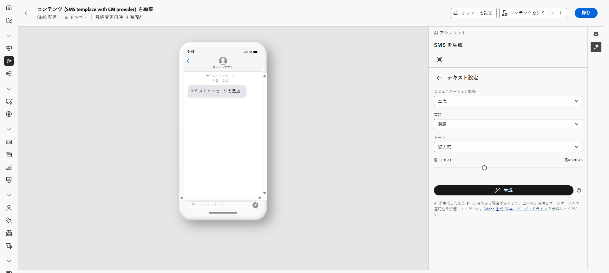
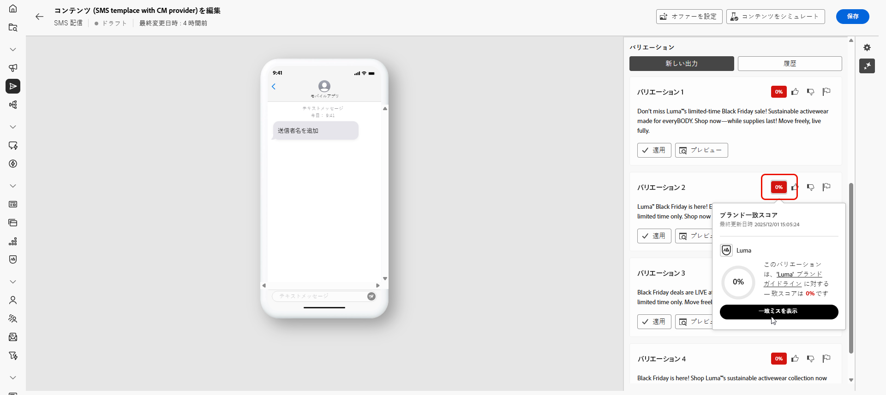
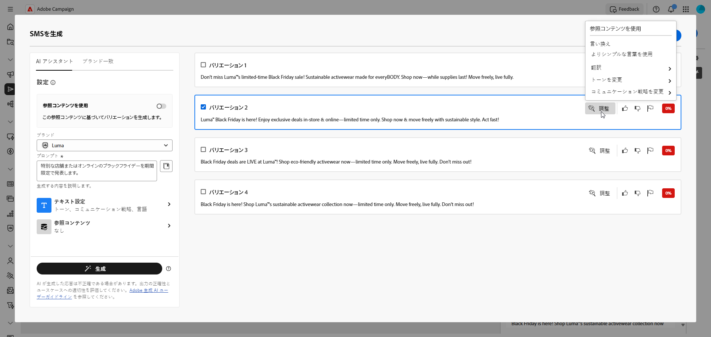

# AI アシスタントでテキストを生成 {#generative-text}

>[!IMPORTANT]
>
>この機能の使用を開始する前に、関連する[ガードレールと制限](generative-gs.md#generative-guardrails)を参照してください。
> 
>
>Adobe Campaign web の AI アシスタントを使用する前に、[ユーザー契約](https://www.adobe.com/jp/legal/licenses-terms/adobe-dx-gen-ai-user-guidelines.html){target="_blank"}に同意する必要があります。詳しくは、アドビ担当者にお問い合わせください。

Adobe Campaign Web で AI アシスタントを使用して、オーディエンスの共感を得られる魅力的なテキストを生成します。 メールのコピーを強化する場合でも、説得力のあるランディングページコンテンツを作成する場合でも、プッシュ通知メッセージを書く場合でも、SMS テキストを作成する場合でも、AI アシスタントを使用すると、明確でインパクトのあるコミュニケーションを提供できます。

## メールおよびランディングページの場合 {#email-web-channels}

AI アシスタントは、E メール配信およびランディングページ用に高品質のテキストコンテンツを生成できます。 この機能を使用すると、デジタルタッチポイントをまたいでオーディエンスと接続する、魅力的なオンブランドメッセージを作成できます。

### アクセスと設定 {#access-configure}

AI アシスタントでテキストコンテンツの生成を開始する前に、配信を設定し、コンテンツエディターにアクセスする必要があります。 次の手順に従ってワークスペースを準備し、AI アシスタント パネルを開きます。

1. 配信を作成して設定します。

   * **メール**：メール配信を作成して設定したら、「**[!UICONTROL コンテンツを編集]**」をクリックします。 [詳細情報](../email/create-email-content.md)
   * **ランディングページ**：ランディングページを作成して設定したら、**[!UICONTROL コンテンツを編集]** をクリックします。 [詳細情報](../landing-pages/create-lp.md)

1. 「**[!UICONTROL テキストコンポーネント]**」を選択して特定のコンテンツをターゲットにし、**[!UICONTROL AI アシスタント]**&#x200B;メニューにアクセスします。

   {zoomable="yes"}

### コンテンツを生成 {#generate-content}

AI アシスタントを使用して明確なプロンプトを作成し、設定を微調整し、カスタマイズされたテキストを生成して、メッセージがブランドやコミュニケーションの目標に沿っていることを確認する方法を説明します。

1. **[!UICONTROL ブランド]** を選択して、AI で生成されたコンテンツがブランドの仕様に従っていることを確認します。 ブランドの [&#x200B; 詳細情報 &#x200B;](brands.md)。

1. 「**[!UICONTROL プロンプト]**」フィールドに生成する内容を記述して、コンテンツを微調整します。

   プロンプトを作成する際に支援が必要な場合は、**[!UICONTROL プロンプトライブラリ]** にアクセスします。このライブラリは、配信を改善するための様々な迅速なアイデアを提供します。 [&#x200B; プロンプトのベストプラクティスの詳細情報 &#x200B;](ai-assistant-prompting-guide.md)

   {zoomable="yes"}

1. 「**[!UICONTROL テキスト設定]**」オプションを使用してプロンプトを調整します。

   * **[!UICONTROL コミュニケーション戦略]**：生成テキストに最適なコミュニケーションスタイルを選択します。
   * **[!UICONTROL 言語]**：生成されたコンテンツの言語を選択します。
   * **[!UICONTROL トーン]**：メールのトーンは、オーディエンスの共感を呼びます。情報の提供や遊び心、説得力のいずれを目指している場合であっても、AI アシスタントはメッセージを適切に調整します。
   * **テキストの長さ**：スライダーを使用して、テキストの目的の長さを選択します。

     {zoomable="yes"}

1. **[!UICONTROL 参照コンテンツ]** メニューで「**[!UICONTROL ファイルをアップロード]**」をクリックし、追加のコンテキスト AI アシスタントを提供できるコンテンツを含むブランドアセットを追加するか、以前にアップロードしたものを選択します。

   以前にアップロードしたファイルは、「**[!UICONTROL アップロードされた参照コンテンツ]** ドロップダウンで使用できます。 生成に含めるアセットを切り替えるのみです。

1. プロンプトの準備が整ったら、「**[!UICONTROL 生成]**」をクリックします。

### 絞り込みと最終処理 {#refine-finalize}

生成されたテキストを確認し、絞り込みを行い、パーソナライゼーションを適用してコンテンツを最終決定し、洗練された魅力的なメッセージを配信準備として作成する方法を説明します。

1. 生成された **[!UICONTROL バリエーション]** を参照します。

1. パーセンテージアイコンをクリックし、**[!UICONTROL ブランド整合性スコア]**&#x200B;を表示して、ブランドとの不整合を特定します。

   詳しくは、[ブランド整合性スコア](brands-score.md)を参照してください。

   {zoomable="yes"}

1. **[!UICONTROL プレビュー]** をクリックして選択したバリエーションの全画面表示バージョンを表示するか、**[!UICONTROL 適用]** をクリックして現在のコンテンツを置き換えます。

1. **[!UICONTROL プレビュー]**&#x200B;ウィンドウ内の「**[!UICONTROL 絞り込み]**」オプションに移動して、追加のカスタマイズ機能にアクセスします。

   * **[!UICONTROL 参照コンテンツとして使用]**：選択したバリアントは、他の結果を生成する参照コンテンツとして機能します。
   * **[!UICONTROL 詳しく述べる]**：特定のトピックを拡大し、理解とエンゲージメントを深められるよう、追加の詳細を提供します。
   * **[!UICONTROL 要約]**：重要なポイントを明確かつ簡潔な概要に要約し、注意を引いてさらに読むよう促します。
   * **[!UICONTROL 言い換え]**：メッセージを様々な方法で言い換え、ユーザーが作成した文章を新鮮で、多様なオーディエンスを惹きつけるメッセージにします。
   * **[!UICONTROL シンプルな言葉を使用]**：言語をわかりやすく簡素化し、幅広いオーディエンスがアクセスできるようにします。
   * **[!UICONTROL 翻訳]**：言語を簡素化して、より幅広いオーディエンスに対して明確さとアクセシビリティを確保します。

   また、テキストの&#x200B;**[!UICONTROL トーン]**&#x200B;と&#x200B;**[!UICONTROL コミュニケーション戦略]**&#x200B;を変更することもできます。

   {zoomable="yes"}

1. 「**[!UICONTROL ブランド整合性]**」タブを開き、コンテンツが[ブランドガイドライン](../content/brands.md)と整合している程度を確認します。

1. 適切なコンテンツが見つかったら、「**[!UICONTROL 選択]**」をクリックします。

1. パーソナライゼーションフィールドを挿入して、プロファイルデータに基づいてコンテンツをカスタマイズします。 次に「**[!UICONTROL コンテンツをシミュレート]**」ボタンをクリックしてレンダリングを制御し、テストプロファイルでパーソナライゼーション設定を確認します。[詳細情報](../preview-test/preview-content.md)

1. コンテンツをレビューしてアクティブ化します。
   * **メール**：コンテンツ、オーディエンス、スケジュールを定義したら、メール配信の準備を始めます。 [詳細情報](../monitor/prepare-send.md)
   * **ランディングページ**：ランディングページの準備が整ったら、ページを公開して、メッセージで使用できるようにします。 [詳細情報](../landing-pages/create-lp.md)

## モバイルチャネル用 {#mobile-channels}

AI アシスタントは、プッシュ通知や SMS メッセージに説得力のあるテキストコンテンツを生成し、すべてのモバイルタッチポイントでオーディエンスと接続する魅力的なモバイル通信を作成するのに役立ちます。

### アクセスと設定 {#mobile-access-configure}

モバイルチャネル用の AI アシスタントでテキストの生成を開始する前に、配信を設定して AI アシスタントにアクセスする必要があります。

1. モバイル配信を作成および設定します。
   * **プッシュ通知**：プッシュ通知配信を作成して設定したら、**[!UICONTROL コンテンツを編集]** をクリックします。 [詳細情報](../push/create-push.md)
   * **SMS**:SMS 配信を作成および設定したら、「**[!UICONTROL コンテンツを編集]**」をクリックします。 [詳細情報](../sms/create-sms.md)

1. 必要に応じてメッセージをパーソナライズします。
   * **プッシュ通知**:[&#x200B; 詳細情報 &#x200B;](../push/content-push.md)
   * **SMS**: [&#x200B; 詳細情報 &#x200B;](../sms/content-sms.md)

1. **[!UICONTROL AI アシスタントを表示]**&#x200B;メニューにアクセスします。

   {zoomable="yes"}

### コンテンツを生成 {#mobile-generate-content}

AI アシスタントにアクセスしたら、生成設定を設定して、ブランドと配信の目標に一致するモバイルコンテンツを作成できます。 テキストパラメーターをカスタマイズし、ブランドアセットを追加し、関連するバリエーションを生成する際に AI をガイドするプロンプトを提供します。

1. **[!UICONTROL ブランド]** を選択して、AI で生成されたコンテンツがブランドの仕様に従っていることを確認します。 ブランドの [&#x200B; 詳細情報 &#x200B;](brands.md)。

1. 「**[!UICONTROL プロンプト]**」フィールドに生成する内容を記述して、コンテンツを微調整します。

   プロンプトを作成する際に支援を必要とする場合は、**[!UICONTROL プロンプトライブラリ]** にアクセスします。このライブラリは、配信を改善するための様々な迅速なアイデアを提供します。 [&#x200B; プロンプトのベストプラクティスの詳細情報 &#x200B;](ai-assistant-prompting-guide.md)

   {zoomable="yes"}

1. **プッシュ通知の場合**、生成するテキストフィールドとして **[!UICONTROL タイトル]**、**[!UICONTROL サブタイトル]**、**[!UICONTROL メッセージ]** のいずれかを選択します。

1. 「**[!UICONTROL テキスト設定]**」オプションを使用してプロンプトを調整します。

   * **[!UICONTROL コミュニケーション戦略]**：生成テキストに最適なコミュニケーションスタイルを選択します。
   * **[!UICONTROL 言語]**：生成されたコンテンツの言語を選択します。
   * **[!UICONTROL トーン]**：トーンはオーディエンスの共感を得られるはずです。 情報を提供する、遊び心がある、説得力がある、のいずれを目指している場合であっても、AI アシスタントはメッセージを適切に調整できます。
   * **[!UICONTROL 長さ]**：範囲スライダーを使用して、コンテンツの長さを選択します。

     {zoomable="yes"}

1. **[!UICONTROL 参照コンテンツ]** メニューで「**[!UICONTROL ファイルをアップロード]**」をクリックし、追加のコンテキスト AI アシスタントを提供できるコンテンツを含むブランドアセットを追加するか、以前にアップロードしたものを選択します。

   以前にアップロードしたファイルは、「**[!UICONTROL アップロードされた参照コンテンツ]** ドロップダウンで使用できます。 生成に含めるアセットを切り替えるのみです。

1. プロンプトの準備が整ったら、「**[!UICONTROL 生成]**」をクリックします。

### 絞り込みと最終処理 {#mobile-refine-finalize}

モバイルメッセージ用にテキストバリエーションを生成したら、結果を微調整して、正確な要件を満たしていることを確認できます。 ブランドの整合性を確認し、トーンと言語を調整し、アクティブ化するコンテンツを準備します。

1. 生成後、**[!UICONTROL バリエーション]** を参照できます。

1. パーセンテージアイコンをクリックし、**[!UICONTROL ブランド整合性スコア]**&#x200B;を表示して、ブランドとの不整合を特定します。

   詳しくは、[ブランド整合性スコア](brands-score.md)を参照してください。

   {zoomable="yes"}

1. **[!UICONTROL プレビュー]** をクリックして選択したバリエーションの全画面表示バージョンを表示するか、**[!UICONTROL 適用]** をクリックして現在のコンテンツを置き換えます。

1. **[!UICONTROL プレビュー]**&#x200B;ウィンドウ内の「**[!UICONTROL 絞り込み]**」オプションに移動して、追加のカスタマイズ機能にアクセスします。

   * **[!UICONTROL 参照コンテンツとして使用]**：選択したバリアントは、他の結果を生成するための参照コンテンツとして機能します。

   * **[!UICONTROL フレーズ変更]**：メッセージの意味を保持したまま、メッセージを書き換えます。 このオプションを使用すると、コアメッセージを変更せずに代替表現を生成したり、フローを改善したり、言葉遣いを調整したりできます。

   * **[!UICONTROL よりシンプルな言葉を使用]**：AI アシスタントを活用して言語をわかりやすく簡素化し、幅広いオーディエンスがアクセスできるようにします。

   * **[!UICONTROL 翻訳]**：言語を簡素化して、より幅広いオーディエンスに対して明確さとアクセシビリティを確保します。

   * **[!UICONTROL トーンを変更]**：メッセージのトーンを調整して、よりフレンドリーでプロフェッショナル、緊急、または感動的なコミュニケーションスタイルに合わせます。

   * **[!UICONTROL コミュニケーション戦略の変更]**：緊急性の創出や魅力的なアピールの強調など、目的に応じてメッセージングアプローチを変更します。

     {zoomable="yes"}

1. 「**[!UICONTROL ブランド整合性]**」タブを開き、コンテンツが[ブランドガイドライン](brands.md)と整合している程度を確認します。

1. 適切なコンテンツが見つかったら、「**[!UICONTROL 選択]**」をクリックします。

1. パーソナライゼーションフィールドを挿入して、プロファイルデータに基づいてコンテンツをカスタマイズします。 次に「**[!UICONTROL コンテンツをシミュレート]**」ボタンをクリックしてレンダリングを制御し、テストプロファイルでパーソナライゼーション設定を確認します。[詳細情報](../personalization/personalize.md)

1. コンテンツをレビューしてアクティブ化します。
   * **プッシュ通知**：コンテンツ、オーディエンスおよびスケジュールを定義したら、プッシュ通知配信の準備を始めます。 [詳細情報](../push/send-push.md)
   * **SMS**:SMS の準備が整ったら、SMS を公開して、メッセージで使用できるようにします。 [詳細情報](../sms/send-sms.md)
