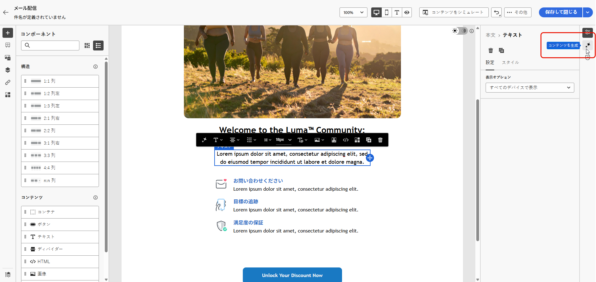
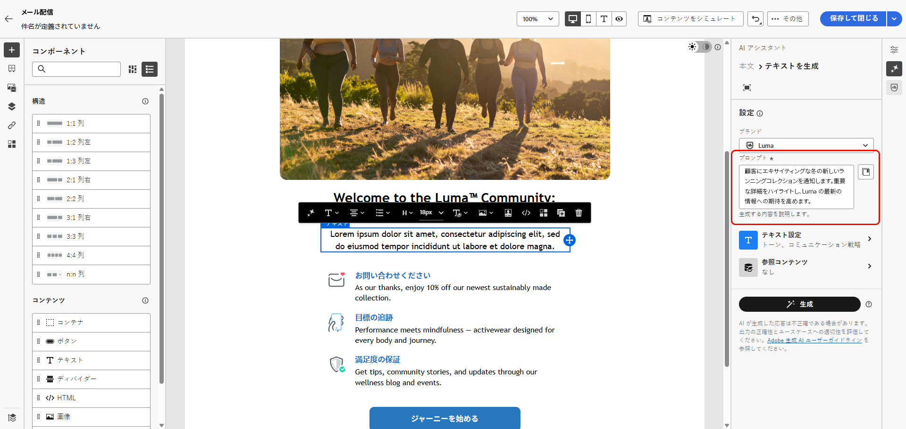
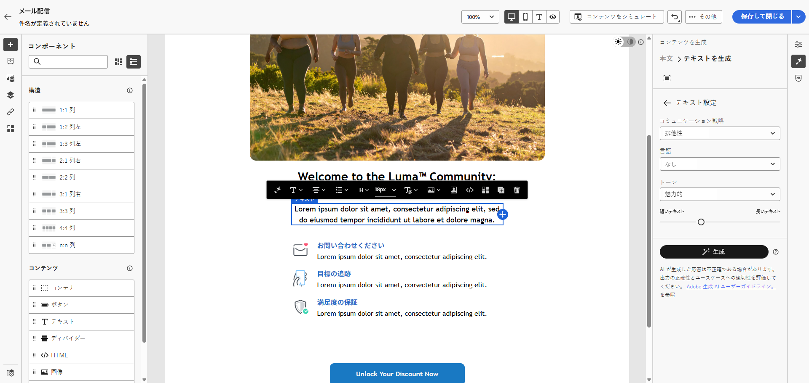
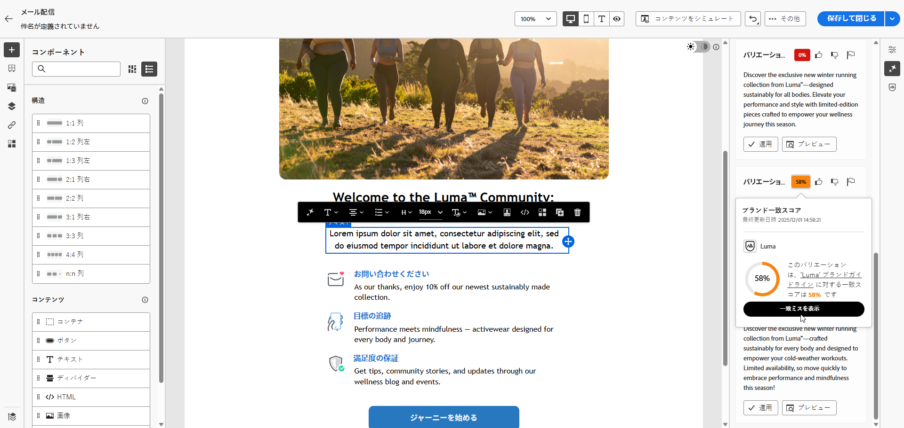
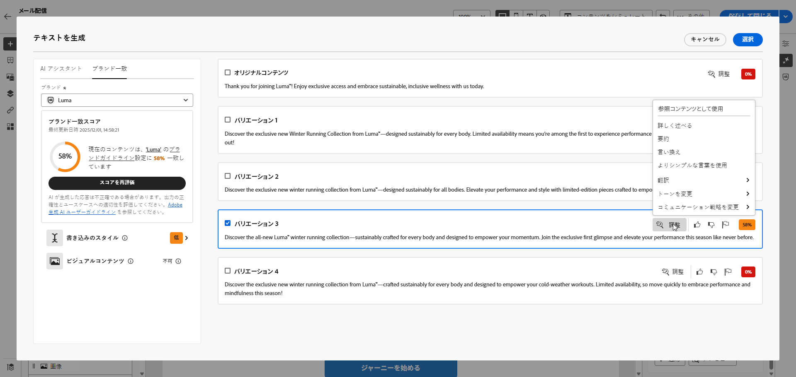
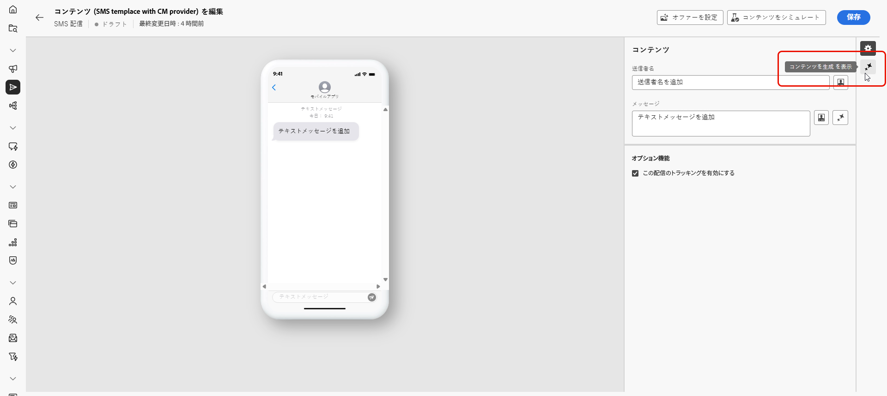
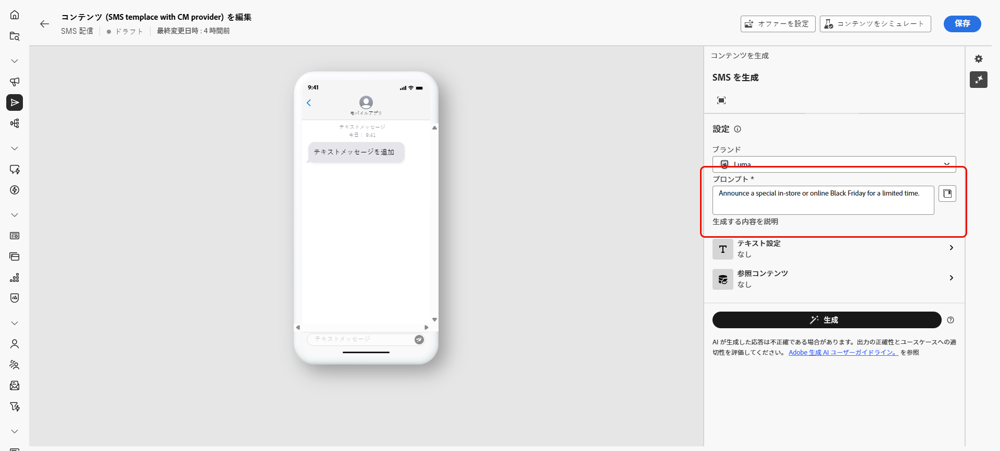
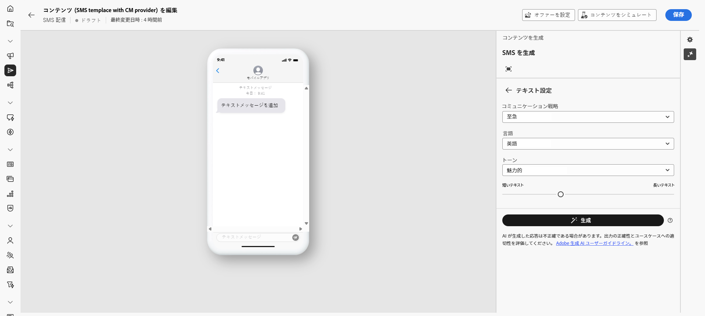
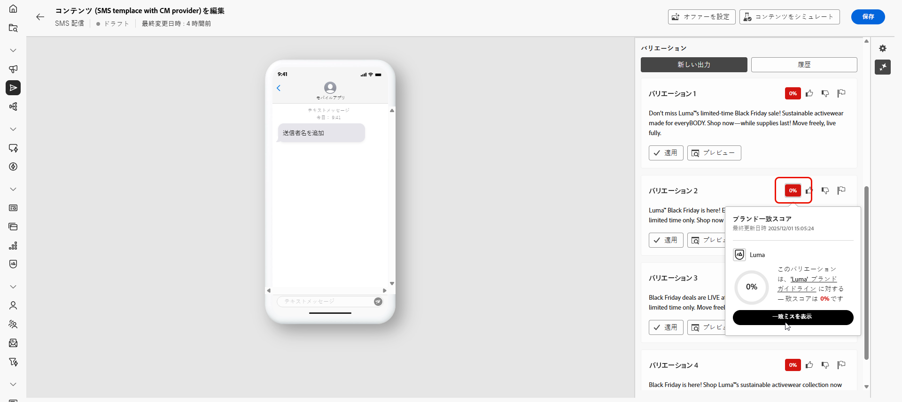
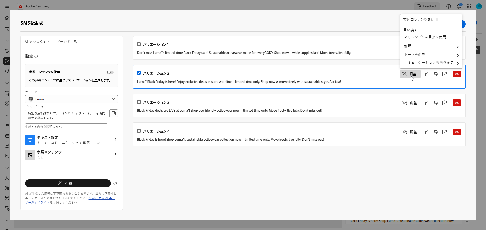

# テキストを生成 {#generative-text}

>[!IMPORTANT]
>
>この機能の使用を開始する前に、関連する[ガードレールと制限](generative-gs.md#generative-guardrails)を参照してください。
> 
>
>AIを使用してAdobe Campaign Webでコンテンツを生成する前に、[&#x200B; ユーザー契約書](https://www.adobe.com/jp/legal/licenses-terms/adobe-dx-gen-ai-user-guidelines.html){target="_blank"}に同意する必要があります。 詳しくは、アドビ担当者にお問い合わせください。

Adobe Campaign WebでAIを利用して、オーディエンスの心に響く魅力的なテキストを生成できます。 AIは、メールのコピー強化、説得力のあるランディングページコンテンツの作成、プッシュ通知メッセージの作成、SMS テキストの作成など、明確でインパクトのあるコミュニケーションの提供に役立ちます。

## メールとランディングページの場合 {#email-web-channels}

AIを活用して、メール配信とランディングページ用の高品質なテキストコンテンツを生成します。 この機能により、デジタルタッチポイントをまたいでオーディエンスとつながる、魅力的でブランドに即したメッセージを作成できます。

### アクセスと設定 {#access-configure}

AIを活用してテキストコンテンツの生成を開始する前に、配信を設定し、コンテンツエディターにアクセスする必要があります。 ワークスペースを準備し、コンテンツを生成パネルを開くには、次の手順に従います。

1. 配信を作成および設定します。

   * **メール**：メール配信を作成および設定したら、「**[!UICONTROL コンテンツを編集]**」をクリックします。 [詳細情報](../email/create-email-content.md)
   * **ランディングページ**：ランディングページを作成および設定したら、「**[!UICONTROL コンテンツを編集]**」をクリックします。 [詳細情報](../landing-pages/create-lp.md)

1. 特定のコンテンツをターゲットにする&#x200B;**[!UICONTROL テキストコンポーネント]**&#x200B;を選択し、**[!UICONTROL コンテンツを生成]** メニューにアクセスします。

   {zoomable="yes"}

### テキストを生成 {#generate-content}

明確なプロンプトの作成、設定の微調整、AIを使用したカスタマイズされたテキストの生成を通じて、メッセージがブランド目標やコミュニケーション目標に即していることを確認する方法を説明します。

1. **[!UICONTROL ブランド]**&#x200B;を選択して、AI で生成されたコンテンツがブランドの仕様に一致していることを確認します。 ブランドについて詳しくは、[こちら](brands.md)を参照してください。

1. 「**[!UICONTROL プロンプト]**」フィールドに生成する内容を記述して、コンテンツを微調整します。

   プロンプトの作成に関するサポートが必要な場合は、配信を改善するための様々なプロンプトのアイデアを提供する&#x200B;**[!UICONTROL プロンプトライブラリ]**&#x200B;にアクセスします。 [プロンプトのベストプラクティスの詳細情報](ai-assistant-prompting-guide.md)

   {zoomable="yes"}

1. 「**[!UICONTROL テキスト設定]**」オプションを使用してプロンプトを調整します。

   * **[!UICONTROL コミュニケーション戦略]**：生成テキストに最適なコミュニケーションスタイルを選択します。
   * **[!UICONTROL 言語]**：生成されたコンテンツの言語を選択します。
   * **[!UICONTROL トーン]**：メールのトーンは、オーディエンスの共感を呼びます。 有益な情報、遊び心、説得力など、AIはメッセージを適切に適応させます。
   * **テキストの長さ**：スライダーを使用して、テキストの目的の長さを選択します。

     {zoomable="yes"}

1. **[!UICONTROL コンテンツを参照]** メニューから、**[!UICONTROL ファイルをアップロード]**&#x200B;をクリックして、追加のコンテキスト AIを提供したり、以前にアップロードしたコンテンツを選択したりできるコンテンツを含むブランドアセットを追加します。

   以前にアップロードしたファイルは、**[!UICONTROL アップロードされた参照コンテンツ]**&#x200B;ドロップダウンで使用できます。 生成に含めるアセットを切り替えるのみです。

1. プロンプトの準備が整ったら、「**[!UICONTROL 生成]**」をクリックします。

### 絞り込みと最終処理 {#refine-finalize}

生成されたテキストを確認し、絞り込みを行い、パーソナライゼーションを適用してコンテンツを最終処理し、配信の準備が整った、洗練された魅力的なメッセージを作成する方法について説明します。

1. 生成された&#x200B;**[!UICONTROL バリエーション]**&#x200B;を参照します。

1. パーセンテージアイコンをクリックし、**[!UICONTROL ブランド整合性スコア]**&#x200B;を表示して、ブランドとの不整合を特定します。

   詳しくは、[ブランド整合性スコア](brands-score.md)を参照してください。

   {zoomable="yes"}

1. 選択したバリエーションの全画面バージョンを表示するには「**[!UICONTROL プレビュー]**」をクリックし、現在のコンテンツを置き換えるには「**[!UICONTROL 適用]**」をクリックします。

1. **[!UICONTROL プレビュー]**&#x200B;ウィンドウ内の「**[!UICONTROL 絞り込み]**」オプションに移動して、追加のカスタマイズ機能にアクセスします。

   * **[!UICONTROL 参照コンテンツとして使用]**：選択したバリアントは、他の結果を生成する参照コンテンツとして機能します。
   * **[!UICONTROL 詳しく述べる]**：特定のトピックを拡大し、理解とエンゲージメントを深められるよう、追加の詳細を提供します。
   * **[!UICONTROL 要約]**：重要なポイントを明確かつ簡潔な概要に要約し、注意を引いてさらに読むよう促します。
   * **[!UICONTROL 言い換え]**：メッセージを様々な方法で言い換え、ユーザーが作成した文章を新鮮で、多様なオーディエンスを惹きつけるメッセージにします。
   * **[!UICONTROL シンプルな言葉を使用]**：言語をわかりやすく簡素化し、幅広いオーディエンスがアクセスできるようにします。
   * **[!UICONTROL 翻訳]**：言語をわかりやすく簡素化し、幅広いオーディエンスがアクセスできるようにします。

   また、テキストの&#x200B;**[!UICONTROL トーン]**&#x200B;と&#x200B;**[!UICONTROL コミュニケーション戦略]**&#x200B;を変更することもできます。

   {zoomable="yes"}

1. 「**[!UICONTROL ブランド整合性]**」タブを開き、コンテンツが[ブランドガイドライン](../content/brands.md)と整合している程度を確認します。

1. 適切なコンテンツが見つかったら、「**[!UICONTROL 選択]**」をクリックします。

1. パーソナライゼーションフィールドを挿入し、プロファイルデータに基づいてコンテンツをカスタマイズします。 次に「**[!UICONTROL コンテンツをシミュレート]**」ボタンをクリックしてレンダリングを制御し、テストプロファイルでパーソナライゼーション設定を確認します。 [詳細情報](../preview-test/preview-content.md)

1. コンテンツを確認およびアクティブ化します。
   * **メール**：コンテンツ、オーディエンスおよびスケジュールを定義したら、メール配信の準備が整います。 [詳細情報](../monitor/prepare-send.md)
   * **ランディングページ**：ランディングページの準備が整ったら、公開して、メッセージで使用できるようになります。 [詳細情報](../landing-pages/create-lp.md)

## モバイルチャネルの場合 {#mobile-channels}

AIを活用して、プッシュ通知やSMS メッセージ用の魅力的なテキストコンテンツを生成し、あらゆるモバイル接点をまたいでオーディエンスとつながる魅力的なモバイルコミュニケーションを作成できます。

### アクセスと設定 {#mobile-access-configure}

モバイルチャネル向けのAIでテキストを生成する前に、配信を設定し、「コンテンツを生成」にアクセスする必要があります。

1. モバイル配信を作成および設定します。
   * **プッシュ通知**：プッシュ通知配信を作成および設定したら、「**[!UICONTROL コンテンツを編集]**」をクリックします。 [詳細情報](../push/create-push.md)
   * **SMS**：SMS 配信を作成および設定したら、「**[!UICONTROL コンテンツを編集]**」をクリックします。 [詳細情報](../sms/create-sms.md)

1. 必要に応じて、メッセージをパーソナライズします。
   * **プッシュ通知**：[詳細情報](../push/content-push.md)
   * **SMS**：[詳細情報](../sms/content-sms.md)

1. **[!UICONTROL コンテンツ生成を表示]** メニューにアクセスします。

   {zoomable="yes"}

### テキストを生成 {#mobile-generate-content}

コンテンツを生成にアクセスしたら、ブランドと配信の目標に合ったモバイルコンテンツを作成するように生成設定を構成できます。 テキストパラメーターをカスタマイズし、ブランドアセットを追加し、関連するバリエーションの生成で AI をガイドするプロンプトを指定します。

1. **[!UICONTROL ブランド]**&#x200B;を選択して、AI で生成されたコンテンツがブランドの仕様に一致していることを確認します。 ブランドについて詳しくは、[こちら](brands.md)を参照してください。

1. 「**[!UICONTROL プロンプト]**」フィールドに生成する内容を記述して、コンテンツを微調整します。

   プロンプトの作成に関するサポートが必要な場合は、配信を改善する様々なプロンプトのアイデアを提供する&#x200B;**[!UICONTROL プロンプトライブラリ]**&#x200B;にアクセスします。 [プロンプトのベストプラクティスの詳細情報](ai-assistant-prompting-guide.md)

   {zoomable="yes"}

1. **プッシュ通知の場合**、生成するテキストフィールド（「**[!UICONTROL タイトル]**」、「**[!UICONTROL サブタイトル]**」、「**[!UICONTROL メッセージ]**」）を選択します。

1. 「**[!UICONTROL テキスト設定]**」オプションを使用してプロンプトを調整します。

   * **[!UICONTROL コミュニケーション戦略]**：生成テキストに最適なコミュニケーションスタイルを選択します。
   * **[!UICONTROL 言語]**：生成されたコンテンツの言語を選択します。
   * **[!UICONTROL トーン]**：トーンは、オーディエンスの共感を呼ぶ必要があります。 有益な情報、遊び心、説得力など、AIはメッセージを適切に適応させることができます。
   * **[!UICONTROL 長さ]**：範囲スライダーを使用して、コンテンツの長さを選択します。

     {zoomable="yes"}

1. **[!UICONTROL コンテンツを参照]** メニューから、**[!UICONTROL ファイルをアップロード]**&#x200B;をクリックして、追加のコンテキスト AIを提供したり、以前にアップロードしたコンテンツを選択したりできるコンテンツを含むブランドアセットを追加します。

   以前にアップロードしたファイルは、**[!UICONTROL アップロードされた参照コンテンツ]**&#x200B;ドロップダウンで使用できます。 生成に含めるアセットを切り替えるのみです。

1. プロンプトの準備が整ったら、「**[!UICONTROL 生成]**」をクリックします。

### 絞り込みと最終処理 {#mobile-refine-finalize}

モバイルメッセージのテキストバリエーションを生成したら、結果を微調整して、正確な要件を満たすことができます。 ブランド一致を確認し、トーンと言語を調整し、アクティブ化するコンテンツを準備します。

1. 生成後、**[!UICONTROL バリエーション]**&#x200B;を参照します。

1. パーセンテージアイコンをクリックし、**[!UICONTROL ブランド整合性スコア]**&#x200B;を表示して、ブランドとの不整合を特定します。

   詳しくは、[ブランド整合性スコア](brands-score.md)を参照してください。

   {zoomable="yes"}

1. 選択したバリエーションの全画面バージョンを表示するには「**[!UICONTROL プレビュー]**」をクリックし、現在のコンテンツを置き換えるには「**[!UICONTROL 適用]**」をクリックします。

1. **[!UICONTROL プレビュー]**&#x200B;ウィンドウ内の「**[!UICONTROL 絞り込み]**」オプションに移動して、追加のカスタマイズ機能にアクセスします。

   * **[!UICONTROL 参照コンテンツとして使用]**：選択したバリアントは、他の結果を生成するための参照コンテンツとして機能します。

   * **[!UICONTROL 言い換え]**： 意味を保持しながらメッセージを書き換えます。 このオプションを使用すると、コアメッセージを変更せずに、代替表現を生成したり、フローを改善したり、フレーズを調整したりできます。

   * **[!UICONTROL よりシンプルな言語を使用]**: AIを使用して言語を編集および調整し、より多くのユーザーに明確さとアクセシビリティを提供します。

   * **[!UICONTROL 翻訳]**：言語をわかりやすく簡素化し、幅広いオーディエンスがアクセスできるようにします。

   * **[!UICONTROL トーンを変更]**：メッセージのトーンを、より使いやすい、プロフェッショナル、緊急、インスピレーションなど、コミュニケーションスタイルに一致させて調整します。

   * **[!UICONTROL コミュニケーション戦略を変更]**：緊急性の創出や魅力的なアピールの強調など、目的に応じてメッセージングアプローチを変更します。

     {zoomable="yes"}

1. 「**[!UICONTROL ブランド整合性]**」タブを開き、コンテンツが[ブランドガイドライン](brands.md)と整合している程度を確認します。

1. 適切なコンテンツが見つかったら、「**[!UICONTROL 選択]**」をクリックします。

1. パーソナライゼーションフィールドを挿入し、プロファイルデータに基づいてコンテンツをカスタマイズします。 次に「**[!UICONTROL コンテンツをシミュレート]**」ボタンをクリックしてレンダリングを制御し、テストプロファイルでパーソナライゼーション設定を確認します。 [詳細情報](../personalization/personalize.md)

1. コンテンツを確認およびアクティブ化します。
   * **プッシュ通知**：コンテンツ、オーディエンスおよびスケジュールを定義したら、プッシュ通知配信の準備が整います。 [詳細情報](../push/send-push.md)
   * **SMS**：SMS の準備が整ったら、公開して、メッセージで使用できるようになります。 [詳細情報](../sms/send-sms.md)
