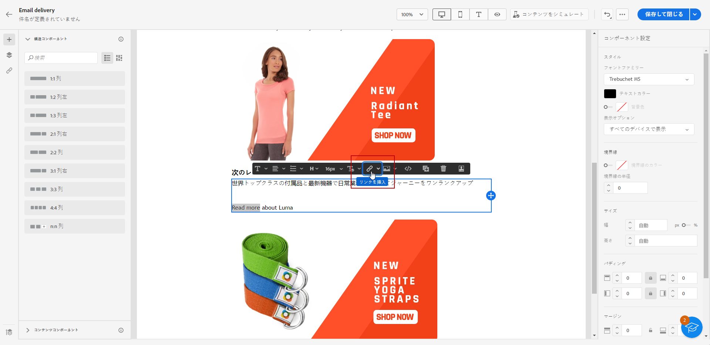
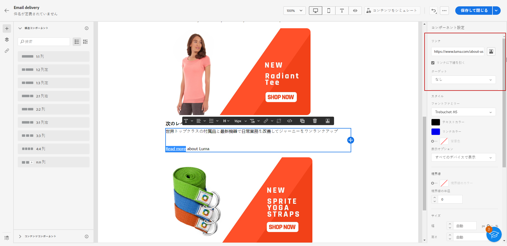
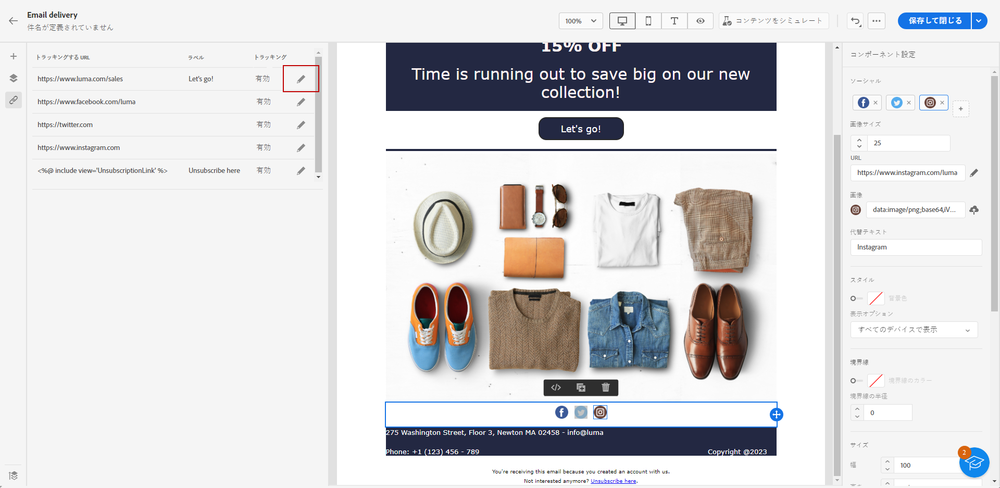
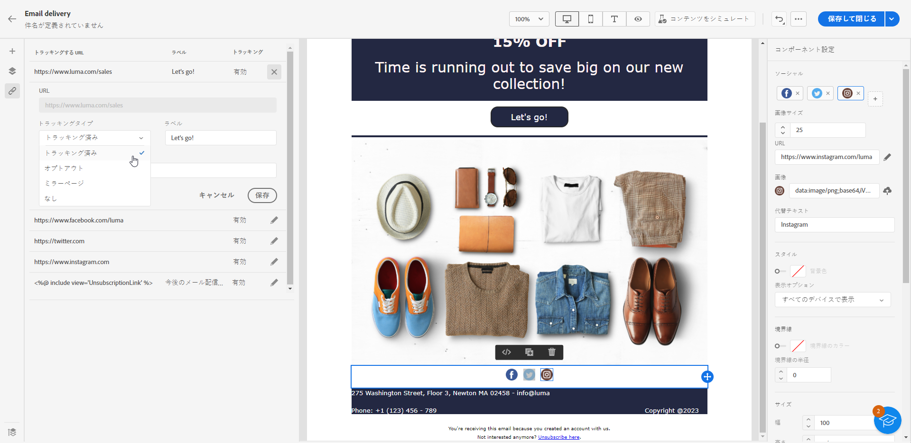
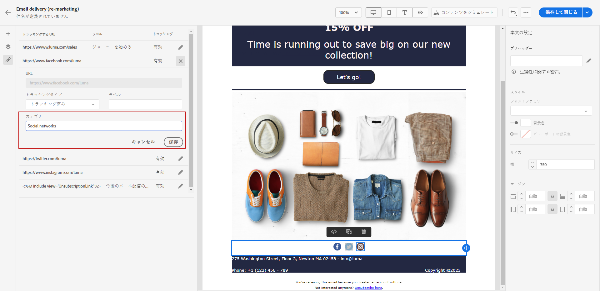

# リンクの追加とメッセージの追跡 {#tracking}

電子メールデザイナーを使用してコンテンツにリンクを追加し、受信者の行動を監視するために送信されたメッセージを追跡します。

## リンクを挿入 {#insert-links}

メッセージをデザインする際に、コンテンツにリンクを追加できます。

>[!NOTE]
>
>トラッキングが有効になっている場合、メッセージコンテンツに含まれるすべてのリンクが追跡されます。

メールコンテンツにリンクを挿入するには、次の手順に従います。

1. 要素を選択し、コンテキストツールバーから「**[!UICONTROL リンクを挿入]**」をクリックします。

   

1. **[!UICONTROL ラベル]**&#x200B;と&#x200B;**[!UICONTROL リンク]**&#x200B;を追加します。

1. 変更内容を保存します。

1. リンクを作成したら、右側の&#x200B;**[!UICONTROL コンポーネント設定]**&#x200B;パネルから変更できます。

   * リンクを編集して、**[!UICONTROL ターゲット]**&#x200B;を変更できます。
   * リンクに下線を引くかどうかは、対応するオプションをオンにすることで選択できます。

   

>[!NOTE]
>
>マーケティングタイプのメールメッセージには、オプトアウトリンクを含める必要があります。これはトランザクションメッセージには必要ありません。メッセージカテゴリ（**[!UICONTROL マーケティング]**&#x200B;または&#x200B;**[!UICONTROL トランザクション]**）はチャネルサーフェス（メッセージプリセット）レベルでメッセージの作成時に定義されます。

## ミラーページへのリンク {#mirror-page}

ミラーページは、web ブラウザーからオンラインアクセス可能な HTML ページです。コンテンツはメールの内容と同じです。

メールにミラー ページへのリンクを追加するには：

1. 要素を選択し、コンテキストツールバーから「**[!UICONTROL リンクを挿入]**」をクリックします。

   

1. 「**[!UICONTROL リンクを挿入]**」アイコンを選択して、パーソナライゼーションメニューにアクセスします。

   

1. **[!UICONTROL コンテンツブロック]**&#x200B;メニューから、「**[!UICONTROL ミラーページ URL]**」を選択し、「**[!UICONTROL 追加]**」をクリックします。

   

ミラーページが自動的に作成されます。

>[!IMPORTANT]
>
>ミラーページのリンクは自動生成され、編集できません。 これらには、元のメールのレンダリングに必要な、暗号化およびパーソナライズされたデータがすべて含まれています。その結果、値が大きいパーソナライズ属性を使用すると、長いミラーページの URL が生成される可能性があり、URL の長さが最大長の web ブラウザーでリンクが機能しなくなる可能性があります。

メールを送信すると、受信者がミラーページのリンクをクリックした際、メールのコンテンツがデフォルトの web ブラウザーに表示されます。

>[!NOTE]
>
>テストプロファイルに送信される配達確認では、ミラーページへのリンクはアクティブになっていません。最終的なメッセージでのみアクティブ化されます。

ミラーページの保持期間は 60 日です。その後、ミラーページは使用できなくなります。

## トラッキングの管理 {#manage-tracking}

[電子メールデザイナー](create-email-content.md)を使用すると、各リンクのトラッキングタイプを編集するなど、追跡する URL を管理できます。

1. 左側のパネルから 「**[!UICONTROL リンク]**」アイコンをクリックして、追跡するコンテンツのすべての URL のリストを表示します。

   このリストを使用すると、一元表示が可能になり、メールコンテンツ内の各 URL を特定できます。

1. リンクを編集するには、対応する鉛筆アイコンをクリックします。

   

1. 必要に応じて、**[!UICONTROL トラッキングタイプ]**&#x200B;を変更できます。

   

   追跡する URL ごとに、トラッキングモードを次のいずれかの値に設定できます。

   * **[!UICONTROL トラッキング対象]**：この URL のトラッキングをアクティブ化します。
   * **[!UICONTROL オプトアウト]**：この URL をオプトアウトまたは購読解除 URL とみなします。
   * **[!UICONTROL ミラーページ]**：この URL をミラーページの URL とみなします。
   * **[!UICONTROL なし]**：この URL のトラッキングをアクティブ化しません。<!--This information is saved: if the URL appears again in a future message, its tracking is automatically deactivated.-->

1. を追加します。 **[!UICONTROL カテゴリ]** をクリックし、 **[!UICONTROL 保存]**.

   

1. 配信を送信したら、配信レポートにアクセスします。 以下 **[!UICONTROL トラッキング]** メニュー、 **[!UICONTROL URL とクリックストリーム]** レポートには、配信で最も訪問回数の多い URL が表示されます。 [詳細情報](../reporting/reports.md)
