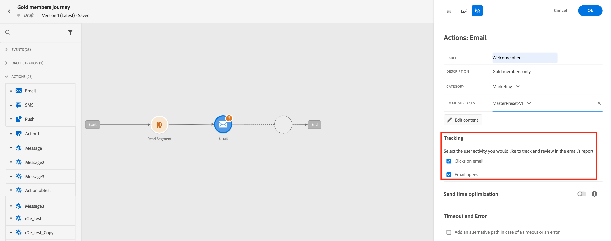

# リンクの追加とメッセージのトラッキング {#tracking}

>[!NOTE]
>
>このドキュメントは作成中で、頻繁に更新されています。 このコンテンツの最終バージョンは、2023 年 1 月に準備が整います。

用途 [!DNL Journey Optimizer] を使用して、コンテンツにリンクを追加し、送信されたメッセージをトラッキングして、受信者の行動を監視します。

## 追跡を有効にする {#enable-tracking}

E メールメッセージレベルでトラッキングを有効にするには、 **[!UICONTROL メール開封数]** および/または **[!UICONTROL メールをクリック]** オプションを使用します。

>[!NOTE]
>
>両方のオプションがデフォルトで有効になっています。

これにより、次の方法で受信者の行動を追跡できます。

* **[!UICONTROL メール開封数]**:開封されたメッセージ。
* **[!UICONTROL メールをクリック]**:E メール内のリンクのクリック数。

## リンクを挿入 {#insert-links}

メッセージをデザインする際に、コンテンツにリンクを追加できます。

>[!NOTE]
>
>条件 [トラッキングが有効になっています](#enable-tracking)を指定した場合、メッセージコンテンツに含まれるすべてのリンクが追跡されます。

E メールコンテンツにリンクを挿入するには、次の手順に従います。

1. 要素を選択し、 **[!UICONTROL リンクを挿入]** を選択します。

   

1. 作成するリンクのタイプを選択します。

   * **[!UICONTROL 外部リンク]**:外部 URL へのリンクを挿入します。

   * **[!UICONTROL ランディングページ]**:ランディングページへのリンクを挿入します。

   * **[!UICONTROL ワンクリックのオプトアウト]**:リンクを挿入すると、ユーザーはオプトアウトを確認する必要なく、通信を素早く登録解除できます。

   * **[!UICONTROL 外部のオプトイン/購読]**:ブランドからの受信コミュニケーションを受け入れるためのリンクを挿入します。

   * **[!UICONTROL 外部のオプトアウト/購読解除]**:ブランドからの通信の受信を停止するリンクを挿入します。

   * **[!UICONTROL ミラーページ]**:Web ブラウザーに E メールコンテンツを表示するためのリンクを挿入します。 詳しくは、[この節](#mirror-page)を参照してください。

   

1. リンクをパーソナライズできます。

1. 変更内容を保存します。

1. リンクを作成した後でも、 **[!UICONTROL コンポーネント設定]** 右側のパネル

   * リンクを編集してタイプを変更できます。
   * リンクに下線を引くかどうかは、対応するオプションを選択することで選択できます。

   

>[!NOTE]
>
>マーケティングタイプの電子メールメッセージには、オプトアウトリンクを含める必要があります。これは、トランザクションメッセージには必要ありません。 メッセージカテゴリ (**[!UICONTROL マーケティング]** または **[!UICONTROL トランザクション]**) は、チャネルサーフェス（つまり、メッセージプリセット）レベルで、かつメッセージの作成時に定義されます。

## ミラーページへのリンク {#mirror-page}

ミラーページは、web ブラウザーからオンラインアクセス可能な HTML ページです。コンテンツは E メールのコンテンツと同じです。

E メール内のミラーページにリンクを追加するには、以下を実行します。 [リンクを挿入](#insert-links) を選択し、 **[!UICONTROL ミラーページ]** をリンクのタイプとして設定します。

ミラーページが自動的に作成されます。

>[!IMPORTANT]
>
>ミラーページのリンクは自動生成され、編集できません。 元の E メールのレンダリングに必要な、暗号化されたパーソナライズされたデータがすべて含まれます。 その結果、値が大きいパーソナライズされた属性を使用すると、ミラーページの URL が長くなる可能性があり、URL の長さが最大の Web ブラウザーでリンクが機能しなくなる可能性があります。

E メールが送信されると、受信者がミラーページのリンクをクリックすると、E メールのコンテンツがデフォルトの Web ブラウザーに表示されます。

>[!NOTE]
>
>テストプロファイルに送信される配達確認で、ミラーページへのリンクがアクティブになっていません。 最後のメッセージでのみ有効化されます。

ミラーページの保持期間は 60 日です。 その後、ミラーページは使用できなくなります。

## トラッキングの管理 {#manage-tracking}

この [メールデザイナー](create-email-content.md) では、各リンクのトラッキングタイプの編集など、トラッキングされる URL を管理できます。

1. 次をクリック： **[!UICONTROL リンク]** アイコンを使用して、追跡するコンテンツのすべての URL のリストを表示します。

   このリストを使用すると、一元表示が可能になり、E メールコンテンツ内の各 URL を特定できます。

1. リンクを編集するには、対応する鉛筆アイコンをクリックします。

   

1. 次の項目を変更できます。 **[!UICONTROL トラッキングタイプ]** 必要に応じて、次の手順を実行します。

   

   トラッキングする URL ごとに、トラッキングモードを次のいずれかの値に設定できます。

   * **[!UICONTROL 追跡]**:この URL のトラッキングを有効化します。
   * **[!UICONTROL オプトアウト]**:この URL をオプトアウトまたは購読解除 URL と見なします。
   * **[!UICONTROL ミラーページ]**:この URL をミラーページの URL とみなします。
   * **[!UICONTROL なし]**:この URL のトラッキングを有効化しません。 <!--This information is saved: if the URL appears again in a future message, its tracking is automatically deactivated.-->

開封数とクリック数のレポートは、ライブレポートとグローバルレポートで使用できます。
