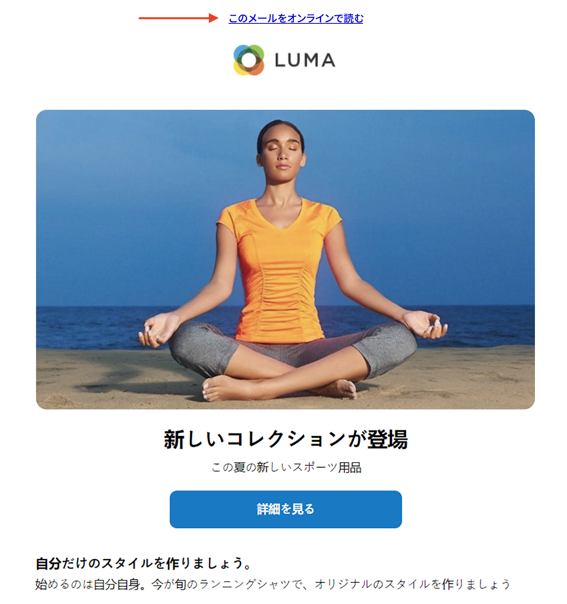
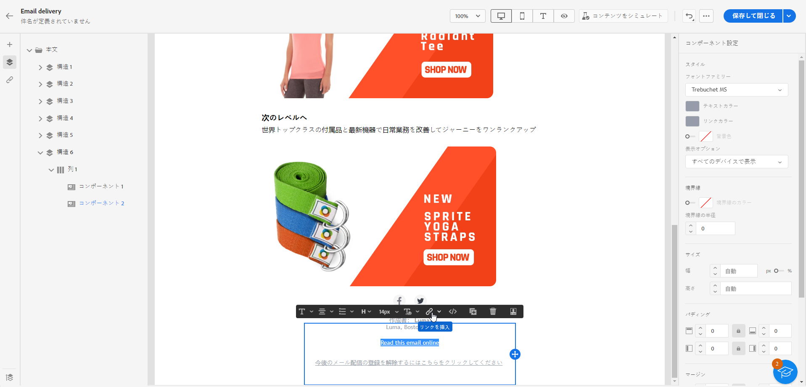
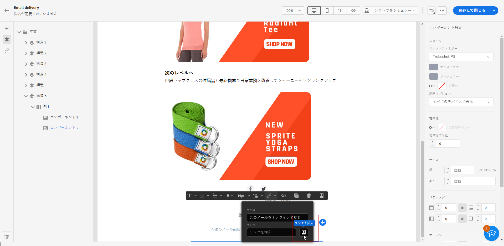
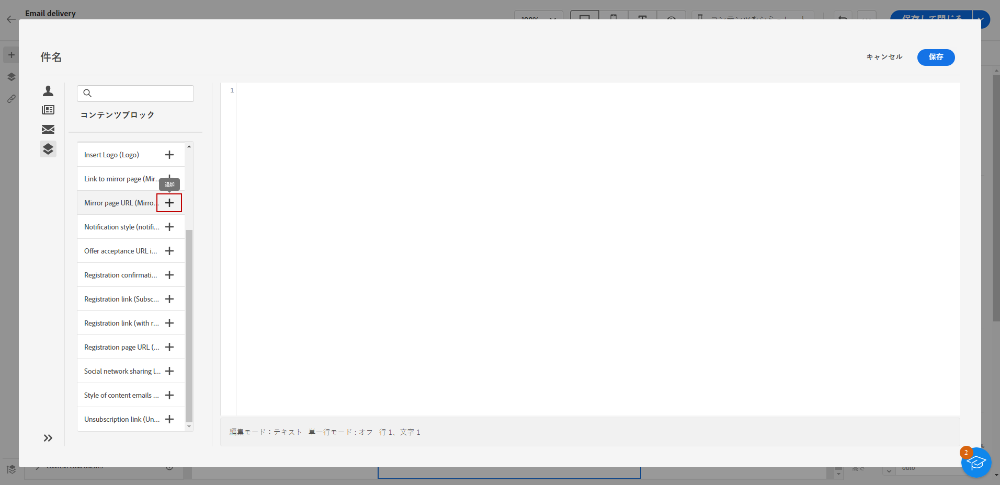

# ミラーページへのリンクを追加{#mirror-page}

## ミラーページについて{#about-mirror-page}

ミラーページは、E メールのオンラインバージョンです。

ほとんどの電子メールクライアントは問題なく画像をレンダリングしますが、一部のプリセットはセキュリティ上の理由から画像を表示できない場合があります。 ユーザーは、例えば、レンダリングの問題や壊れた画像が受信ボックスで表示されようとした場合に、E メールのミラーページを参照できます。 アクセシビリティ上の理由からオンラインバージョンを提供したり、ソーシャル共有を促進したりすることもお勧めします。

Adobe Campaignで生成されるミラーページには、すべてのパーソナライゼーションデータが含まれています。

{width="600" align="left"}

## ミラーページへのリンクを追加{#link-to-mirror-page}

ミラーページへのリンクを挿入することをお勧めします。 このリンクには、「このメールをブラウザーに表示」や「このオンラインを読む」などがあります。 多くの場合、電子メールのヘッダーまたはフッターに配置されています。

Adobe Campaignでは、専用の **パーソナライゼーションブロック**. 組み込み **ミラーページへのリンク** パーソナライゼーションブロックは、メールコンテンツに次のコードを挿入します。 `<%@ include view='MirrorPage' %>`.

メールにミラー ページへのリンクを追加するには：

1. 要素を選択し、コンテキストツールバーから「**[!UICONTROL リンクを挿入]**」をクリックします。

   

1. 「**[!UICONTROL リンクを挿入]**」アイコンを選択して、パーソナライゼーションメニューにアクセスします。

   

1. **[!UICONTROL コンテンツブロック]**&#x200B;メニューから、「**[!UICONTROL ミラーページ URL]**」を選択し、「**[!UICONTROL 追加]**」をクリックします。

   

   カスタムコンテンツブロックの挿入について詳しくは、 [この節](../personalization/personalize.md#personalize-emails).

ミラーページが自動的に作成されます。

>[!IMPORTANT]
>
>ミラーページのリンクは自動生成され、編集できません。 これらには、元のメールのレンダリングに必要な、暗号化およびパーソナライズされたデータがすべて含まれています。その結果、値が大きいパーソナライズ属性を使用すると、長いミラーページの URL が生成される可能性があり、URL の長さが最大長の web ブラウザーでリンクが機能しなくなる可能性があります。

メールを送信すると、受信者がミラーページのリンクをクリックした際、メールのコンテンツがデフォルトの web ブラウザーに表示されます。

>[!NOTE]
>
>テストプロファイルに送信されるテストメールでは、ミラーページへのリンクはアクティブになっていません。最終的なメッセージでのみアクティブ化されます。

デフォルトでは、ミラーページの保持期間は 60 日です。 その遅延の後は、ミラーページは使用できなくなります。

## ミラーページの生成{#mirror-page-generation}

E メールコンテンツが空でない場合、およびミラーページへのリンク（別名ミラーリンク）が含まれている場合、デフォルトでは、ミラーページはAdobe Campaignによって自動的に生成されます。

E メールミラーページの生成モードを制御できます。 オプションは配信プロパティで使用できます。 [詳細情報](../advanced-settings/delivery-settings.md#mirror)
