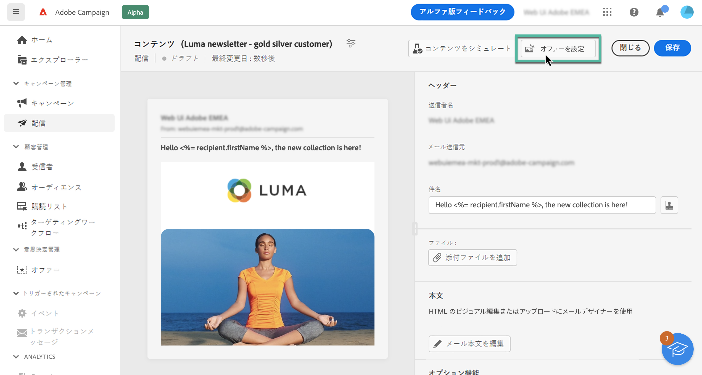
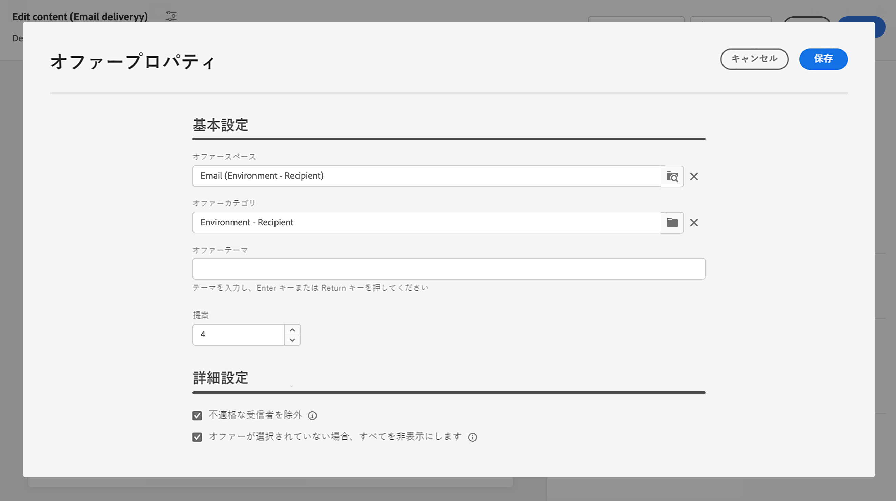
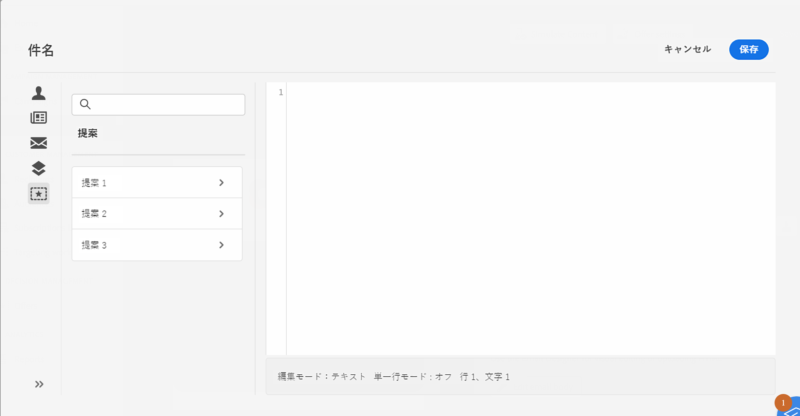
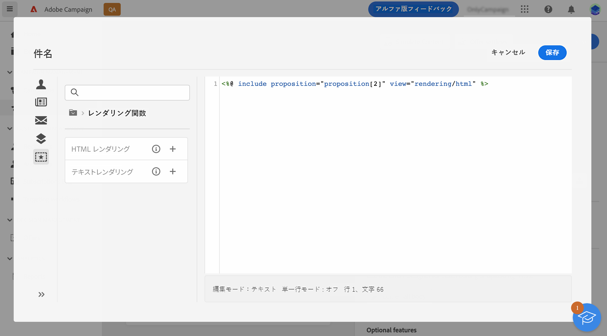

# オファーの送信 {#offers-content}

Adobe Campaign v8 Web では、**[!UICONTROL インタラクション]**&#x200B;モジュールを使用してコンソールで作成されたオファーを、メールで送信できます。インタラクションの詳細と、コンソールでオファーカタログを管理する方法については、[Campaign V8 のドキュメント](https://experienceleague.adobe.com/docs/campaign/campaign-v8/offers/interaction.html?lang=ja){target="_blank"}を参照してください。

メールでオファーを送信する手順は、次のとおりです。

1. [提案するオファーを設定します](#configure)。
1. [オファーをメールに挿入します](#insert)。

## 提案するオファーの設定 {#configure}

>[!CONTEXTUALHELP]
>id="acw_deliveries_email_offers_settings"
>title="オファー設定"
>abstract="受信者に提案するオファーを設定します。"

>[!CONTEXTUALHELP]
>id="acw_deliveries_email_offers_advanced_settings"
>title="オファーの詳細設定"
>abstract="オファーに関する詳細設定オプションの設定"

1. メールで提案するオファーを選択するには、メールコンテンツ編集画面で「**[!UICONTROL オファー]**」ボタンをクリックします。

   

1. 受信者に提案するオファーを設定します。まず、オファー環境に合致する&#x200B;**[!UICONTROL オファースペース]**&#x200B;を選択します。

   

1. エンジンのオファー選択を調整するには、オファーを並べ替える特定の&#x200B;**[!UICONTROL オファーカテゴリ]**&#x200B;を選択します。

   カテゴリが指定されてない場合、**[!UICONTROL オファーテーマ]**&#x200B;が選択されていない限り、環境に含まれているすべてのオファーがオファーエンジンで考慮されます。

   >[!NOTE]
   >
   >テーマは、カテゴリの上流で定義されたキーワードです。これらはフィルターとして機能し、一連のカテゴリで選択することにより、提示するオファーの数を調整することができます。

1. 「**[!UICONTROL 提案]**」フィールドを使用して、メールに挿入するオファーの数を指定します。

1. 必要に応じて、「**[!UICONTROL 不適格な受信者を除外]**」オプションを選択します。

   このオプションを使用すると、実施要件を満たすオファーがない受信者の除外を有効または無効にすることができます。

   * このオプションが有効になっている場合は、十分な提案が揃わない受信者が配信から除外されます。
   * このオプションが無効になっている場合、そのような受信者は、除外はされませんが、リクエストした数の提案を受け取ることはできません。

1. 必要に応じて、「**[!UICONTROL オファーが選択されていない場合はすべて非表示にする]**」オプションを選択します。

   このオプションを使用すると、提案のいずれかが存在しない場合にメッセージがどのように処理されるかを選択できます。

   * このオプションが有効になっている場合は、見つからない提案の表示域が表示されず、その提案に関するコンテンツはメッセージに表示されません。
   * このオプションが無効になっている場合は、メッセージそのものが送信中にキャンセルされ、受信者はメッセージを受信しなくなります。

メールに提案するオファーを設定したら、式エディターを使用してメールにオファーを挿入できます。詳しくは、[メールにオファーを挿入する方法](#insert)を参照してください。

## メールへのオファーの挿入 {#insert}

オファーは、式エディターを使用してメールに追加できます。次のいずれかに挿入できます。

* メールの件名
* メール本文（任意のコンテンツコンポーネントでパーソナライゼーションを許可する場合）詳しくは、[コンテンツコンポーネントの追加方法](content-components.md)を参照してください。

>[!NOTE]
>
>オファーを挿入する前に、[メールで提案するオファーを設定](#configure)したことを確認します。

式エディターを使用してオファーを挿入するには、次の手順に従います。

1. 式エディターを開き、**[!UICONTROL 提案]**&#x200B;メニューを選択します。

   使用可能な提案がリストに表示されます。提案の数は、提案するオファーを設定する際に定義されます。

   

1. 提案ごとに使用可能なパーソナライゼーションフィールド、レンダリング関数またはオファー属性を使用して、メールの件名または本文に提案を追加します。

   
