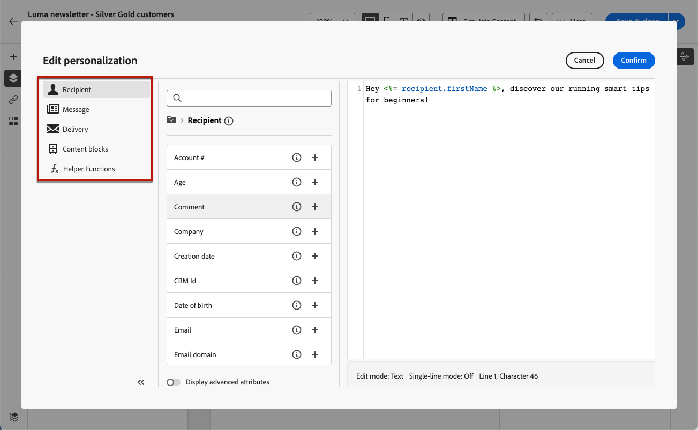

# メールへのプリヘッダーの追加 {#preheader}

>[!CONTEXTUALHELP]
>id="ac_edition_preheader"
>title="プリヘッダーの追加"
>abstract="プリヘッダーは、メールクライアントからメールを表示する際に件名の後に続く短い概要テキストです。多くの場合、メールの短い概要を提供し、通常は 1 文長です。"

プリヘッダーは、主要な E メールクライアントから E メールを表示する際に、件名の後に続く短いテキストです。

多くの場合、コンテンツの短い概要を提供し、通常は 1 文長です。

>[!NOTE]
>
>プリヘッダーは、すべてのメールクライアントでサポートされているわけではありません。サポートされていない場合、プリヘッダーは表示されません。

E メールのプリヘッダーを定義するには、次の手順に従います。

1. 次の [メールデザイナー](create-email-content.md)、少なくとも **[!UICONTROL 構造]** コンポーネントを使用して、e メールのデザインを開始します。

1. 左側のペインから&#x200B;**[!UICONTROL ナビゲーションツリー]**&#x200B;アイコンをクリックし、「**[!UICONTROL 本文]**」を選択します。

   

1. 次の **[!UICONTROL 設定]** 「 」タブで、プリヘッダー用のテキストを入力します。

1. さらにパーソナライズするには、 **[!UICONTROL パーソナライゼーションを追加]** アイコン **[!UICONTROL プリヘッダー]** フィールドに入力します。

   

1. 次の **[!UICONTROL パーソナライゼーションを編集]** ウィンドウで、 [パーソナライゼーションフィールド](../personalization/personalize.md), [コンテンツブロック](../personalization/content-blocks.md) および [条件付きコンテンツ](../personalization/conditions.md) 左側の専用エントリを使用して

   

1. 「**[!UICONTROL 確認]**」をクリックします。

これで、メールのプリヘッダーが設定されました。
