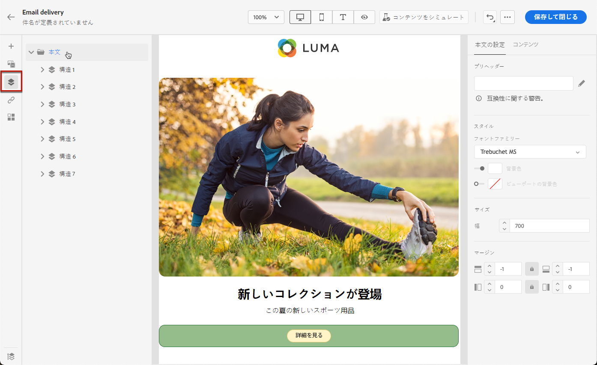
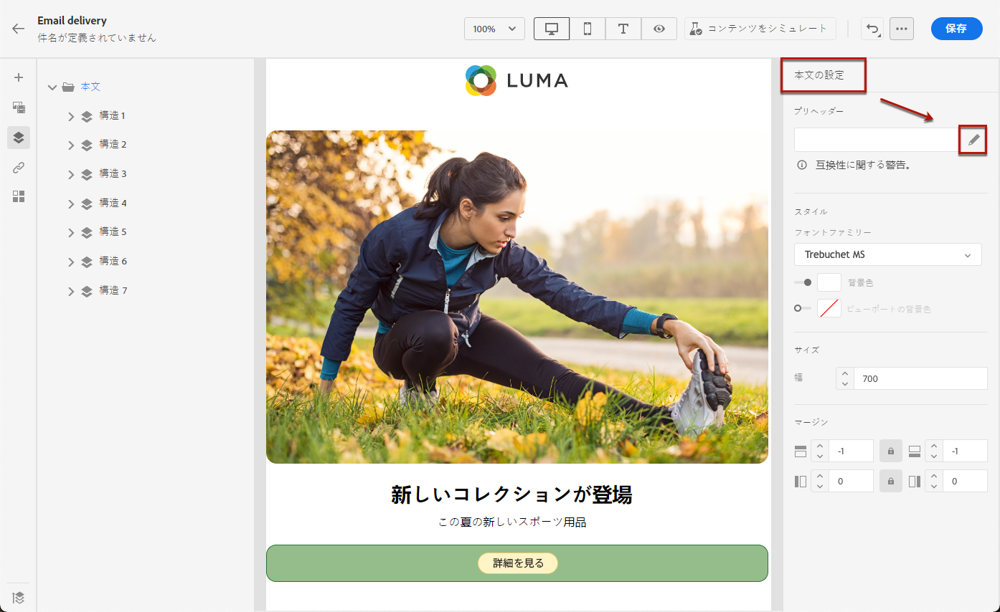
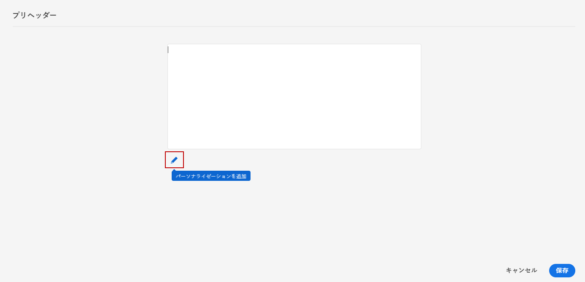

# プリヘッダーの追加 {#preheader}

>[!CONTEXTUALHELP]
>id="ac_edition_preheader"
>title="プリヘッダーの追加"
>abstract="プリヘッダーは、メールクライアントからメールを表示する際に件名の後に続く短い概要テキストです。多くの場合、メールの短い概要を提供し、通常は 1 文長です。"

プリヘッダーは、メールクライアントからメールを表示する際に件名の後に続く短い概要テキストです。

多くの場合、メールの短い概要を提供し、通常は 1 文長です。

>[!NOTE]
>
>プリヘッダーは、すべてのメールクライアントでサポートされているわけではありません。サポートされていない場合、プリヘッダーは表示されません。

メールのプリヘッダーを定義するには、次の手順に従います。

1. メールデザイナーから、少なくとも&#x200B;**[!UICONTROL 構造コンポーネント]**&#x200B;を追加して、メールのデザインを開始します。

1. 左側のペインから&#x200B;**[!UICONTROL ナビゲーションツリー]**&#x200B;アイコンをクリックし、「**[!UICONTROL 本文]**」を選択します。

   

1. **[!UICONTROL 本文の設定]**&#x200B;の右側のペインで、**[!UICONTROL プリヘッダー]**&#x200B;フィールドの隣の編集アイコンをクリックして、コンテンツを追加します。

   

1. プリヘッダーを追加します。 「**[!UICONTROL パーソナライゼーションを追加]**」アイコンをクリックして、さらにパーソナライズできます。

   

1. **[!UICONTROL パーソナライゼーションを編集]**&#x200B;ウィンドウで、**[!UICONTROL コンテンツブロック]**、**[!UICONTROL 動的コンテンツ]**&#x200B;または&#x200B;**[!UICONTROL パーソナライゼーションフィールド]**&#x200B;を追加できます。

1. 「**[!UICONTROL 検証]**」をクリックして、パーソナライゼーション構文を確認します。

1. 「**[!UICONTROL 保存]**」をクリックします。

これで、メールのプリヘッダーが設定されました。
