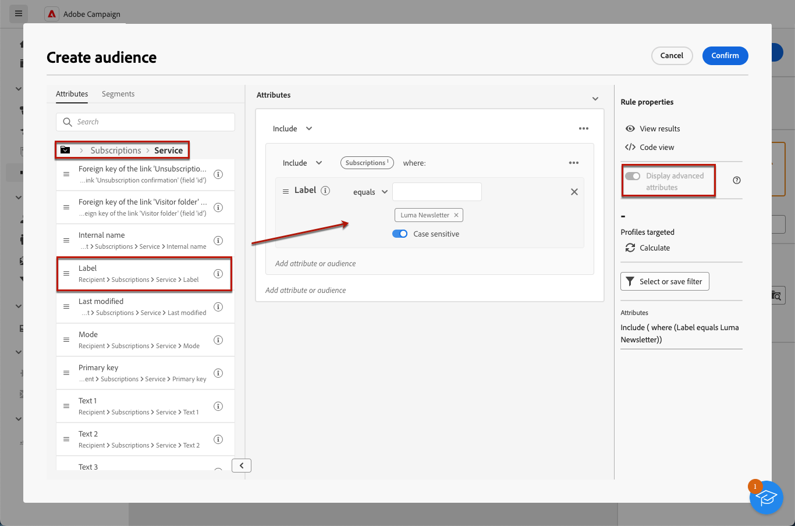

# サービスの購読者へのメッセージの送信

Adobe Campaignで購読サービスを作成し、購読者にメッセージを送信できます。 で購読サービスを作成する方法を説明します。 [このページ](../audience//manage-services.md#create-service).

購読者にメッセージを送信するには、購読者を識別する特定のオーディエンスを作成し、以下に説明する方法で配信を作成します。

1. オーディエンスの作成. のオーディエンスの詳細 [このページ](../audience/create-audience.md).

1. Adobe Analytics の **[!UICONTROL オーディエンスの構築]** アクティビティ、詳細属性の表示および選択 **[!UICONTROL 受信者]** > **[!UICONTROL 購読]** > **[!UICONTROL サービス]**.

   この例では、 **Luma ニュースレター** ラベル。

   

1. オーディエンスを保存します。
1. 配信を作成. 配信の作成手順について詳しくは、 [このページ](../msg/gs-messages.md#create-delivery).
1. 上で作成したオーディエンスを選択します。

   

1. メッセージコンテンツを作成し、配信をテストして送信します。詳しくは、 [この節](../preview-test/preview-test.md).

   

配信は、そのサービスの購読者にのみ送信されます。
