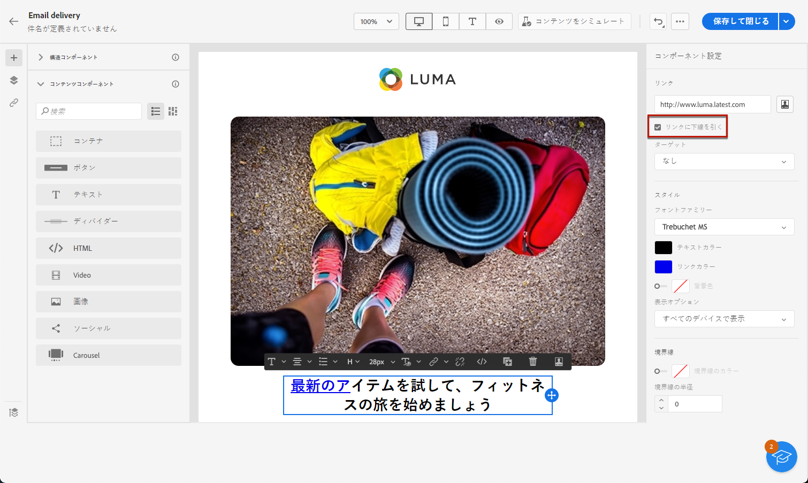
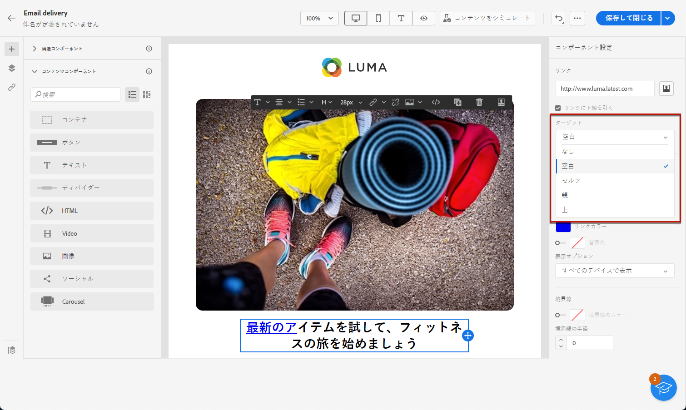
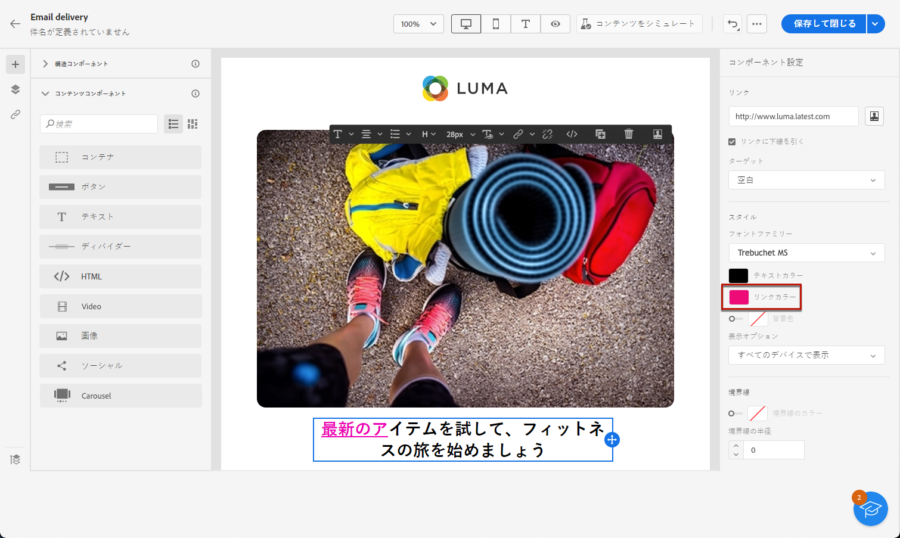

# リンクのスタイルの定義 {#styling-links}

メールデザイナーでは、リンクに下線を引き、その色とターゲットを選択できます。

1. リンクが挿入された&#x200B;**[!UICONTROL テキスト]**&#x200B;コンポーネントで、リンクを選択します。

1. **[!UICONTROL コンポーネント設定]**&#x200B;メニューで、**[!UICONTROL 下線リンク]**&#x200B;をチェックして、ラベルに下線を引きます。

   

1. 「**[!UICONTROL ターゲット]**」ドロップダウンで、オーディエンスのリダイレクト方法を選択します。

   * **[!UICONTROL なし]**：クリックされたのと同じフレームでリンクを開きます（デフォルト）。
   * **[!UICONTROL 空白]**：リンクを新しいウィンドウまたはタブで開きます。
   * **[!UICONTROL セルフ]**：クリックされたのと同じフレームでリンクを開きます。
   * **[!UICONTROL 親]**：親フレームでリンクを開きます。
   * **[!UICONTROL 上]**：ウィンドウの全体でリンクを開きます。

   

1. リンクの色を変更するには、右側のパネルで&#x200B;**[!UICONTROL リンクの色]**&#x200B;をクリックします。

   

1. 変更内容を保存します。
