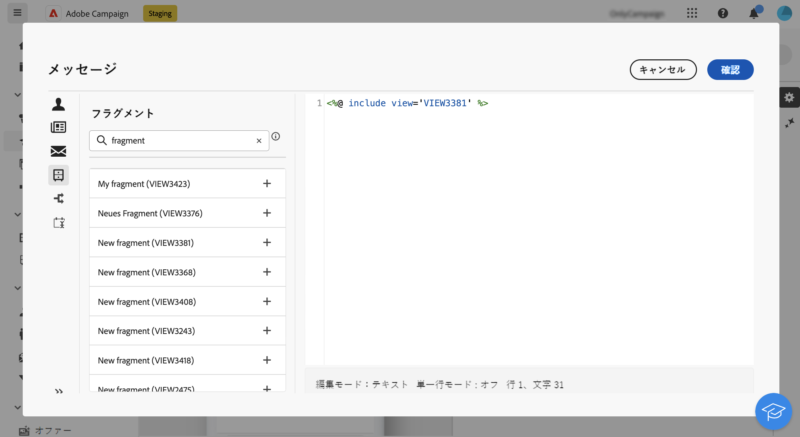

# 式エディターでの式フラグメントの追加 {#expression}

>[!CONTEXTUALHELP]
>id="acw_fragments_list"
>title="フラグメント"
>abstract="現在のサンドボックスで作成したすべての式フラグメントがこのリストに表示されます。フラグメントを使用するには、「+」ボタンをクリックしてフラグメント ID をエディターに追加します。"

<!-- pas vu dans l'UI-->

式フラグメントは、式エディターを使用して編集できる任意のフィールドで使用できます。コンテンツに式フラグメントを追加するには、次の手順に従います。

1. [式エディター](../personalization/gs-personalization.md)を開き、左側のパネルで&#x200B;**[!UICONTROL フラグメント]**&#x200B;メニューを選択します。

   リストには、現在のサンドボックスで作成したすべての式フラグメントが表示されます。

1. 式フラグメントの横にある「`+`」アイコンをクリックして、コンテンツに追加します。

   

1. フラグメント ID がエディターに追加されます。対応する式フラグメントを開き、インターフェイスから編集すると、変更内容が自動的に同期されます。これらは、そのフラグメント ID を含むすべての&#x200B;**[!UICONTROL ドラフト]**&#x200B;配信に生成されます。