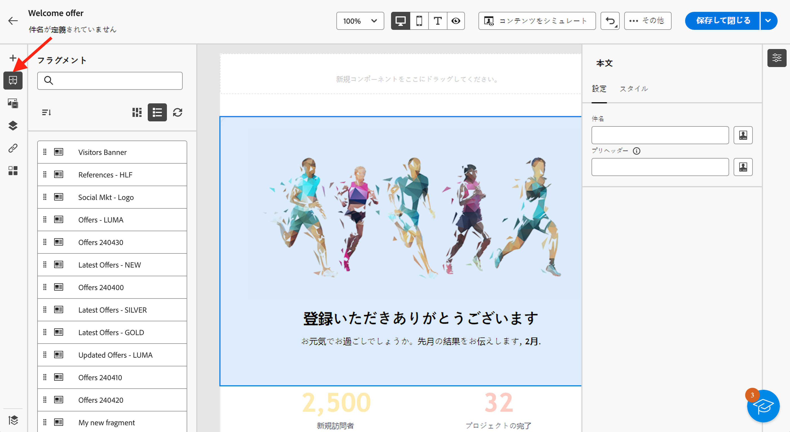
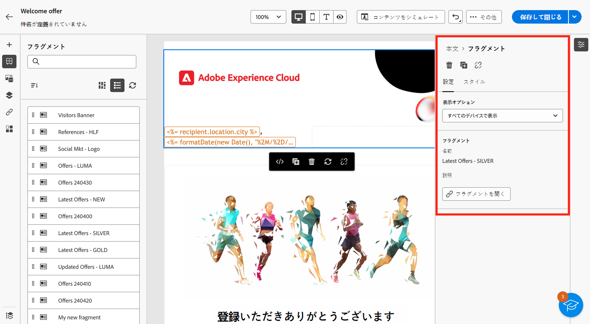
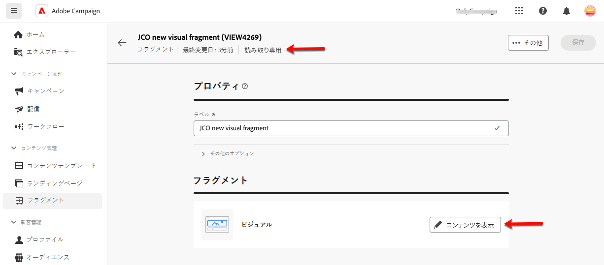
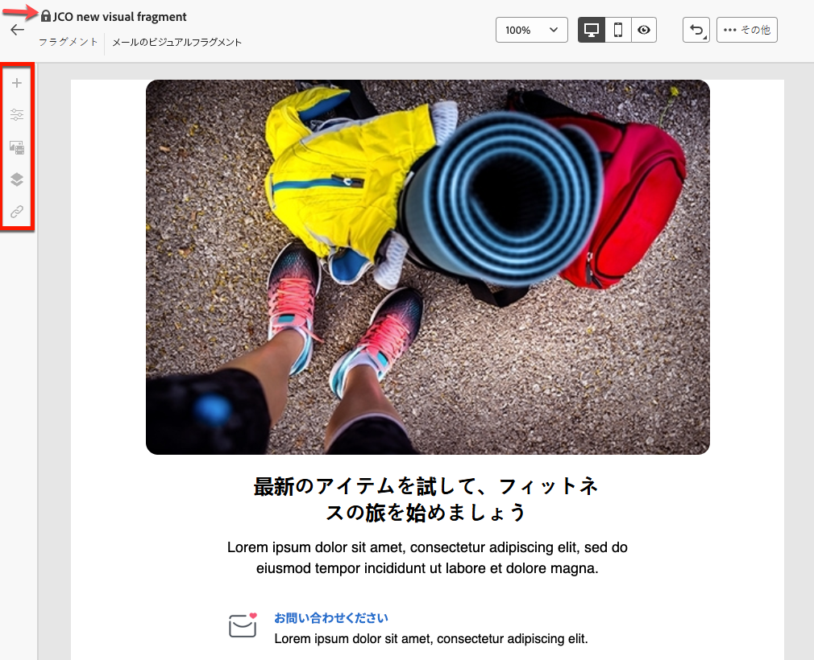
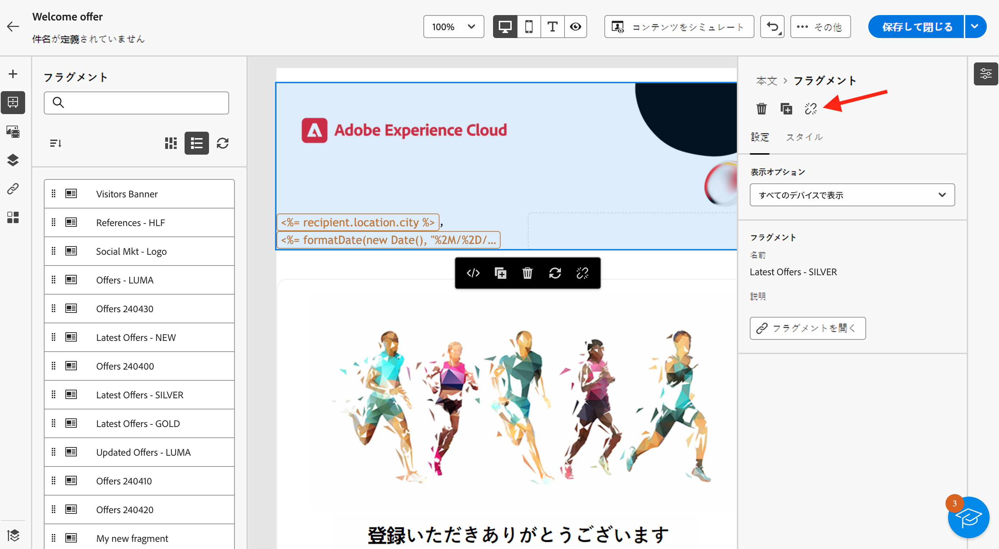

# メールへのビジュアルフラグメントの追加 {#use-visual-fragments}

>[!AVAILABILITY]
>
>この機能を使用するには、Campaign v8.6.4 への更新が必要です。詳しくは、[Campaign v8 クライアントコンソールリリースノート](https://experienceleague.adobe.com/ja/docs/campaign/campaign-v8/releases/release-notes)を参照してください。

Campaign web インターフェイスでは、**ビジュアルフラグメント**&#x200B;は、複数の[メール配信](../email/get-started-email-designer.md)や[コンテンツテンプレート](../email/use-email-templates.md)で再利用できる、定義済みのビジュアルブロックです。コンテンツフラグメントの作成と管理の方法について詳しくは、[この節](fragments.md)を参照してください。

## ビジュアルフラグメントの使用 {#use-fragment}

>[!CONTEXTUALHELP]
>id="acw_fragments_details"
>title="フラグメントオプション"
>abstract="このパネルには、選択したフラグメントに関連するオプションが表示されます。フラグメントを表示するデバイスを選択し、このフラグメントのコンテンツを開くことができます。「**[!UICONTROL スタイル]**」タブを使用すると、フラグメントをさらにカスタマイズできます。また、元のビジュアルフラグメントで継承を解除することもできます。"

<!-- pas vu dans l'UI-->

メールコンテンツにビジュアルフラグメントを挿入するには、次の手順に従います。

1. [E メールデザイナー](../email/get-started-email-designer.md)を使用して、メールまたはテンプレートのコンテンツを開きます。

1. 左側のパネルから&#x200B;**[!UICONTROL フラグメント]**&#x200B;アイコンを選択します。

   

1. 現在のサンドボックスで作成されたすべてのビジュアルフラグメントのリストが表示されます。以下を行うことができます。

   * ラベルの入力を開始して、特定のフラグメントを検索。
   * フラグメントを昇順または降順に並べ替え。
   * フラグメントの表示方法（カード表示またはリスト表示）を変更。

   >[!NOTE]
   >
   >フラグメントは作成日別に並べ替えられ、最近追加されたフラグメントがリストの最初に表示されます。

   コンテンツの編集中に一部のビジュアルフラグメントが変更または追加された場合は、**更新**&#x200B;アイコンをクリックして、最新の変更でリストを更新します。

1. リストからビジュアルフラグメントを挿入する領域にドラッグ＆ドロップします。他のコンポーネントと同様に、コンテンツ内でフラグメントを移動できます。

1. フラグメントを選択すると、右側のペインにオプションが表示されます。

   

   「**[!UICONTROL 設定]**」タブから、次の操作を実行できます。

   * フラグメントを表示するデバイスを選択します。
   * 「**コンテンツを編集**」ボタンをクリックして、このフラグメントのコンテンツを開きます。[詳細情報](../content/fragments.md#edit-fragments)

     「**[!UICONTROL スタイル]**」タブを使用して、フラグメントをさらにカスタマイズできます。

1. 必要に応じて、元のビジュアルフラグメントの継承を解除できます。[詳細情報](#break-inheritance)

   また、コンテンツからフラグメントを削除したり、複製したりすることもできます。これらのアクションは、フラグメントの上部に表示されるコンテキストメニューから直接実行できます。

1. 必要な数のビジュアルフラグメントを追加し、変更を&#x200B;**[!UICONTROL 保存]**&#x200B;します。

### 読み取り専用モードのビジュアルフラグメント {#fragment-readonly}

アクセス権はビジュアルフラグメントに適用される場合があります。

特定のビジュアルフラグメントに対する編集権限がない場合、コンテンツテンプレートは&#x200B;**読み取り専用モード**&#x200B;で表示されます。この場合、「**[!UICONTROL コンテンツを編集]**」ボタンは「**[!UICONTROL コンテンツを表示]**」ボタンに置き換えられ、変更を加えずにフラグメントを表示できます。

{zoomable="yes"}

以下に示すように、すべての機能アイコンが非アクティブ化され、インタラクションは表示のみに制限されます。

{zoomable="yes"}

## 継承を解除 {#break-inheritance}

ビジュアルフラグメントを編集すると、変更内容が同期されます。これらは、そのフラグメントを含むすべてのメール配信とコンテンツテンプレートに自動的に反映されます。

メールまたはコンテンツテンプレートに追加すると、フラグメントはデフォルトで同期されます。

ただし、元のフラグメントからの継承を解除することはできます。その場合、フラグメントのコンテンツは現在のデザインにコピーされ、変更内容は同期されなくなります。

継承を解除するには、次の手順に従います。

1. ビジュアルフラグメントを選択します。

1. コンテキストツールバーのロック解除アイコンをクリックします。

   

1. そのフラグメントは、元のフラグメントにリンクされないスタンドアロン要素になります。コンテンツ内の他のコンテンツコンポーネントと同様に編集します。[詳細情報](../email/content-components.md)
