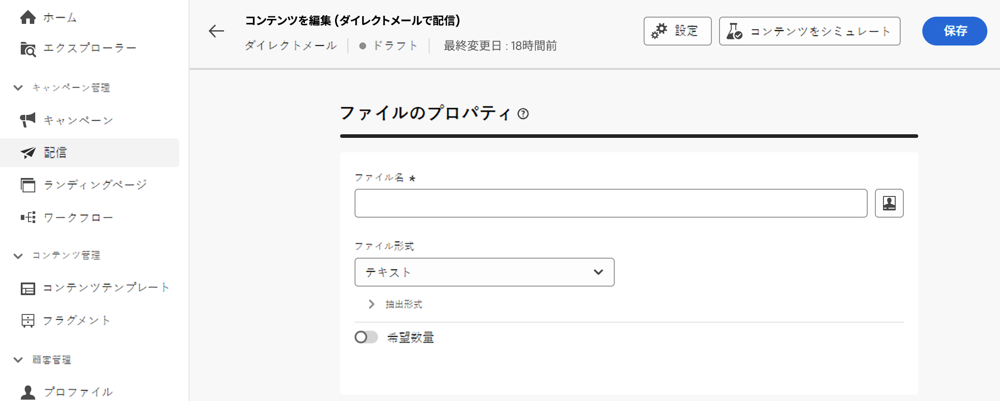
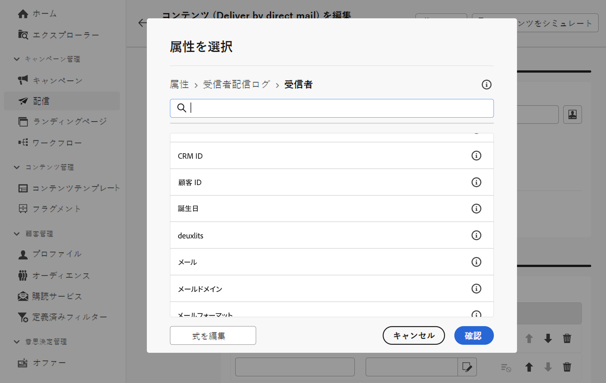
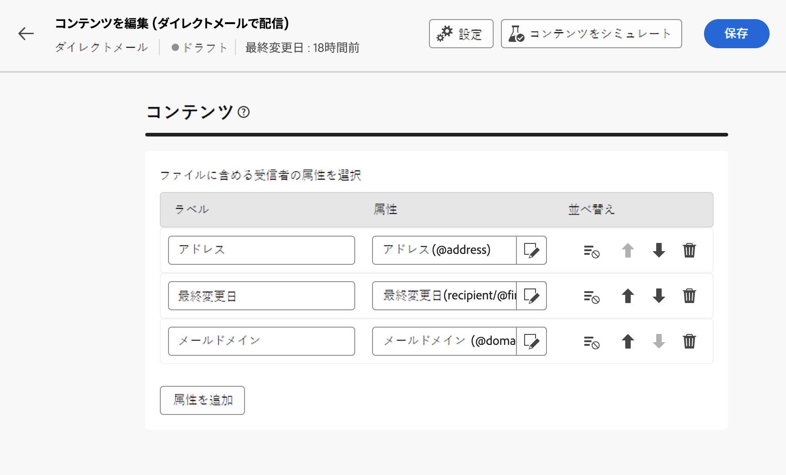

# 抽出ファイルの設計 {#design-direct-mail}

>[!CONTEXTUALHELP]
>id="acw_directmail_content"
>title="抽出ファイルのコンテンツ"
>abstract="「**コンテンツを編集**」ボタンをクリックして、ダイレクトメールプロバイダーが必要とする抽出ファイルのデザインを開始します。これにより、ファイルのプロパティ（ラベルや形式など）を定義したり、ファイルに含める列を指定したりできます。"

>[!CONTEXTUALHELP]
>id="acw_directmail_properties_file"
>title="ファイルのプロパティ"
>abstract="抽出ファイルの名前や形式などのプロパティを設定します。式エディターで、データベースの属性を使用してファイル名をパーソナライズできます。"

>[!CONTEXTUALHELP]
>id="acw_directmail_properties_content"
>title="コンテンツ"
>abstract="この節では、抽出ファイルに表示する列を指定します。完了したら、「**コンテンツをシミュレート**」ボタンを使用して抽出ファイルのプレビューを取得できます。"

ダイレクトメール配信で生成された抽出ファイルのコンテンツをデザインするには、配信ページの「**[!UICONTROL コンテンツを編集]**」ボタンをクリックし、ファイルのプロパティとコンテンツを設定します。

## 抽出ファイルプロパティの設定 {#properties}

1. 「**[!UICONTROL ファイル名]**」フィールドで、抽出ファイルの名前を指定します。データベースの属性を使用して、ファイル名をパーソナライズできます。これを行うには、「**[!UICONTROL パーソナライゼーションダイアログを開く]**」アイコンをクリックして、式エディターを開きます。詳しくは、[コンテンツをパーソナライズする方法](../personalization/personalize.md)を参照してください。

1. 「**[!UICONTROL ファイル形式]**」フィールドで、抽出ファイルの形式を、「**テキスト**」、「**列で固定を使用したテキスト**」、「**CSV (Excel)**」または「**XML**」から選択します。

1. 「**[!UICONTROL 抽出形式]**」セクションを展開して、抽出ファイルの形式に関連する特定のオプションにアクセスします。使用できる値は、選択した形式によって異なります。

+++ 使用可能な抽出形式オプション

   * **[!UICONTROL 最初の行を列ヘッダーとして使用]**（テキスト／CSV（Excel）形式）：最初の列をヘッダーとして使用するように、このオプションをオンに切り替えます。
   * **[!UICONTROL 列区切り記号]**（テキスト形式）：抽出ファイルで列区切り記号として使用する文字を指定します。
   * **[!UICONTROL 文字列の区切り]**（テキスト形式）：抽出ファイルの文字列を区切る方法を指定します。
   * **[!UICONTROL 行末]**（テキスト形式）：抽出ファイルで行末を区切る方法を指定します。
   * **[!UICONTROL エンコード]**：抽出ファイルのエンコーディングを選択します。
   * **[!UICONTROL 日付形式と区切り記号]**：抽出ファイルでの日付の書式設定方法を指定します。
   * **[!UICONTROL 数値の形式]**：抽出ファイルでの数値の形式設定方法を指定します。
   * **[!UICONTROL 列挙の内部値の代わりにラベルを書き出し]**：列挙値を書き出し、内部 ID ではなく、わかりやすい列ラベルを取得する場合は、このオプションをオンに切り替えます。

+++

1. 「**[!UICONTROL リクエストされた数量]**」オプションをオンに切り替えて、配信の受信者数を制限します。

   {zoomable="yes"}

## 抽出ファイル列の設定 {#content}

「**[!UICONTROL コンテンツ]**」セクションで、抽出ファイルに表示する列を指定します。これを行うには、次の手順に従います。

1. 「**[!UICONTROL 属性を追加]**」ボタンをクリックして、新しい列を作成します。
1. 列に表示する属性を選択し、確定します。「**[!UICONTROL 式を編集]**」ボタンをクリックすると、式エディターを活用して、使用する属性を選択できます。

   

1. 列を追加したら、編集アイコンを使用して、その列のラベルを変更し、関連する属性を変更できます。
1. これらの手順を繰り返して、抽出ファイルに必要な数の列を追加します。
1. いずれかの列を使用して抽出ファイルを並べ替えるには、「**[!UICONTROL 並べ替え]**」列のアイコンをクリックし、目的の並べ替え方法を選択します。
1. 列の位置を変更するには、上下の矢印を使用します。

これで、抽出ファイルをプレビューし配信を送信して、抽出ファイルを生成できるようになります。[詳しくは、ダイレクトメールメッセージのテストと送信の方法を参照してください。](send-direct-mail.md)
