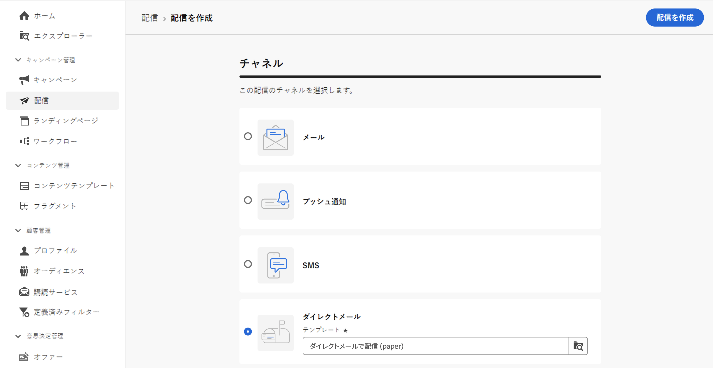
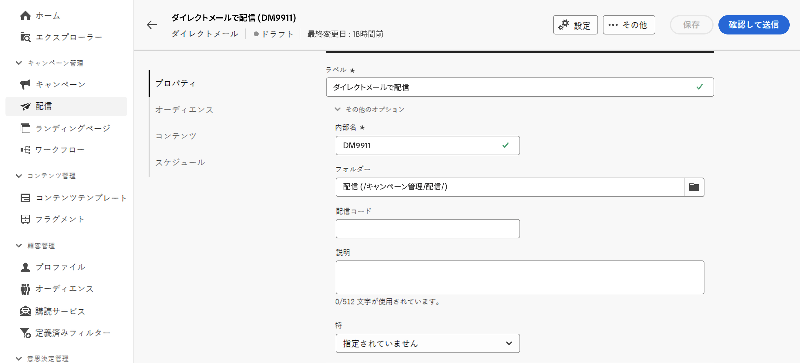
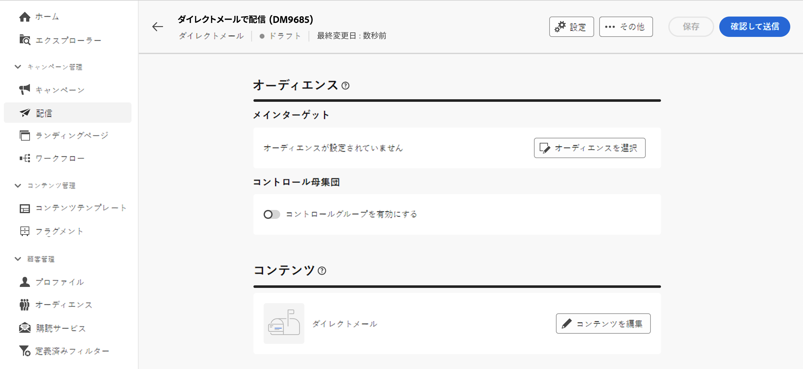
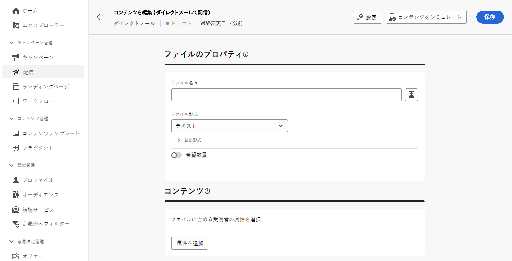
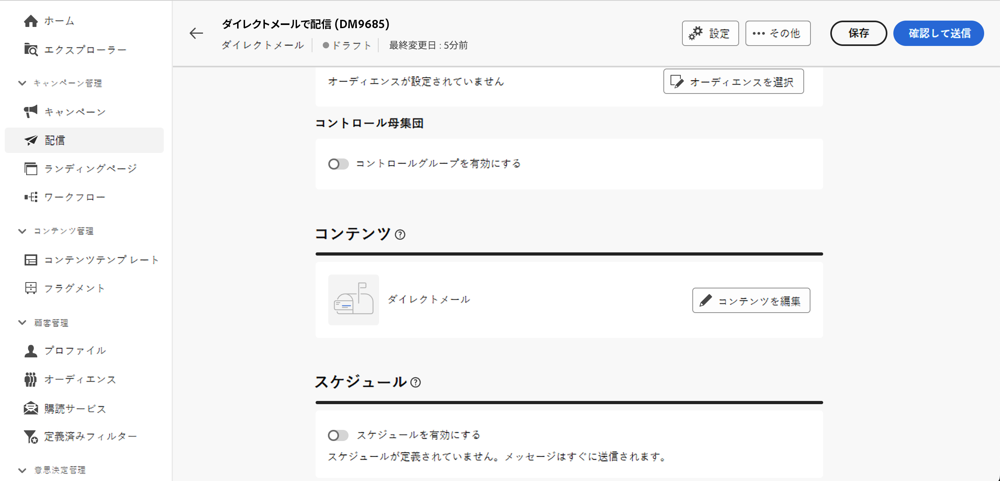

# ダイレクトメール配信の作成 {#create-direct-mail}

スタンドアロンのダイレクトメール配信を作成することも、キャンペーンワークフローのコンテキストでダイレクトメール配信を作成することもできます。以下の手順では、スタンドアロン（1 回限りの）ダイレクトメール配信の手順について説明します。キャンペーンワークフローのコンテキストで作業している場合、作成手順について詳しくは、[この節](../workflows/activities/channels.md#create-a-delivery-in-a-campaign-workflow)を参照してください。

スタンドアロンのダイレクトメール配信を新規作成するには、次の手順に従います。

1. 左側のパネルの **[!UICONTROL 配信]** メニューを参照し、「**[!UICONTROL 配信を作成]**」ボタンをクリックします。

1. 「**[!UICONTROL チャネル]**」セクションで、チャネルとして「**[!UICONTROL ダイレクトメール]**」を選択し、テンプレートを選択します。[テンプレートの詳細情報](../msg/delivery-template.md)

1. 「**[!UICONTROL 配信を作成]**」ボタンをクリックして、確定します。

   {zoomable="yes"}

1. 配信の **[!UICONTROL ラベル]** を入力し、**[!UICONTROL その他のオプション]** ドロップダウンにアクセスします。 配信が拡張スキーマに基づいている場合は、特定の&#x200B;**カスタムオプション**&#x200B;フィールドを使用できます。

   {zoomable="yes"}

   +++要件に基づいて次の設定を行います。
   * **[!UICONTROL 内部名]**：配信に一意の ID を割り当てます。
   * **[!UICONTROL フォルダー]**：配信を特定のフォルダーに保存します。
   * **[!UICONTROL 配信コード]**：独自の命名規則を使用して配信を整理します。
   * **[!UICONTROL 説明]**：配信の説明を指定します。
   * **[!UICONTROL 特性]**  : 分類目的で配信の特性を指定します。
+++

1. 「**[!UICONTROL オーディエンスを選択]**」ボタンをクリックして、既存のオーディエンスをターゲットにするか、独自のオーディエンスを作成します。

   * [既存のオーディエンスの選択方法について説明します。](../audience/add-audience.md)
   * [新規のオーディエンスの作成方法について説明します。](../audience/one-time-audience.md)

   {zoomable="yes"}

   >[!NOTE]
   >
   >ダイレクトメールの受信者には、少なくとも名前と郵送先住所が登録されている必要があります。名前、郵便番号、市区町村フィールドが空でない場合、アドレスは完全に入力されているとみなされます。アドレスが不完全な受信者はダイレクトメールの配信から除外されます。

1. 「**[!UICONTROL コントロール母集団を有効にする]**」オプションをオンにして、配信の影響を測定するコントロール母集団を設定します。メッセージは、そのコントロール母集団には送信されないので、メッセージを受信した母集団の行動と、受信しなかった連絡先の行動を比較できます。 [詳しくは、コントロール母集団の操作方法を参照してください。](../audience/control-group.md)

1. 「**[!UICONTROL コンテンツを編集]**」をクリックして、抽出ファイルに書き出す情報（列）を定義します。[詳細情報](content-direct-mail.md)

   {zoomable="yes"}

1. 特定の日時に配信をスケジュールするには、「**[!UICONTROL スケジュールを有効にする]**」オプションをオンにします。配信を開始すると、抽出ファイルは、定義した正確な日時に自動的に生成されます。 [詳しくは、配信をスケジュールする方法を参照してください](../msg/gs-deliveries.md#gs-schedule)。

   >[!NOTE]
   >
   >ワークフローのコンテキストで配信が送信された場合、「**スケジューラー**」アクティビティを使用する必要があります。詳しくは、[ このページ ](../workflows/activities/scheduler.md) を参照してください。

1. 「**[!UICONTROL 設定]**」をクリックして、配信テンプレートに関連する詳細オプションにアクセスします。[詳細情報](../advanced-settings/delivery-settings.md)

   {zoomable="yes"}

1. ダイレクトメール配信の準備が整ったら、「**[!UICONTROL 確認して送信]**」ボタンをクリックして、配信を検証して送信し、抽出ファイルを生成します。[詳しくは、ダイレクトメール配信をプレビューおよび送信する方法を参照してください。](send-direct-mail.md)