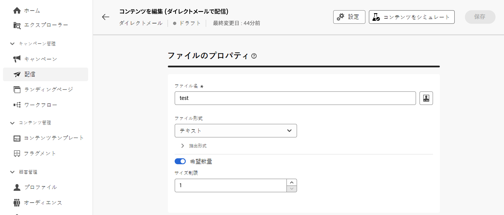
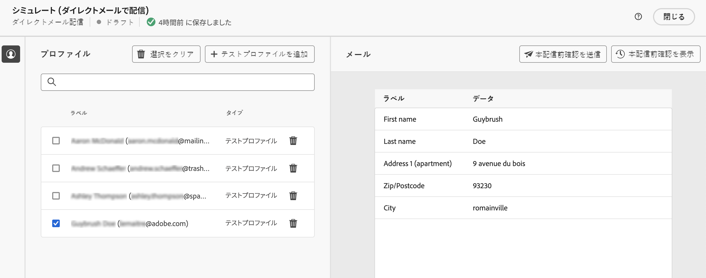
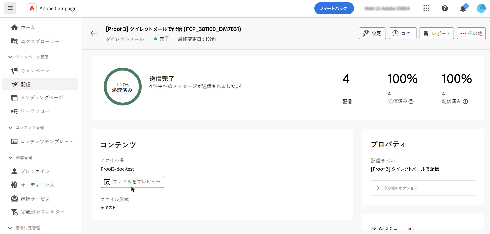
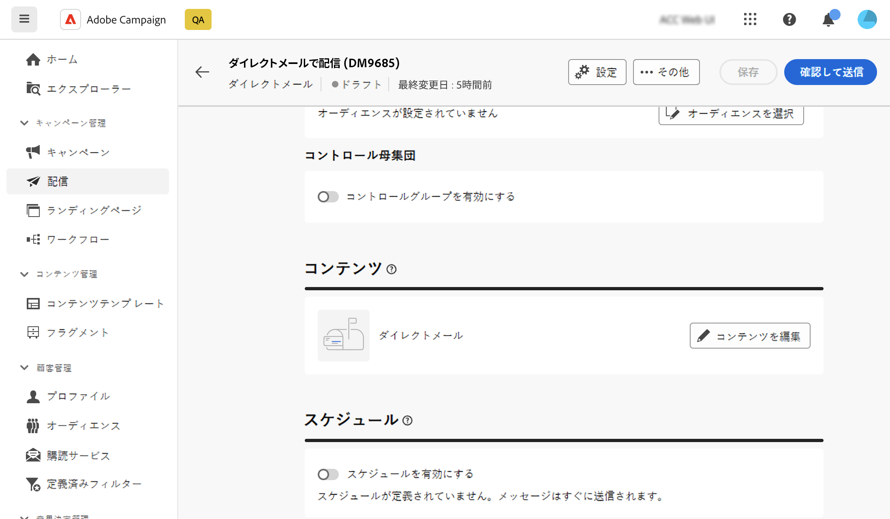
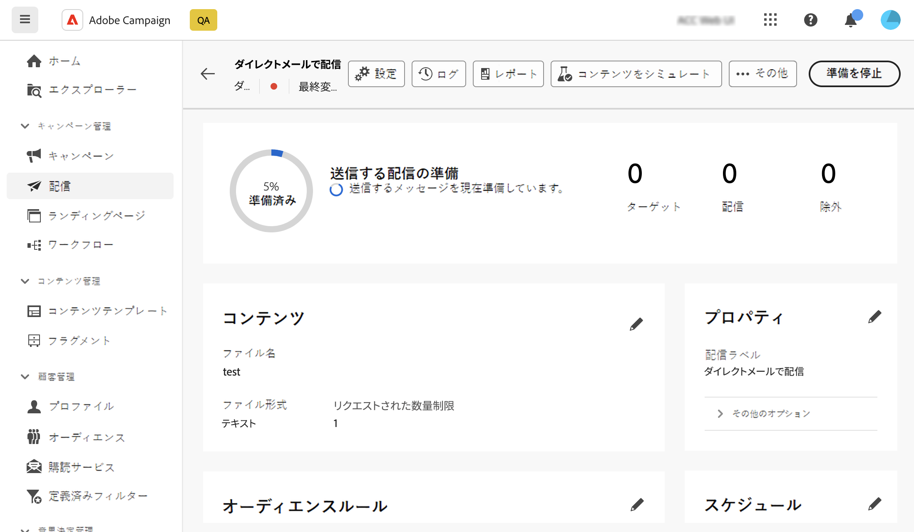

# ダイレクトメール配信のプレビューと送信 {#send-direct-mail}

ダイレクトメール配信用の抽出ファイルを設定したら、テストプロファイルを使用してプレビューできます。パーソナライズされたコンテンツを挿入してある場合は、そのコンテンツが列にどのように表示されるかを、テストプロファイルデータを利用して確認できます。ここで、ファイルコンテンツが正しくレンダリングされ、パーソナライズされた要素が適切に組み込まれていることを確認できます。

抽出ファイルの準備が整ったら、ダイレクトメール配信を送信してファイルを生成し、ダイレクトメールプロバイダーと共有できます。[詳しくは、ダイレクトメール配信の送信方法を参照してください。](#dm-send)

## 抽出ファイルのプレビュー {#preview-dm}

抽出ファイルをプレビューする主な手順は次のとおりです。配信のプレビュー方法の詳細については、[この節](../preview-test/preview-content.md)を参照してください。

1. 配信コンテンツページから、「**[!UICONTROL コンテンツをシミュレート]**」を使用して、パーソナライズされたコンテンツをプレビューします。

   {zoomable="yes"}

1. 「**[!UICONTROL テストファイルを追加]**」をクリックし、1 つまたは複数のプロファイルを選択して、抽出ファイルコンテンツ内のデータをプレビューします。

1. 右側のパネルには抽出ファイルのプレビューが表示され、パーソナライズされた要素が選択したプロファイルのデータに動的に置き換えられます。

   {zoomable="yes"}

## 本配信前確認の送信 {#test-dm}

**Adobe Campaign** を使用すると、メインオーディエンスに送信する前に本配信前確認を送信できます。この手順は、配信を検証し、問題を特定する上で重要です。テスト受信者は、パーソナライゼーション設定などの要素を確認し、最適なパフォーマンスの確保やエラー検出を行うことができます。このプロセスは、メインオーディエンスに届ける前に抽出ファイルを調整し、最適化するのに役立ちます。

ダイレクトメール配信の場合、本配信前確認を送信すると、選択したテストプロファイルのデータを使用して抽出ファイルのサンプルが生成されます。アクセスするには、次の手順に従います。

1. コンテンツをシミュレート画面で「**[!UICONTROL 本配信前確認を送信]**」ボタンをクリックし、任意のタイプの配信の場合と同じ手順に従って本配信前確認を送信します。[詳しくは、本配信前確認の送信方法を参照してください。](../preview-test/test-deliveries.md)

1. 本配信前確認を送信したら、「**[!UICONTROL 本配信前確認を表示]**」ボタンまたは配信リストからアクセスできます。[詳しくは、本配信前確認のアクセス方法を参照してください。](../preview-test/test-deliveries.md#access-test-deliveries)

1. 本配信前確認配信ダッシュボードで「**[!UICONTROL ファイルをプレビュー]**」ボタンをクリックして、抽出ファイルのプレビューにアクセスします。

   {zoomable="yes"}

   >[!NOTE]
   >
   >プレビューファイルには最初の 100 行のみが表示されます。

## ダイレクトメール配信の送信 {#send-dm}

ダイレクトメールを顧客に送信する準備が整ったら、指定した抽出ファイルでデータ抽出を開始するために配信を送信できます。これを行うには、次の手順に従います。

1. 抽出ファイルのコンテンツを設計したら、**[!UICONTROL 配信]**&#x200B;ページで「**[!UICONTROL レビューして送信]**」をクリックします。

   {zoomable="yes"}

1. 「**[!UICONTROL 準備]**」をクリックし、表示される進行状況と統計を監視します。

   エラーが発生した場合は、**[!UICONTROL ログ]**&#x200B;メニューでエラーに関する詳細情報を参照してください。

   {zoomable="yes"}

1. 「**[!UICONTROL 送信]**」をクリックしてメッセージを送信し、最終的な送信プロセスに進みます。

1. 「**[!UICONTROL 送信]**」ボタンをクリックして、送信アクションを確定します。

   ダイレクトメール配信がスケジュールされている場合は、「**[!UICONTROL スケジュールどおりに送信]**」ボタンをクリックします。配信スケジュールについて詳しくは、[この節](../msg/gs-messages.md#schedule-the-delivery-sending)を参照してください。

配信を送信すると、抽出ファイルが自動的に生成され、配信テンプレートの[詳細設定](../advanced-settings/delivery-settings.md)で選択した&#x200B;**[!UICONTROL ルーティング]**&#x200B;外部アカウントで指定した場所に書き出されます。

配信ページから KPI（主要業績評価指標）データを追跡し、**[!UICONTROL ログ]**&#x200B;メニューからデータを追跡できます。

また、組み込みレポートを使用して、メッセージの影響の測定を開始することもできます。[詳細情報](../reporting/direct-mail.md)
