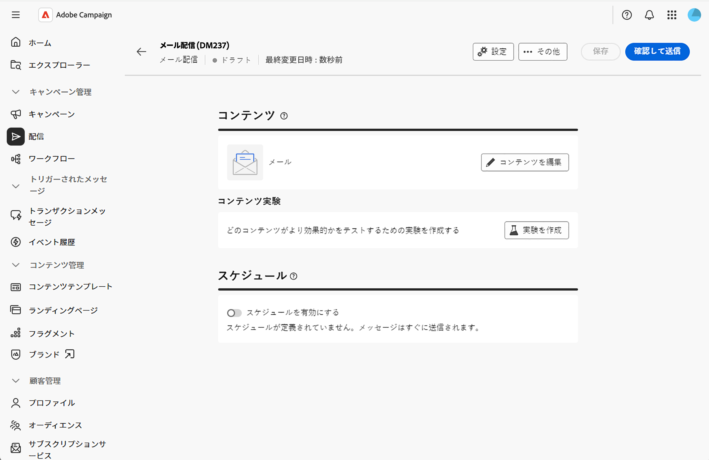
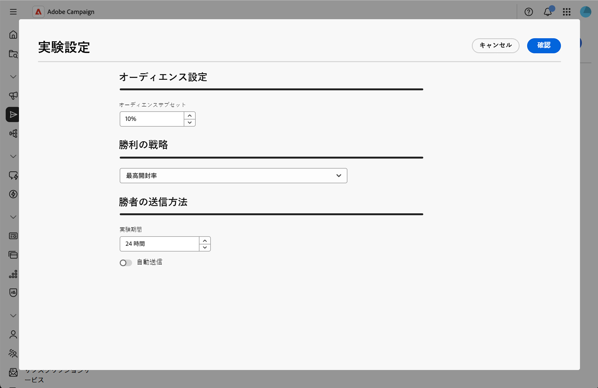
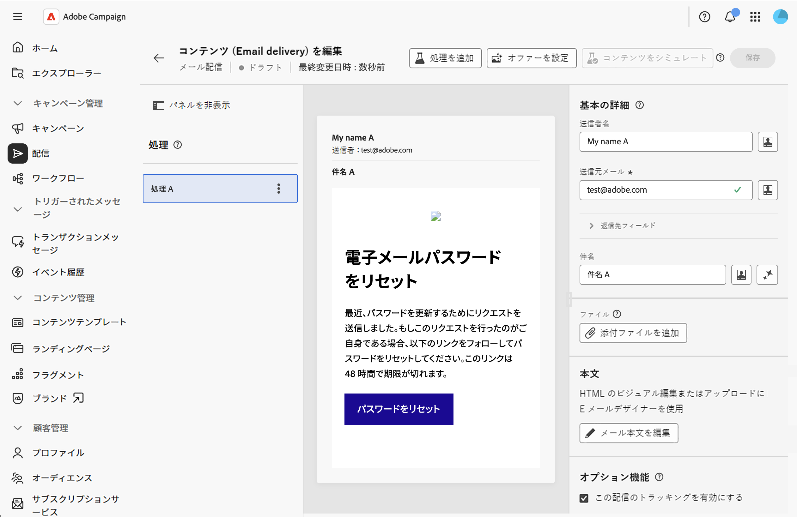
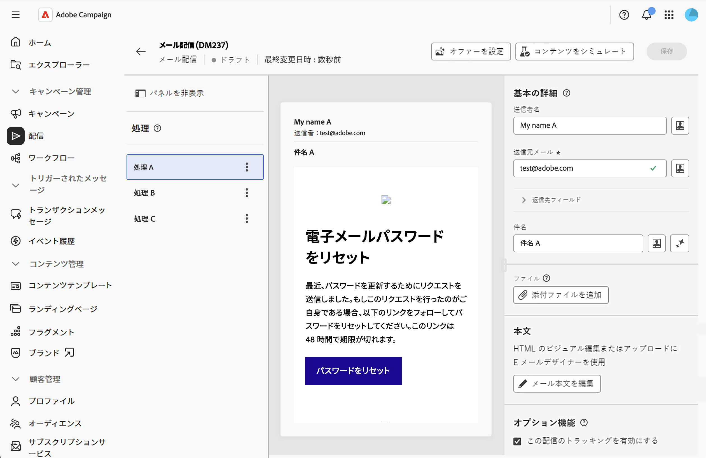
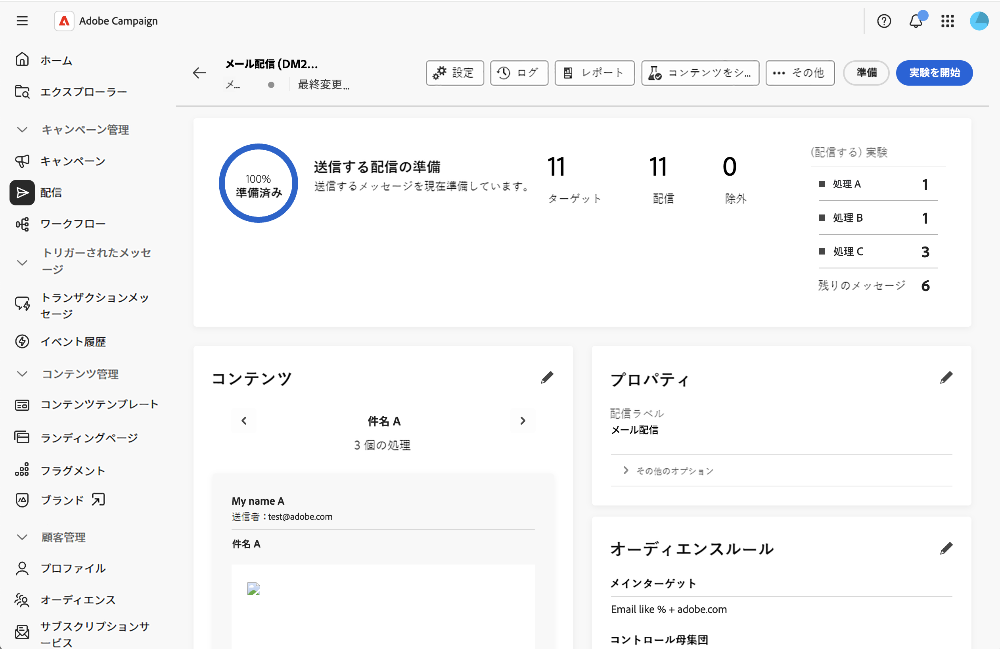

# コンテンツ実験の作成 {#content-experiment}

>[!CONTEXTUALHELP]
>id="acw_deliveries_email_content_experiment"
>title="コンテンツ実験"
>abstract="コンテンツ実験では、ターゲットオーディエンスにとって最適なパフォーマンスを測定するために、複数のA/B テスト配信のバリエーションを定義できます。 配信コンテンツ、件名、送信者を変更して、さまざまなバージョンをテストし、どのバリエーションが最も優れた結果を生み出すのかを判断できます。"

## コンテンツ実験について {#about-content-experiment}

Adobe Campaign Webのコンテンツ実験では、ターゲットオーディエンスにとって最適なパフォーマンスを測定するために、複数のA/B テスト配信のバリエーションを定義できます。 配信コンテンツ、件名、送信者を変更して、さまざまなバージョンをテストし、どのバリエーションが最も優れた結果を生み出すのかを判断できます。

電子メールのさまざまな要素に対して、次のようなA/B テストを実施できます。

* **件名**：異なるメールの件名をテストして、最も開封率が高い件名を確認します
* **送信者の名前**：異なる送信者の組み合わせを試す
* **メール本文コンテンツ**：複数のコンテンツバージョンを作成して、どのコンテンツが最もクリック率が高いかを特定します

>[!NOTE]
>
>* コンテンツの実験は、現在、メールチャネルでのみ利用できます。
>* A/B テストは、トランザクションメッセージではサポートされていません。
>* 実験ごとに最大3つの処理（バリエーション）。

## コンテンツ実験を作成 {#create-content-experiment}

メール配信にコンテンツ実験を追加するには、次の手順に従います。

1. メール配信を作成するか、既存のドラフト配信を開きます。 [電子メールの作成方法を学ぶ](create-email.md)

1. メール配信のプロパティページで、「**[!UICONTROL コンテンツ]**」セクションにある「**[!UICONTROL 実験を作成]**」ボタンをクリックします。

   {zoomable="yes"}

## 実験設定の設定 {#configure-experiment}

以下のセクションを使用して実験を設定します。

実験の設定を示す{zoomable="yes"}

### オーディエンス設定 {#audience-settings}

テストのバリエーションを受け取るターゲット母集団の割合を定義します。

オーディエンスサイズを設定する値を入力します。 これは、テスト段階で実験のバリエーションの1つを受け取る受信者の割合を表します。

* **最小**: 1%
* **最大**: 100%
* **既定**: 10%

残りのオーディエンス（デフォルトでは90%）は、実験が終了し、勝者が決定されると、勝者バリエーションを受け取ります。

例えば、ターゲットオーディエンスが10,000人、オーディエンスサイズが10%の場合、実験に参加するために1,000人の受信者がランダムに選択されます。 残りの9,000人の受信者には、実験が終了した後に勝者バリエーションが送信されます。

### 成功戦略 {#winning-strategy}

勝者バリアントの決定に使用する指標を選択します。

* **[!UICONTROL 開封率]** （デフォルト）：電子メールの開封率が最も高いバリエーションが勝者となります
* **[!UICONTROL 最高のクリック率]**：メール内のクリック数が最も多いバリエーションが勝者となります
* **[!UICONTROL 最も登録解除率が低い]**：登録解除率が最も低いバリエーションが勝者となります

システムは実験中にこれらの指標を自動的に追跡し、選択した基準に従ってどのバリエーションが最も効果的かを計算します。

### 勝者の送信方法 {#sending-method}

テストを実行する時間を定義し、送信方法を選択します。

1. 期間の値を時間単位で入力します。 テストは、勝利のバリエーションを決定する前にこの期間に実行されます。

   * **最小**: 3時間
   * **最大**: 240時間（10日間）
   * **既定**: 24時間

   >[!NOTE]
   >
   >有意義なデータを収集するのに十分な期間を確保する。 期間が短い場合、十分な統計的有意性を提供できない可能性があります。特に、クリックスルー率などの指標の場合、蓄積に時間がかかる可能性があります。

1. 勝者バリエーションを残りの母集団に送信する方法を選択します。

   * **[!UICONTROL 自動送信]**&#x200B;がアクティブ化されました：実験が終了すると、システムは自動的に残りのオーディエンスに勝利のバリエーションを送信します。
   * **[!UICONTROL 自動送信]**&#x200B;が非アクティブ化されました：**[!UICONTROL 送信]** ボタンを手動でクリックして、実験結果を確認した後に勝利したバリエーションを送信する必要があります。

実験の終わりまでに他のバリアントよりも有意に良い結果を得たバリアントがない場合、システムは残りの母集団に最初のバリアントを送信します。 この[節](#send-deliveries)を参照してください。

## コンテンツ処理の定義 {#define-content}

実験設定を保存すると、初期設定で最初の処理が作成されます。 次に、他の処理（最大3つ）を追加し、その特定のコンテンツを定義する必要があります。

1. 配信プロパティから、**[!UICONTROL コンテンツを編集]**&#x200B;をクリックします。 処理は左側に表示されます。

   コンテンツ実験パネルを表示する{zoomable="yes"}

1. 「**[!UICONTROL 処理を追加]**」ボタンをクリックし、名前を定義します。 追加する必要があるすべての処理について、この操作を繰り返します。 その後、名前を変更し、複製して削除できます。

1. 各処理をクリックし、次の項目をカスタマイズします。

   * **送信者名**：電子メールの送信元をカスタマイズ
   * **件名**：各処理に対して一意の件名を書き込みます
   * **メール本文**：メール Designerを使用して、様々なコンテンツバージョンをデザインします

   複数の処理を示す{zoomable="yes"}

1. 処理をクリックし、**[!UICONTROL コンテンツをシミュレート]**&#x200B;をクリックして、各処理をプレビューします。

## 実験を開始し、結果をモニターする {#validate-start}

すべてのコンテンツ処理を定義したら、検証して実験を開始できます。

1. 配信プロパティから、**[!UICONTROL レビューして送信]**&#x200B;をクリックし、**[!UICONTROL 準備]**&#x200B;をクリックします。

1. 次に、**[!UICONTROL 実験を開始]**&#x200B;をクリックして、A/B テストを開始します。

   実験を開始ボタンを表示する{zoomable="yes"}

1. テストを実行したら、配信ダッシュボードに表示されるさまざまな指標を監視します。

実験の実行中に、**[!UICONTROL 送信を停止]**&#x200B;をクリックして実験を終了できます。 また、**[!UICONTROL 選択して勝者]**&#x200B;に送信をクリックすることで、実験の終了前に手動で送信することもできます。

>[!NOTE]
>
>結果は、受信者が電子メールを操作するにつれて、ほぼリアルタイムで更新されます。 ただし、初期の結果には統計的有意性がない可能性があります。最終的な決定を下す前に、実験期間が完了するまで待つことをお勧めします。

## 配信の送信 {#send-deliveries}

送信は、**[!UICONTROL 勝者の送信方法]**&#x200B;の設定で選択した内容に従って、自動的または手動で実行できます。 この[節](#sending-method)を参照してください。

### 自動送信 {#automatic-sending}

自動送信の場合、システムは勝者の戦略に基づいて結果を分析し、勝者の処理を決定します。 勝者の処理は、残りのオーディエンスに自動的に送信されます。 明確な勝者が現れなかった場合は、最初のバリエーションが選択されます。

### 手動送信 {#manual-sending}

手動送信を設定した場合は、実験が終了したときに結果を確認し、**[!UICONTROL 送信]**&#x200B;をクリックして勝者の処理を送信します。 明確な勝者が表示されない場合、最初の処理はデフォルトで選択されますが、別の処理を選択できます。

## 最終結果を表示 {#final-results}

テストが完了し、配信が完全に送信されたら、包括的なレポートにアクセスできます。

1. 配信ダッシュボードで、**[!UICONTROL レポート]**&#x200B;をクリックします。

1. 「**[!UICONTROL 実験]** レポート」タブに移動して、各処理の主要なパフォーマンス指標を表示します。

## ベストプラクティス {#best-practices}

コンテンツ実験を行う際には、以下の推奨事項を考慮してください。

* **一度に1つの要素をテストする**：最も明確な結果を得るには、複数の要素を同時にテストするのではなく、1つの要素のバリエーション（件名のみ、コンテンツのみ）をテストします。

* **適切な期間を選択**：統計的有意性を得るのに十分な時間を確保します。
   * 開封率テストの場合：12～24時間で十分です
   * クリックスルー率テストの場合：24～48時間以上が必要な場合があります
   * 大規模なオーディエンスは少ない時間で済む場合もあり、小規模なオーディエンスは長い時間で済む場合もあります

* **オーディエンスを適切にサイズ調整**:
   * 実験オーディエンス（テストに割り当てられた割合）が、意味のある結果を生成するのに十分な大きさであることを確認します
   * 一般的なガイドライン：信頼性の高い結果を得るために、治療ごとに最低1,000人の受信者

* **定期的にテストを実施しますが、過剰なテストは実施しません**：重要なキャンペーンに関する実験は実施しますが、すべての送信をテストして、インパクトのある意思決定にリソースを集中させることは避けてください。

* **学習内容を文書化**：実験結果の記録を保持して、今後のキャンペーン戦略に役立てることができます。

## 関連トピック {#related-topics}

* [最初のメールを作成](create-email.md)
* [メールコンテンツの設定](edit-content.md)
* [メールのプレビューと送信](../monitor/prepare-send.md)
* [メール配信レポート](../reporting/email-report.md)
