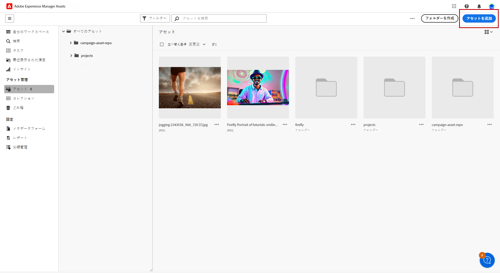
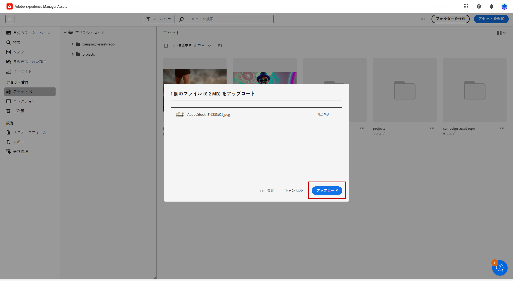
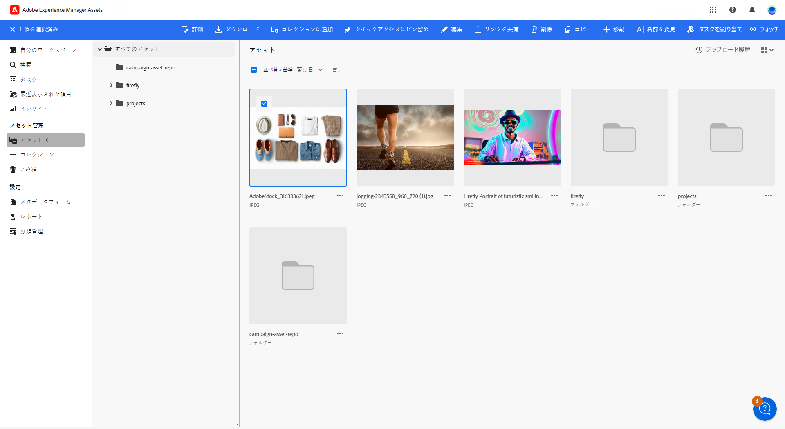
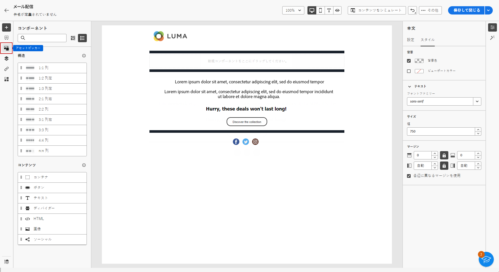
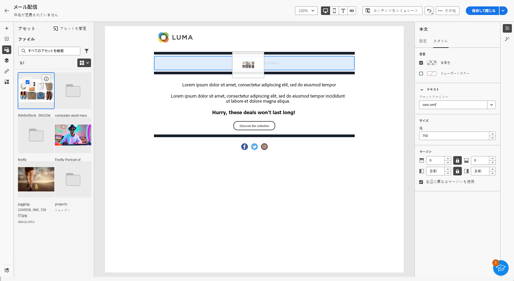
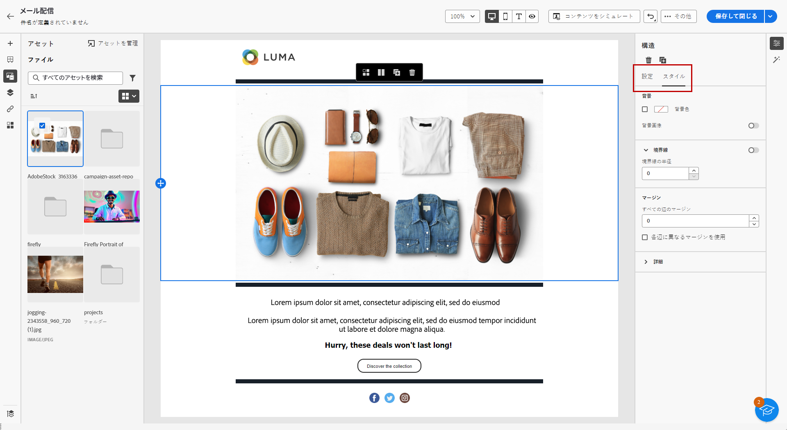

# [!DNL Adobe Experience Manager Assets as a Cloud Service] を使用したアセットの管理{#aem-assets}

## [!DNL Adobe Experience Manager Assets as a Cloud Service] の基本を学ぶ {#get-started-assets-essentials}

[!DNL Adobe Experience Manager Assets as a Cloud Service] は、クリエイティブワークフローを合理化し、デジタルアセットを一元管理してシームレスなエクスペリエンス配信を実現する、統合された共同プラットフォームです。これにより、承認された実稼動アセットの整理、タグ付け、取得が簡単になり、チーム間でのブランドの一貫性が確保されます。使いやすいインターフェイスを備えた [!DNL Assets as Cloud Service] を使用すると、アドビのクリエイティブアプリケーションと Experience Cloud アプリケーション内のアセットに即座にアクセスして共有できます。

詳しくは、[Adobe Experience Manager Assets as a Cloud Serviceドキュメント](https://experienceleague.adobe.com/docs/experience-manager-cloud-service/content/assets/home.html?lang=ja){target="_blank"}を参照してください。

## アセットのアップロードと挿入{#add-asset}

ファイルを [!DNL Assets as Cloud Service] に読み込むには、まず保存先のフォルダーを参照または作成する必要があります。その後、メールコンテンツに挿入できます。

アセットのアップロード方法について詳しくは、[Adobe Experience Manager Assets as a Cloud Service ドキュメント](https://experienceleague.adobe.com/docs/experience-manager-cloud-service/content/assets/assets-view/add-delete-assets-view.html?lang=ja){target="_blank"}を参照してください。

1. ホームページから、詳細設定メニューにアクセスし、「[!DNL Experience Manager Assets]」を選択します。

   

1. **アセット管理**&#x200B;で、「**Assets**」をクリックして、Adobe Campaign で Assets のリポジトリを選択します。

1. 中央のセクションまたはツリービューからフォルダーをクリックして開きます。

   また、「**[!UICONTROL フォルダーを作成]**」をクリックして新規フォルダーを作成します。

1. 選択したフォルダーまたは作成したフォルダーで、「**[!UICONTROL アセットを追加]**」をクリックして、新しいアセットをフォルダーにアップロードします。

   

1. 「**[!UICONTROL ファイルをアップロード]**」で、「**[!UICONTROL 参照]**」クリックし、「**[!UICONTROL ファイルを参照]**」または「**[!UICONTROL フォルダーを参照]**」するかを選択します。

1. アップロードするファイルを選択します。完了したら、「**[!UICONTROL アップロード]**」をクリックします。

   

1. アセット管理詳細設定メニューにアクセスするには、アップロードしたアセットを選択します。

   アセットの管理方法について詳しくは、この[ページ](https://experienceleague.adobe.com/docs/experience-manager-cloud-service/content/assets/assets-view/manage-organize-assets-view.html?lang=ja)を参照してください。

   

1. Adobe Photoshop Express を使用してアセットをさらに編集するには、アセットをダブルクリックします。次に、右側のメニューから、**[!UICONTROL 編集モード]**&#x200B;アイコンを選択します。[詳細情報](https://experienceleague.adobe.com/docs/experience-manager-cloud-service/content/assets/assets-view/edit-images-assets-view.html?lang=ja#edit-using-express){target="_blank"}.

1. [!DNL Adobe Campaign] から、メールデザイナーの左側のペインから&#x200B;**[!UICONTROL アセットピッカー]**&#x200B;メニューを選択します。

   

1. 以前に作成した&#x200B;**[!UICONTROL アセット]**&#x200B;フォルダーを選択します。検索バーで、アセットやフォルダーを検索することもできます。

   必要に応じて、「**[!UICONTROL アセットを管理]**」をクリックすると、[!DNL Adobe Experience Manager Assets] ワークスペースに直接アクセスできます。

1. アセットをメールコンテンツにドラッグ＆ドロップします。

   

1. 「**[!UICONTROL 設定]**」タブと「**[!UICONTROL スタイル]**」タブを使用すると、外部リンクやテキストを追加するなど、アセットをさらにカスタマイズできます。[コンポーネント設定の詳細情報](../email/content-components.md)

   
