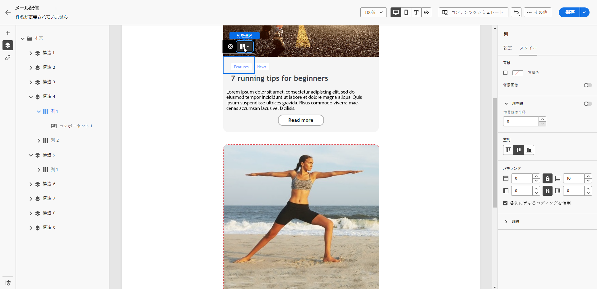
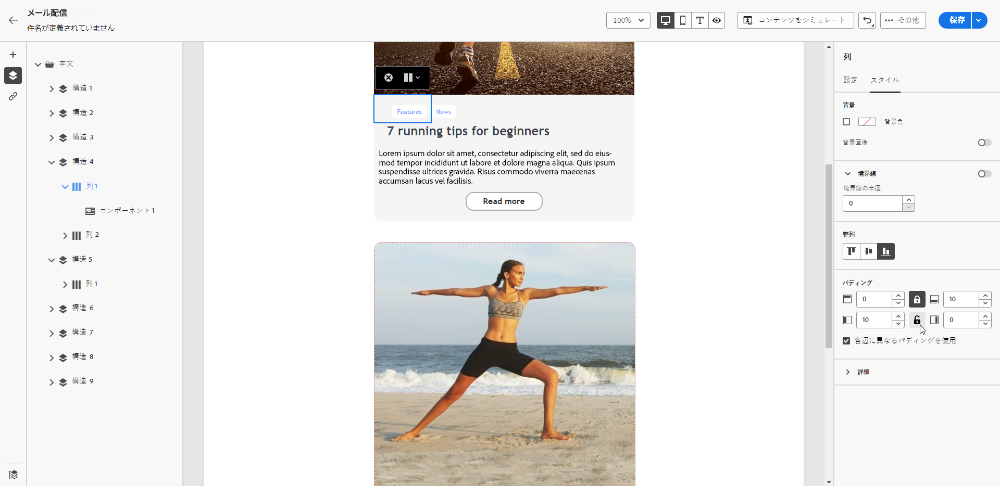

# 垂直方向の整列とパディングを調整する {#alignment-and-padding}

この例では、3 列で構成される構造コンポーネント内のパディングと垂直方向の整列を調整します。

1. メールで構造コンポーネントを直接選択するか、左側のパネルにある **[!UICONTROL ナビゲーションツリー]** を使用します。

   {zoomable="yes"}

1. コンテキストツールバーから **[!UICONTROL 列を選択]** をクリックし、編集する列を選択します。 左側の構造ツリーから選択することもできます。

   {zoomable="yes"}

1. 選択した列の編集可能なパラメーターが、「**[!UICONTROL スタイル]**」タブに表示されます。 専用セクションを使用して、**[!UICONTROL 位置]**&#x200B;を調整します。

   {zoomable="yes"}

   例えば、「**[!UICONTROL 下部]**」を選択します。コンテンツコンポーネントが列の下部に移動します。

1. **[!UICONTROL パディング]**&#x200B;の下で、列の内側の上部のパディングを定義し、その列の左右のパディングを設定します。

   >[!NOTE]
   >
   >ロックアイコンをクリックすると、上下または左右のパディングの同期が解除されます。

   {zoomable="yes"}

1. 他の列の整列とパディングも同じように調整します。

1. 変更を保存します。