# メールコンテンツへのテーマの追加 {#apply-email-themes}

>[!CONTEXTUALHELP]
>id="acw_homepage_welcome_rn2"
>title="メールDesigner（LA）のテーマ"
>abstract="再利用可能なテーマのスタイルと変数を適用して、メールコンテンツとブランドの一貫性を維持できます。 この機能は、一連の組織でのみ使用できます（制限付き可用性）"
>additional-url="https://experienceleague.adobe.com/docs/campaign-web/v8/release-notes/release-notes.html?lang=ja" text="リリースノートを参照してください"

>[!CONTEXTUALHELP]
>id="acw_email_apply_theme"
>title="メールへのテーマの適用"
>abstract="メールのテーマを選択して、ブランドやデザインに合った特定のスタイル設定をすばやく適用します。"

>[!AVAILABILITY]
>
>この機能は限定的です。 Adobeの担当者にお問い合わせください。

テーマを使用すると、技術に詳しくないユーザーでも、標準テンプレート <!-- to achieve brand specific results-->の上にカスタムスタイルを追加することで、特定のブランドやデザイン言語に合った再利用可能なコンテンツを作成できます。

この機能により、マーケターはブランドに即した魅力的な電子メールを、より迅速かつ容易に活用できるようになります。また、独自のデザインニーズに合わせて高度なカスタマイズオプションを利用できます。

## ガードレールと制限 {#themes-guardrails}

* ゼロからメールを作成する場合、テーマを使ってコンテンツの作成を開始し、ブランドやデザインに合った特定のスタイルをすばやく適用することができます。

  手動スタイルモードを選択した場合、メールをリセットしない限り、テーマを適用することはできません。

* [ フラグメント ](../content/fragments.md)は、テーマの使用モードと手動スタイル設定モードの間で互換性がありません。

   * テーマを使用せずに作成された電子メールコンテンツでは、テーマ別のフラグメントは使用できません。

   * テーマ別コンテンツで[ フラグメント ](../content/fragments.md)を活用するには、このフラグメントがテーマを使用して作成されている必要があります。 [詳細情報](#leverage-themes-fragment)

   * メールコンテンツでフラグメントを使用する場合は、このフラグメントに定義したテーマを適用していることを確認してください。 そうしないと、特にOutlook 2021以前のバージョンで、表示の問題が発生する可能性があります。 [詳細情報](#leverage-themes-fragment)

* HTMLで作成されたコンテンツを使用している場合、[互換モード ](existing-content.md)になり、このコンテンツにテーマを直接適用することはできません。

   * テーマを適用するには、最初に読み込んだコンテンツ [を新しいテンプレート ](../content/create-email-templates.md#save-as-template)として保存してから、このテンプレートをテーマ互換コンテンツに変換する必要があります。 次に、このテンプレートを使用してメールコンテンツを作成します。 手動スタイル設定で作成したテンプレートを[このセクション ](#theme-convertor)で変換する方法を説明します。

   * また、読み込んだHTML コンテンツを変換することもできます。 [詳細情報](existing-content.md)

  <!--To fully leverage all the capabilities of the Email Designer, including themes, you must either create a new content in Use Themes mode, or convert your imported HTML content. [Learn more](existing-content.md)-->

* テーマでカスタム web フォント（Google フォントを含む）を使用する場合は、多くのメールクライアントがサポートしていないことに注意してください。 あらゆるメールクライアントで読みやすさを確保するために、テーマで適切なフォールバックフォントを常に定義します。

   * GmailとYahoo! HTML/CSSで指定したフォントファミリーに関係なく、外部のweb フォントを読み込まず、システムフォントにフォールバックします。
   * GmailでサポートされているGoogle フォントは、RobotoとGoogle Sansのみです。
   * *do*&#x200B;がWeb フォントをサポートしている電子メールクライアントには、Apple Mail、iOS Mail、Android Mail、Thunderbird、Outlook for macOSなどがあります。

<!--If you apply a theme to a content using a [fragment](../content/fragments.md) created with Manual Styling mode, the rendering may not be optimal.-->

## テーマを作成 {#create-and-edit-themes}

今後のメールコンテンツで活用できるテーマを定義するには、次の手順に従います。

1. 開始するには、新しい[ コンテンツテンプレート ](../content/create-email-templates.md)を作成します。

1. 「**[!UICONTROL テーマを作成または編集]**」オプションを選択します。

   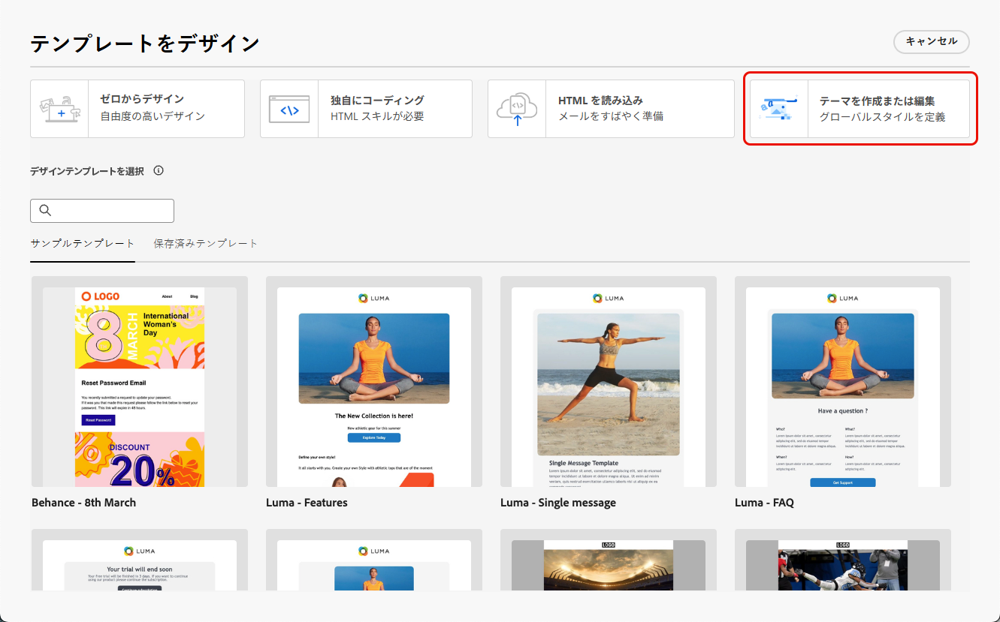

1. Adobeのテーマを選ぶ。 この例では、**[!UICONTROL Default theme]**&#x200B;を選択し、**[!UICONTROL Create]**&#x200B;をクリックします。

   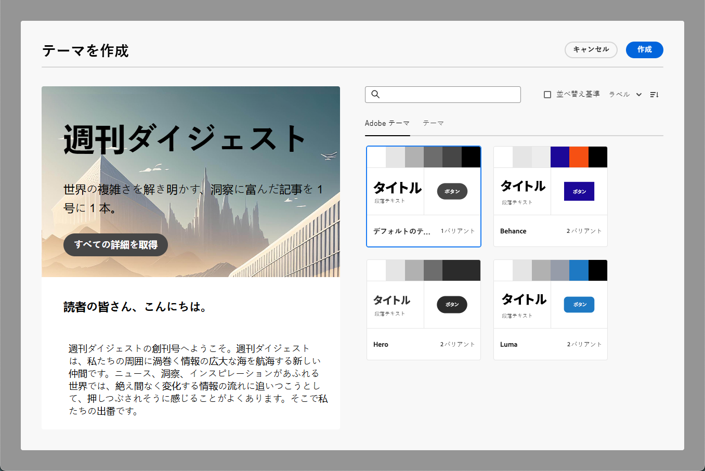を含むテーマ ピッカー

1. **[!UICONTROL マイテーマ]** タブからカスタムテンプレートを選択し、**[!UICONTROL 編集]**&#x200B;をクリックして更新することもできます。

   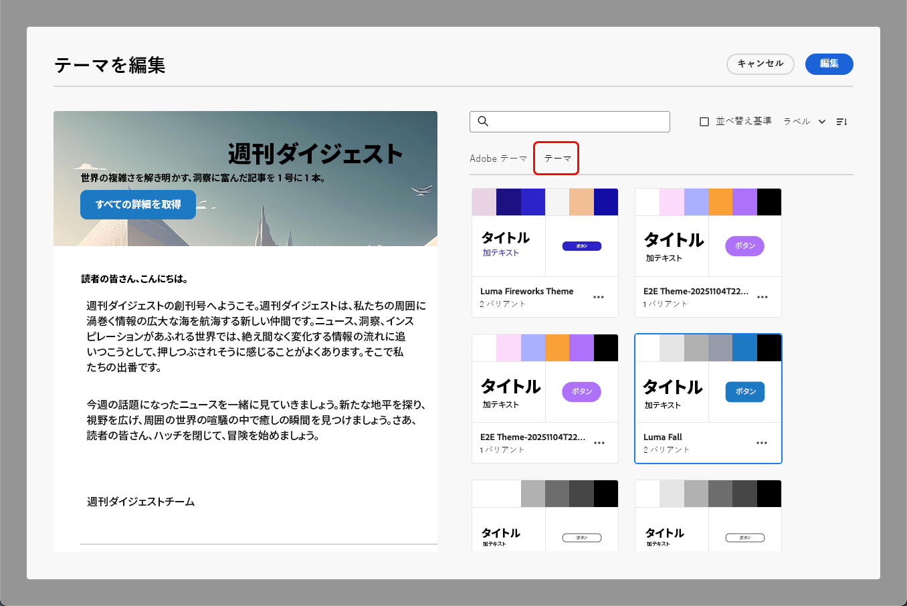

1. 「**[!UICONTROL 一般設定]**」タブで、ブランドに適した特定の名前を付けてテーマの定義を開始します。 メールのデフォルトの表示幅を調整できます<!--and also export the current theme for reuse-->。

   <!--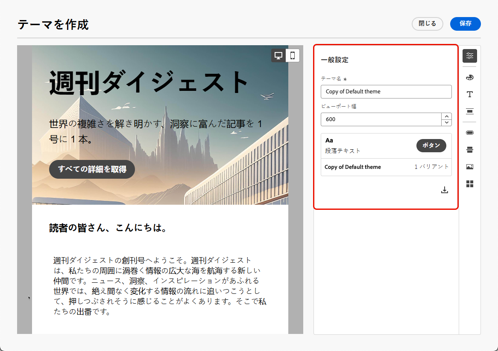-->

1. 右側のパネルを使用して、様々なタブを移動し、デザイン設定を更新します。

   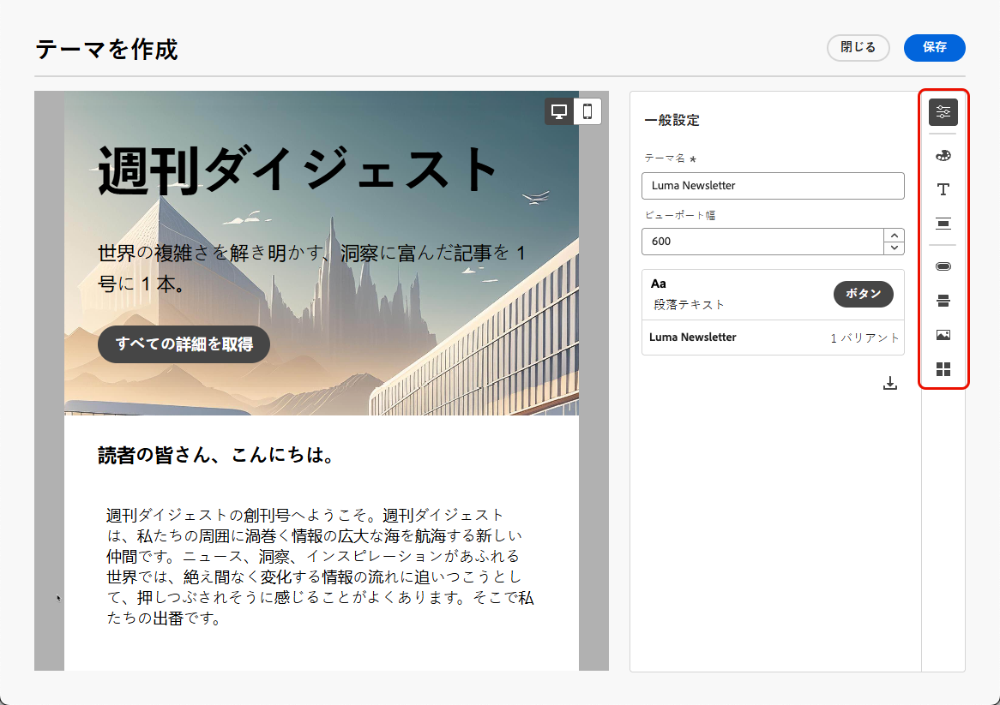

1. 「**[!UICONTROL カラー]**」タブから：

   * 「**[!UICONTROL 編集]**」ボタンを使用して、ブランドのデフォルトカラーを含む&#x200B;**[!UICONTROL カラーパレット]**&#x200B;を設定します。 **[!UICONTROL プリセット]**&#x200B;を選択して、すばやくカラースキームを作成するか、テーマの各色を個別に調整します。 両方を組み合わせて使用することもできます。

     

   * 「**[!UICONTROL バリエーションを追加]**」をクリックして、ライトモードやダークモードなど、テーマの各バリエーションに独自のカラーパレットとニュアンスのコントロールがある複数のカラーバリエーションを作成します。

     追加パレット用のバリアントを追加する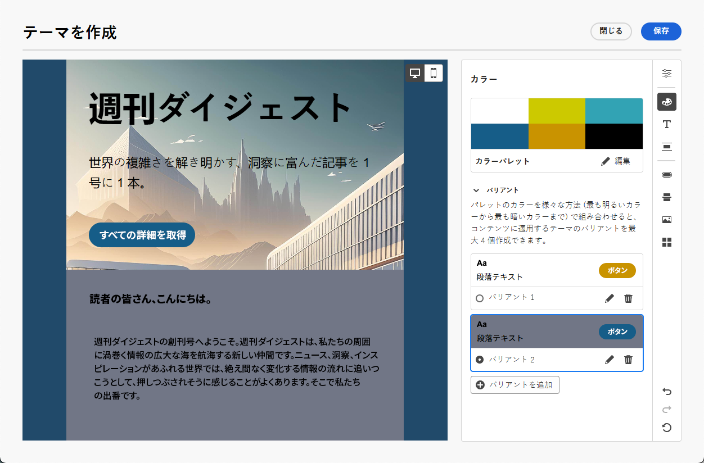

   * バリエーションごとに、**[!UICONTROL 編集]** アイコンをクリックして、個々の要素を編集します。 作成したデフォルトのパレットまたは任意のカスタムカラーを使用できます。

     

1. **[!UICONTROL テキスト設定]**&#x200B;では、テーマ全体で使用するグローバルフォントを設定できます。 さらに細かくコントロールするには、各見出しと段落タイプを編集して、フォント、サイズ、スタイルなどを調整することもできます。

   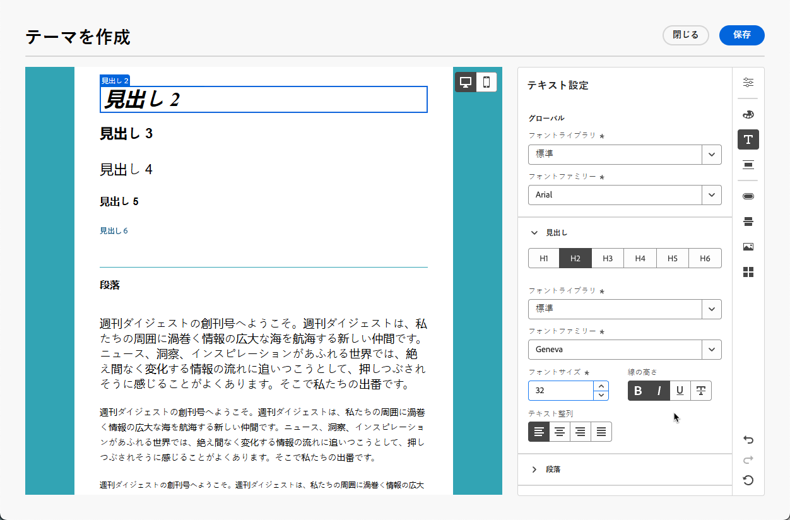

   >[!NOTE]
   >
   >カスタム web フォントを選択する場合は、GmailやYahoo！などの多くのメールクライアントに注意してください。 外部web フォントはサポートしておらず、システムフォントにフォールバックします。 あらゆるメールクライアントでコンテンツが正しく表示されるように、フォールバックフォントを含めることを検討してください。 [詳細情報](#themes-guardrails)

1. 「**[!UICONTROL 間隔]**」タブで、リストから個々の要素を選択して、異なるコンポーネント間で適切に間隔を空けます。

   <!--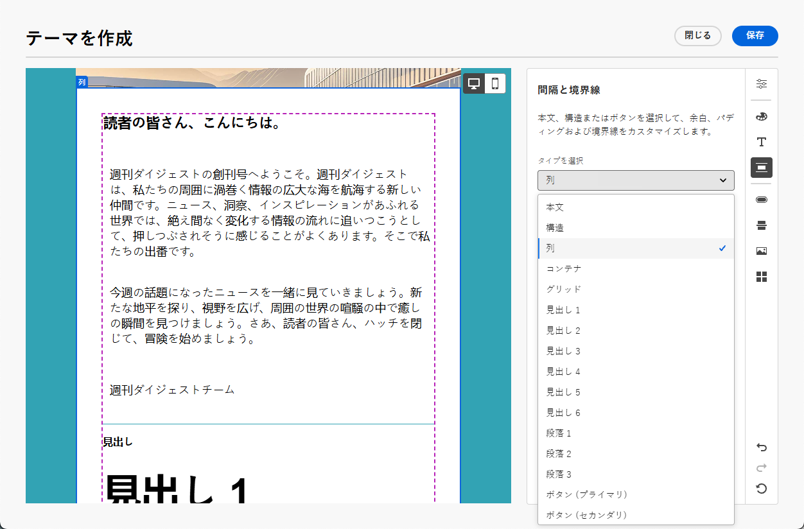-->

1. 右側の他のタブを使用すると、このテーマの各ボタン要素、ディバイダ、追加の画像書式設定、グリッドレイアウト間隔を個別に管理できます。

   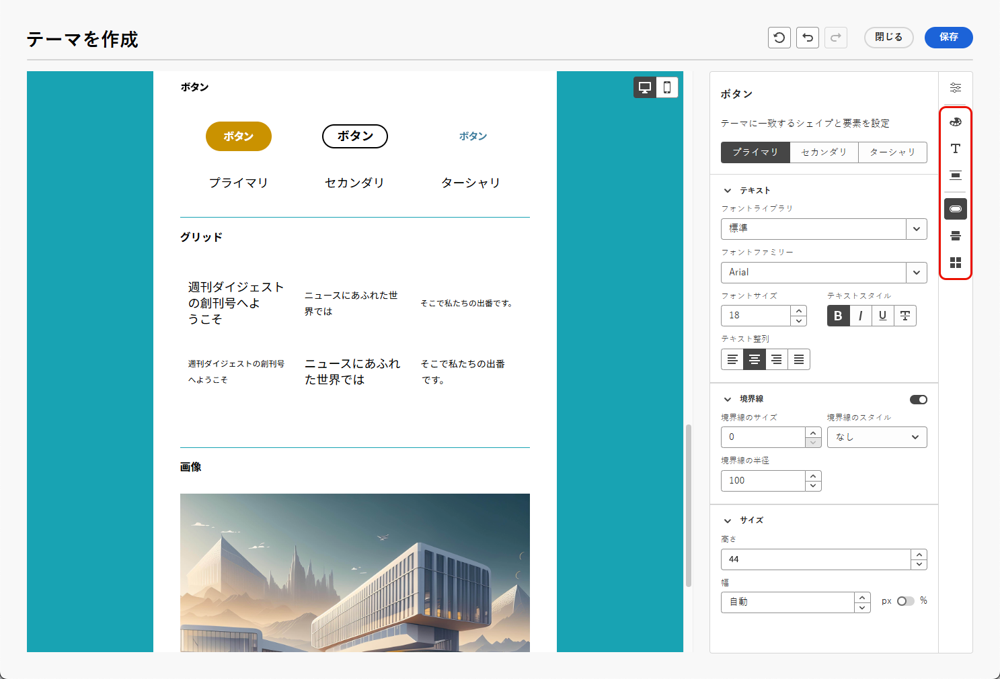

1. **[!UICONTROL 保存]**&#x200B;をクリックして、このテーマを今後の使用のために保存します。 **[!UICONTROL マイテーマ]** タブに表示されるようになりました。

<!--A little strange upon hitting Save, because once the theme is created, you need to hit Close to go back to Design your template screen, then click Cancel if you don't want to proceed with template creation.-->

## メールコンテンツへのテーマの適用 {#apply-themes-email}

コンテンツテンプレートまたはメールにデフォルトまたはカスタムのスタイル設定テーマを適用するには、次の手順に従います。

1. [!DNL Adobe Campaign]では、[ メール配信を作成](create-email.md)するか、既存の配信から作業するか、メール [ コンテンツテンプレート ](../content/create-email-templates.md#create-template-from-scratch)を作成し、[ メールコンテンツを編集](get-started-email-designer.md#start-authoring)します。

1. 次のいずれかのアクションを選択できます。

   * ビルトインの[ メールテンプレート ](../content/use-email-templates.md)を選択して、メールDesignerを開きます。 各テンプレートに固有のデフォルトテーマが自動的に適用されます。

   * [新しいコンテンツを最初からデザイン ](create-email-content.md)し、**[!UICONTROL テーマを使用]**&#x200B;を選択して、定義済みのスタイル設定テーマから開始します。

     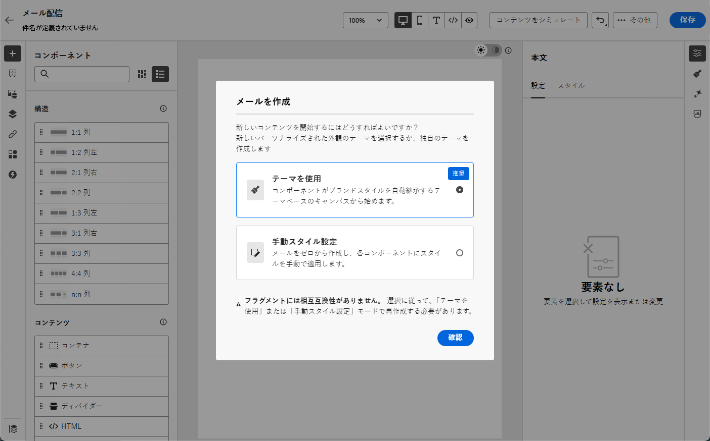

     >[!CAUTION]
     >
     >手動スタイルモードを選択した場合、デザインをリセットしない限り、テーマを適用することはできません。
     >
     >テーマ別コンテンツで[ フラグメント ](../content/fragments.md)を活用するには、このフラグメントがテーマを使用して作成されている必要があります。 [詳細情報](#leverage-themes-fragment)

1. メールDesignerで、右側のパネルの「**[!UICONTROL テーマ]**」ボタンをクリックします。 デフォルトのテーマまたはテンプレートのテーマが表示されます。 このテーマでは、2つのカラーバリエーションを切り替えることができます。

   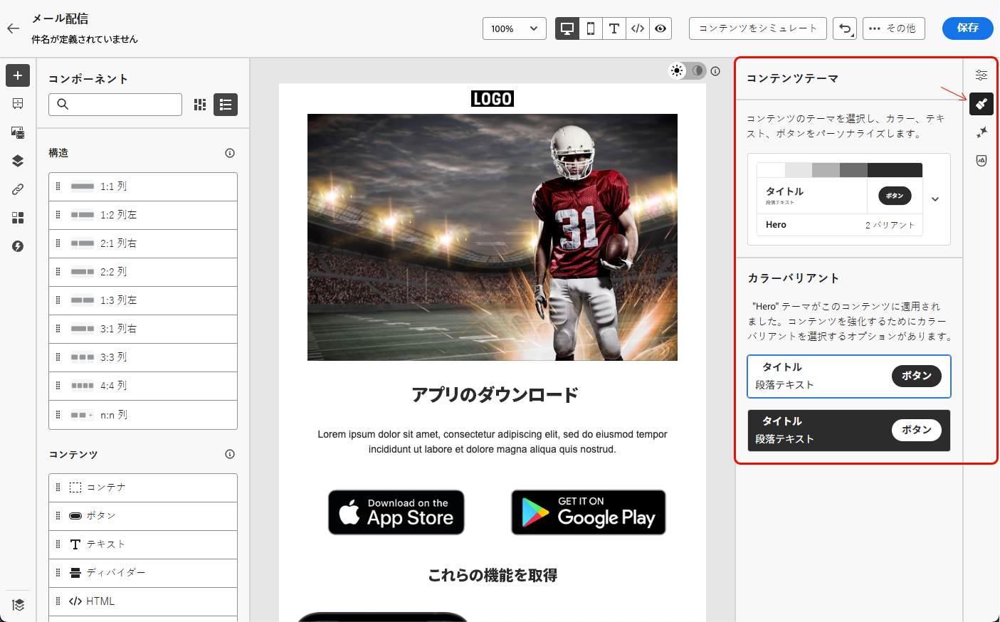

1. 現在使用しているテーマの横にある矢印をクリックします。 使用可能なカスタムテーマとAdobe テーマのリストが表示されます。

   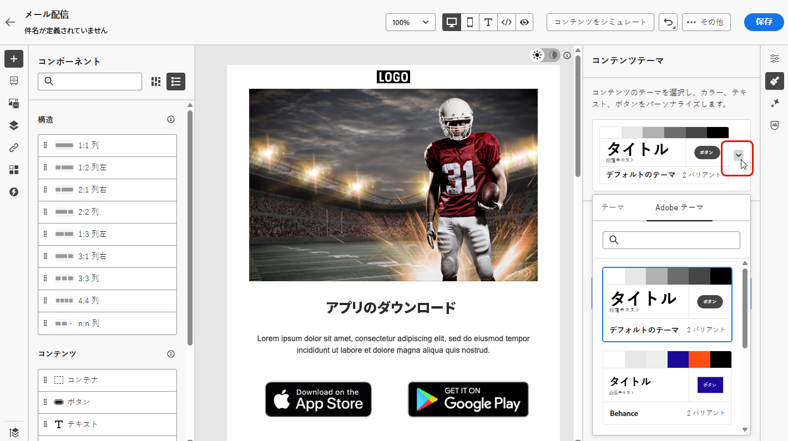

1. **[!UICONTROL マイテーマ]**&#x200B;をクリックし、作成したテーマを選択します。

   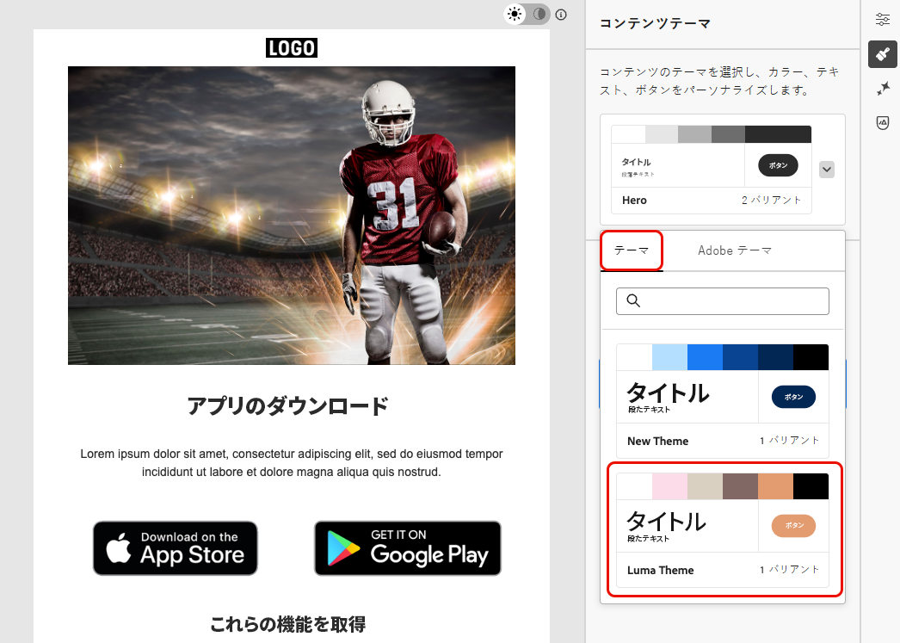

1. ドロップダウンリストの外側をクリックします。 新しく選択したカスタムテーマは、すべてのメールコンポーネントにそのスタイルを自動的に適用します。 カラーバリエーションがあれば、切り替えることができます。

1. コンテンツテンプレートでテーマを選択した場合、「**[!UICONTROL テーマを編集]**」ボタンをクリックして更新できます。 [詳細情報](#create-and-edit-themes)

   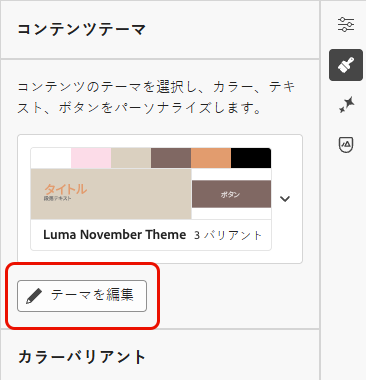{width="40%"}

   >[!NOTE]
   >
   >このオプションは、メールの内容でテーマを使用する場合は使用できません。

1. 複数のカラーバリエーションを使用してテーマを活用する場合は、特定の構造コンポーネントに対して特定のバリエーションを選択できます。 これにより、コンテンツ全体に対してカラーバリアントを定義し、特定の構造に対してのみ異なるバリアントを使用することができます。

   >[!NOTE]
   >
   >コンテンツコンポーネントに対してこのアクションを実行することはできません。

   これを行うには、構造コンポーネントを選択し、右側の「**[!UICONTROL スタイル]**」タブから「**[!UICONTROL 特定のテーマのバリエーションを使用]**」オプションをクリックして、目的のバリエーションをその構造に適用します。

   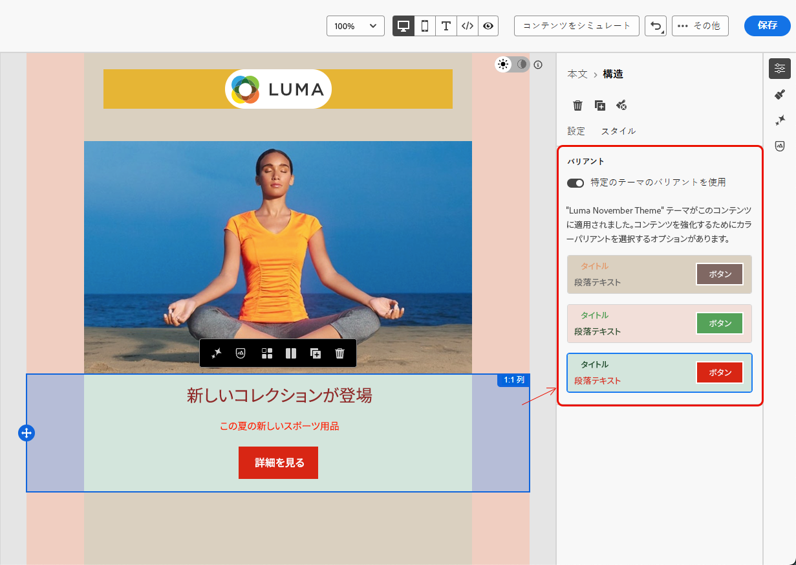

   この例では、現在のテーマの最初のカラーバリエーションはメールコンテンツ全体に適用されますが、3番目のカラーバリエーションは選択した構造に適用されます。 特定の構造の本文とビューポートの背景色が、他のコンテンツとは異なることがわかります。

いつでもテーマを切り替えることができます。 メールコンテンツは変更されませんが、新しいテーマを反映するようにスタイルが更新されます。

### スタイルのロック解除 {#unlocking-styles}

コンポーネントを選択すると、「**[!UICONTROL スタイル]**」タブの専用アイコンを使用して、そのスタイルのロックを解除できます。

選択したコンポーネントの「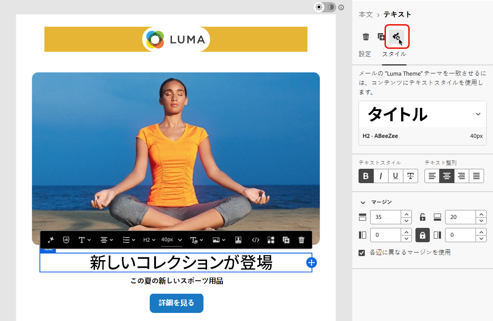{width="90%"}

選択したテーマは、そのコンポーネントに適用されますが、そのスタイル設定エレメントを上書きできます。 テーマを変更すると、新しいテーマは、上書きされなかったスタイル要素にのみ適用されます。<!--can you revert this action?-->

例えば、テキストコンポーネントのロックを解除すると、フォントカラーを<!--the font size from 11 to 14 and -->黒から赤に変更できます。

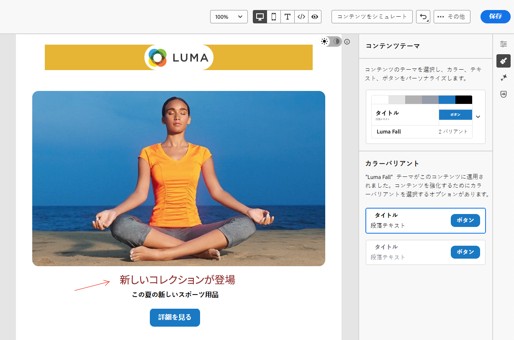{width="80%" align="center" zoomable="yes"}

テーマを変更した場合、<!--the font size is still 14 and -->そのコンポーネントのフォントカラーはまだ赤ですが、このコンポーネントの背景色は新しいテーマで変更されます。

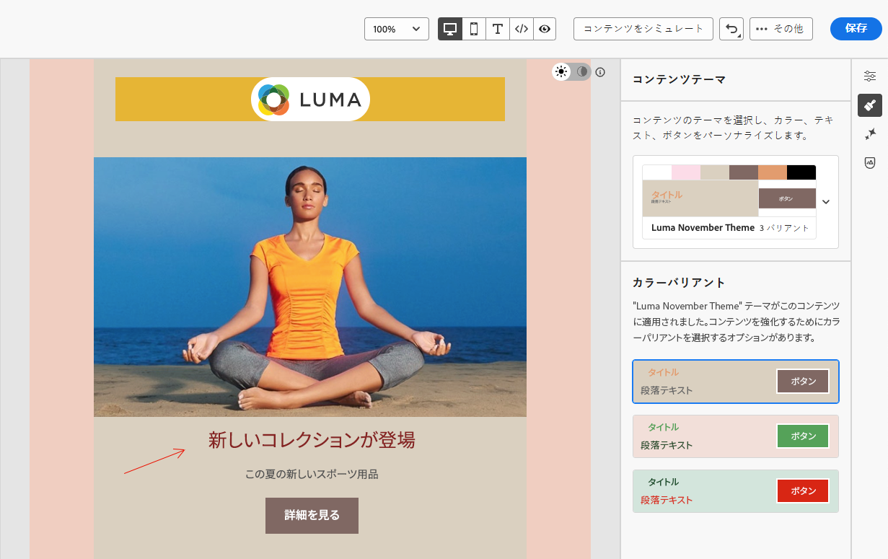{width="80%"}

## フラグメント内のテーマの活用 {#leverage-themes-fragment}

[ テーマが適用されたテンプレートまたはメール内のフラグメントを活用するには、](#apply-themes-email) テーマを使用して、このフラグメント自体が作成されている必要があります。 そうでない場合、テーマ別コンテンツでこのフラグメントを使用することはできません。

テーマと互換性のあるフラグメントを作成するには、次の手順に従います。

1. [!DNL Adobe Campaign]で、ビジュアルフラグメントを作成し、**[!UICONTROL 作成]**&#x200B;をクリックして、フラグメントのコンテンツをデザインします。 [詳細情報](../content/create-fragment.md#create-from-scratch)

1. 「**[!UICONTROL テーマを使用]**」を選択して、定義済みのスタイル設定テーマから開始します。

   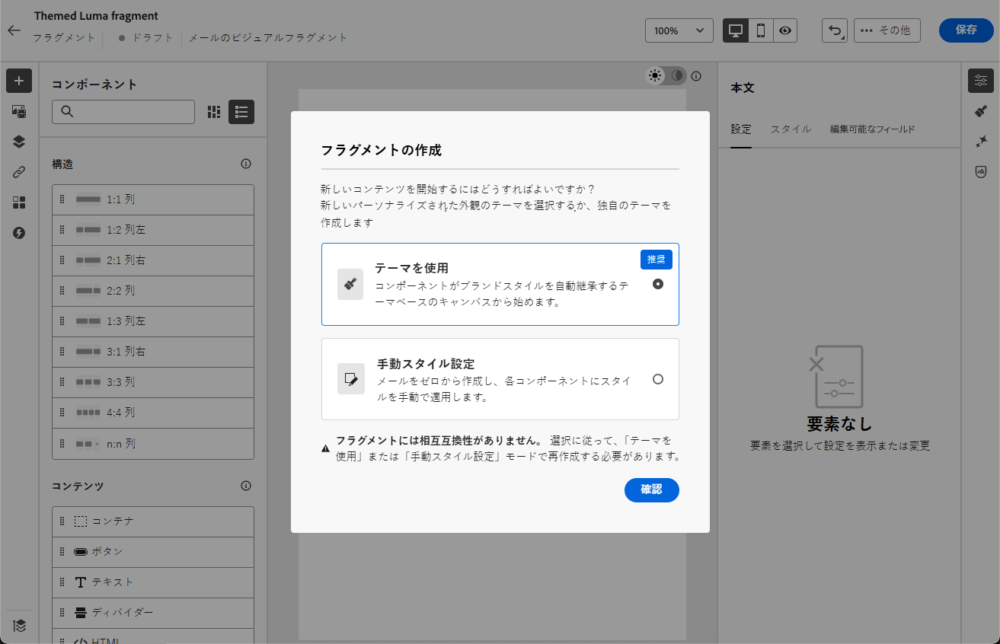{width="100%"}

   >[!CAUTION]
   >
   >手動スタイル設定モードを選択した場合、フラグメントデザインをリセットしない限り、テーマを適用することはできません。

1. メールDesignerで、フラグメントの作成を開始できます。

1. 右側のパネルの「**[!UICONTROL テーマ]**」ボタンをクリックします。 デフォルトのテーマが表示されます。 このテーマの異なるカラーバリエーションを切り替えることができます。

   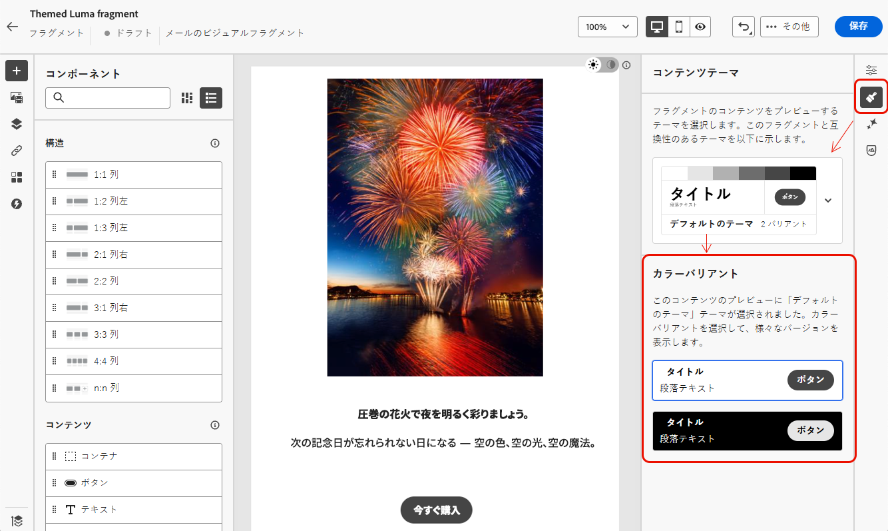{width="100%" align="center" zoomable="yes"}

1. 他のテーマを選択して、フラグメントコンテンツをプレビューできます。 これを行うには、デフォルトのテーマの横にある矢印を選択し、**[!UICONTROL テーマを選択]**&#x200B;をクリックします。

   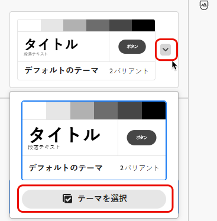{width="40%"}

1. **[!UICONTROL Adobe テーマ]**&#x200B;と&#x200B;**[!UICONTROL マイテーマ]**&#x200B;の間を移動し、フラグメントに対応するテーマを（両方のタブから）最大5つ選択できます。

   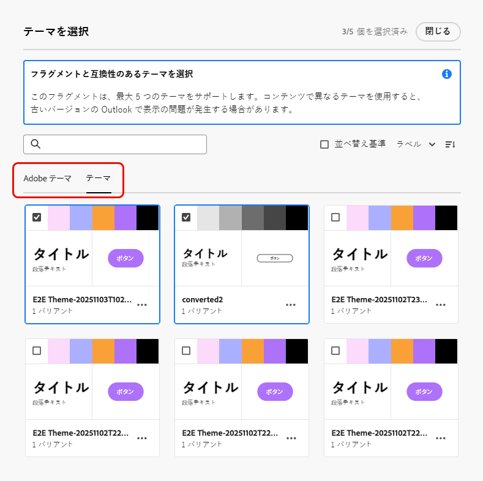{width=70%}

   >[!CAUTION]
   >
   >メールコンテンツでフラグメントを使用する場合は、このフラグメントに定義したテーマ [を](#apply-themes-email)適用してください。 そうしないと、特にOutlook 2021以前のバージョンで、表示の問題が発生する可能性があります。

1. 「**[!UICONTROL 閉じる]**」をクリックします。

1. **[!UICONTROL デフォルトテーマ]**&#x200B;の横にある矢印をもう一度選択します。 選択したさまざまなテーマを切り替えて、各スタイルレンダリングをプレビューできるようになりました。

   テーマパネルでプレビュー用に複数のテーマを選択した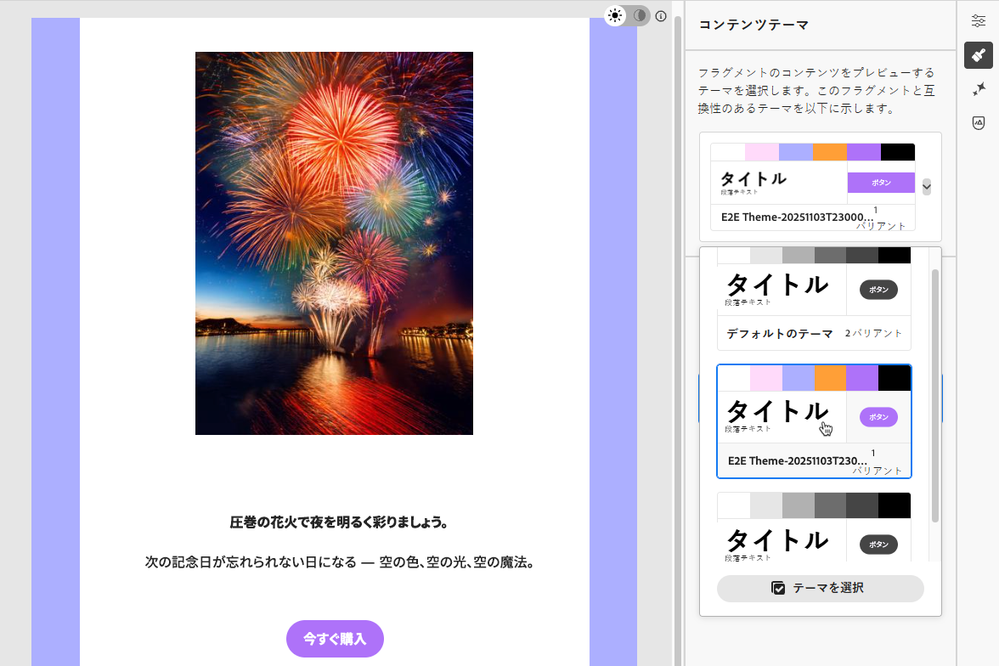{width=90%}

1. 「**[!UICONTROL テーマを選択]**」をもう一度クリックして、さらにテーマを追加するか、選択範囲を変更します。

## テーマに対応したテンプレートにする {#theme-convertor}

[!DNL Adobe Campaign]を使用すると、手動スタイル設定を使用して作成されたテンプレートをテーマ互換コンテンツに変換できます。 これは、テーマが[!DNL Adobe Campaign]に導入される前にコンテンツテンプレートを作成した場合や、外部コンテンツを読み込む場合に特に便利です。

>[!NOTE]
>
> テーマと互換性のある変換できるのは、**メールテンプレート**&#x200B;のみです。 個々のメールは変換できません。まず、コンテンツをテンプレートとして保存する必要があります。

1. 電子メール [ コンテンツテンプレート ](../content/create-email-templates.md)を開き、電子メール Designerを使用してコンテンツを編集します。

1. 右側のパネルで「**[!UICONTROL テーマ]**」アイコンを選択し、「**[!UICONTROL コンテンツからテーマを生成]**」ボタンをクリックします。

   「コンテンツからテーマを生成」ボタンがハイライト表示された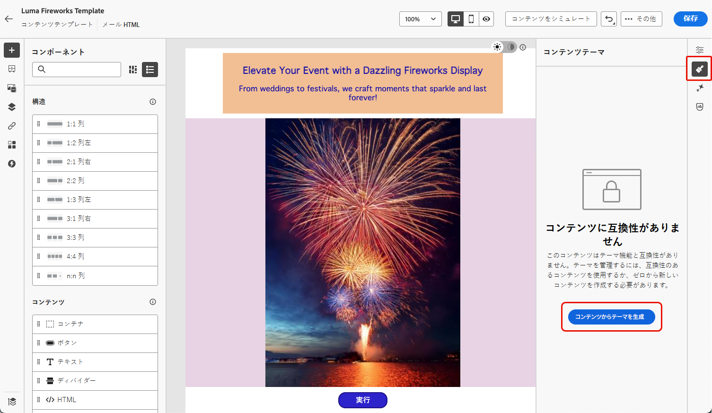{width=100%}

1. 「**[!UICONTROL テーマを作成]**」ウィンドウが開きます。 [!DNL Adobe Campaign]は、スタイル設定の要素を自動的に検出し、新しいテーマに統合します。

   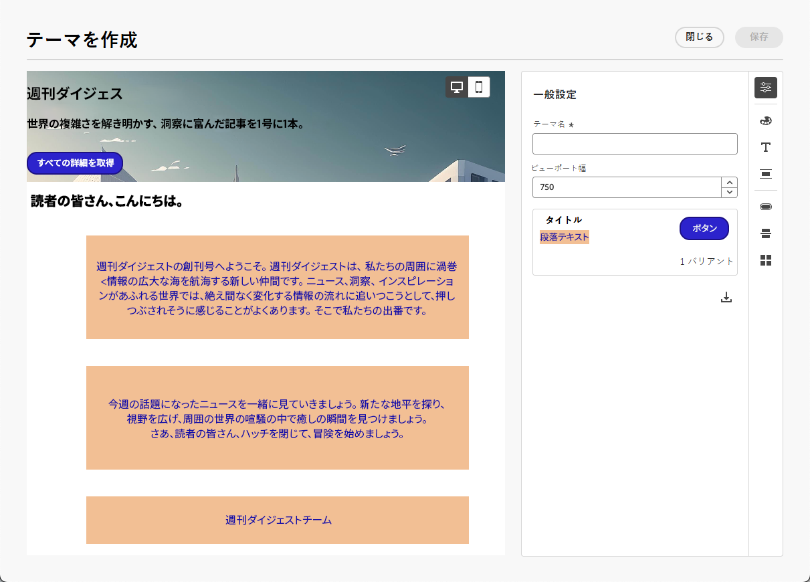{width=90%}

1. テーマに名前を付けます。

1. カラーバリエーションの追加やフォントの編集など、ゼロからテーマを作成する場合と同様に、必要に応じて独自の調整を行います。 [詳細情報](#create-and-edit-themes)

   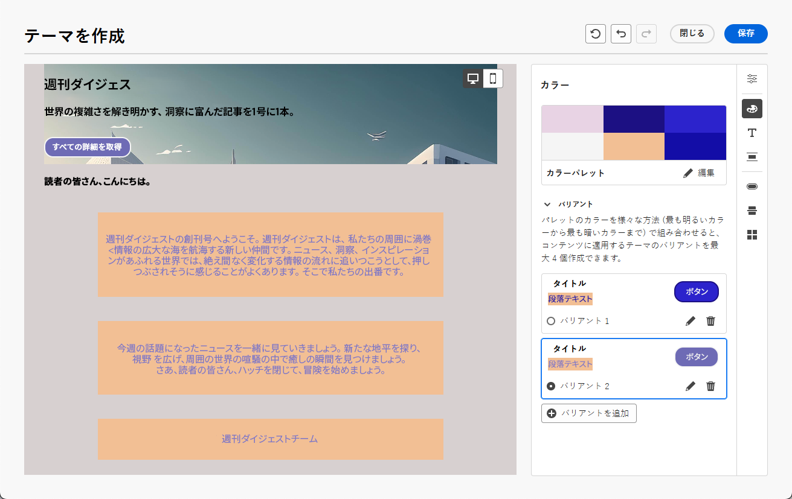{width=90%}

1. **[!UICONTROL 保存]**&#x200B;をクリックして、この新しいテーマを再利用のために保存します。 このテーマを、他のテーマなどのコンテンツに適用できるようになりました。 [詳細情報](#apply-themes-email)
