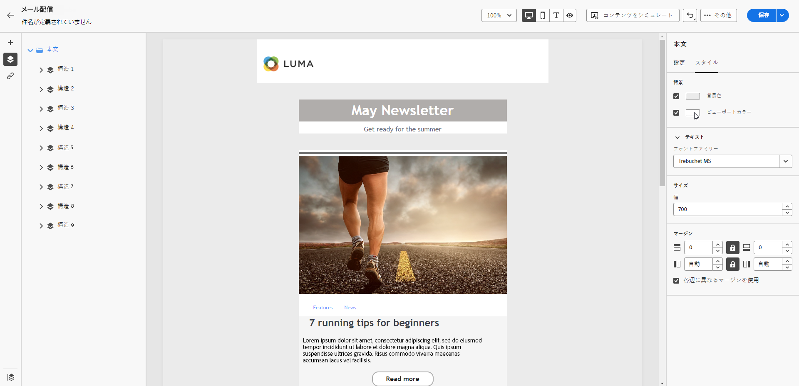
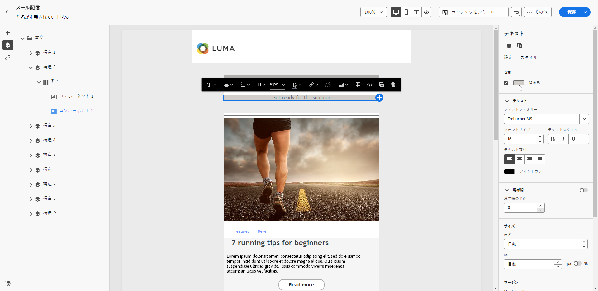
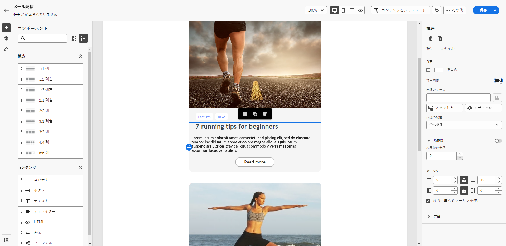
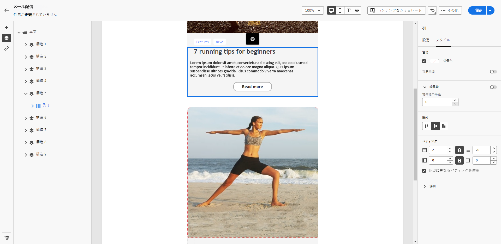

# メールの背景をパーソナライズする {#backgrounds}

>[!CONTEXTUALHELP]
>id="ac_edition_backgroundimage"
>title="背景設定"
>abstract="コンテンツの背景色や背景画像をパーソナライズできます。背景画像は、すべてのメールクライアントでサポートされているわけではありません。"

E メールデザイナーで背景を設定する際の推奨事項は次のとおりです。

1. デザインで必要な場合は、メールの本文に背景色を適用します。
1. ほとんどの場合、列レベルで背景色を設定します。
1. 画像やテキストコンポーネントは管理が困難なので、背景色の使用を回避します。

使用可能な背景設定を次に示します。

* **[!UICONTROL 背景色]**&#x200B;をメール全体に対して設定します。左側のウィンドウからアクセス可能なナビゲーションツリーで、本文設定を選択します。

  [ナビゲーションツリー経由でアクセスできる、メール本文全体に対する背景色の設定。]\
  {zoomable="yes"}

* すべての構造コンポーネントに同じ背景色を設定するには、**[!UICONTROL ビューポートの背景色]**&#x200B;を選択します。このオプションを使用すると、背景色から別の設定を選択できます。

  [ビューポートの背景色オプションを使用する、すべての構造コンポーネントに対する均一な背景色を設定する。]\
  {zoomable="yes"}

* 構造コンポーネントごとに異なる背景色を設定します。左側ウィンドウのナビゲーションツリーで構造を選択し、その構造にのみ特定の背景色を適用します。

  [ナビゲーションツリー経由での個々の構造コンポーネントに一意の背景色を適用する。]\
  {zoomable="yes"}

  >[!NOTE]
  >\
  >構造の背景色が隠れてしまう場合があるので、ビューポートの背景色を設定しないでください。

* 構造コンポーネントのコンテンツに対して、**[!UICONTROL 背景画像]**&#x200B;を設定します。

  [特定の構造コンポーネントのコンテンツに対する背景画像の追加。]\
  {zoomable="yes"}

  >[!NOTE]
  >\
  >一部のメールプログラムでは、背景画像はサポートされていません。サポートされていない場合は、代わりに行の背景色が使用されます。画像を表示できない場合は、適切なフォールバックの背景色を選択します。

* 列レベルで背景色を設定します。

  [柔軟性を高めるための列レベルでの背景色の適用。]\
  {zoomable="yes"}

  >[!NOTE]
  >\
  >これは最も一般的なユースケースです。アドビでは、メールコンテンツ全体を柔軟に編集できるように、背景色を列レベルで設定することをお勧めします。

  また、列レベルで背景画像を設定することもできますが、ほとんど使用されません。