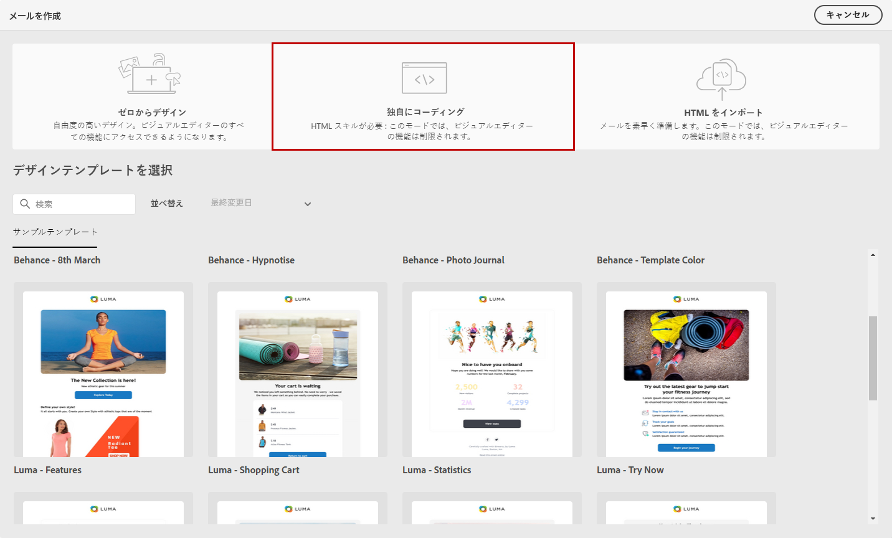
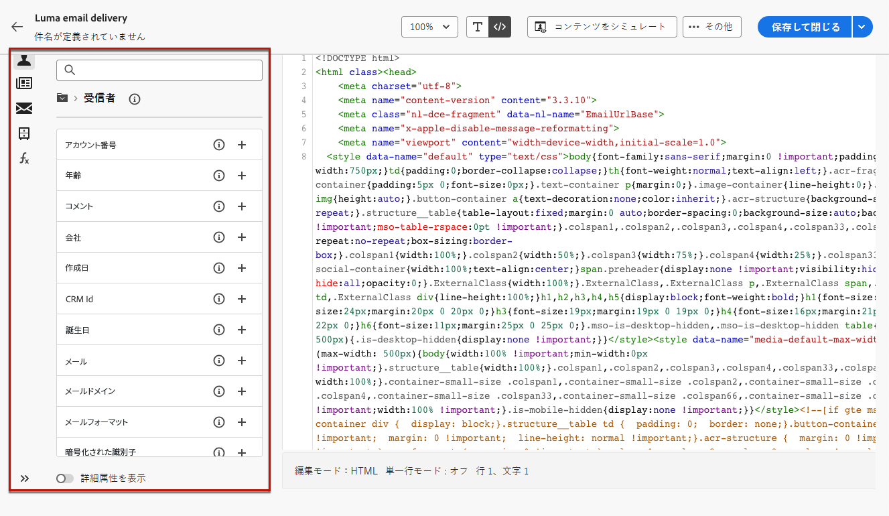

# 独自のメールコンテンツをコーディング {#code-content}

**[!UICONTROL 独自のコーディング]**&#x200B;モードを使用して、Raw HTML を読み込んだり、メールコンテンツをコーディングしたりします。

>[!CAUTION]
>
>この方法には、HTML スキルが必要です。

1. [E メールデザイナー](get-started-email-designer.md)のホームページで、「**[!UICONTROL 独自のコーディング]**」を選択します。

   {zoomable=&quot;yes&quot;}

1. メインキャンバスに生の HTML コードを入力するかペーストします。

1. 左側のペインを使用してパーソナライゼーション機能を活用します。[詳細情報](../personalization/gs-personalization.md)

   {zoomable=&quot;yes&quot;}

1. **[!UICONTROL コンテンツをシミュレート]**&#x200B;ボタンをクリックして、テストプロファイルを使用してメッセージデザインとパーソナライゼーションを確認します。[詳細情報](../preview-test/preview-test.md)

1. コードの準備が整ったら、「**[!UICONTROL 保存して閉じる]**」をクリックし、メッセージ作成画面に戻り、メッセージを最終決定します。
