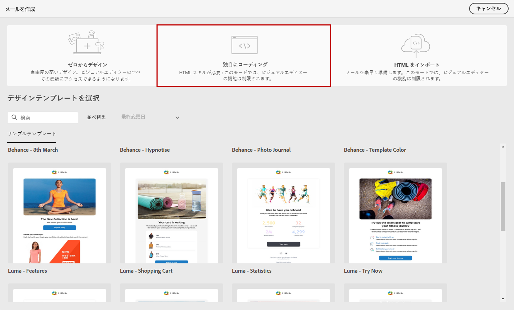
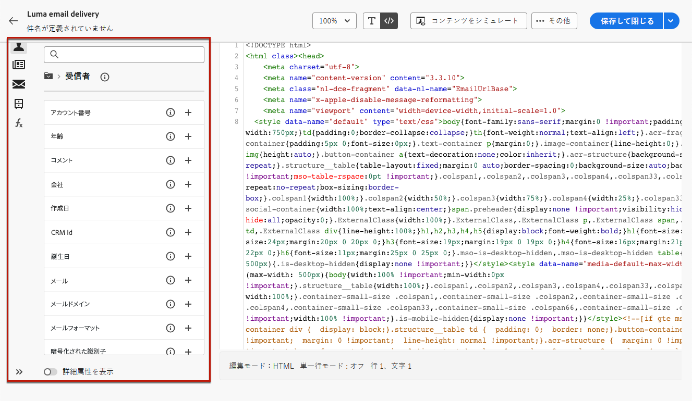

# 独自のメールコンテンツをコーディング {#code-content}

**[!UICONTROL 独自にコーディング]**&#x200B;モードを使用して、Raw HTML をインポートしたり、メールコンテンツをコーディングしたりします。

>[!CAUTION]
>
>この方法には、HTML の知識が必要です。

1. [E メールデザイナー](get-started-email-designer.md)のホームページで、「**[!UICONTROL 独自にコーディング]**」を選択します。

   {zoomable="yes"}

1. メインキャンバスに生の HTML コードを入力するかペーストします。

1. 左側のパネルを使用してパーソナライゼーション機能にアクセスします。 [詳細情報](../personalization/gs-personalization.md)

   {zoomable="yes"}

1. 「**[!UICONTROL コンテンツをシミュレート]**」ボタンをクリックして、テストプロファイルを使用してメッセージデザインとパーソナライゼーションをプレビューします。 [詳細情報](../preview-test/preview-test.md)

1. コードが完成したら、「**[!UICONTROL 保存して閉じる]**」をクリックし、メッセージ作成画面に戻り、メッセージを最終決定します。