# コンテンツコンポーネントの使用 {#content-components}

>[!CONTEXTUALHELP]
>id="ac_content_components_email"
>title="コンテンツについて"
>abstract="コンテンツコンポーネントは、メールのレイアウトの作成に使用できる空のコンテンツプレースホルダーです。"

>[!CONTEXTUALHELP]
>id="ac_content_components_landing_page"
>title="コンテンツについて"
>abstract="コンテンツコンポーネントは、ランディングページのレイアウトの作成に使用できる空のコンテンツプレースホルダーです。"

>[!CONTEXTUALHELP]
>id="ac_content_components_fragment"
>title="コンテンツについて"
>abstract="コンテンツコンポーネントは、コンテンツフラグメントのレイアウトの作成に使用できる空のコンテンツプレースホルダーです。"

>[!CONTEXTUALHELP]
>id="ac_content_components_template"
>title="コンテンツについて"
>abstract="コンテンツコンポーネントは、テンプレートのレイアウトの作成に使用できる空のコンテンツプレースホルダーです。"

メールコンテンツを作成する場合、**[!UICONTROL コンテンツ]**&#x200B;コンポーネントを使用すると、メールに配置して使用できる生の空コンポーネントでメールをパーソナライズできます。

メールのレイアウトを定義する&#x200B;**[!UICONTROL 構造]**&#x200B;内には、**[!UICONTROL コンテンツ]**&#x200B;を必要な数だけ追加できます。

## コンテンツコンポーネントを追加 {#add-content-components}

メールにコンテンツコンポーネントを追加し、必要に応じて調整するには、次の手順に従います。

1. E メールデザイナーで、[既存のコンテンツ](existing-content.md)を使用するか、**[!UICONTROL 構造]**&#x200B;を空のコンテンツにドラッグ＆ドロップして、メールのレイアウトを定義します。方法については、[こちら](create-email-content.md)を参照してください。

1. 選択した&#x200B;**[!UICONTROL コンテンツ]**&#x200B;を、関係のある構造内にドラッグ＆ドロップします。

   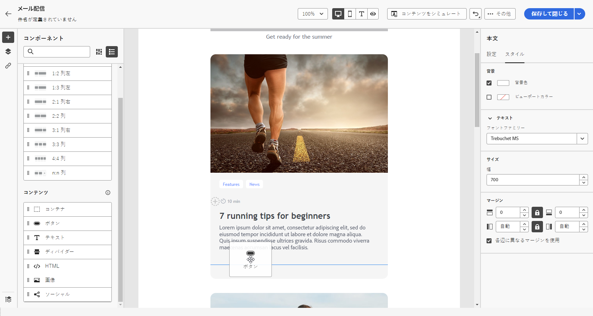{zoomable="yes"}

   >[!NOTE]
   >
   >単一の構造および構造の各列に複数のコンポーネントを追加できます。

1. コンテキストの「**[!UICONTROL 設定]**」タブを使用して、各コンポーネントのオプションを調整します。例えば、デスクトップやモバイルデバイスのみ、またはその両方に表示するように選択します。また、このタブでリンクオプションを管理することもできます。[リンクの管理に関する詳細情報](message-tracking.md)

1. 「**[!UICONTROL スタイル]**」タブを使用して、各コンポーネントのスタイル属性を調整します。例えば、各コンポーネントのテキストスタイル、パディングまたは余白を変更します。[詳しくは、整列とパディングを参照してください](alignment-and-padding.md)

   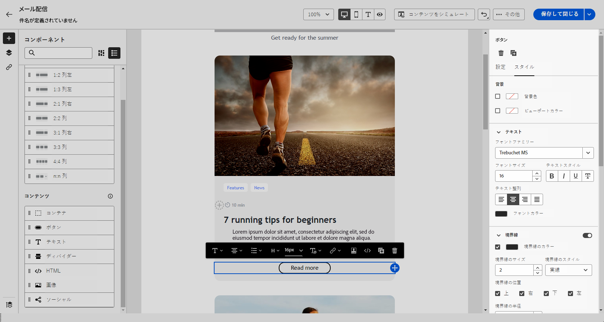{zoomable="yes"}

1. 右側のパネルにある&#x200B;**[!UICONTROL コンテンツ]**&#x200B;の詳細メニューで、必要に応じてコンテンツコンポーネントを削除または複製します。

## コンテナ {#container}

シンプルなコンテナを追加して、その中に別のコンテンツコンポーネントを追加することができます。これにより、コンポーネント内部で使用されるものとは異なる特定のスタイルをコンテナに適用できます。

例えば、**[!UICONTROL コンテナ]**&#x200B;コンポーネントを追加したあと、そのコンテナの内部に[ボタン](#button)コンポーネントを追加します。コンテナには特定の背景を使用し、ボタンには別の背景を指定します。

{zoomable="yes"}

## ボタン {#buttons}

**[!UICONTROL ボタン]**&#x200B;コンポーネントを使用すると、メールに 1 つまたは複数のボタンを挿入し、メールのオーディエンスを別のページにリダイレクトすることができます。

1. **[!UICONTROL コンテンツ]**&#x200B;リストから、**[!UICONTROL ボタン]**&#x200B;コンポーネントを&#x200B;**[!UICONTROL 構造]**&#x200B;コンポーネントにドラッグ＆ドロップします。

   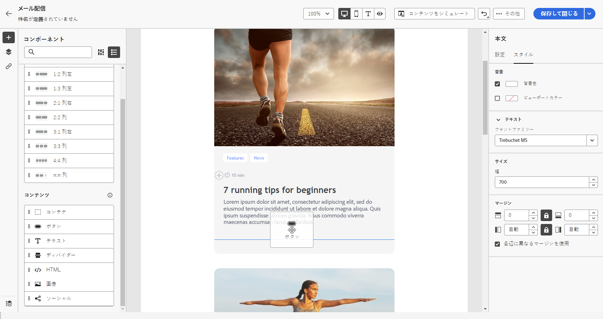{zoomable="yes"}

1. 新しく追加したボタンをクリックして、テキストをパーソナライズし、「**[!UICONTROL 設定]**」タブと「**[!UICONTROL スタイル]**」タブにアクセスします。

   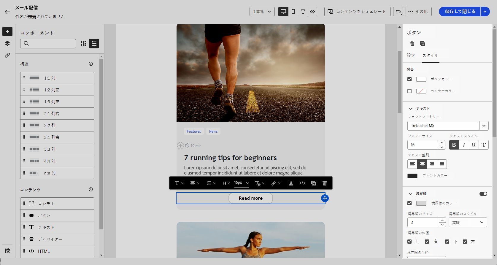{zoomable="yes"}

1. 「**[!UICONTROL 設定]**」タブの「**[!UICONTROL URL]**」フィールドに、ボタンをクリックしたときにリダイレクトする URL を追加します。

1. 「**[!UICONTROL ターゲット]**」ドロップダウンリストを使用して、コンテンツの表示方法を選択します。

   * **[!UICONTROL なし]**：クリックされたのと同じフレームでリンクを開きます（デフォルト）。
   * **[!UICONTROL 空白]**：リンクを新しいウィンドウまたはタブで開きます。
   * **[!UICONTROL セルフ]**：クリックされたのと同じフレームでリンクを開きます。
   * **[!UICONTROL 親]**：親フレームでリンクを開きます。
   * **[!UICONTROL 上]**：ウィンドウの全体でリンクを開きます。

   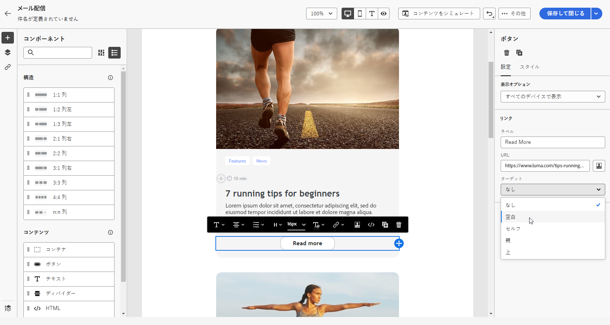{zoomable="yes"}

1. 「**[!UICONTROL スタイル]**」タブから&#x200B;**[!UICONTROL 境界線]**、**[!UICONTROL サイズ]**、**[!UICONTROL 余白]**&#x200B;などのスタイル属性を変更して、ボタンをさらにパーソナライズします。

## テキスト {#text}

**[!UICONTROL テキスト]**&#x200B;コンポーネントを使用すると、メールにテキストを挿入し、スタイル（境界線、サイズ、パディングなど）を「**[!UICONTROL 設定]**」タブと「**[!UICONTROL スタイル]**」タブを使用して調整できます。

1. **[!UICONTROL コンテンツ]**&#x200B;メニューから、**[!UICONTROL テキスト]**&#x200B;を&#x200B;**[!UICONTROL 構造]**&#x200B;コンポーネントにドラッグ＆ドロップします。

   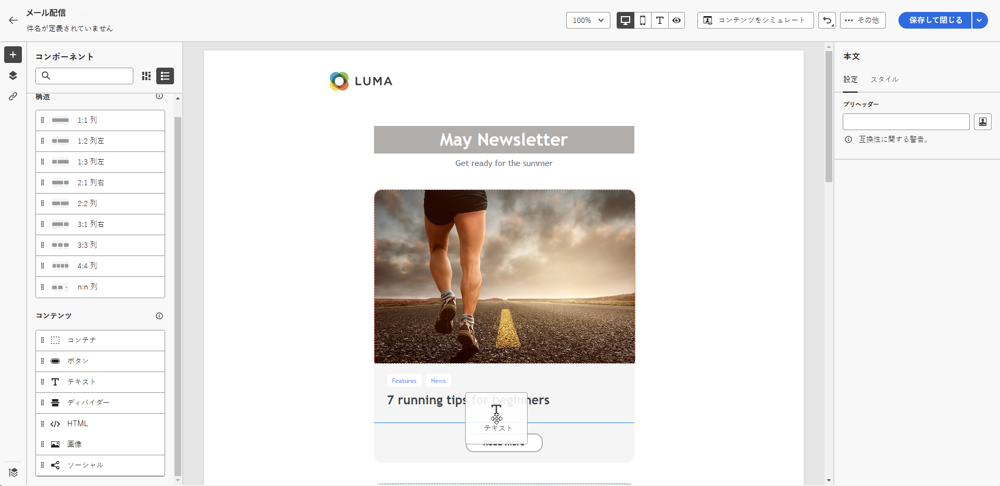{zoomable="yes"}

1. 新しく追加したコンポーネントをクリックして、テキストをパーソナライズし、「**[!UICONTROL 設定]**」タブと「**[!UICONTROL スタイル]**」タブにアクセスします。

1. コンテキストツールバーから使用できる次のオプションを使用して、テキストを変更します。

   {zoomable="yes"}

   * **[!UICONTROL テキストスタイルを変更]**：テキストに太字、斜体、下線または取り消し線を適用します。
   * **整列を変更**：テキストの配置を左揃え、右揃え、中央揃えまたは両端揃えにします。
   * **[!UICONTROL リストを作成]**：テキストに箇条書きリストまたは番号リストを追加します。
   * **[!UICONTROL 見出しを設定]**：テキストに最大 6 つの見出しレベルを追加します。
   * **フォントサイズ**：テキストのフォントサイズをピクセル単位で選択します。
   * **[!UICONTROL 画像を編集]**：テキストコンポーネントに画像またはアセットを追加します。
   * **[!UICONTROL ソースコードを表示]**：テキストのソースコードを表示します。これは変更できません。
   * **[!UICONTROL 複製]**：テキストコンポーネントの複製を追加します。
   * **[!UICONTROL 削除]**：選択したテキストコンポーネントをメールから削除します。
   * **[!UICONTROL パーソナライゼーションを追加]**：パーソナライゼーションフィールドを追加して、プロファイルデータからコンテンツをカスタマイズします。
   * **[!UICONTROL 条件付きコンテンツを有効にする]**：条件付きコンテンツを追加して、コンポーネントのコンテンツをターゲットプロファイルに適応させます。

1. その他のスタイル属性（テキストの色、フォントファミリー、境界線、パディング、余白など）を「**[!UICONTROL スタイル]**」タブから調整します。

   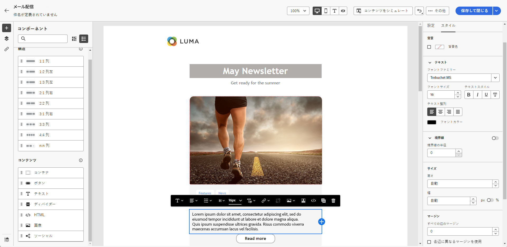{zoomable="yes"}

## ディバイダー {#divider}

**[!UICONTROL ディバイダー]**&#x200B;コンポーネントを使用すると、分割線を挿入してメールのレイアウトとコンテンツを整理できます。

線の色、スタイル、高さなどのスタイル属性は、「**[!UICONTROL スタイル]**」タブから調整できます。

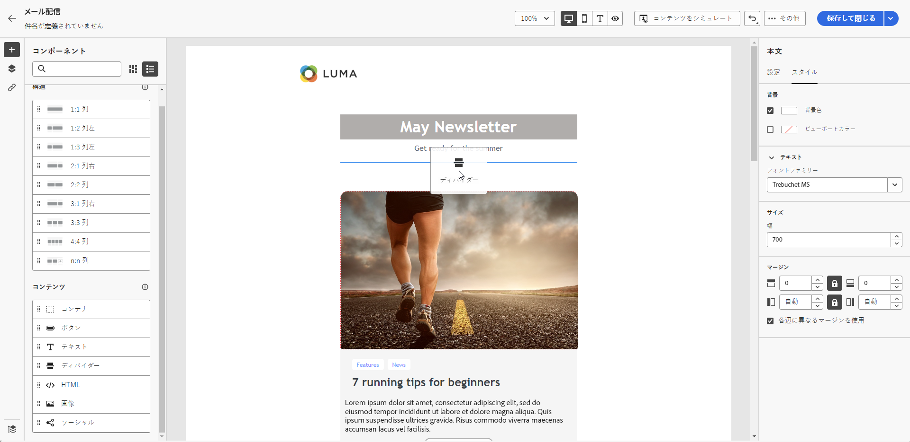{zoomable="yes"}

## HTML {#HTML}

**[!UICONTROL HTML]** コンポーネントを使用して、既存の HTML の一部をコピーして貼り付けることができます。これにより、無料のモジュラー HTML コンポーネントを作成して、外部コンテンツを再利用できます。

1. **[!UICONTROL コンポーネント]**&#x200B;から、**[!UICONTROL HTML]** コンポーネントを&#x200B;**[!UICONTROL 構造]**&#x200B;コンポーネントにドラッグ＆ドロップします。

   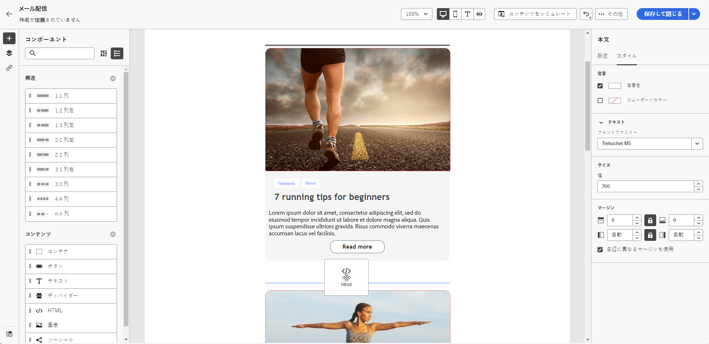{zoomable="yes"}

1. 新しく追加したコンポーネントをクリックし、コンテキストツールバーから「**[!UICONTROL ソースコードを表示]**」選択して HTML を追加します。

   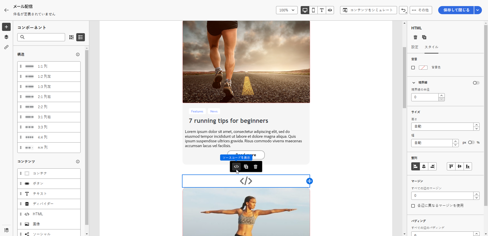{zoomable="yes"}

>[!NOTE]
>
>外部コンテンツをE メールデザイナーに準拠させるには、[ゼロからメッセージを作成](create-email-content.md)し、既存のメールのコンテンツをコンポーネントにコピーすることをお勧めします。

## 画像 {#image}

>[!IMPORTANT]
>
>Assets メニューへのアクセスは、アクティブな Adobe Experience Manager as a Cloud Service ライセンスを持つユーザーに制限されます。このライセンスを保持していない場合、Assets メニューは使用できません。

**[!UICONTROL 画像]**&#x200B;コンポーネントを使用して、コンピューターからメールに画像ファイルを挿入します。

1. **[!UICONTROL コンテンツ]**&#x200B;メニューで、**[!UICONTROL 画像]**&#x200B;コンポーネントを&#x200B;**[!UICONTROL 構造]**&#x200B;コンポーネントにドラッグ＆ドロップします。

   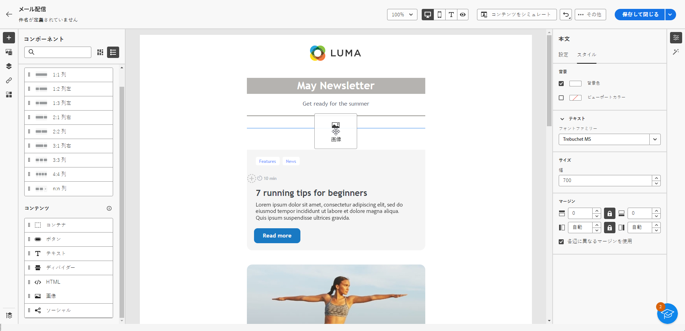{zoomable="yes"}

1. 「**[!UICONTROL 参照]**」をクリックして、アセットから画像ファイルを選択します。また、「**[!UICONTROL メディアを読み込み]**」を選択することもできます。

   Adobe Experience Manager でアセットをアップロードおよび追加する方法について詳しくは、[Adobe Experience Manager as a Cloud Service ドキュメント](https://experienceleague.adobe.com/docs/experience-manager-cloud-service/content/assets/manage/add-assets.html?lang=ja)を参照してください。

   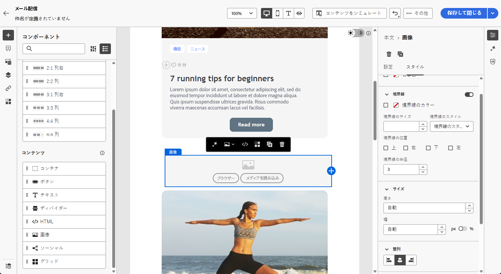{zoomable="yes"}

1. フォルダー内を移動して必要な特定のアセットを見つけるか、検索バーを使用して効率的に見つけます。

   検索しているアセットが見つかったら、「**[!UICONTROL 選択]**」をクリックします。

   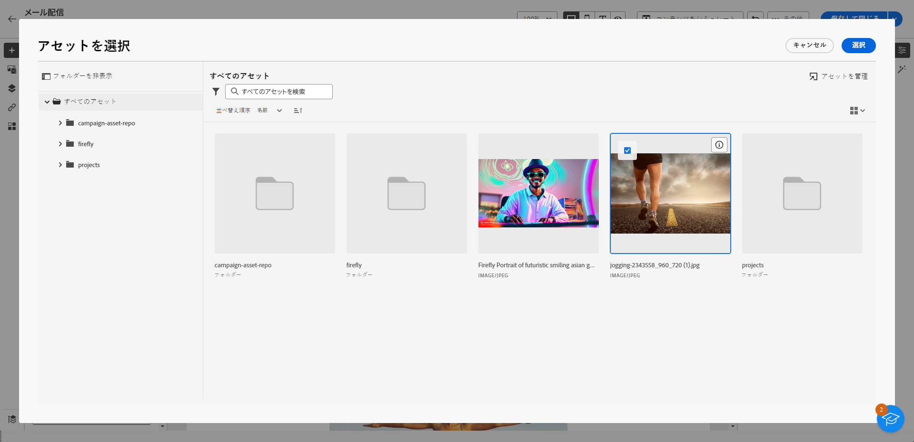{zoomable="yes"}

1. 新しく追加したコンポーネントをクリックし、「**[!UICONTROL 設定]**」タブを使用して画像プロパティを設定します。

   * **[!UICONTROL 画像タイトル]**&#x200B;を使用すると、画像のタイトルを指定できます。
   * **[!UICONTROL 代替テキスト]**&#x200B;を使用すると、画像にリンクされたキャプションを定義できます。これは、HTML の alt 属性に対応します。

   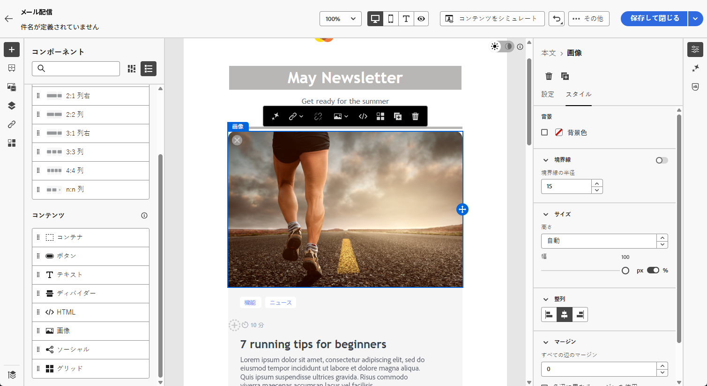{zoomable="yes"}

1. オーディエンスを別のコンテンツにリダイレクトするリンクを追加します。[詳細情報](message-tracking.md)

1. 「**[!UICONTROL スタイル]**」タブを使用して、余白、境界線などの他のスタイル属性を調整します。

## ソーシャル {#social}

**[!UICONTROL ソーシャル]**&#x200B;コンポーネントを使用すると、メールコンテンツにソーシャルメディアページへのリンクを挿入できます。

1. **[!UICONTROL コンテンツ]**&#x200B;コンテンツメニューから、**[!UICONTROL ソーシャル]**&#x200B;コンポーネントを&#x200B;**[!UICONTROL 構造]**&#x200B;コンポーネントにドラッグ＆ドロップします。

1. 新しく追加したコンポーネントをクリックします。

1. 「**[!UICONTROL 設定]**」タブの「**[!UICONTROL ソーシャル]**」フィールドで、追加または削除するソーシャルメディアを選択します。

   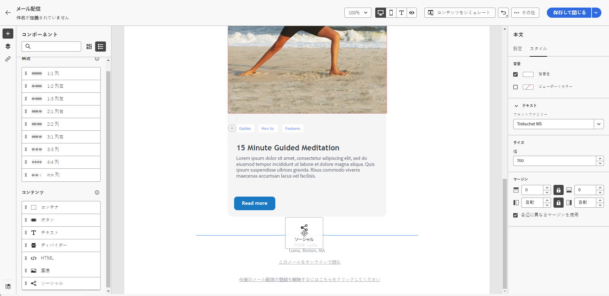{zoomable="yes"}

1. 「**[!UICONTROL 画像のサイズ]**」フィールドでアイコンのサイズを選択します。

1. 各ソーシャルメディアアイコンをクリックして、オーディエンスのリダイレクト先の **[!UICONTROL URL]** を設定します。

   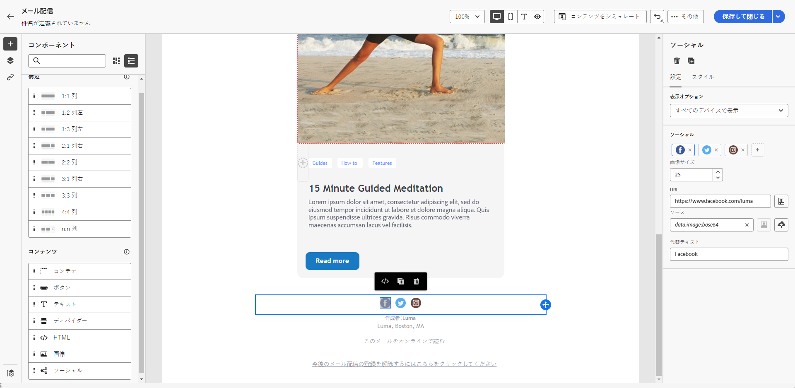{zoomable="yes"}

1. 必要に応じて、「**[!UICONTROL ソース]**」フィールドで各ソーシャルメディアのアイコンを変更します。

1. 「**[!UICONTROL スタイル]**」タブから、スタイル、余白、境界線などの他のスタイル属性を調整します。