# コンテンツテンプレートの操作 {#content-templates}

>[!CONTEXTUALHELP]
>id="acw_contenttemplate_menu"
>title="コンテンツテンプレート"
>abstract="設計プロセスを加速し改善するために、スタンドアロンのメールテンプレートを作成すると、Adobe Campaign 全体でカスタムコンテンツを簡単に再利用できます。これらのコンテンツテンプレートは、ビルトインテンプレートまたはカスタムテンプレートに基づいてゼロから設計したり、既存のコンテンツから作成したり、コンテンツテンプレートエディターにインポートしたりできます。"

設計プロセスを加速し改善するために、スタンドアロンのテンプレートを作成すると、[!DNL Adobe Campaign] 全体でカスタムコンテンツを簡単に再利用できます。これらのコンテンツテンプレートは、組み込みテンプレートやカスタムテンプレートに基づいてゼロから設計することも、既存のコンテンツから作成することも、コンテンツテンプレートエディターに読み込むこともできます。

この機能を使用すると、コンテンツ指向のユーザーはスタンドアロンテンプレートで作業できるので、マーケティングユーザーは独自のメールキャンペーン内でテンプレートを再利用および調整できます。

>[!NOTE]
>
>現在、**メール** コンテンツテンプレートのみがサポートされています。

## コンテンツテンプレートへのアクセス {#access-templates}

>[!CONTEXTUALHELP]
>id="acw_contenttemplate_edition"
>title="テンプレートコンテンツの編集"
>abstract="「**コンテンツを編集**」ボタンをクリックして、メールデザイナーでコンテンツを更新します。"

コンテンツテンプレートリストにアクセスするには、左側のパネルから&#x200B;**[!UICONTROL コンテンツ管理]**／**[!UICONTROL コンテンツテンプレート]**&#x200B;メニューを参照します。

{zoomable="yes"}

このダッシュボードには、使用可能なすべてのコンテンツテンプレートがリストとして表示されます。ドロップダウンリストを使用して特定の[フォルダー](../get-started/permissions.md#folders)をフィルタリングしたり、[クエリモデラー](../query/query-modeler-overview.md)を使用してルールを追加したりできます。

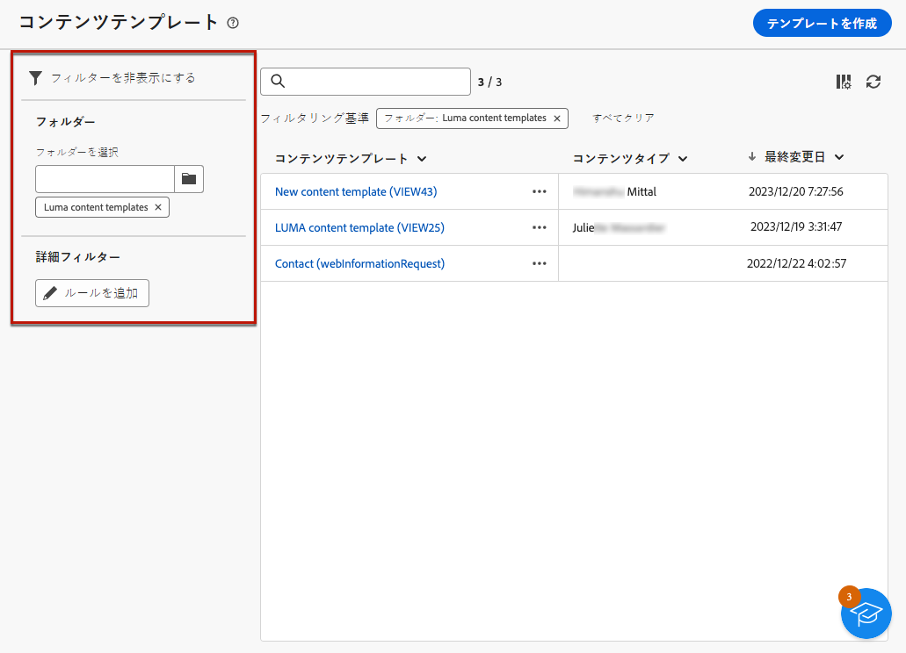{zoomable="yes"}

リストから、既存のコンテンツテンプレートを編集、複製または削除できます。コンテンツテンプレートを作成するには、上部のセクションにあるボタンを使用します。

### 読み取り専用モードのコンテンツテンプレート {#template-readonly}

アクセス権はコンテンツテンプレートに適用される場合があります。

特定のコンテンツテンプレートの編集権限がない場合、そのコンテンツテンプレートは&#x200B;**読み取り専用モード**&#x200B;で表示されます。この場合、「**[!UICONTROL コンテンツを編集]**」ボタンは「**[!UICONTROL コンテンツを表示]**」ボタンに置き換えられ、変更を加えることなくテンプレートを表示できます。

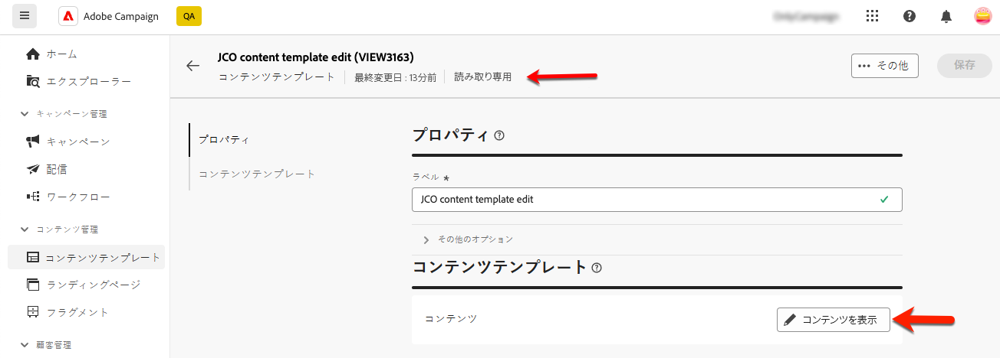{zoomable="yes"}

以下に示すように、すべての機能アイコンが非アクティブ化され、インタラクションは表示のみに制限されます。

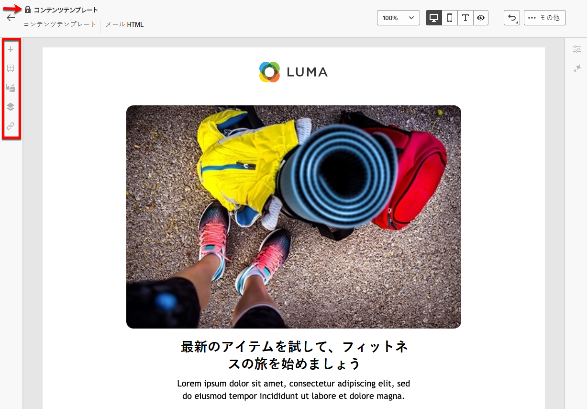{zoomable="yes"}

## コンテンツテンプレートの作成 {#create-content-templates}

>[!CONTEXTUALHELP]
>id="acw_contenttemplate_design"
>title="コンテンツテンプレートのデザイン"
>abstract="メールコンテンツテンプレートをデザインします。"

>[!CONTEXTUALHELP]
>id="acw_contenttemplate_selection"
>title="コンテンツテンプレートの選択"
>abstract="メールコンテンツテンプレートを選択します。"

コンテンツテンプレートを作成するには、[ 既存のメールをテンプレートとして保存 ](#save-as-template) するか、メールテンプレートのリストから **コンテンツテンプレートを作成** ボタンを使用します [ 以下で詳しく説明します ](#create-template-from-scratch)。

保存すると、[!DNL Adobe Campaign] 内で [ メール ](../email/create-email.md) を作成する際にこのテンプレートを使用できます。 [詳細情報](use-email-templates.md)

>[!NOTE]
>
>* コンテンツテンプレートに加えた変更は、メールには生成されません。
>
>* 同様に、メールでテンプレートを使用している場合、メールのコンテンツに対して行った編集は、以前に使用したコンテンツテンプレートには影響しません。

### 新しいコンテンツテンプレートの作成 {#create-template-from-scratch}

>[!CONTEXTUALHELP]
>id="acw_contenttemplate_properties"
>title="テンプレートプロパティの定義"
>abstract="必要に応じて簡単に取得できるように、メールコンテンツテンプレートのプロパティを定義します。"

コンテンツテンプレートダッシュボードから新しいコンテンツテンプレートを作成するには、次の手順に従います。

1. **[!UICONTROL コンテンツ管理]**／**[!UICONTROL コンテンツテンプレート]**&#x200B;の左側のパネルからコンテンツテンプレートリストを参照します。

1. 「**[!UICONTROL テンプレートを作成]**」を選択します。

   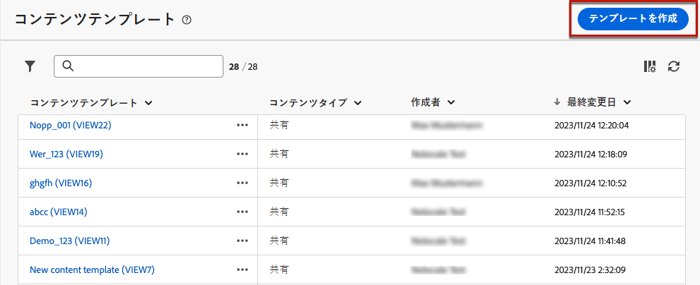{zoomable="yes"}

1. テンプレートのラベルとプロパティを入力します。テンプレートを保存するフォルダーを選択できます。デフォルトでは、コンテンツテンプレートは、Adobe Campaign 階層の専用フォルダー（**[!UICONTROL エクスプローラー]**／**[!UICONTROL リソース]**／**[!UICONTROL テンプレート]**／**[!UICONTROL コンテンツテンプレート]**）に保存されます。フォルダーについて詳しくは、[このページ](../get-started/permissions.md#folders)を参照してください。

   {zoomable="yes"}

1. 「**[!UICONTROL 作成]**」をクリックし、次の様々なオプションからテンプレートのデザイン方法を選択します。

   * [コンテンツをゼロからデザイン](create-email-content.md) - E メールデザイナーのインターフェイスを使用します。
   * [Raw HTML をコーディングまたはコピー＆ペースト](code-content.md) - メールデザイナーで直接行います。
   * [既存の HTML コンテンツをインポート](existing-content.md) - ファイルまたは .zip フォルダーから行います。
   * 組み込みまたはカスタムテンプレートのリストから既存のコンテンツを使用します。メールでコンテンツテンプレートを使用する手順については、[この節](use-email-templates.md)を参照してください。

   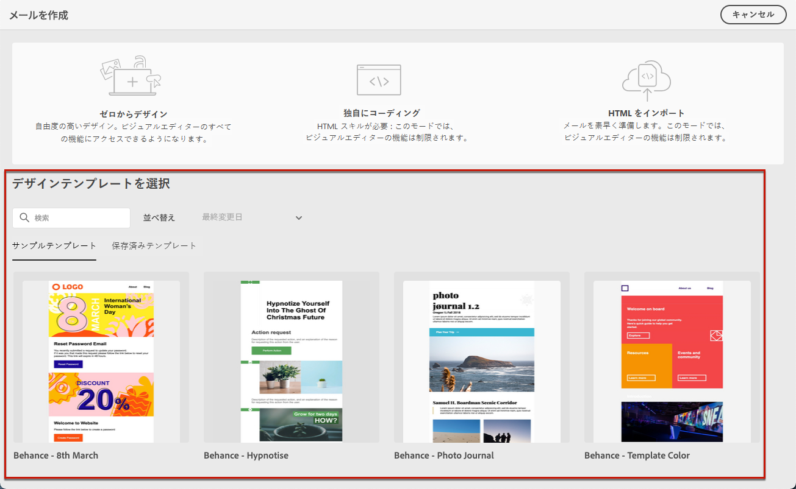{zoomable="yes"}

1. E メールデザイナーが表示されます。選択したオプションに従って、他のメールの場合と同じ方法で、必要に応じてコンテンツを編集します。メールデザイナーの使用方法については、[この節](get-started-email-designer.md)をご覧ください。

   <!--You can test your content if needed. [Learn how](#test-template)-->

1. テンプレートの準備が整ったら、「**[!UICONTROL 保存]**」をクリックします。

   必要に応じて、テンプレート名の横にある矢印をクリックして&#x200B;**[!UICONTROL 詳細]**&#x200B;画面に戻り、テンプレートを編集します。

   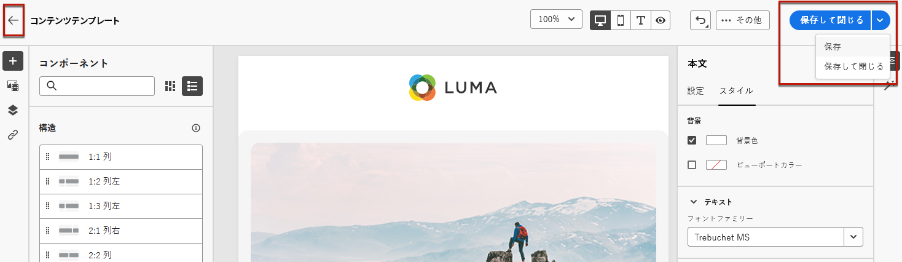{zoomable="yes"}

このテンプレートは、**[!UICONTROL コンテンツテンプレート]**&#x200B;リストで利用できます。[詳細情報](#access-templates)

これで、このテンプレートを使用して新しいコンテンツを作成できます。 これは、メールDesignerの「**[!UICONTROL 保存済みのテンプレート]**」タブで使用できます。 [詳細情報](use-email-templates.md)

### メールコンテンツをテンプレートとして保存 {#save-as-template}

[ メールをデザイン ](create-email-content.md) すると、後で再利用できるように、このコンテンツをテンプレートとして保存できます。 保存済みのテンプレートは、Adobe Campaign 環境のすべてのユーザーが使用できます。

メールコンテンツをテンプレートとして保存するには、次の手順に従います。

1. メールデザイナーで、画面の右上にある **[!UICONTROL 詳細]** ボタンをクリックします。

1. ドロップダウンメニューから「**[!UICONTROL コンテンツテンプレートとして保存]**」を選択します。

   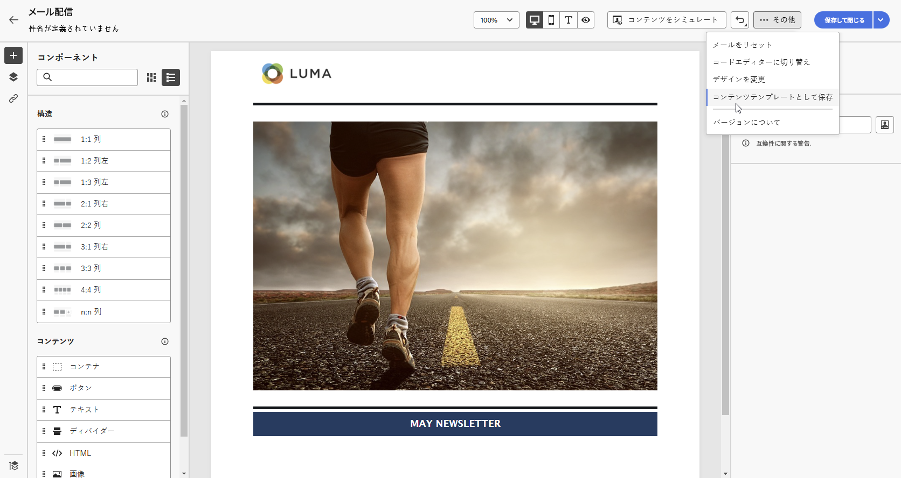{zoomable="yes"}

1. このテンプレートの名前を入力して保存します.

   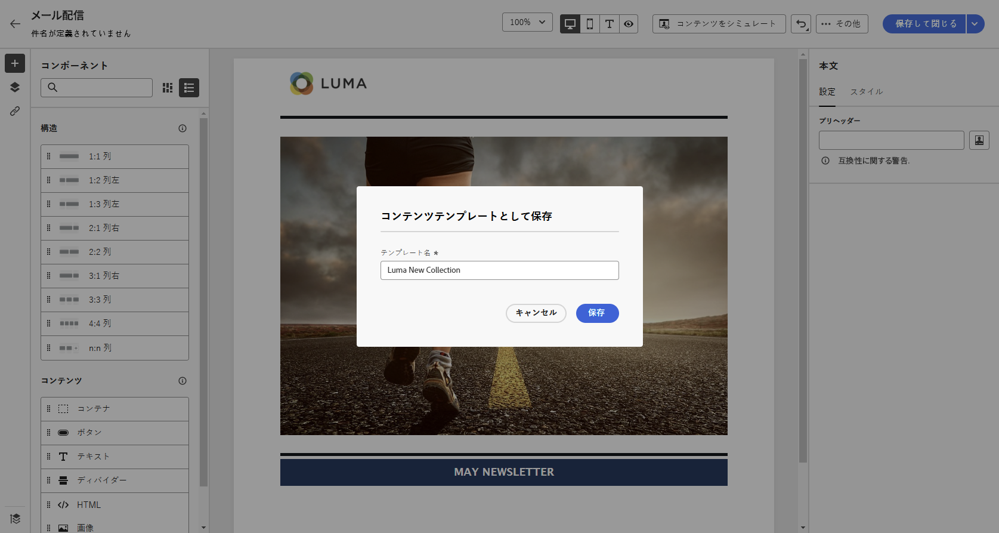{zoomable="yes"}

**[!UICONTROL コンテンツテンプレート]**&#x200B;リストにテンプレートが保存され、表示されます。このテンプレートは、そのリストの他の項目と同様に、アクセス、編集、削除できるスタンドアロンのコンテンツテンプレートになります。 [詳細情報](#access-manage-templates)

これで、このテンプレートを使用して新しいコンテンツを作成できます。 これは、メールDesignerの「**[!UICONTROL 保存済みのテンプレート]**」タブで使用できます。 [詳細情報](use-email-templates.md)

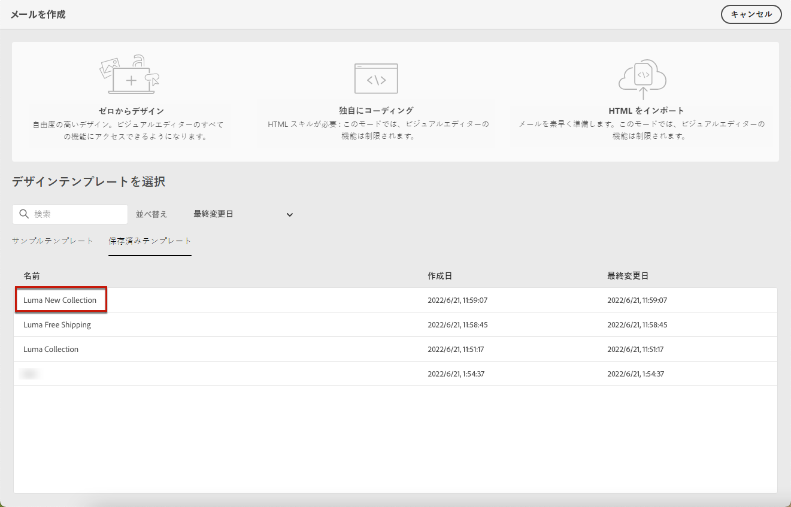{zoomable="yes"}

>[!NOTE]
>
>その新しいテンプレートに対する変更は、送信元のメールには生成されません。同様に、そのメール内の元のコンテンツを編集しても、新しいテンプレートは変更されません。

<!--

Test your content template {#test-template}

You can test the rendering of any email content template, whether created from scratch or from an email. To do so, follow the steps below.

1. Access the content template list.

1. Click **[!UICONTROL Edit content]** from the **[!UICONTROL Template properties]**.

1. Click **[!UICONTROL Simulate Content]** and select a test profile to check your email rendering. You can choose the desktop or mobile view.

1. You can send a proof to test your content and have it approved by some internal users before using it. To do so, click the **[!UICONTROL Send proof]** button and follow the steps described in .

-->

## コンテンツテンプレートを変更する {#modify-delete}

既存のコンテンツテンプレートを更新するには、次の手順に従います。

1. コンテンツテンプレートのリストで、変更するテンプレートのラベルをクリックします。

1. 「**[!UICONTROL コンテンツを編集]**」ボタンをクリックして、[メールデザイナー](get-started-email-designer.md)でコンテンツを更新します。

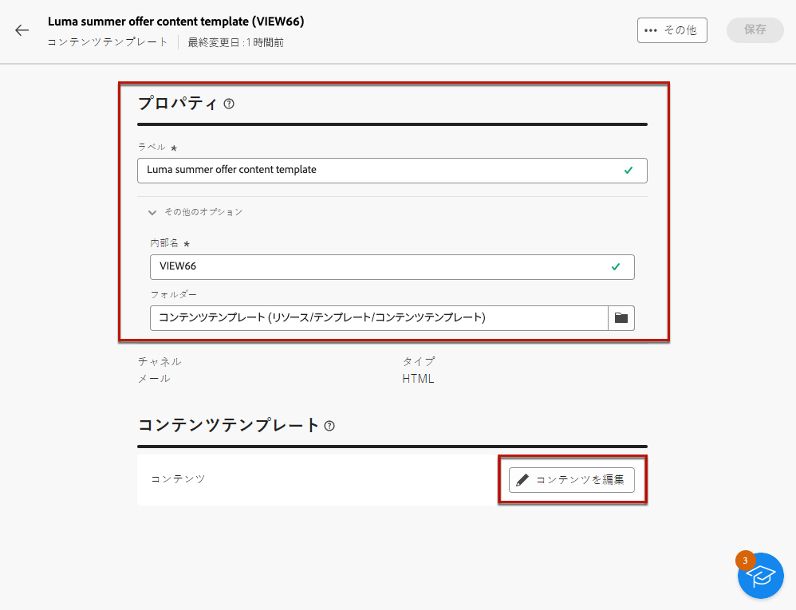{zoomable="yes"}

>[!NOTE]
>
>コンテンツテンプレートに加えた変更は、このコンテンツテンプレートを使用しているメールには反映されません。

## コンテンツテンプレートを削除する {#content-delete}

コンテンツテンプレートを削除するには、次の 2 つがあります。

* コンテンツテンプレートのリストで、省略記号ボタンをクリックし、「**削除**」を選択します。

  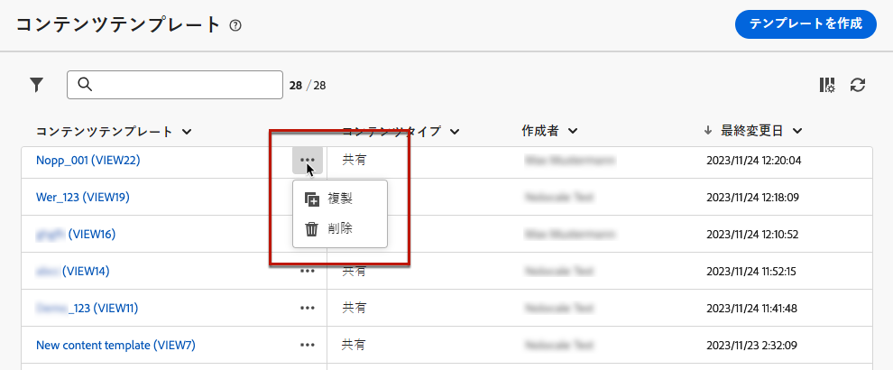{zoomable="yes"}

* コンテンツテンプレート自体で、「**詳細**」ボタンをクリックし、「**削除**」を選択します。

>[!NOTE]
>
>コンテンツテンプレートを削除しても、このテンプレートを使用して作成された配信には影響しません。

## コンテンツテンプレートを複製する {#content-duplicate}

コンテンツテンプレートを複製する方法には、次の 2 つがあります。

* コンテンツテンプレートのリストで、省略記号ボタンをクリックし、「**複製**」を選択します。

* コンテンツテンプレート自体で、「**詳細**」ボタンをクリックし、「**複製**」を選択します。

どちらの場合も、複製を確認して新しいコンテンツテンプレートを作成します。新しいコンテンツテンプレートのラベルは、`<label of the initial campaign>`**の**&#x200B;コピーです。テンプレートの設定を参照して、このラベルを更新します。