# 最初のメールを送信 {#first-email}

>[!CONTEXTUALHELP]
>id="acw_homepage_card2"
>title="メールの基本を学ぶ"
>abstract="テンプレートから開始するか、Adobe Campaign の新しいメールデザイナーを使用して、コードを 1 行も記述しなくてもメールを作成できます。メールデザイナーを使用してコンテンツを作成し、プレビューおよびテストして、既存のオーディエンスにメールを送信する方法をエンドツーエンドのユースケースで説明します。"

最初のターゲットメールを作成する方法について説明します。このユースケースでは、特定の日にシルバーおよびゴールドのロイヤルティメンバーにメールを送信するようにスケジュールします。

事前定義されたデザインテンプレートに基づき、メールには、顧客プロファイル属性に基づいてパーソナライズされたコンテンツも含まれます。

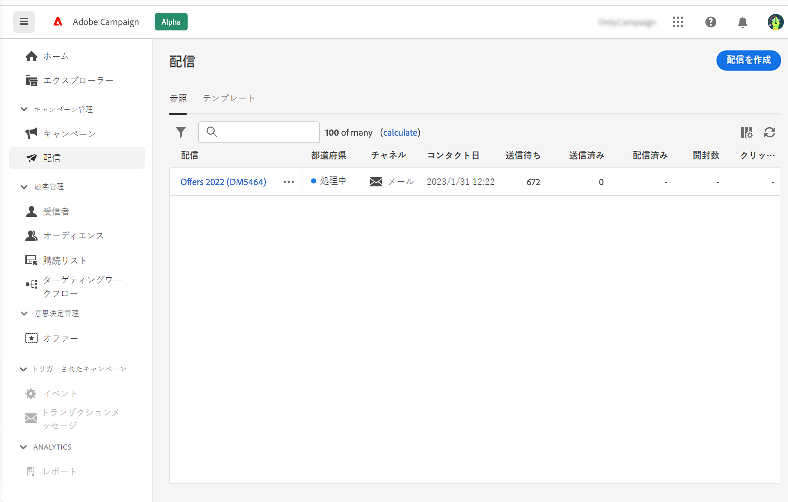

## メール配信の作成 {#create-email}

>[!CONTEXTUALHELP]
>id="acw_deliveries_email_template_selection"
>title="メールテンプレートの選択"
>abstract="メールテンプレートは、タイポロジルール、パーソナライゼーション、ルーティングパラメーターなど、事前定義された設定を含む特定の配信設定です。テンプレートは、Campaign クライアントコンソールで定義されます。"

>[!CONTEXTUALHELP]
>id="acw_deliveries_email_properties"
>title="メールのプロパティ"
>abstract="プロパティは、配信の名前付けや分類に役立つ一般的な配信パラメーターです。配信が Adobe Campaign v8 コンソールで定義された拡張スキーマに基づいている場合は、いくつかの特定の&#x200B;**カスタムオプション**&#x200B;フィールドを使用できます。"

新しい配信を作成するには、次の手順に従います。

1. 左側のナビゲーションの&#x200B;**[!UICONTROL 配信]**&#x200B;メニューを参照し、「**[!UICONTROL 配信を作成]**」ボタンをクリックします。

1. 「**[!UICONTROL メール]**」をチャネルとして選択し、リストからメール配信テンプレートを選択します。

   >[!NOTE]
   >
   >テンプレートは、後で使用するために保存された、事前設定済みの配信設定です。[詳細情報](../msg/delivery-template.md)

   

1. 「**[!UICONTROL 配信を作成]**」ボタンをクリックして、確定します。
1. 配信のラベルを入力し、必要に応じて追加のオプションを設定します。

   * **[!UICONTROL 内部名]**：配信に一意の ID を割り当てます。
   * **[!UICONTROL フォルダー]**：配信を特定のフォルダーに保存します。
   * **[!UICONTROL 配信コード]**：このフィールドを使用すると、独自の命名規則に基づいて配信を整理できます。
   * **[!UICONTROL 説明]**：配信の説明を指定します。
   * **[!UICONTROL 特性]**：分類目的でメールの特性を指定します。<!--The content of the list is defined in the delivery template selected when creating the email.-->

   >[!NOTE]
   >
   >特定のカスタムフィールドを使用してスキーマを拡張した場合は、 「**[!UICONTROL カスタムオプション]**」セクションでそれらのフィールドにアクセスできます。

   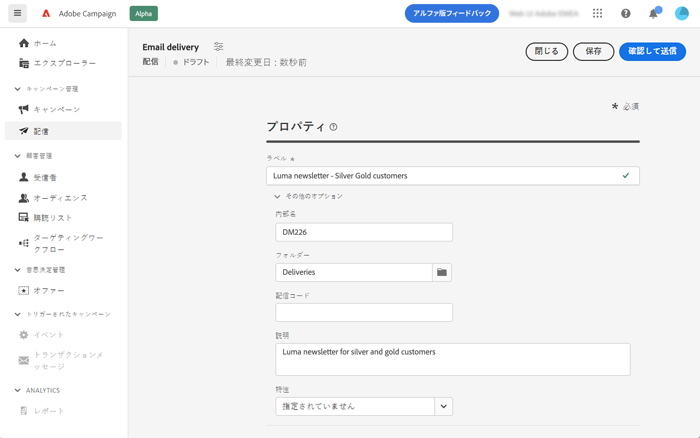

   また、タイポロジルールやターゲットマッピングなどの詳細設定には、配信名の横にあるボタンをクリックしてアクセスできます。これらの設定は、選択したテンプレートで事前に設定されていますが、この特定のメールの必要に応じて編集できます。

## メールコンテンツの定義 {#create-content}

メールコンテンツの作成を開始するには、次の手順に従います。

<!--Detailed instructions on how to configure the email content are available in [this section](../content/edit-content.md).-->

このユースケースでは、事前定義されたメール[配信テンプレート](../msg/delivery-template.md)を使用してメールをデザインします。

1. メール配信ダッシュボードで、「**[!UICONTROL コンテンツを編集]**」ボタンをクリックします。

   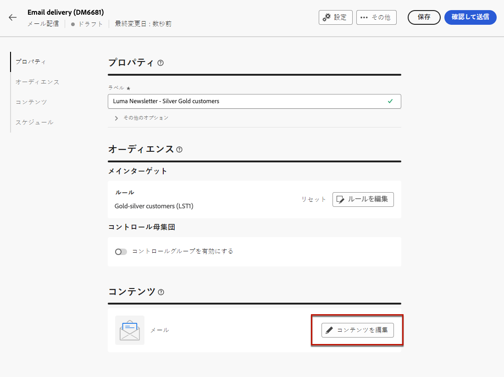

   これにより、メールコンテンツを設定し、メールデザイナーをアクセスできる専用のインターフェイスが表示されます。[詳細情報](../content/edit-content.md)

   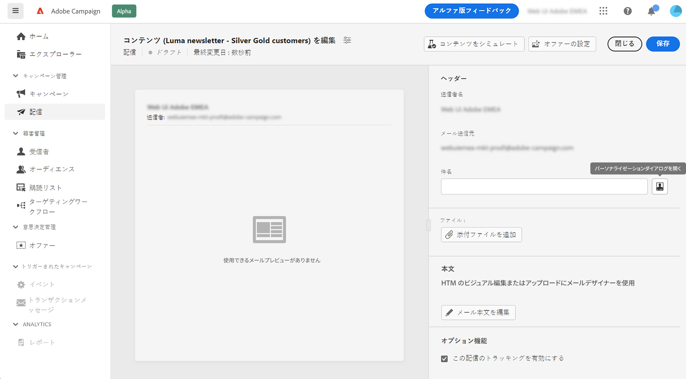

1. メールの件名を入力し、式エディターを使用してパーソナライズします。詳しくは、[コンテンツをパーソナライズする方法](../personalization/personalize.md)を参照してください。

   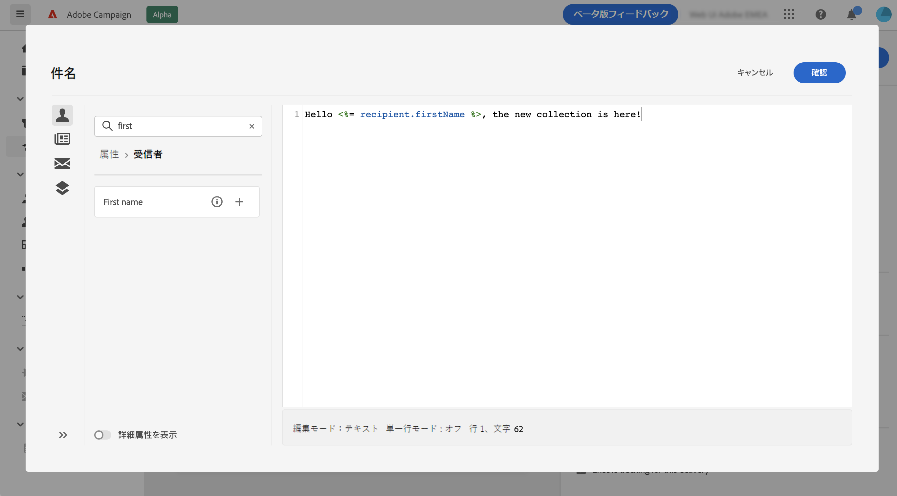

1. メールのコンテンツをデザインするには、「**[!UICONTROL メール本文を編集]**」ボタンをクリックします。

   メールコンテンツの作成に使用する方法を選択します。この例では、[事前定義済みのコンテンツテンプレートを使用します](../msg/delivery-template.md)。

   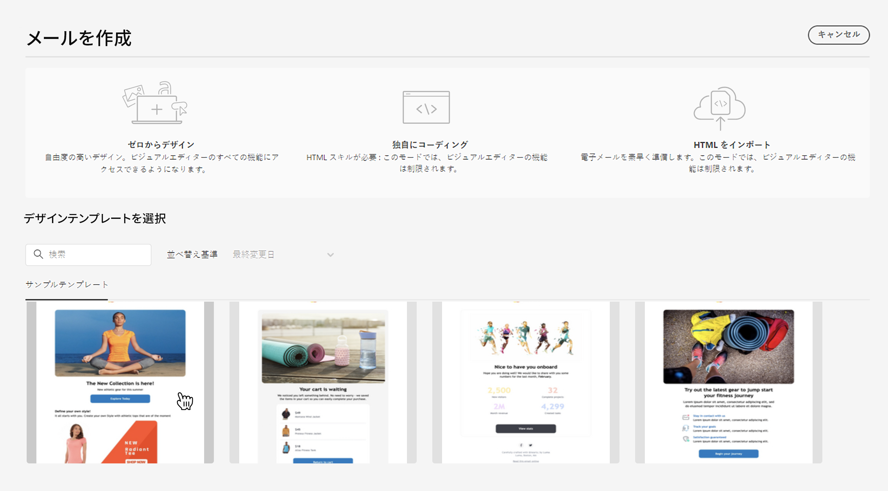

1. テンプレートを選択すると、[メールデザイナー](../content/create-email-content.md)に表示され、必要な編集を加えたり、パーソナライゼーションを追加したりできます。

   例えば、パーソナライゼーションをメールタイトルに追加するには、コンポーネントブロックを選択し、「**[!UICONTROL パーソナライゼーションを追加]**」をクリックします。

   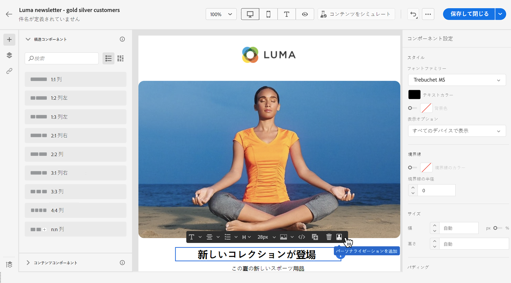

1. コンテンツの設定が完了したら、デザインを保存して閉じます。「**[!UICONTROL 保存]**」をクリックして、メール作成画面に戻ります。

   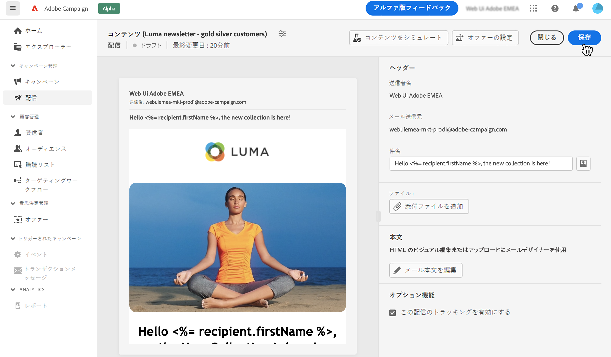

## オーディエンスを定義 {#define-audience}

>[!CONTEXTUALHELP]
>id="acw_deliveries_email_audience"
>title="オーディエンスを定義"
>abstract="マーケティングメッセージに最適なオーディエンスを選択します。Campaign v8 インスタンスまたは Adobe Experience Platform で既に定義されている既存のオーディエンスを選択するか、ルールビルダーを使用して新しいオーディエンスを作成できます。「ファイルから選択」に対してはコントロール母集団が有効になっていません。逆も同様です。"

このユースケースでは、既存のオーディエンスにメールを送信します。オーディエンスの操作方法に関する追加手順については、[この節](../audience/about-audiences.md)を参照してください。

1. メールのオーディエンスを選択するには、「**[!UICONTROL オーディエンスを選択]**」ボタンをクリックし、リストから既存のオーディエンスを選択します。

   この例では、シルバーおよびゴールドのロイヤルティポイントレベルに属する顧客をターゲティングする既存のオーディエンスを使用します。

   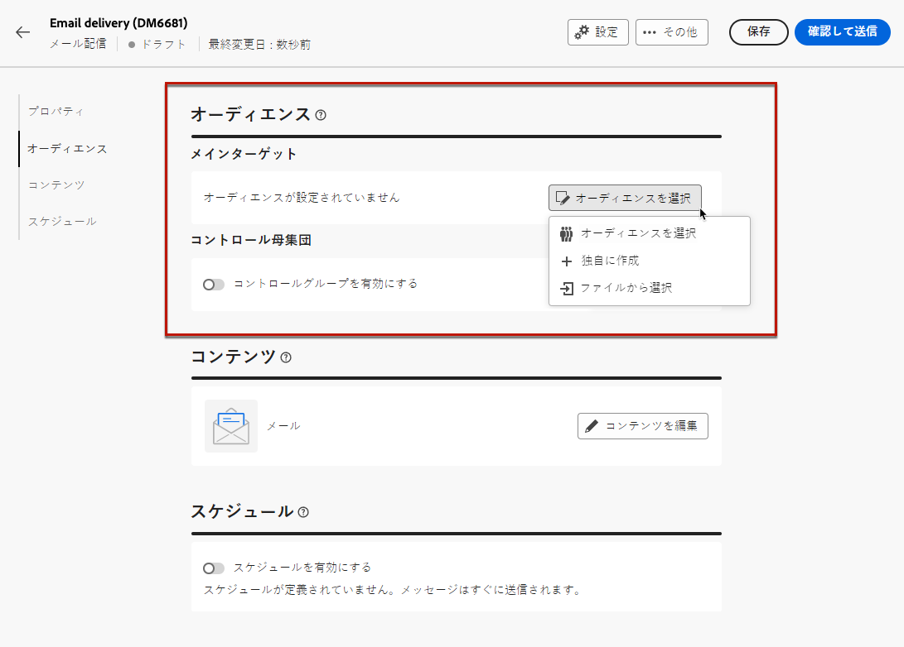

   >[!NOTE]
   >
   >リストで使用可能なオーディエンスは、Campaign v8 インスタンスから、またはインスタンスに宛先／ソースの統合が設定されている場合は Adobe Experience Platform から作成されます。
   >
   >宛先／ソースの統合により、Experience Platform セグメントを Adobe Campaign に送信したり、キャンペーンの配信とトラッキングログを Adobe Experience Platform に送信したりできます。Campaign と Adobe Experience Platform の操作方法については、[Campaign v8（コンソール）ドキュメント](https://experienceleague.adobe.com/docs/campaign/campaign-v8/connect/ac-aep.html?lang=ja){target="_blank"}を参照してください。

1. オーディエンスを選択したら、追加のルールを適用してターゲットを絞り込むことができます。

   またコントロール母集団を設定して、ターゲットとならなかったユーザーと比較してメール受信者の行動を分析することもできます。[詳しくは、コントロール母集団の操作方法を参照してください](../audience/control-group.md)

   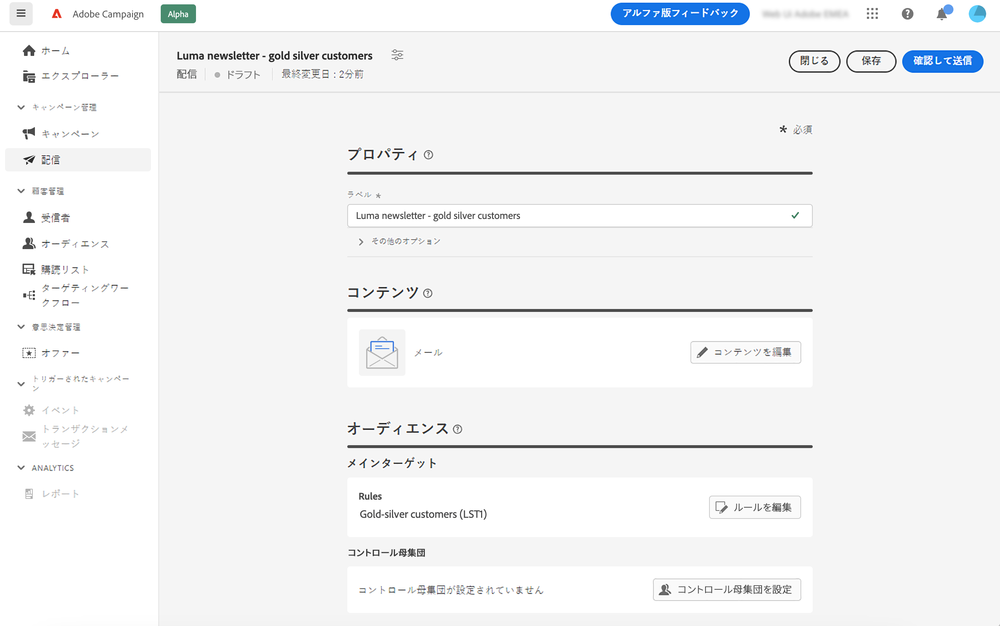

## 送信のスケジュール設定 {#schedule}

>[!CONTEXTUALHELP]
>id="acw_deliveries_email_schedule"
>title="送信のスケジュール設定"
>abstract="送信の日付と正確な時刻を定義します。マーケティングメッセージに最も適した時間を選択することで、開封率を最大化します。"

メールの送信スケジュールを設定するには、メール配信を開き、「**スケジュール**」セクションを参照します。「**[!UICONTROL スケジュールを有効にする]**」切替スイッチを使用してスケジュールをアクティベートし、送信する日時を設定します。配信を送信すると、実際の送信は、定義した連絡日に開始されます。

デフォルトでは、「**[!UICONTROL 送信前に確認を有効にする]**」オプションが有効になっています。このオプションでは、スケジュール設定した日時にメールを送信する前に送信を確定する必要があります。スケジュールを設定した日時にメールを自動的に送信する必要がある場合は、このオプションを無効にします。

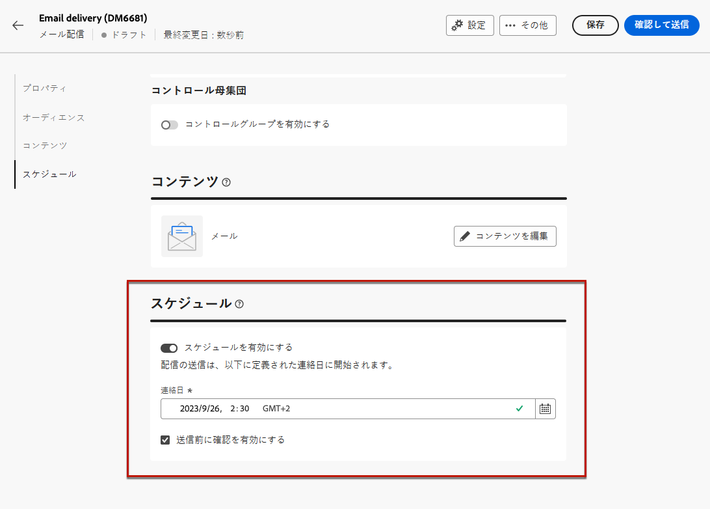

## メールのプレビューとテスト {#preview-test}

メールを送信する前に、プレビューおよびテストを行って、期待どおりに動作するかどうかを確認できます。

このユースケースでは、ターゲットプロファイルの一部を偽装して、メールをプレビューし、特定のメールアドレスにテストバージョンを送信します。

メールのプレビューおよびテスト方法に関する追加情報については、 [この節](../preview-test/preview-test.md)を参照してください。

1. メールを確認するには、「**[!UICONTROL 確認して送信]**」をクリックします。これによりメールのプレビューが、設定済みのすべてのプロパティ、オーディエンス、スケジュールと共に表示されます。「変更」ボタンをクリックして、これらの要素を編集できます。

1. メールをプレビューしてテストバージョンを送信するには、「**[!UICONTROL コンテンツをシミュレート]**」ボタンをクリックします。

   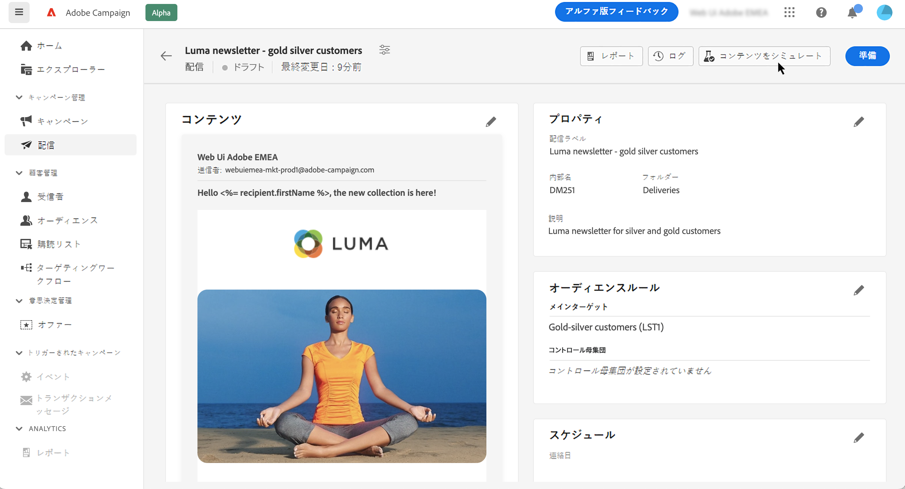

1. 左側で、メールのプレビューに使用するプロファイルを選択します。

   右側のパネルに選択したプロファイルに基づくメールのプレビューが表示されます。 複数のプロファイルを追加した場合は、それぞれを切り替えて対応するメールをプレビューできます。

   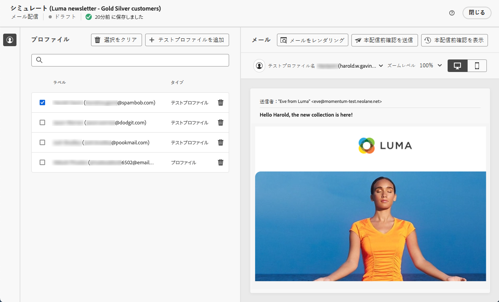

   <!--Additionally, the **[!UICONTROL Render email]** button allows you to preview the email using mutiple devices or mail providers. Learn on how to preview email rendering
    -->

1. テストバージョンのメールを送信するには、「**[!UICONTROL テスト]**」ボタンをクリックして、使用するモードを選択します。

   この例では、**[!UICONTROL メインターゲットから代入]**&#x200B;モードを使用して、メールのターゲットとなる一部のプロファイルを別のユーザーとして実行し、特定のメールアドレスにテストバージョンを送信します。

   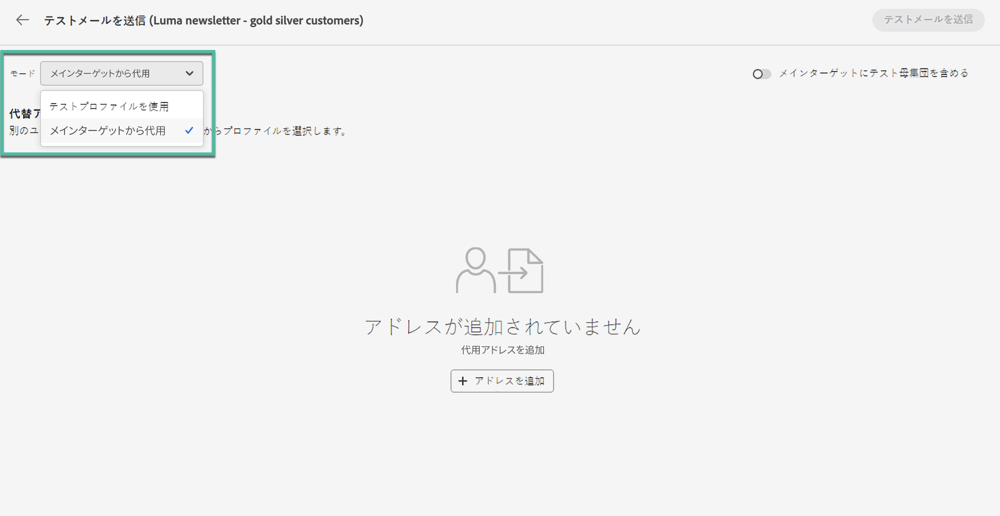

1. 「**[!UICONTROL アドレスを追加]**」をクリックして、テストバージョンを受け取るメールアドレスを指定します。

   メールアドレスごとに、別のユーザーとして実行するプロファイルを選択します。また、ターゲットからランダムなプロファイルを Adobe Campaign に選択させることもできます。

   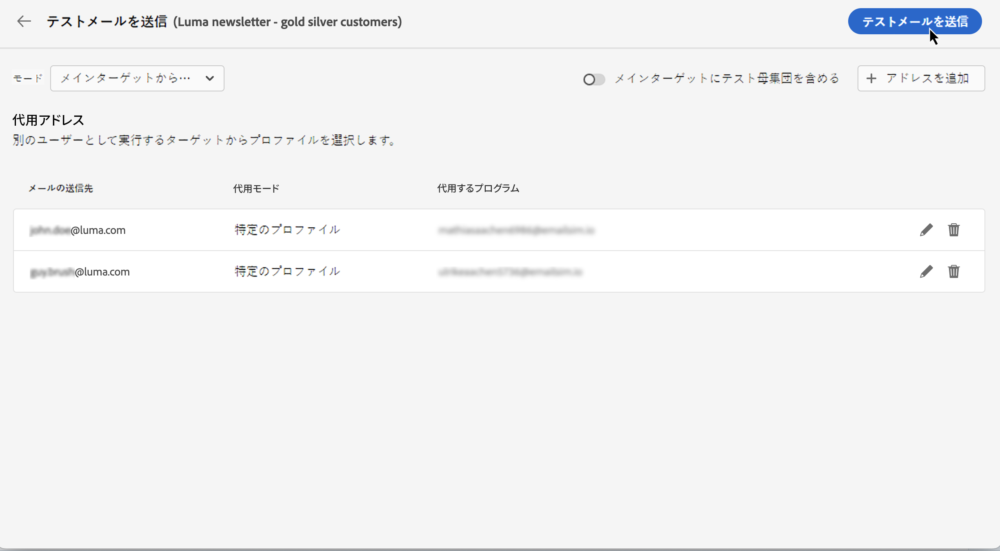

1. 「**[!UICONTROL テストメールを送信]**」をクリックし、送信を確認します。

   テスト版は、選択したプロファイルに **[Proof x]** という接頭辞を付けて使用し、指定したメールアドレスに送信されます。

   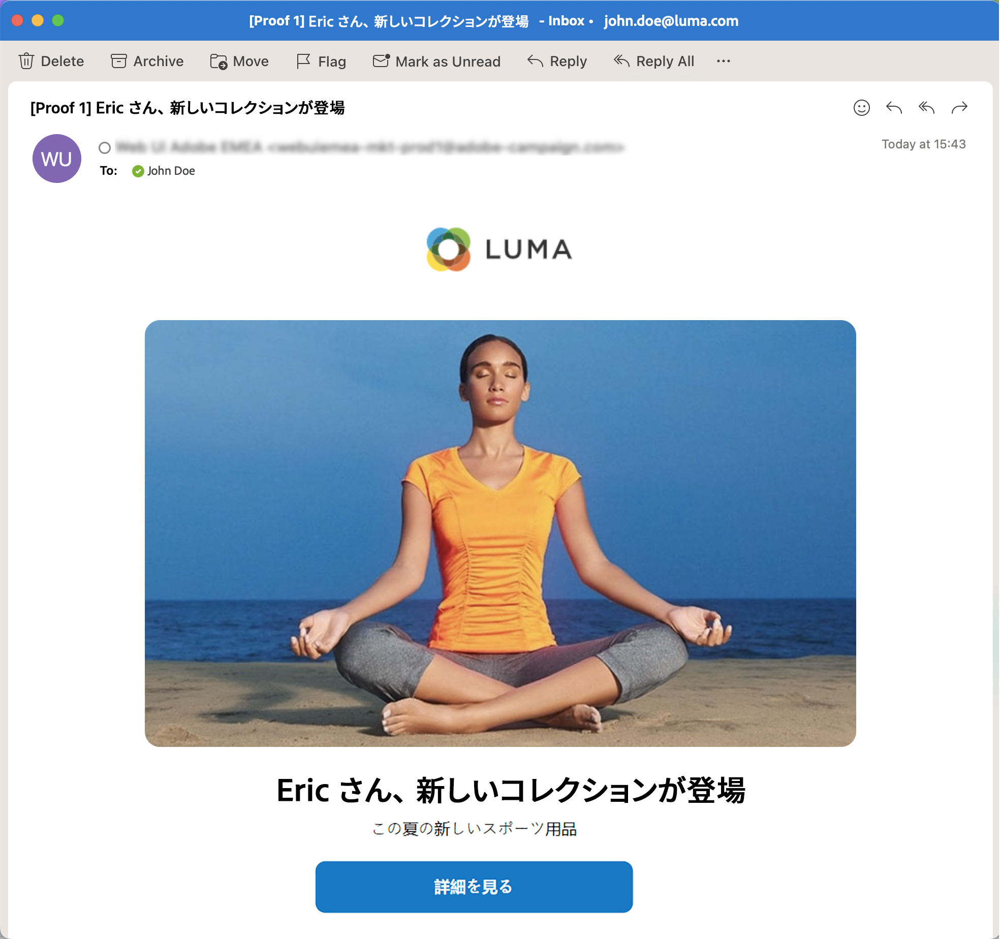

   コンテンツをシミュレート画面の「**[!UICONTROL テストメールログを表示]**」ボタンをクリックすると、送信ステータスの確認や送信済みのテストメールにいつでもアクセスできます。

## メールの送信と監視 {#prepare-send}

メールを確認およびテストした後、準備を開始して送信できます。

1. メールの準備を開始するには、「**[!UICONTROL 準備]**」をクリックします。[詳しくは、メールの準備方法を参照してください](../monitor/prepare-send.md)

   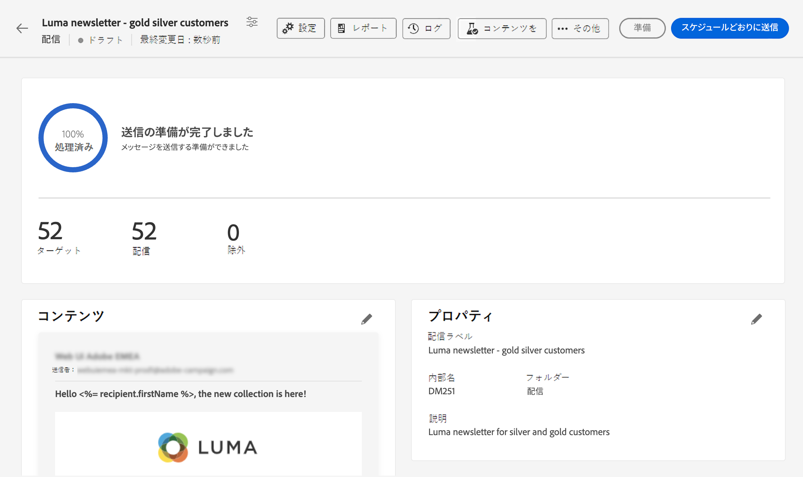

1. メールを送信する準備が整ったら、「**[!UICONTROL 送信]**」ボタン（送信をスケジュールしている場合は「**[!UICONTROL スケジュールどおりに送信]**」）をクリックして、送信を確認します。

1. 送信プロセス中に、この画面で進行状況をリアルタイムで追跡し、統計を直接表示できます。

   

   また、「**[!UICONTROL ログ]**」ボタンをクリックして、送信に関する詳細情報にアクセスできます。[詳しくは、配信ログの監視方法を参照してください](../monitor/delivery-logs.md)

1. メール送信後、「**[!UICONTROL レポート]**」ボタンをクリックすると、専用のレポートにアクセスしてさらに詳しく分析できます。

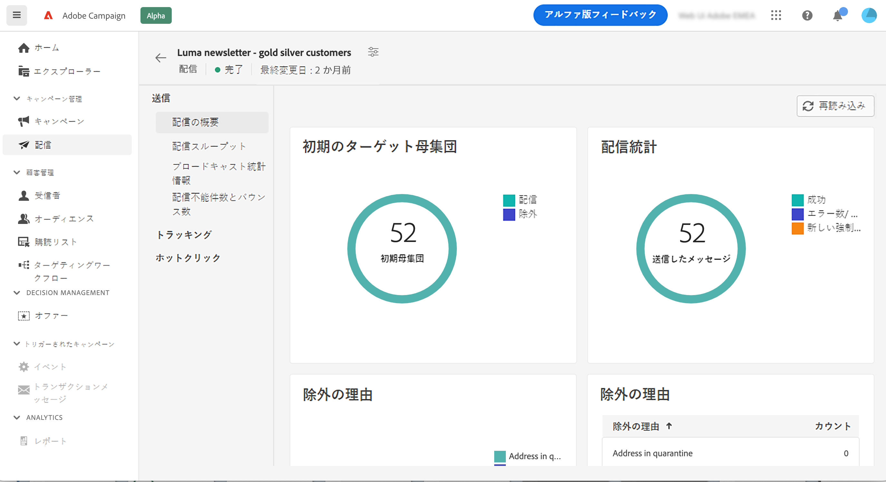
