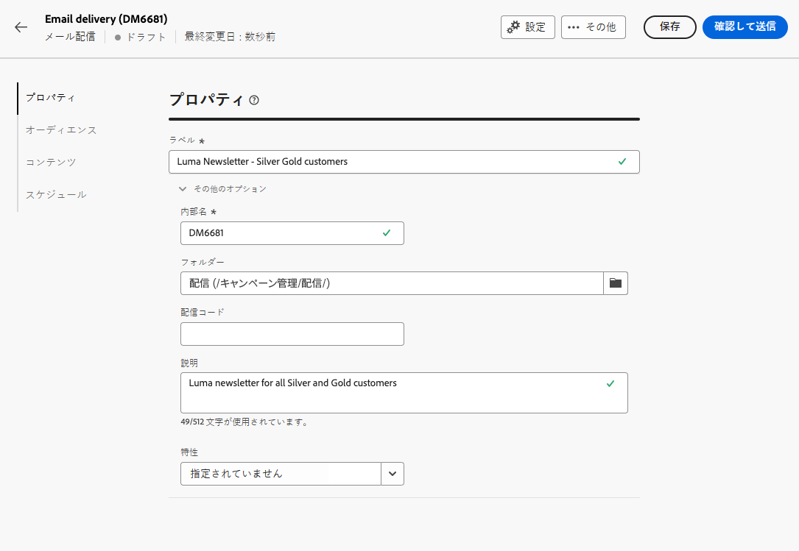
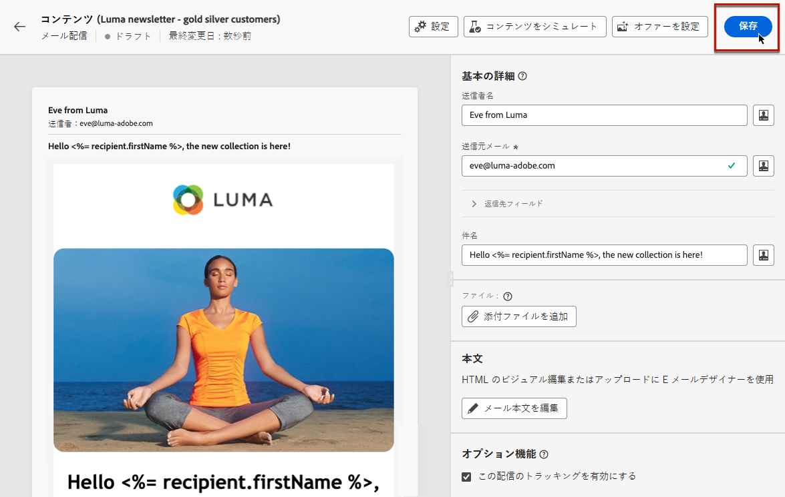
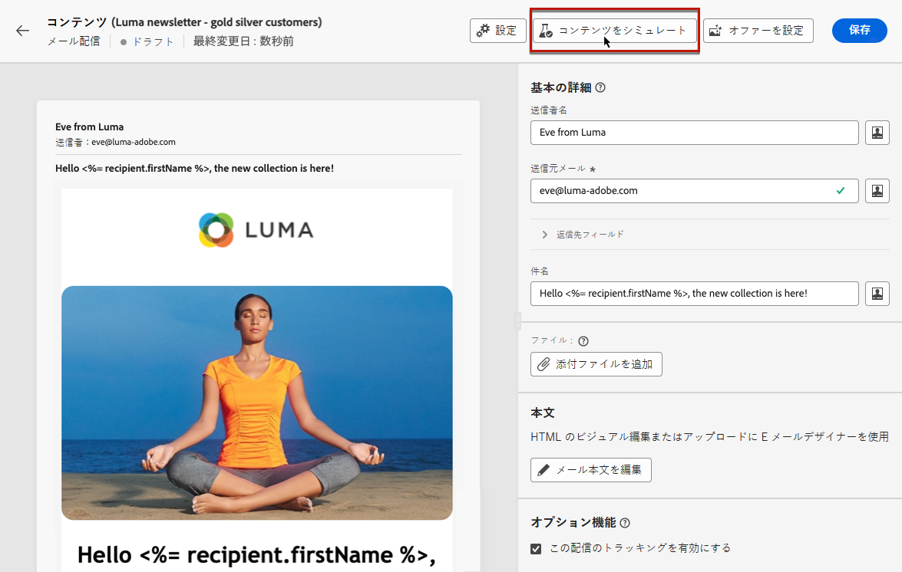

# 最初のメールの送信 {#first-email}

最初のターゲット E メールを作成する方法を説明します。 この使用例では、シルバーおよびゴールドロイヤルティメンバーに対して、特定の日に E メールを送信するようにスケジュールします。

事前定義されたデザインテンプレートに基づき、E メールには、顧客プロファイル属性に基づいてパーソナライズされたコンテンツも含まれます。

## メールの作成 {#create-email}

>[!CONTEXTUALHELP]
>id="acw_deliveries_email_template_selection"
>title="メールテンプレートの選択"
>abstract="E メールテンプレートは、タイポロジルール、パーソナライゼーション、ルーティングパラメーターなど、事前定義された設定を含む特定の配信設定です。 テンプレートは、Campaign クライアントコンソールで定義されます。"

>[!CONTEXTUALHELP]
>id="acw_deliveries_email_properties"
>title="メールのプロパティ"
>abstract="プロパティは、配信の名前付けや分類に役立つ一般的な配信パラメーターです。配信が Adobe Campaign v8 コンソールで定義された拡張スキーマに基づいている場合は、いくつかの特定の&#x200B;**カスタムオプション**&#x200B;フィールドを使用できます。"

1. 新しい配信を作成するには、 **[!UICONTROL 配信]** メニューと選択 **[!UICONTROL 電子メール]** をチャネルとして使用します。

1. 使用するテンプレートを選択し、 **[!UICONTROL 配信を作成]**.

   >[!NOTE]
   >
   >テンプレートは事前に設定された配信設定で、今後の使用のために保存されます。 管理者ユーザーは、Adobe Campaignコンソールで作成できます。 [詳しくは、配信テンプレートの使用方法を参照してください](https://experienceleague.adobe.com/docs/campaign/campaign-v8/campaigns/send/create-templates.html?lang=ja){target="_blank"}。

   

1. メールのラベルを指定し、必要に応じて追加のオプションを設定します。

   * **[!UICONTROL 内部名]**：配信に一意の ID を割り当てます。
   * **[!UICONTROL フォルダー]**：配信を特定のフォルダーに保存します。
   * **[!UICONTROL 配信コード]**：このフィールドを使用すると、独自の命名規則に基づいて配信を整理できます。
   * **[!UICONTROL 説明]**：配信の説明を指定します。
   * **[!UICONTROL 特性]**：分類目的でメールの特性を指定します。<!--The content of the list is defined in the delivery template selected when creating the email.-->

   >[!NOTE]
   >
   >特定のカスタムフィールドでスキーマを拡張した場合は、 **[!UICONTROL カスタムオプション]** 」セクションに入力します。

   

   また、タイポロジルールやターゲットマッピングなどの詳細設定には、配信名の横にある「 」ボタンをクリックしてアクセスできます。 これらの設定は、選択したテンプレートで事前に設定されていますが、この特定の E メールで必要に応じて編集できます。

## メールコンテンツの作成 {#create-content}

>[!CONTEXTUALHELP]
>id="acw_homepage_card3"
>title="E メールコンテンツのデザイン方法を学ぶ"
>abstract="E メールデザイナーの使用方法を説明します。"

この使用例では、事前に定義されたテンプレートを使用して E メールをデザインします。

E メールコンテンツの設定方法に関する詳細な手順については、 [この節](../content/edit-content.md).

1. E メールコンテンツの作成を開始するには、 **[!UICONTROL コンテンツを編集]** 」ボタンをクリックします。

   これにより、E メールコンテンツを設定し、E メールデザイナーを使用してデザインできる専用のインターフェイスが表示されます。

   

1. E メールの件名行を入力し、式エディターを使用してパーソナライズします。 詳しくは、[コンテンツをパーソナライズする方法](../personalization/personalize.md)を参照してください。

   

1. E メールの本文をデザインするには、 **[!UICONTROL メール本文を編集]** 」ボタンをクリックします。

   メールコンテンツの作成に使用する方法を選択します。この例では、事前定義済みのデザインテンプレートを使用します。

   

<!--1. Select the HTML or ZIP file to import then click **[!UICONTROL Next]**.

    If your folder contains assets, choose the instance and folder where they should be stored then click **[!UICONTROL Import]**. (+ link to doc on assets?)

    -->

1. テンプレートを選択すると、E メールデザイナーに表示され、必要な編集を加えたり、パーソナライゼーションを追加したりできます。

   例えば、パーソナライゼーションを電子メールタイトルに追加するには、コンポーネントブロックを選択し、 **[!UICONTROL パーソナライゼーションを追加]**.

   

1. コンテンツの設定が完了したら、デザインを保存して閉じます。 クリック **[!UICONTROL 保存]** をクリックして、e メール作成画面に戻ります。

   

## オーディエンスの定義 {#define-audience}

>[!CONTEXTUALHELP]
>id="acw_deliveries_email_audience"
>title="オーディエンスの定義"
>abstract="マーケティングメッセージに最適なオーディエンスを選択します。Campaign v8 インスタンスまたはAdobe Experience Platformで既に定義されている既存のオーディエンスを選択するか、ルールビルダーを使用して新しいオーディエンスを作成することができます。"

この使用例では、既存のオーディエンスに電子メールを送信します。 オーディエンスの操作方法に関する追加の手順については、 [この節](../audience/about-audiences.md).

1. E メールのオーディエンスを選択するには、 **[!UICONTROL オーディエンスを選択]** ボタンをクリックし、リストから既存のオーディエンスを選択します。

   この例では、シルバーおよびゴールドのロイヤルティポイントレベルに属する顧客をターゲティングする既存のオーディエンスを使用します。

   

   >[!NOTE]
   >
   >リストで使用可能なオーディエンスは、Campaign v8 インスタンスから、またはインスタンスで宛先/ソースの統合が設定されている場合はAdobe Experience Platformから作成されます。
   >
   >宛先／ソースの統合により、Experience Platform セグメントを Adobe Campaign に送信したり、キャンペーンの配信とトラッキングログを Adobe Experience Platform に送信したりできます。[Campaign と Adobe Experience Platform の連携方法を参照してください](https://experienceleague.adobe.com/docs/campaign/campaign-v8/connect/ac-aep.html?lang=ja){target="_blank"}。

1. オーディエンスを選択したら、追加のルールを適用してターゲットを絞り込むことができます。

   また、コントロール母集団を設定して、ターゲット設定されていない受信者と比較した、E メール受信者の行動を分析することもできます。 [詳しくは、コントロール母集団の操作方法を参照してください](../audience/control-group.md)

   

## 送信のスケジュール設定 {#schedule}

>[!CONTEXTUALHELP]
>id="acw_deliveries_email_schedule"
>title="送信のスケジュール設定"
>abstract="送信の日付と正確な時刻を定義します。マーケティングメッセージに最も適した時間を選択することで、開封率を最大化できます。"

E メールの送信をスケジュールするには、 **[!UICONTROL 有効にする]** 送信する日時を設定します。

デフォルトでは、 **[!UICONTROL 送信前の確認]** 「 」オプションが有効になっている場合に、スケジュールされた日時に E メールを送信する前に送信を確認する必要があります。 スケジュールされた日時に電子メールを自動的に送信する場合は、このオプションを無効にできます。

## メールのプレビューとテスト {#preview-test}

E メールを送信する前に、プレビューおよびテストを行って、期待通りに動作するかどうかを確認できます。

この使用例では、ターゲットプロファイルの一部を偽装しているときに、E メールをプレビューし、特定の E メールアドレスにテストバージョンを送信します。

メールのプレビューおよびテスト方法に関する追加情報については、 [この節](../preview-test/preview-test.md)を参照してください。

1. E メールを確認して送信するには、以下をクリックします。 **[!UICONTROL 確認して送信]**. E メールのプレビューと、設定済みのすべてのプロパティ、オーディエンス、スケジュールが表示されます。 これらの要素は、変更ボタンをクリックして編集できます。

1. E メールをプレビューしてテストバージョンを送信するには、 **[!UICONTROL コンテンツをシミュレート]** 」ボタンをクリックします。

   

1. 左側で、E メールのプレビューに使用するプロファイルを選択します。

   右側のウィンドウには、選択したプロファイルに基づく E メールのプレビューが表示されます。 複数のプロファイルを追加した場合は、それらのプロファイルを切り替えて、対応する E メールをプレビューできます。

   

   <!-- !NOTE
    >
    >Additionally, the **[!UICONTROL Render email]** button allows you to preview the email using mutiple devices or mail providers. Learn on how to preview email rendering-->

1. テストバージョンの E メールを送信するには、 **[!UICONTROL テスト]** ボタンをクリックして、使用するモードを選択します。

   この例では、 **[!UICONTROL メインターゲットから置換]** モード：e メールのターゲットとなる一部のプロファイルを偽装しているときに、特定の e メールアドレスにテストバージョンを送信します。

   

1. クリック **[!UICONTROL アドレスを追加]** テストバージョンを受け取る電子メールアドレスを指定します。

   電子メールアドレスごとに、別のユーザーとして実行するプロファイルを選択します。 また、Adobe Campaign にターゲットからランダムプロファイルを選択させることもできます。

   

1. クリック **[!UICONTROL テストメールの送信]** 送信を確認します。

   選択したプロファイルで **[配達確認 x]** プレフィックス

   

   送信のステータスを確認し、送信済みのテスト E メールにいつでもアクセスするには、 **[!UICONTROL テストメールログを表示]** 「コンテンツをシミュレート」画面の「 」ボタン

## メールの送信と監視 {#prepare-send}

E メールを確認およびテストした後、準備を開始して送信できます。

1. E メールの準備を開始するには、 **[!UICONTROL 準備]**. [詳しくは、メールの準備方法を参照してください](../monitor/prepare-send.md)

   

1. E メールを送信する準備が整ったら、 **[!UICONTROL 送信]** ボタン ( または **[!UICONTROL 予定どおりに送信]** 送信をスケジュールしている場合 )、および送信を確認します。

1. 送信プロセス中に、進行状況をリアルタイムで追跡し、統計をこの画面で直接表示できます。

   

   また、 **[!UICONTROL ログ]** 」ボタンをクリックします。 [詳しくは、配信ログの監視方法を参照してください](../monitor/delivery-logs.md)

1. E メールの送信後、 **[!UICONTROL レポート]** 」ボタンをクリックします。

