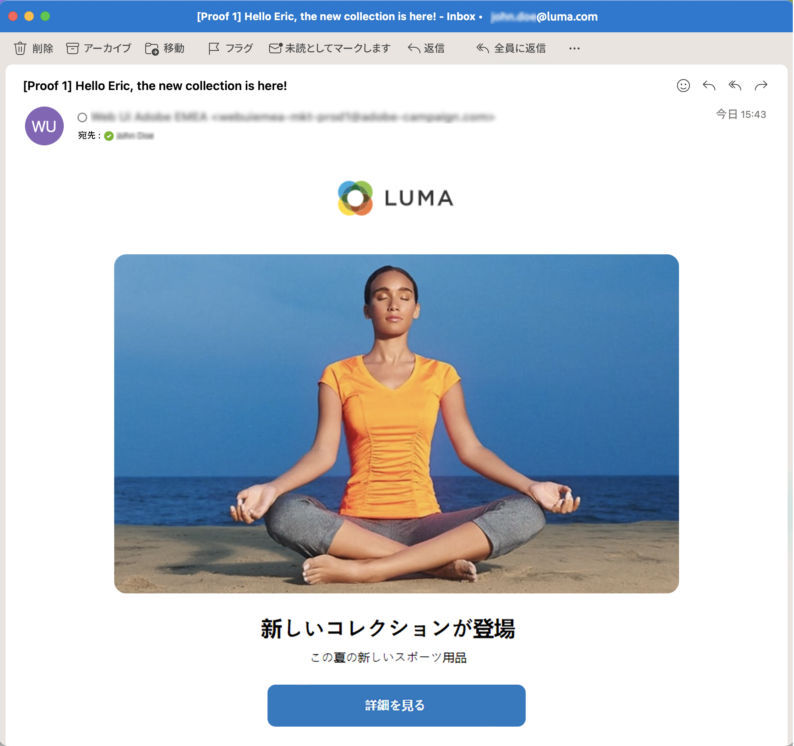

# 最初のメールを作成 {#first-email}

>[!CONTEXTUALHELP]
>id="acw_homepage_learning_card3"
>title="メールの基本を学ぶ"
>abstract="スタンドアロンのメール配信を作成することも、キャンペーンワークフローのコンテキストでメールを作成することもできます。配信の作成、オーディエンスの選択、メールコンテンツのデザインの方法について説明します。"

最初のターゲットメールを作成する方法について説明します。このユースケースでは、特定の日にシルバーおよびゴールドのロイヤルティメンバーにメールを送信するようにスケジュールします。

事前定義された[デザインテンプレート](../email/create-email-templates.md)に基づき、メールには、顧客プロファイル属性に基づいてパーソナライズされたコンテンツも含まれます。

➡️ [この機能をビデオで確認](#video)

## メール配信の作成 {#create-email}

>[!CONTEXTUALHELP]
>id="acw_deliveries_email_template_selection"
>title="メールテンプレートの選択"
>abstract="メールテンプレートは、タイポロジルール、パーソナライゼーション、ルーティングパラメーターなど、事前定義された設定を含む特定の配信設定です。テンプレートは、Campaign クライアントコンソールで定義されます。"

>[!CONTEXTUALHELP]
>id="acw_deliveries_email_properties"
>title="メールプロパティの定義"
>abstract="プロパティは、配信の名前付けや分類に役立つ一般的な配信パラメーターです。追加の設定はオプションです。配信が Adobe Campaign v8 コンソールで定義された拡張スキーマに基づいている場合は、いくつかの特定の&#x200B;**カスタムオプション**&#x200B;フィールドを使用できます。"

スタンドアロンのメール配信を作成することも、キャンペーンワークフローのコンテキストでメールを作成することもできます。以下の手順では、スタンドアロン（1 回限りの）メール配信の手順について説明します。Adobe Campaign での配信作成の手順について詳しくは、[このページ](../msg/gs-deliveries.md)を参照してください。

新しいスタンドアロンのメール配信を作成するには、次の手順に従います。

1. 左側のナビゲーションの&#x200B;**[!UICONTROL 配信]**&#x200B;メニューを参照し、「**[!UICONTROL 配信を作成]**」ボタンをクリックします。

   

1. 「**[!UICONTROL メール]**」をチャネルとして選択し、リストからメール配信テンプレートを選択します。

   >[!NOTE]
   >
   >テンプレートは、後で使用するために保存された、事前設定済みの配信設定です。[詳細情報](../msg/delivery-template.md)

   {zoomable="yes"}

1. 「**[!UICONTROL 配信を作成]**」ボタンをクリックして、確定します。
1. 配信のラベルを入力し、必要に応じて追加のオプションを設定します。

   * **[!UICONTROL 内部名]**：配信に一意の ID を割り当てます。
   * **[!UICONTROL フォルダー]**：配信を特定のフォルダーに保存します。
   * **[!UICONTROL 配信コード]**：このフィールドを使用すると、独自の命名規則に基づいて配信を整理できます。
   * **[!UICONTROL 説明]**：配信の説明を指定します。
   * **[!UICONTROL 特性]**：分類目的でメールの特性を指定します。<!--The content of the list is defined in the delivery template selected when creating the email.-->

   >[!NOTE]
   >
   >特定のカスタムフィールドを使用してスキーマを拡張した場合は、 「**[!UICONTROL カスタムオプション]**」セクションでそれらのフィールドにアクセスできます。

   {zoomable="yes"}

1. また、画面右上にある「**[!UICONTROL 設定]**」ボタンから、タイポロジルールやターゲットマッピングなどの詳細設定にアクセスできます。これらの設定は、選択したテンプレートで事前に設定されていますが、この特定のメールの必要に応じて編集できます。[詳細情報](../advanced-settings/delivery-settings.md)

## オーディエンスを定義 {#define-audience}

>[!CONTEXTUALHELP]
>id="acw_deliveries_email_audience"
>title="配信用のオーディエンスを選択"
>abstract="マーケティングメッセージに最適なオーディエンスを選択します。既存のオーディエンス（Campaign v8 インスタンスまたは Adobe Experience Platform で既に定義されている）を選択するか、クエリモデラーを使用して新しいオーディエンスを作成するか、オーディエンスを含むファイルをアップロードすることができます。「**ファイルから選択**」オプションに対してはコントロール母集団が有効になっていません。逆も同様です。"
>additional-url="https://experienceleague.adobe.com/docs/campaign-web/v8/audiences/target-audiences/add-audience.html?lang=ja" text="メインオーディエンスを選択"
>additional-url="https://experienceleague.adobe.com/docs/campaign-web/v8/audiences/target-audiences/control-group.html?lang=ja" text="コントロール母集団の設定"

このユースケースでは、既存のオーディエンスにメールを送信します。

オーディエンスの操作方法に関する追加手順については、[この節](../audience/about-recipients.md)を参照してください。

1. メールのオーディエンスを選択するには、「**[!UICONTROL オーディエンスを選択]**」ボタンをクリックし、リストから既存のオーディエンスを選択します。

   この例では、シルバーおよびゴールドのロイヤルティポイントレベルに属する顧客をターゲティングする既存のオーディエンスを使用します。

   {zoomable="yes"}

   >[!NOTE]
   >
   >リストで使用可能なオーディエンスは、Campaign v8 インスタンスから、またはインスタンスに宛先／ソースの統合が設定されている場合は Adobe Experience Platform から作成されます。この統合により、Experience Platform セグメントを Adobe Campaign に送信したり、キャンペーンの配信とトラッキングログを Adobe Experience Platform に送信したりできます。Campaign と Adobe Experience Platform の操作方法については、[Campaign v8（クライアントコンソール）ドキュメント](https://experienceleague.adobe.com/docs/campaign/campaign-v8/connect/ac-aep/ac-aep.html?lang=ja){target="_blank"}を参照してください。

1. オーディエンスを選択したら、追加のルールを適用してターゲットを絞り込むことができます。

   {zoomable="yes"}

1. またコントロール母集団を設定して、ターゲットとならなかったユーザーと比較してメール受信者の行動を分析することもできます。[詳しくは、コントロール母集団の操作方法を参照してください](../audience/control-group.md)

## メールコンテンツの定義 {#create-content}

メールコンテンツの作成を開始するには、次の手順に従います。このユースケースでは、事前定義されたメール[配信テンプレート](../msg/delivery-template.md)を使用してメールをデザインします。<!--TBC delivery template or email content template?-->

<!--Detailed instructions on how to configure the email content are available in [this section](../email/edit-content.md).-->

1. メール配信ダッシュボードで、「**[!UICONTROL コンテンツを編集]**」ボタンをクリックします。

   {zoomable="yes"}

   これにより、メールコンテンツを設定し、E メールデザイナーをアクセスできる専用のインターフェイスが表示されます。[詳細情報](edit-content.md)

   {zoomable="yes"}

1. メールの件名を入力し、式エディターを使用してパーソナライズします。詳しくは、[コンテンツをパーソナライズする方法](../personalization/personalize.md)を参照してください。

   {zoomable="yes"}

1. メールのコンテンツをデザインするには、「**[!UICONTROL メール本文を編集]**」ボタンをクリックします。

   メールコンテンツの作成に使用する方法を選択します。この例では、[事前定義済みのコンテンツテンプレートを使用します](create-email-templates.md)。

   {zoomable="yes"}

1. テンプレートを選択すると、[E メールデザイナー](create-email-content.md)に表示され、必要な編集を加えたり、パーソナライゼーションを追加したりできます。

   例えば、パーソナライゼーションをメールタイトルに追加するには、コンポーネントブロックを選択し、「**[!UICONTROL パーソナライゼーションを追加]**」をクリックします。

   {zoomable="yes"}

1. コンテンツの設定が完了したら、デザインを保存して閉じます。「**[!UICONTROL 保存]**」をクリックして、メール作成画面に戻ります。

   {zoomable="yes"}

## 送信のスケジュール設定 {#schedule}

ワークフローのコンテキストで配信が送信された場合、「**スケジューラー**」アクティビティを使用する必要があります。詳しくは、[このページ](../workflows/activities/scheduler.md)を参照してください。以下の手順は、スタンドアロン配信にのみ適用されます。

1. 配信プロパティの「**[!UICONTROL スケジュール]**」セクションを参照します。

1. **[!UICONTROL スケジュールを有効にする]**&#x200B;切替スイッチをオンにしてアクティブ化します。

1. 送信する日時を設定します。

   {zoomable="yes"}

配信を送信すると、実際の送信は、定義した連絡日に開始されます。

配信スケジュールについて詳しくは、[この節](../msg/gs-deliveries.md#schedule-the-delivery-sending)を参照してください。

## メールのプレビューと本配信前確認の送信 {#preview-test}

メールを送信する前に、プレビューおよびテストを行って、期待どおりに動作するかどうかを確認できます。

このユースケースでは、ターゲットプロファイルの一部を偽装して、メールをプレビューし、特定のメールアドレスに本配信前確認を送信します。

メールのプレビューと本配信前確認の送信方法に関する追加情報については、[この節](../preview-test/preview-test.md)を参照してください。

1. メールを確認するには、「**[!UICONTROL 確認して送信]**」をクリックします。これによりメールのプレビューが、設定済みのすべてのプロパティ、オーディエンス、スケジュールと共に表示されます。「変更」ボタンをクリックして、これらの要素を編集できます。

1. メールをプレビューして本配信前確認を送信するには、「**[!UICONTROL コンテンツをシミュレート]**」ボタンをクリックします。

   {zoomable="yes"}

   >[!NOTE]
   >
   >特定のコンテキストでは、「**[!UICONTROL コンテンツをシミュレート]**」ボタンは無効になります。 制限について詳しくは [ この節 ](#content-simulation-limitations) を参照してください。

1. 左側で、メールのプレビューに使用するプロファイルを選択します。

   右側のパネルに選択したプロファイルに基づくメールのプレビューが表示されます。 複数のプロファイルを追加した場合は、それぞれを切り替えて対応するメールをプレビューできます。

   {zoomable="yes"}

   <!--Additionally, the **[!UICONTROL Render email]** button allows you to preview the email using mutiple devices or mail providers. Learn on how to preview email rendering
    -->

1. 本配信前確認を送信するには、「**[!UICONTROL 本配信前確認を送信]**」ボタンをクリックして、使用するモードを選択します。

   この例では、**[!UICONTROL メインターゲットから代用]**&#x200B;モードを使用し、メールのターゲットプロファイルの一部を偽装して、特定のメールアドレスに本配信前確認を送信します。

   {zoomable="yes"}

1. 「**[!UICONTROL アドレスを追加]**」をクリックして、本配信前確認を受信するメールアドレスを指定します。

   メールアドレスごとに、別のユーザーとして実行するプロファイルを選択します。また、ターゲットからランダムなプロファイルを Adobe Campaign に選択させることもできます。

   {zoomable="yes"}

1. 「**[!UICONTROL 本配信前確認を送信]**」をクリックし、送信を確認します。

   本配信前確認は、選択したプロファイルに **[Proof x]** という接頭辞を付けて使用し、指定したメールアドレスに送信されます。

   {zoomable="yes"}

   コンテンツをシミュレート画面の「**[!UICONTROL 本配信前確認を表示]**」ボタンをクリックすると、送信ステータスの確認や送信済みの本配信前確認にいつでもアクセスできます。

### コンテンツシミュレーションの制限 {#content-simulation-limitations}

>[!CONTEXTUALHELP]
>id="acw_simulation_limitation_multilingual"
>title="コンテンツシミュレーションはサポートされていません"
>abstract="多言語配信にはロケールが 1 つしか含まれていないので、「**コンテンツをシミュレート**」ボタンは無効になります。"

>[!CONTEXTUALHELP]
>id="acw_simulation_limitation_reconcilied_deliveries"
>title="コンテンツシミュレーションはサポートされていません"
>abstract="「**コンテンツをシミュレート**」ボタンは、このフェーズの紐付けされた配信と互換性がないので無効になります。"

>[!CONTEXTUALHELP]
>id="acw_simulation_limitation_ffda"
>title="コンテンツシミュレーションはサポートされていません"
>abstract="Campaign Enterprise Full Federated Access （FFDA）モードではサポートされていないので、「**コンテンツをシミュレート**」ボタンが無効になります。"

>[!CONTEXTUALHELP]
>id="acw_simulation_limitation_no_file"
>title="コンテンツシミュレーションはサポートされていません"
>abstract="コンテンツがアップロードされていないので、「**コンテンツをシミュレート**」ボタンは無効になっています。"

場合によっては、コンテンツのシミュレーションを実行できず、「**[!UICONTROL コンテンツをシミュレート]**」ボタンが無効になります。

次の場合、コンテンツのシミュレーションはサポートされていません。

<!--* When a multilingual delivery contains only one locale,-->
* 紐付けされた配信で、
* Campaign デプロイメントモデルが [Adobe Campaign Enterprise Full Federated Access （FFDA）の場合 ](https://experienceleague.adobe.com/ja/docs/campaign/campaign-v8/config/architecture/ffda/enterprise-deployment){target="_blank"}
* ファイルがアップロードされていない場合。

## メールの送信と監視 {#prepare-send}

メールを確認およびテストした後、準備を開始して送信できます。

1. メールの準備を開始するには、「**[!UICONTROL 準備]**」をクリックします。[詳しくは、メールの準備方法を参照してください](../monitor/prepare-send.md)

   {zoomable="yes"}

1. メールを送信する準備が整ったら、「**[!UICONTROL 送信]**」ボタン（送信をスケジュールしている場合は「**[!UICONTROL スケジュールどおりに送信]**」）をクリックして、送信を確認します。

1. 送信プロセス中に、この画面で進行状況をリアルタイムで追跡し、統計を直接表示できます。

   {zoomable="yes"}

   <!--
    {zoomable="yes"}-->

   また、「**[!UICONTROL ログ]**」ボタンをクリックして、送信に関する詳細情報にアクセスできます。[詳しくは、配信ログの監視方法を参照してください](../monitor/delivery-logs.md)

1. メール送信後、「**[!UICONTROL レポート]**」ボタンをクリックすると、専用のレポートにアクセスしてさらに詳しく分析できます。

{zoomable="yes"}

## チュートリアルビデオ {#video}

メール配信をゼロから作成し、オーディエンスの定義、コンテンツの設計、プレビューのシミュレートを行い、配達確認を送信する方法について説明します。

>[!VIDEO](https://video.tv.adobe.com/v/3425866/?quality=12)
