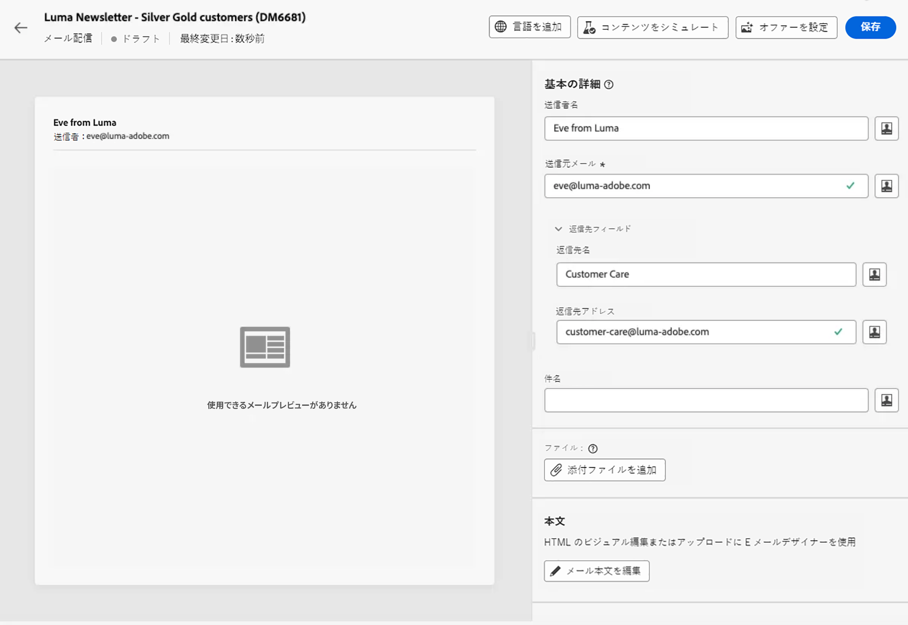
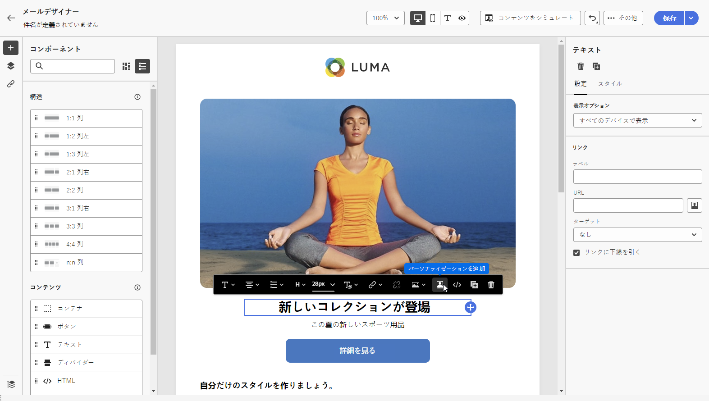
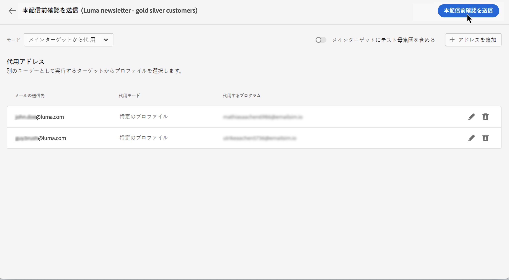
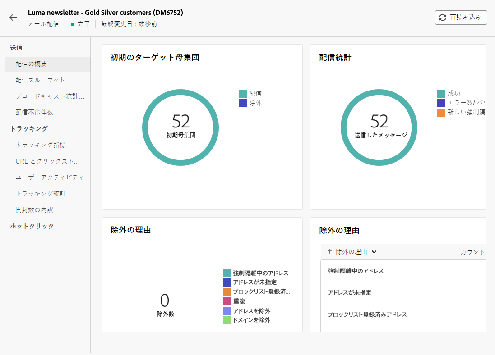

# 最初のメールを送信 {#first-email}

>[!NOTE]
>
>このドキュメントは作成中で、頻繁に更新されています。 このコンテンツの最終バージョンは、2023 年 1 月に準備が整います。

この使用例では、最初の E メールの作成方法を説明します

この例では、シルバーロイヤリティ顧客とゴールドロイヤリティ顧客に対して、特定の日に E メールを送信するようにスケジュールします。 この E メールは、ZIP ファイルの事前定義済みのHTMLテンプレートを使用して設計され、プロファイルの属性を使用したパーソナライゼーションが含まれます。

## E メールの作成 {#create-email}

1. 以下から新しい配信を作成： **[!UICONTROL 配信]** メニュー
1. を選択します。 **[!UICONTROL 電子メール]** チャネルと使用するテンプレートを選択し、「 **[!UICONTROL 作成]**.

   >[!NOTE]
   >
   >テンプレートに関する情報。 V7 ドキュメントの情報を確認

   

1. 配信のラベルを指定し、必要に応じて追加のオプションを設定します。

   * 内部名:
   * フォルダー:
   * 配信コード :
   * 説明:
   * 特性 :

   テンプレートで定義されている設定を確認し、それらに言及します ( 説明？ フォルダー、特性？

   

   >[!NOTE]
   >
   >配信設定ボタンに関する情報+ドキュメントへのリンク

## E メールコンテンツの作成 {#create-content}

>[!CONTEXTUALHELP]
>id="acw_homepage_card3"
>title="E メールデザイナーを使用して最初の E メールコンテンツを作成します。"
>abstract="最初の E メールコンテンツを作成"

>[!CONTEXTUALHELP]
>id="acw_deliveries_email_content"
>title="E メールコンテンツの作成"
>abstract="TBC"

1. 次をクリック： **[!UICONTROL コンテンツを編集]** ボタンをクリックして、E メールのコンテンツの作成を開始します。

   この画面では、E メールの内容を設定し、E メールデザイナーを使用して設計できます。

   

   >[!NOTE]
   >
   >送信者名と送信者の電子メール情報は、選択した電子メールテンプレートで事前に定義されています。
   >
   >デフォルトでは、開封数およびクリック数の電子メールトラッキングが有効になっています。 これらのオプションを無効にするには、「オプション機能」セクションでオプションの選択を解除します。

1. 式エディターを使用して電子メールの件名を指定します。 [コンテンツをパーソナライズする方法を説明します](../personalization/personalize.md)

   この例では、プロファイルの名を使用して件名行をパーソナライズします。

   

1. 必要に応じて、添付ファイルを E メールに追加します。 E メールコンテンツの編集方法を説明します

1. 次をクリック： **[!UICONTROL メール本文を編集]** ボタンを使用して、E メールのコンテンツを作成およびデザインします。

   E メールコンテンツの作成に使用する方法を選択します。 この例では、既存のHTMLコンテンツをインポートします。

   

1. 読み込むHTMLまたは ZIP ファイルを選択し、「 **[!UICONTROL 次へ]**.

   フォルダーにアセットが含まれている場合、アセットが格納されるインスタンスとフォルダーを選択し、「 **[!UICONTROL インポート]**. （+アセットのドキュメントへのリンク？）

   

1. コンテンツを読み込むと、E メールデザイナーに表示され、必要に応じて編集したり、パーソナライゼーションを追加したりできます。

   この例では、パーソナライゼーションを E メールのタイトルに追加します。 これをおこなうには、コンポーネントブロックを選択し、 **[!UICONTROL パーソナライゼーションを追加]**.

   

1. コンテンツを保存したら、矢印をクリックして E メール作成画面に戻ります。

   

## オーディエンスの定義 {#define-audience}

>[!CONTEXTUALHELP]
>id="acw_deliveries_email_audience"
>title="オーディエンスの定義"
>abstract="TBC"

1. 次をクリック： **[!UICONTROL オーディエンスを選択]** ボタンをクリックして、既存のオーディエンスを選択するか、新しいオーディエンスを作成します。

   この例では、シルバーおよびゴールドのロイヤルティポイントレベルに属する顧客をターゲティングする既存のオーディエンスを使用します。

   

   >[!NOTE]
   >
   >リストで使用可能なオーディエンスは、Campaign V8 インスタンスから、またはインスタンスに宛先/ソース統合が実装されている場合はAdobe Experience Platformから作成されます。 電子メールオーディエンスの選択方法を説明します

1. オーディエンスを選択したら、必要に応じてルールを編集できます。 また、コントロール母集団を設定して、ターゲット設定されていないプロファイルの動作と比較した、E メール受信者の動作を分析することもできます。 コントロール母集団の操作方法を説明します

## 送信のスケジュールを設定 {#schedule}

>[!CONTEXTUALHELP]
>id="acw_deliveries_email_schedule"
>title="送信のスケジュールを設定"
>abstract="TBC"

E メールの送信をスケジュールするには、「有効」をクリックし、目的の日時を指定します。

=送信前の確認オプション：スケジュールされた日に起こること：メッセージの送信を確認する通知

## E メールのプレビューとテスト {#preview-test}

E メールの準備が整ったら、送信を開始する前に、プレビューおよびテストできます。

1. クリック **[!UICONTROL 送信するレビュー]**. E メールのプレビューが、設定済みのすべてのプロパティ、オーディエンス、スケジュールと共に表示されます。 変更ボタンを使用して、これらの要素を編集できます。

   

1. 次をクリック： **[!UICONTROL コンテンツをシミュレート]** ボタンをクリックして、E メールをプレビューし、配達確認を送信します。

1. 左側の領域で、E メールのプレビューに使用するプロファイルを選択します。 ターゲットプロファイルまたは専用のテストプロファイルを使用できます。

1. 選択したプロファイルに基づいて、E メールのプレビューが右側の領域に表示されます。 複数のプロファイルを追加した場合は、それぞれを切り替えて、対応する E メールをプレビューできます。

   

   >[!NOTE]
   >
   >また、 **[!UICONTROL E メールをレンダリング]** ボタンをクリックすると、複数のデバイスまたはメールプロバイダーを使用して e メールをプレビューできます。 E メールのレンダリングをプレビューする方法を説明します

1. E メールの配達確認を送信するには、 **[!UICONTROL テスト]** ボタンをクリックして、配達確認を受け取るプロファイルを選択します。 この例では、特定のテストプロファイルに配達確認を送信します。

   

   >[!NOTE]
   >
   >また、ターゲットプロファイルの一部を偽装し、選択した E メールアドレスに配達確認メッセージを送信することで、メッセージをテストすることもできます。 ターゲットモードでの代替の使用方法を説明します

1. クリック **[!UICONTROL テストメールの送信]** 次に、送信を確定します。

   配達確認が送信されたら、「 **[!UICONTROL テストメールログを表示]** 」ボタンをクリックします。

## E メールの送信と監視 {#prepare-send}

E メールを確認およびテストしたら、準備を開始して送信できます。

1. クリック **[!UICONTROL 準備]** をクリックして、メッセージの準備を開始します。

   統計情報と共に、準備の進行状況をリアルタイムで追跡できます。 準備が完了したら、詳細なログにアクセスして、さらに分析をおこなうことができます。 配信の監視方法の詳細

   

1. E メールを送信する準備が整ったら、「 **[!UICONTROL 送信]** 次に、送信を確定します。

   送信を統計と共にリアルタイムで追跡できます。 また、 **[!UICONTROL ログ]** 「 」ボタンを使用すると、E メール送信に関する詳細情報にアクセスできます。 配信の監視方法の詳細

   

1. E メールの送信後、さらに分析をおこなうために専用のレポートにアクセスできます。

   
