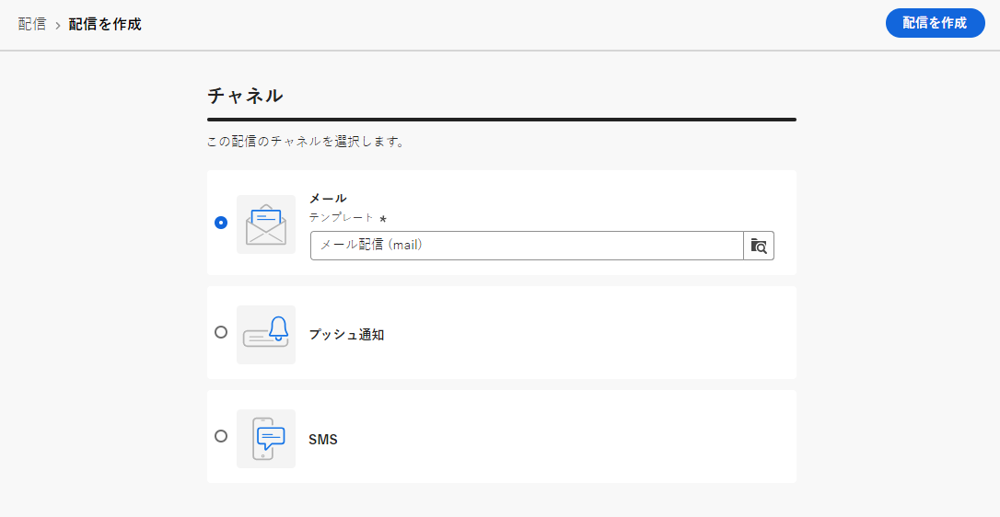

# 最初のメールの送信 {#first-email}

このユースケースでは、最初のメールの作成方法を示します。シルバーロイヤルティ顧客とゴールドロイヤルティ顧客に対して特定の日にメールを送信するようスケジュールを設定します。このメールは、事前定義済みテンプレートを使用してデザインされ、プロファイルの属性を使用してパーソナライゼーションを組み込みます。

## メールの作成 {#create-email}

>[!CONTEXTUALHELP]
>id="acw_deliveries_email_template_selection"
>title="メールテンプレートの選択"
>abstract="テンプレートは、Adobe Campaign v8 コンソールで定義されます。 これは、タイポロジルール、パーソナライゼーション、ルーティングパラメーターなどの事前定義済みパラメーターを含んだ特定の配信設定です。"

>[!CONTEXTUALHELP]
>id="acw_deliveries_email_properties"
>title="メールのプロパティ"
>abstract="プロパティは、配信の名前付けや分類に役立つ一般的な配信パラメーターです。配信が Adobe Campaign v8 コンソールで定義された拡張スキーマに基づいている場合は、いくつかの特定の&#x200B;**カスタムオプション**&#x200B;フィールドを使用できます。"

1. **[!UICONTROL 配信]**&#x200B;メニューから新しい配信を作成します。

1. **[!UICONTROL メール]**&#x200B;チャネルと使用するテンプレートを選択し、「**[!UICONTROL 作成]**」をクリックします。

   >[!NOTE]
   >
   >テンプレートとは、再利用するためにテンプレートとして保存された特定の配信設定です。配信テンプレートは、Adobe Campaign コンソールで管理者ユーザーが設定します。[配信テンプレートの使用方法を説明します。](https://experienceleague.adobe.com/docs/campaign/campaign-v8/campaigns/send/create-templates.html){target="_blank"}.

   

1. メールのラベルを指定し、必要に応じて追加のオプションを設定します。

   * **[!UICONTROL 内部名]**：配信に一意の ID を割り当てます。
   * **[!UICONTROL フォルダー]**：配信を特定のフォルダーに保存します。
   * **[!UICONTROL 配信コード]**：このフィールドを使用すると、独自の命名規則に基づいて配信を整理できます。
   * **[!UICONTROL 説明]**：配信の説明を指定します。
   * **[!UICONTROL 特性]**：分類目的でメールの特性を指定します。<!--The content of the list is defined in the delivery template selected when creating the email.-->

   >[!NOTE]
   >
   >特定のカスタムフィールドを使用してスキーマを拡張した場合は、 「**[!UICONTROL カスタムオプション]**」セクションでそれらのフィールドにアクセスできます。

   

   さらに、詳細設定（タイポロジルール、ターゲットマッピングなど）が、配信名の横にあるボタンから使用できます。 これらは、メールの作成時に選択したテンプレートで事前に定義されています。必要に応じて編集できます。

## メールコンテンツの作成 {#create-content}

>[!CONTEXTUALHELP]
>id="acw_homepage_card3"
>title="電子メールデザイナーを使用してメールコンテンツをデザインする方法について説明します。"
>abstract="コンテンツのデザイン方法について説明します"

このユースケースでは、事前定義済みテンプレートを使用してメールをデザインします。 メールコンテンツを設定する方法について詳しくは、[この節](../content/edit-content.md)を参照してください。

1. 「**[!UICONTROL コンテンツを編集]**」ボタンをクリックして、メールコンテンツの作成を開始します。

   この画面では、メールコンテンツを設定し、電子メールデザイナーを使用してデザインできます。

   

1. メールの件名を指定し、式エディターを使用してパーソナライズします。詳しくは、[コンテンツをパーソナライズする方法](../personalization/personalize.md)を参照してください。

   

1. 「**[!UICONTROL メール本文を編集]**」ボタンをクリックして、メールのコンテンツを作成およびデザインします。

   メールコンテンツの作成に使用する方法を選択します。この例では、既存のデザインテンプレートを使用します。

   

<!--1. Select the HTML or ZIP file to import then click **[!UICONTROL Next]**.

    If your folder contains assets, choose the instance and folder where they should be stored then click **[!UICONTROL Import]**. (+ link to doc on assets?)

    -->

1. テンプレートを選択すると、それが電子メールデザイナーに表示されるので、必要に応じて編集したり、パーソナライゼーションを追加したりできます。

   この例では、メールのタイトルにパーソナライゼーションを追加します。それには、コンポーネントブロックを選択し、「**[!UICONTROL パーソナライゼーションを追加]**」をクリックします。

   

1. コンテンツの準備が整ったら、それを保存してから、矢印をクリックしてメール作成画面に戻ります。

   

## オーディエンスの定義 {#define-audience}

>[!CONTEXTUALHELP]
>id="acw_deliveries_email_audience"
>title="オーディエンスの定義"
>abstract="マーケティングメッセージに最適なオーディエンスを選択します。Campaign v8 インスタンスで既に定義されている既存のオーディエンスを選択するか、Adobe Experience Platformから選択するか、ルールビルダーを使用して新しいオーディエンスを作成するかを選択できます。"

この使用例では、既存のオーディエンスにメールを送信します。オーディエンスの操作方法に関する追加情報については、[この節](../audience/about-audiences.md)を参照してください。

1. 「**[!UICONTROL オーディエンスを選択]**」ボタンをクリックして、ターゲットにする既存のオーディエンスを選択します。

   この例では、シルバーおよびゴールドのロイヤルティポイントレベルに属する顧客をターゲティングする既存のオーディエンスを使用します。

   

   >[!NOTE]
   >
   >リストで使用可能なオーディエンスは、Campaign V8 インスタンスから、またはインスタンスで宛先/ソースの統合が設定されている場合はAdobe Experience Platformから作成されます。
   >
   >宛先/ソースの統合により、Experience PlatformセグメントをAdobe Campaignに送信したり、キャンペーンの配信とトラッキングログをAdobe Experience Platformに送信したりできます。 [Campaign とAdobe Experience Platformの連携の仕組み](https://experienceleague.adobe.com/docs/campaign/campaign-v8/connect/ac-aep.html){target="_blank"}.

1. オーディエンスを選択したら、追加のルールを使用してターゲットを絞り込むことができます。

   また、コントロール母集団を設定して、ターゲットされていないプロファイルの動作と比較した、メール受信者の行動を分析することもできます。[詳しくは、コントロール母集団の操作方法を参照してください](../audience/control-group.md)

## 送信のスケジュール設定 {#schedule}

>[!CONTEXTUALHELP]
>id="acw_deliveries_email_schedule"
>title="送信のスケジュール設定"
>abstract="送信の日付と正確な時刻を定義します。マーケティングメッセージに最も適した時間を選択することで、開封率を最大化します。"

メールの送信をスケジュールするには、「**[!UICONTROL 有効にする]**」をクリックしてから、送信する日時を指定します。

デフォルトでは、 **[!UICONTROL 送信前の確認]** 」オプションが有効になっている場合、指定した日時に E メールを送信できるように、送信を確定する必要があります。 このオプションを無効にすると、確認を必要とせずにスケジュールされた日時にメールが送信されます。

## メールのプレビューとテスト {#preview-test}

メールの準備が整ったら、送信を開始する前に、プレビューおよびテストできます。

この使用例では、E メールをプレビューし、既存のプロファイルを使用して配達確認を送信します。

メールのプレビューおよびテスト方法に関する追加情報については、 [この節](../preview-test/preview-test.md)を参照してください。

1. 「**[!UICONTROL レビューして送信]**」をクリックします。メールのプレビューが、設定済みのすべてのプロパティ、オーディエンス、スケジュールと共に表示されます。変更ボタンを使用して、これらの要素を編集できます。

1. 「**[!UICONTROL コンテンツをシミュレート]**」ボタンをクリックして、メールをプレビューし、配達確認を送信します。

   

1. 左側の領域で、メールのプレビューに使用するプロファイルを選択します。

1. 選択したプロファイルに基づいて、メールのプレビューが右側のパネルに表示されます。 複数のプロファイルを追加した場合は、それぞれを切り替えて、対応するメールをプレビューできます。

   

   <!-- !NOTE
    >
    >Additionally, the **[!UICONTROL Render email]** button allows you to preview the email using mutiple devices or mail providers. Learn on how to preview email rendering-->

1. メールの配達確認を送信するには、「**[!UICONTROL テスト]**」ボタンをクリックして、配達確認を受信するプロファイルを選択します。

   <!--TO REPLACE WITH SUBSTITUTION PROFILE-->

   この例では、特定のテストプロファイル（ターゲットに含まれていないシードアドレス）に配達確認を送信します。でのシードアドレスの使用方法を説明します。 [Campaign Classicv7 ドキュメント](https://experienceleague.adobe.com/docs/campaign-classic/using/sending-messages/using-seed-addresses/about-seed-addresses.html?lang=ja){target="_blank"}.

   

   >[!NOTE]
   >
   >また、ターゲットプロファイルの一部を偽装し、選択したメールアドレスに配達確認メッセージを送信することで、メッセージをテストすることもできます。[詳しくは、配達確認の送信方法を参照してください](../preview-test/preview-test.md)

1. 「**[!UICONTROL テストメールを送信]**」をクリックし、送信を確認します。

   配達確認を送信したら、「**[!UICONTROL テストメールログを表示]**」ボタンをクリックすると、ステータスを確認できます。

## メールの送信と監視 {#prepare-send}

メールをレビューおよびテストしたら、準備を開始して送信できます。

1. 「**[!UICONTROL 準備]**」をクリックして、メッセージの準備を開始します。[詳しくは、メールの準備方法を参照してください](../monitor/prepare-send.md)

   

1. メールを送信する準備が整ったら、「**[!UICONTROL 送信]**」をクリックし、送信を確認します。

   送信を統計と共にリアルタイムで追跡できます。また、「**[!UICONTROL ログ]**」ボタンを使用すると、メール送信に関する詳細情報にアクセスできます。[詳しくは、配信ログの監視方法を参照してください](../monitor/delivery-logs.md)
   

1. メールの送信後、詳細な分析のために専用の[レポート](../reporting/reports.md)にアクセスできます。

   
