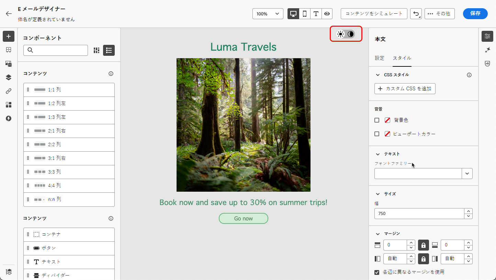
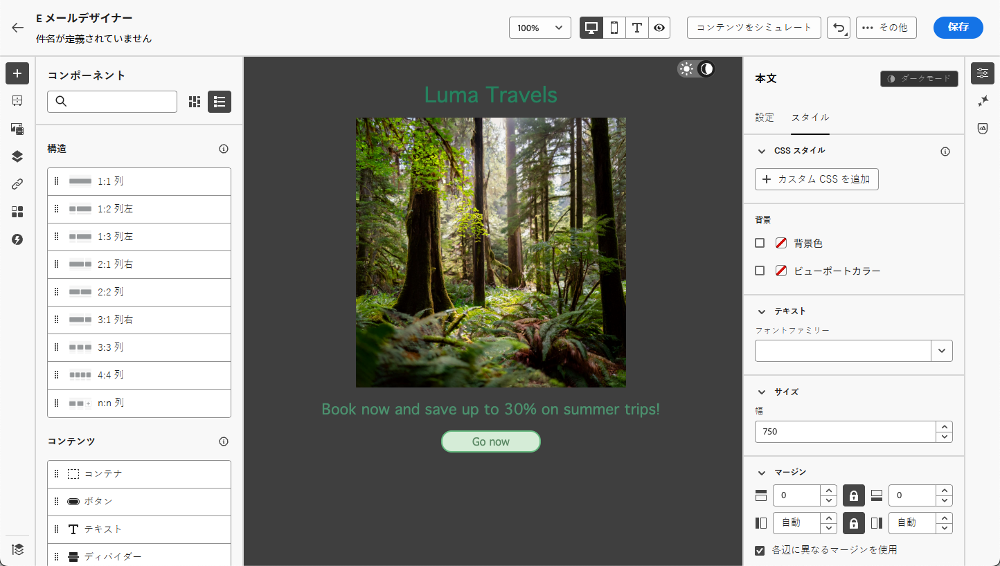
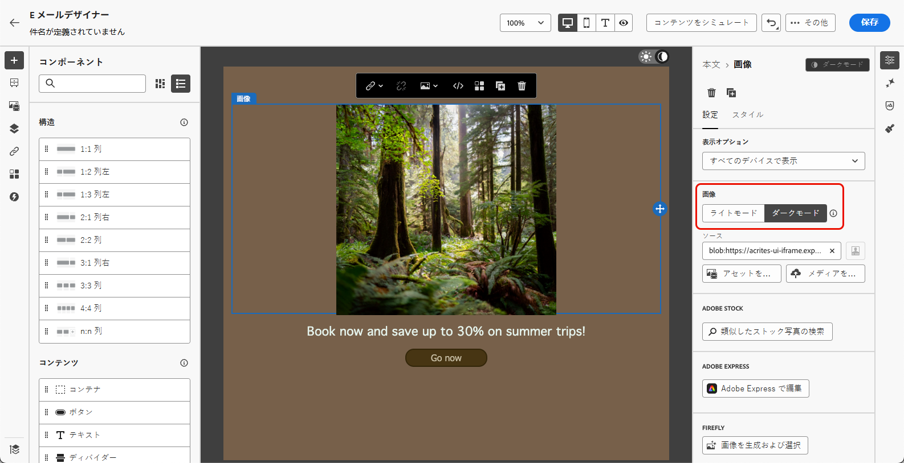
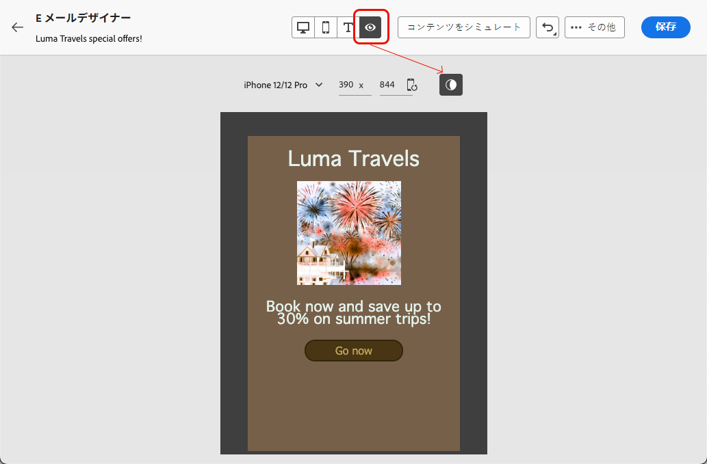

# ダークモードコンテンツの管理 {#dark-mode}

>[!CONTEXTUALHELP]
>id="ac_edition_darkmode"
>title="ダークモードに切り替え"
>abstract="ダークモードに切り替えると、レンダリング方法のプレビューや、特定のカスタム設定の定義ができます。 最終的なレンダリングは、受信者のメールクライアントに応じて異なります。すべてのメールクライアントがカスタムダークモードをサポートしているわけではありません。"

>[!CONTEXTUALHELP]
>id="ac_edition_darkmode_preview"
>title="ダークモードに切り替え"
>abstract="ダークモードに切り替えると、サポートされているメールクライアントでどのようにレンダリングされるかをプレビューできます。  最終的なレンダリングは、受信者のメールクライアントに応じて異なります。すべてのメールクライアントがダークモードをサポートしているわけではありません。"

メールをデザインする際に、[!DNL Adobe Campaign][ メールDesigner](get-started-email-designer.md) を使用して **[!UICONTROL ダークモード]** ビューに切り替えることができます。

この <!--Email Designer --> ダークモード表示では、サポートしているメールクライアントがダークモードがオンの場合に表示する特定のカスタム設定を定義することもできます。

## ダークモードとは {#what-is-dark-mode}

さまざまなメールクライアントでダークモードがレンダリングされる方法は複雑です。 まず、ダークモードを定義します。

ダークモードを使用すると、サポートされるメールクライアントやアプリで、テキスト、ボタン、その他の UI 要素に暗い背景と明るい色のメールを表示できます。 目への負担を軽減し、バッテリー寿命を短縮し、低照度環境での読みやすさを向上させて、より快適な視聴体験を実現します。

主要なオペレーティングシステムやアプリ全体で高まる傾向として <!-- (Apple Mail, Gmail, Outlook, Twitter, Slack)--> コンテンツをすべてのユーザーにとって読みやすく、視覚的に魅力あるものにするために、最新のメールデザインでは重要な検討事項となっています。

## ガードレール {#guardrails}

ダークモードのレンダリングに対する期待は、様々なメールクライアントによって適用される方法が大きく異なる可能性があるので、慎重に考慮する必要があります。

<!--The dark mode final rendering depends on the recipient's email client. It is not possible to guarantee that your email will look the same in dark mode across all devices.-->

[!DNL Adobe Campaign] Email Designerでダークモードを使用する前に、メインのメールクライアントでの処理方法を理解することが重要です。 区別すべきケースは次の 3 つです。

<!--
* Check out the list of [email clients supporting dark mode](https://www.caniemail.com/search/?s=dark){target="_blank"}

* Learn more on Dark mode in this [Litmus blog post](https://www.litmus.com/blog/the-ultimate-guide-to-dark-mode-for-email-marketers){target="_blank"}
-->

### ダークモードをサポートしていないクライアント {#not-supporting}

次のような一部のメールクライアントは、この機能をまったくサポートしていません。

* Yahoo！メール
* AOL

E メールDesignerでダークモードのカスタム設定を定義しているかどうかに関係なく、これらのメールクライアントはダークモードのレンダリングを表示しません。<!--Regardless of whether the interface is in light or dark mode, your email will render the same.-->

### 独自のダークモードを適用するクライアント {#default-support}

一部のメールクライアントは、受信するすべてのメールに対して独自のデフォルトのダークモードを体系的に適用しています。 色、背景、画像など。 はメールクライアントに固有のダークモード設定で自動的に調整されます。つまり、外部の変更はできません。

<!--It is important to note that less than 25% of email clients offer customization options for dark mode. Clients such as Gmail implement their own dark mode rendering, which is not subject to external modification.-->

次に例を示します。

* Gmail （デスクトップ Web メール、iOS、Android、モバイル Web メール）
* Windows のチェックアウト
* Outlook Windows メール

この場合、メールDesignerでカスタムダークモード設定を定義すると、その設定はメールクライアントの設定で上書きされます。

これらのメールクライアントはダークモードを処理することを理解することが重要ですが、特定のダークモードデザインはレンダリングされません。

### カスタムダークモードをサポートするクライアント {#custom-support}

他のメールクライアントには、`@media (prefers-color-scheme: dark)` クエリを使用してカスタムダークモードをレンダリングするオプションが用意されています。これは、[!DNL Journey Optimizer] Email Designerで使用される方法です。

このオプションを処理する主なクライアントのリストを以下に示します。

* Apple メールmacOS
* Apple メールiOS
* アウトルック macOS
* Outlook.com
* アウトルック iOS
* アウトルック Android

この場合、メールDesignerで定義した具体的な設定が表示されます。

>[!NOTE]
>
>メールDesignerを使用してダークモードのカスタム設定を定義する方法については、[ この節 ](#define-custom-dark-mode) を参照してください。

ただし、電子メールクライアントごとに適用される制限もあります。 例えば、Apple Mail 16 （macOs 13）などの一部のクライアントでは、メールのコンテンツに画像が存在してもダークモードが生成されません。

最適な結果を得るには、ターゲット設定しているメールクライアントでコンテンツをテストします。 各クライアントの最終結果にできるだけ近いシミュレーションを確認するには、メールDesignerの「[ メールのレンダリング ](../preview-test/email-rendering.md)」オプションを使用します。

## メールDesignerのダークモード {#dark-mode-email-designer}

メールDesignerでダークモードに関して考慮すべき 2 つの側面があります。

* ほとんどのサポートメールクライアントでデフォルトのダークモードがどのようにレンダリングされるかをプレビューできます。 [詳細情報](#preview-dark-mode)

* メールクライアントのデフォルト設定 [ カスタムダークモードをサポート ](#custom-support) を上書きする場合は、編集するメールのカスタム設定を定義できます。 [詳細情報](#define-custom-dark-mode)

### デフォルトのダークモードのプレビュー {#preview-dark-mode}

メールDesignerでダークモードにアクセスし、デフォルトのダークモード設定のプレビューを取得するには、次の手順に従います。

1. メールDesignerのホームページで、「**[!UICONTROL ゼロからデザイン]**」オプションを選択します。 [詳細情報](create-email-content.md)

1. [ 構造 ](create-email-content.md) および [ コンテンツコンポーネント ](content-components.md) をコンテンツに追加します。

1. 中央キャンバスの右上で、切り替えを **[!UICONTROL ダークモード]** に切り替えます。

   

1. デフォルトのダークモードプレビューが表示されます。

   

デフォルトでは、メールDesignerのダークモードプレビューは、画像とアイコンを除くすべての要素に「フルカラー反転」カラースキームを適用します。

つまり、明るい要素と暗い要素の領域を検出してそれらを反転することで、明るい背景は暗くなり、暗いテキストは明るくなり、暗い背景は明るくなり、明るいテキストは暗くなります。

>[!CAUTION]
>
>最終的なレンダリングは、受信者のメールクライアントによって異なる場合があります。 各メールクライアントの最終結果にできるだけ近いシミュレーションを確認するには、「[ メールのレンダリング ](../preview-test/email-rendering.md)」オプションを使用します。

### カスタムダークモードの定義 {#define-custom-dark-mode}

>[!CONTEXTUALHELP]
>id="ac_edition_darkmode_image"
>title="特定の画像をダークモードで使用"
>abstract="ダークモードがオンの場合に表示される別の画像を選択できます。  ダークモードで使用する特定の画像を追加しても、すべてのメールクライアントで正しくレンダリングされるとは限りません。すべてのメールクライアントがカスタムダークモードをサポートしているわけではありません。"

**[!UICONTROL ダークモード]** に切り替えた後、受信者のメールクライアントでダークモードが有効な場合にのみ表示される、コンテンツの特定のスタイル要素を編集できます（その機能をサポートしている場合）。

>[!WARNING]
>
>ダークモードの最終レンダリングはメールクライアントごとに異なるので、結果はクライアントによって異なる場合があります。 [詳細情報](#guardrails)

<!--
>[!WARNING]
>
>Not all email clients support dark mode. Moreover, some email clients only apply their own default dark mode for all emails that are received. In both cases, the custom settings that you defined in the Email Designer cannot be rendered.-->

Journey Optimizerでは、メールDesignerのカスタムダークモードのスタイル設定を活用するために、<!-- `@media (prefers-color-scheme: dark)` method--> の機能を使用しています。 CSS クエリ `@media (prefers-color-scheme: dark)`、ユーザーのメールクライアントがダークモードに設定されているかどうかを検出し、メールで定義されたダークテーマのデザインを適用します。

ダークモードのカスタム設定を定義するには、次の手順に従います。

1. メールDesignerのプレビューを **[!UICONTROL ダークモード]** に切り替えてください。 [詳細情報](#preview-dark-mode)

1. テキスト、背景、ボタンなどのスタイル設定色属性を編集します。

1. 画像やアイコンの色は変更できませんが、特定のアセットはダークモード用にのみ定義できます。

   それには、任意の画像を選択します。 **[!UICONTROL 設定]** パネルの専用トグルを使用して **[!UICONTROL ダークモード]** に切り替え、別のアセットを選択します。

   

   <!---->

1. コンテンツが様々なデバイスサイズでどのようにレンダリングされるかを確認するには、いつでも **[!UICONTROL ライブビューに切り替える]** ことができます。 この表示で、画面上部のダークモード トグルを選択して、様々なデバイスでのコンテンツのダークモードバージョンをプレビューします。

   {width="80%" align="center"}

   >[!CAUTION]
   >
   >ライブビューは汎用プレビューで、様々なデバイスサイズでレンダリングがどのように表示されるかを比較するために設計されています。 最終的なレンダリングは、受信者のメールクライアントによって異なる場合があります。

1. ダークモードの変更に満足したら、「**[!UICONTROL コンテンツをシミュレート]**」をクリックします。

   

1. **[!UICONTROL メールをレンダリング]** を選択し、Litmus アカウントに接続します。 様々なメールクライアントでの最終的なダークモードレンダリングを確認できます。 詳しくは、[ メールのレンダリング ](../preview-test/email-rendering.md) を参照してください。

   >[!WARNING]
   >
   >シミュレーションはダークモードでのメールの表示に非常に近いものですが、メールサービスプロバイダーやデバイスレベルの設定の違いにより、実際のレンダリングは異なる場合があります。

## ベストプラクティス {#best-practices}

ダークモードの採用が主要なメールクライアント間で増加するにつれて、[ カスタムダークモード ](#define-custom-dark-mode) を使用しているかどうかにかかわらず、メールが明暗の両方の環境でどのようにレンダリングされるかを考慮することが重要になります。

ダークモードでは、カラー、背景、画像を変更でき、デザインの選択肢を上書きする場合もあります。 ビジュアルの一貫性、アクセシビリティ、ブランドの整合性を確保するには、次に示すベストプラクティスに従います。

**画像とロゴの最適化**

* ロゴやアイコンを背景が透明な PNG として保存して、ダークモードで白いボックスが表示されないようにします。

* 白または明るい背景をハードコードした画像は避けます。

* 透明度がオプションでない場合は、カラーがぎこちなく反転するのを防ぐために、デザインの実線の背景に画像を配置します。

**背景に注意**

* 明るいモードと暗いモードの両方で読みやすくするために、テキストと背景色の間に十分なコントラストを確保します。

* 重要なコンテンツを背景色だけに依存することは避けます。 一部のクライアントは、ダークモードでは背景色をオーバーライドするので、キー情報が表示されていることを確認します。

<!--**Inline critical styles**

Inline CSS helps maintain more control over styling, as some clients strip external styles in dark mode.-->

**アクセス可能なコンテンツをダークモードでデザイン**

<!--KEEP dark mode accessibility best practices IN ONE SINGLE LOCATION - for now listed on this page.
If needed, it can be moved to the Design accessible content page:
The best practices for designing accesible content in dark mode are listed in [this section](accessible-content.md#dark-mode).-->

* 色覚異常者には、簡単に区別できる色の組み合わせを使用します。

* ミッドトーンパレットを使用して、明るい背景と暗い背景の両方に対してコントラストを確保します。

* アクセシブルな色の組み合わせを高コントラストで使用して、読みやすさを向上し、web コンテンツアクセシビリティガイドライン（WCAG）標準を満たします。 WebAIM のコントラストチェッカーなどのツールを使用して、カラーコントラストを確認します。

* 読みやすさに影響する可能性があるので、細いフォントは避けます。 ブランドが薄いフォントを必要とする場合は、ダークモードで太字にします。

* 純粋な白を純粋な黒にスキップすると、目の疲れが生じる可能性があり、一部のメールクライアントによって自動的に反転する可能性があります。

* ダークモードがサポートされていない場合は、アクセシブルなフォールバックスタイル設定を提供します。

**ダークモード環境でのメールのテスト**

* メールDesigner[ ダークモードプレビュー ](#preview-dark-mode) を使用する。これは、反転したカラースキームを使用して問題を早期に発見します。

* Litmus を活用した [ メールのレンダリング ](../preview-test/email-rendering.md) オプションを使用して、主要なメールクライアント（Apple Mail、Gmail、Outlook）をまたいでデザインをシミュレーションし、ダークモードでのカラーと画像の動作を確認します。
